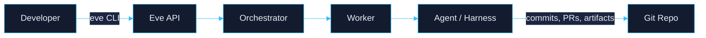

# Eve Horizon Docs — Design Refactor Plan

> **Aesthetic direction:** Precision-engineered futurism.
> Think Linear meets Stripe meets a spacecraft control panel — dark-first, luminous accents, crystalline typography, and just enough motion to feel alive without feeling busy.

---

## 1. Design Philosophy

The current site is a stock Docusaurus install with system fonts, basic Tailwind-ish blue, and flat cards. It works, but it doesn't *feel* like a platform that orchestrates AI agents across distributed systems. The redesign should make visitors feel they're looking at something intentionally crafted — something that communicates confidence, precision, and a quiet sense of power.

**Core principles:**

- **Dark is home, light is a guest** — Dark mode is the primary experience. Light mode isn't an afterthought, but it's designed *from* dark, not *towards* light.
- **Color as signal, not decoration** — A restrained palette where color means something: brand accent for interactive elements, status colors for diagrams, subtle gradients for depth.
- **Typography carries authority** — A distinctive display font for headings paired with a highly legible mono-geometric body font. No system-ui. No Inter.
- **Motion earns its place** — Page-load stagger for hero elements, subtle hover elevations on cards, smooth theme transitions. Nothing that loops or distracts.
- **Diagrams are first-class citizens** — Mermaid charts styled as integral design elements, not awkward embedded widgets.

---

## 2. Color System

### 2.1 Dark Mode (Primary)

```
Background layers:
  --eve-bg-deep:       #06090f    (page body — near-black with blue undertone)
  --eve-bg-surface:    #0c1220    (cards, sidebar, containers)
  --eve-bg-elevated:   #131c2e    (hover states, dropdowns, tooltips)
  --eve-bg-overlay:    #1a2540    (modal backdrops, highlighted regions)

Text hierarchy:
  --eve-text-primary:  #e8ecf4    (headings, primary body — warm white)
  --eve-text-secondary:#94a3b8    (secondary text, descriptions — slate-400)
  --eve-text-muted:    #64748b    (timestamps, breadcrumbs, metadata — slate-500)

Brand accent:
  --eve-accent:        #38bdf8    (primary interactive — sky-400, brighter than current blue)
  --eve-accent-hover:  #7dd3fc    (hover state — sky-300)
  --eve-accent-glow:   rgba(56, 189, 248, 0.15)  (glow effect behind buttons/links)

Borders:
  --eve-border:        rgba(148, 163, 184, 0.08)  (subtle structural lines)
  --eve-border-accent: rgba(56, 189, 248, 0.25)   (accent borders on hover)
```

### 2.2 Light Mode

```
Background layers:
  --eve-bg-deep:       #f8fafc    (page body — cool white)
  --eve-bg-surface:    #ffffff    (cards, sidebar)
  --eve-bg-elevated:   #f1f5f9    (hover states)
  --eve-bg-overlay:    #e2e8f0    (highlighted regions)

Text hierarchy:
  --eve-text-primary:  #0f172a    (headings — slate-900)
  --eve-text-secondary:#475569    (body — slate-600)
  --eve-text-muted:    #94a3b8    (metadata — slate-400)

Brand accent:
  --eve-accent:        #0284c7    (sky-600 — darker for contrast on white)
  --eve-accent-hover:  #0369a1    (sky-700)
  --eve-accent-glow:   rgba(2, 132, 199, 0.08)

Borders:
  --eve-border:        rgba(15, 23, 42, 0.06)
  --eve-border-accent: rgba(2, 132, 199, 0.2)
```

### 2.3 Status & Semantic Colors

Used consistently in diagrams, admonitions, and UI:

```
--eve-green:   #34d399    (success, active, done)
--eve-amber:   #fbbf24    (warning, review, pending)
--eve-red:     #f87171    (error, cancelled, danger)
--eve-purple:  #a78bfa    (agent/AI indicators)
--eve-cyan:    #22d3ee    (info, links in diagrams)
```

---

## 3. Typography

### 3.1 Font Selection

| Role | Font | Weight(s) | Rationale |
|------|------|-----------|-----------|
| **Display / H1-H2** | [Outfit](https://fonts.google.com/specimen/Outfit) | 600, 700 | Geometric sans with character — rounded terminals feel modern without being soft. Distinctive "a" and "g" glyphs. |
| **Body / UI** | [Geist](https://vercel.com/font) | 400, 500, 600 | Vercel's screen-optimized sans. Engineered for technical content, precise letterforms, excellent readability at all sizes. |
| **Code / Mono** | [JetBrains Mono](https://fonts.google.com/specimen/JetBrains+Mono) | 400, 500 | Purpose-built for code reading. Increased height for distinction of similar characters. Ligatures optional. |

### 3.2 Type Scale

```css
--eve-text-xs:    0.75rem;     /* 12px — metadata, badges */
--eve-text-sm:    0.875rem;    /* 14px — captions, sidebar */
--eve-text-base:  1rem;        /* 16px — body text */
--eve-text-lg:    1.125rem;    /* 18px — lead paragraphs */
--eve-text-xl:    1.25rem;     /* 20px — H4 */
--eve-text-2xl:   1.5rem;      /* 24px — H3 */
--eve-text-3xl:   1.875rem;    /* 30px — H2 */
--eve-text-4xl:   2.5rem;      /* 40px — H1 */
--eve-text-hero:  3.5rem;      /* 56px — Homepage hero */
```

### 3.3 Loading Strategy

Add fonts via `headTags` in `docusaurus.config.ts` for preloading:

```ts
headTags: [
  {
    tagName: 'link',
    attributes: {
      rel: 'preconnect',
      href: 'https://fonts.googleapis.com',
    },
  },
  {
    tagName: 'link',
    attributes: {
      rel: 'preconnect',
      href: 'https://fonts.gstatic.com',
      crossorigin: 'anonymous',
    },
  },
  {
    tagName: 'link',
    attributes: {
      rel: 'stylesheet',
      href: 'https://fonts.googleapis.com/css2?family=Outfit:wght@600;700&family=Geist:wght@400;500;600&family=JetBrains+Mono:wght@400;500&display=swap',
    },
  },
],
```

Then in `custom.css`:

```css
:root {
  --ifm-font-family-base: 'Geist', system-ui, sans-serif;
  --ifm-heading-font-family: 'Outfit', system-ui, sans-serif;
  --ifm-font-family-monospace: 'JetBrains Mono', 'Fira Code', monospace;
}
```

---

## 4. Homepage Redesign

The homepage is the first impression. It should feel like the cockpit of something powerful.

### 4.1 Hero Section

**Structure:**

```
┌─────────────────────────────────────────────────────┐
│                                                     │
│          [subtle animated grid background]          │
│                                                     │
│              E V E   H O R I Z O N                  │
│                                                     │
│      Ship software with AI-powered workflows        │
│                                                     │
│       [ Get Started ]    [ CLI Reference ]          │
│                                                     │
│     ┌───────────────────────────────────────┐       │
│     │  $ eve deploy --env staging           │       │
│     │  ✓ Build completed in 34s             │       │
│     │  ✓ Release eve-api:v2.1.0 created     │       │
│     │  ✓ Deployed to staging (3 replicas)   │       │
│     │  ✓ Health checks passing              │       │
│     └───────────────────────────────────────┘       │
│                                                     │
└─────────────────────────────────────────────────────┘
```

**Design details:**

- **Background:** Subtle CSS grid pattern (diagonal lines, 10px spacing) using `repeating-linear-gradient` — visible at ~4% opacity in dark mode, ~2% in light. Creates depth without noise. Consider a very faint radial gradient glow behind the title (accent color at ~5% opacity, 600px radius).
- **Title:** `Outfit 700`, hero size, with a subtle `background: linear-gradient(135deg, var(--eve-text-primary), var(--eve-accent))` text gradient via `background-clip: text`. The gradient should be barely perceptible — more of a shimmer than a rainbow.
- **Terminal mockup:** A fake terminal window below the CTA buttons showing an `eve deploy` command completing. Dark card with rounded corners, subtle accent border glow, monospaced font. This instantly communicates what the product *does*. Typed-out animation on first view (CSS `@keyframes` with `steps()` — no JS library needed).
- **Buttons:** Primary button gets a subtle `box-shadow: 0 0 20px var(--eve-accent-glow)` that pulses gently on hover. Secondary button is ghost-style with accent border.
- **Entry animation:** Hero content fades in + translates up (20px) with staggered `animation-delay` per element (title → subtitle → buttons → terminal). Total duration ~800ms. `prefers-reduced-motion` media query disables this.

### 4.2 Feature Cards Section

**Replace the flat 3-column grid** with a more distinctive layout:

```
┌─────────────────────────────────────────────────────┐
│                                                     │
│     Why Eve Horizon                                 │
│                                                     │
│  ┌──────────┐  ┌──────────┐  ┌──────────┐         │
│  │ ⌘        │  │ ☰        │  │ ◎        │         │
│  │ CLI-First│  │ Manifest │  │ Agent-   │         │
│  │          │  │ Driven   │  │ Native   │         │
│  │ desc...  │  │ desc...  │  │ desc...  │         │
│  │          │  │          │  │          │         │
│  │     →    │  │     →    │  │     →    │         │
│  └──────────┘  └──────────┘  └──────────┘         │
│                                                     │
│  ┌──────────┐  ┌──────────┐  ┌──────────┐         │
│  │ ⊕        │  │ ↗        │  │ ❖        │         │
│  │ Job      │  │ Deploy   │  │ Skills   │         │
│  │ Orchestr.│  │ with     │  │ & Packs  │         │
│  │          │  │ Confid.  │  │          │         │
│  │ desc...  │  │ desc...  │  │ desc...  │         │
│  │     →    │  │     →    │  │     →    │         │
│  └──────────┘  └──────────┘  └──────────┘         │
│                                                     │
└─────────────────────────────────────────────────────┘
```

**Design details:**

- Each card has a **monoline icon** (SVG, ~24px) in the accent color at top-left. Not emoji — clean geometric line icons.
- Card background: `var(--eve-bg-surface)` with `var(--eve-border)` border.
- On hover: border transitions to `var(--eve-border-accent)`, card gets a subtle `translateY(-2px)` lift, and a faint accent glow appears at the top edge (`box-shadow: 0 -2px 20px var(--eve-accent-glow)`).
- Arrow indicator (→) at bottom-right, faint until hover, slides right 4px on hover.
- Cards stagger-animate in on scroll using `IntersectionObserver` (or CSS `animation-timeline: view()` for modern browsers).

### 4.3 Additional Homepage Sections (Optional)

Consider adding below the feature cards:

1. **Architecture at a Glance** — A styled Mermaid diagram showing the full Eve flow (Developer → CLI → API → Orchestrator → Workers → Git). Serves as both a visual anchor and educational tool. Wrapped in a full-width dark panel.

2. **"Start in 60 Seconds"** — A compact three-step visual:
   ```
   01. Install     →     02. Init     →     03. Deploy
   brew install eve    eve init           eve deploy
   ```
   Numbered steps with monospace labels, connected by subtle dashed lines.

---

## 5. Global Component Styling

### 5.1 Navbar

```css
.navbar {
  background: var(--eve-bg-deep);
  border-bottom: 1px solid var(--eve-border);
  backdrop-filter: blur(12px);         /* glass effect when content scrolls under */
  -webkit-backdrop-filter: blur(12px);
  background: rgba(6, 9, 15, 0.85);   /* dark mode: semi-transparent */
}

[data-theme='light'] .navbar {
  background: rgba(248, 250, 252, 0.85);
}
```

- Logo: Redesign from the simple blue square to a more refined mark (outlined "E" with horizon line motif, or geometric abstract).
- Active nav item: Bottom border accent line (2px) with subtle glow.

### 5.2 Sidebar

```css
.theme-doc-sidebar-container {
  background: var(--eve-bg-surface);
  border-right: 1px solid var(--eve-border);
}

/* Active sidebar item */
.menu__link--active {
  background: var(--eve-accent-glow);
  border-left: 2px solid var(--eve-accent);
  color: var(--eve-accent);
  font-weight: 500;
}

/* Category headers */
.menu__list-item-collapsible .menu__link {
  font-family: var(--ifm-heading-font-family);
  font-weight: 600;
  font-size: var(--eve-text-sm);
  text-transform: uppercase;
  letter-spacing: 0.05em;
  color: var(--eve-text-muted);
}
```

### 5.3 Doc Page Content Area

```css
.markdown {
  /* Tighter, more editorial feel */
  max-width: 48rem;
  line-height: 1.75;
}

.markdown h1 {
  font-family: var(--ifm-heading-font-family);
  font-size: var(--eve-text-4xl);
  font-weight: 700;
  letter-spacing: -0.02em;
  margin-bottom: 0.5em;
}

.markdown h2 {
  font-size: var(--eve-text-3xl);
  font-weight: 600;
  margin-top: 2.5em;
  padding-bottom: 0.3em;
  border-bottom: 1px solid var(--eve-border);
}

.markdown h3 {
  font-size: var(--eve-text-2xl);
  font-weight: 600;
  margin-top: 2em;
}
```

### 5.4 Code Blocks

```css
/* Dark mode code blocks */
[data-theme='dark'] pre {
  background: #0a0f1a;                        /* slightly darker than page bg */
  border: 1px solid var(--eve-border);
  border-radius: 8px;
}

/* Code block title bar */
[data-theme='dark'] .prism-code .token-line {
  font-family: var(--ifm-font-family-monospace);
  font-size: 0.875rem;
  line-height: 1.7;
}

/* Light mode code blocks */
[data-theme='light'] pre {
  background: #f8fafc;
  border: 1px solid rgba(15, 23, 42, 0.06);
}
```

Use **Dracula** for dark Prism theme (already configured) and consider switching light theme from `github` to `oneLight` or a custom theme that uses our accent color for keywords.

### 5.5 Admonitions (Callout Boxes)

Restyle the default Docusaurus admonitions to match the design system:

```css
.admonition {
  border-radius: 8px;
  border-left: 3px solid;
  background: var(--eve-bg-surface);
  padding: 1rem 1.25rem;
}

.admonition-note    { border-color: var(--eve-accent); }
.admonition-tip     { border-color: var(--eve-green); }
.admonition-info    { border-color: var(--eve-cyan); }
.admonition-warning { border-color: var(--eve-amber); }
.admonition-danger  { border-color: var(--eve-red); }

.admonition .admonition-heading {
  font-family: var(--ifm-heading-font-family);
  font-weight: 600;
  font-size: var(--eve-text-sm);
  text-transform: uppercase;
  letter-spacing: 0.04em;
}
```

### 5.6 Tables

```css
table {
  border-collapse: separate;
  border-spacing: 0;
  border-radius: 8px;
  overflow: hidden;
  border: 1px solid var(--eve-border);
}

th {
  background: var(--eve-bg-surface);
  font-family: var(--ifm-heading-font-family);
  font-weight: 600;
  font-size: var(--eve-text-sm);
  text-transform: uppercase;
  letter-spacing: 0.04em;
  color: var(--eve-text-muted);
}

tr:nth-child(even) td {
  background: var(--eve-bg-surface);
}
```

### 5.7 Footer

```css
.footer--dark {
  background: var(--eve-bg-deep);
  border-top: 1px solid var(--eve-border);
}
```

Minimal footer — links in a single row with muted text, copyright at bottom. No heavy column layout needed for a docs site.

---

## 6. Flair Pieces

These are the memorable touches that make the site feel crafted.

### 6.1 Animated Grid Background (Hero)

A CSS-only subtle grid pattern that creates a sense of infinite space:

```css
.heroBackground {
  position: absolute;
  inset: 0;
  background-image:
    linear-gradient(var(--eve-border) 1px, transparent 1px),
    linear-gradient(90deg, var(--eve-border) 1px, transparent 1px);
  background-size: 60px 60px;
  mask-image: radial-gradient(ellipse 80% 60% at 50% 40%, black 40%, transparent 100%);
  -webkit-mask-image: radial-gradient(ellipse 80% 60% at 50% 40%, black 40%, transparent 100%);
}
```

The mask fades the grid to nothing at the edges, creating a spotlight effect centered on the title.

### 6.2 Theme Toggle Transition

When switching between dark and light mode, apply a brief (200ms) whole-page transition:

```css
html {
  transition: background-color 0.3s ease, color 0.2s ease;
}

/* Apply to key elements */
.navbar, .footer, .main-wrapper,
.theme-doc-sidebar-container {
  transition: background-color 0.3s ease, border-color 0.3s ease;
}
```

### 6.3 Accent Line on Active Doc

A thin (2px) accent-colored line on the left edge of the content area for the currently-viewed doc, connecting visually to the sidebar active state.

### 6.4 Scroll Progress Indicator

A thin (2px) bar at the very top of the viewport that fills left-to-right with the accent color as the user scrolls down a doc page. Pure CSS using `animation-timeline: scroll()` (progressive enhancement — invisible in unsupported browsers).

```css
.scrollProgress {
  position: fixed;
  top: 0;
  left: 0;
  right: 0;
  height: 2px;
  background: var(--eve-accent);
  transform-origin: left;
  animation: grow-progress linear;
  animation-timeline: scroll();
}

@keyframes grow-progress {
  from { transform: scaleX(0); }
  to { transform: scaleX(1); }
}
```

### 6.5 Terminal Typing Effect (Hero)

The terminal mockup in the hero types out the command and results using CSS `steps()`:

```css
.terminalLine {
  overflow: hidden;
  white-space: nowrap;
  border-right: 2px solid var(--eve-accent);
  animation:
    typing 0.8s steps(30) forwards,
    blink 0.8s step-end infinite;
}

@keyframes typing {
  from { width: 0; }
  to { width: 100%; }
}

@keyframes blink {
  50% { border-color: transparent; }
}
```

Lines appear sequentially with staggered `animation-delay`.

---

## 7. Mermaid Diagram Styling

This is critical — diagrams appear throughout the docs and need to feel like integral design elements, not embedded widgets.

### 7.1 Global Mermaid Configuration

In `docusaurus.config.ts`, replace the current minimal config:

```ts
mermaid: {
  theme: { light: 'base', dark: 'base' },
  options: {
    themeVariables: {
      // Will be overridden per-theme via CSS, but these are defaults
      fontFamily: '"Geist", system-ui, sans-serif',
      fontSize: '14px',
    },
    flowchart: {
      curve: 'basis',        // smoother curves than default "linear"
      padding: 16,
      nodeSpacing: 50,
      rankSpacing: 60,
    },
    sequence: {
      actorFontFamily: '"Plus Jakarta Sans", system-ui, sans-serif',
      noteFontFamily: '"Plus Jakarta Sans", system-ui, sans-serif',
      messageFontFamily: '"Plus Jakarta Sans", system-ui, sans-serif',
    },
  },
},
```

### 7.2 Per-Theme Mermaid Variables

Since Docusaurus applies mermaid themes globally, we use the `base` theme and override with `themeVariables` to match our design system.

**Create `website/src/theme/Mermaid.tsx`** by swizzling the Mermaid component (or use `clientModules` to call `mermaid.initialize()` with our custom variables based on the current theme).

Alternatively, since Docusaurus theme-mermaid already reads `themeConfig.mermaid.theme`, and we can't dynamically switch `themeVariables`, the pragmatic approach is:

**Approach A: CSS Override (Recommended)**

Target the generated SVG elements inside `.docusaurus-mermaid-container`:

```css
/* ===== Mermaid Diagram Styling ===== */

.docusaurus-mermaid-container {
  margin: 2rem 0;
  padding: 1.5rem;
  background: var(--eve-bg-surface);
  border: 1px solid var(--eve-border);
  border-radius: 12px;
  overflow-x: auto;
}

/* Center diagrams */
.docusaurus-mermaid-container svg {
  display: block;
  margin: 0 auto;
  max-width: 100%;
}

/* ---- Dark mode diagram colors ---- */

[data-theme='dark'] .docusaurus-mermaid-container {
  background: rgba(12, 18, 32, 0.6);
  border-color: rgba(56, 189, 248, 0.1);
}

/* Node styling */
[data-theme='dark'] .node rect,
[data-theme='dark'] .node polygon,
[data-theme='dark'] .node circle {
  fill: var(--eve-bg-elevated) !important;
  stroke: var(--eve-accent) !important;
  stroke-width: 1.5px !important;
}

[data-theme='dark'] .node .label {
  color: var(--eve-text-primary) !important;
  fill: var(--eve-text-primary) !important;
  font-family: var(--ifm-font-family-base) !important;
}

/* Edge/arrow styling */
[data-theme='dark'] .edgePath .path {
  stroke: var(--eve-accent) !important;
  stroke-width: 1.5px !important;
  opacity: 0.6;
}

[data-theme='dark'] .edgeLabel {
  background: var(--eve-bg-surface) !important;
  color: var(--eve-text-secondary) !important;
  font-size: 0.8rem !important;
}

/* Marker/arrowhead */
[data-theme='dark'] .marker {
  fill: var(--eve-accent) !important;
  stroke: var(--eve-accent) !important;
}

/* State diagram specifics */
[data-theme='dark'] .statediagram-state rect {
  fill: var(--eve-bg-elevated) !important;
  stroke: var(--eve-accent) !important;
}

[data-theme='dark'] .state-note rect {
  fill: var(--eve-bg-overlay) !important;
  stroke: var(--eve-amber) !important;
}

/* ---- Light mode diagram colors ---- */

[data-theme='light'] .docusaurus-mermaid-container {
  background: #f8fafc;
  border-color: rgba(15, 23, 42, 0.08);
}

[data-theme='light'] .node rect,
[data-theme='light'] .node polygon,
[data-theme='light'] .node circle {
  fill: #ffffff !important;
  stroke: var(--eve-accent) !important;
  stroke-width: 1.5px !important;
}

[data-theme='light'] .node .label {
  color: var(--eve-text-primary) !important;
  fill: var(--eve-text-primary) !important;
}

[data-theme='light'] .edgePath .path {
  stroke: var(--eve-accent) !important;
  stroke-width: 1.5px !important;
  opacity: 0.5;
}
```

**Approach B: Inline Config Directives (Per-Diagram)**

For diagrams that need special treatment (e.g., the architecture overview on the homepage), use Mermaid's frontmatter config block:



### 7.3 Mermaid Diagram Authoring Guide

When writing docs with Mermaid diagrams, follow these conventions:

1. **Always use `graph LR` or `graph TD`** — Left-to-right for pipelines/flows, top-down for hierarchies. Avoid `graph RL` or `graph BT`.

2. **Keep node labels short** — 2-3 words max. Use edge labels for connecting verbs.

3. **Use subgraphs for grouping** — Wrap related nodes in named subgraphs for visual clarity:
   ```mermaid
   graph LR
     subgraph Platform
       A[API] --> B[Orchestrator]
       B --> C[Workers]
     end
     subgraph External
       D[GitHub] --> A
       C --> E[Git Repo]
     end
   ```

4. **State diagrams for lifecycles** — Job phases, deployment states, etc. Use `stateDiagram-v2` with descriptive state names.

5. **No inline styles in markdown** — Let the global CSS handle colors. Inline Mermaid styles (`style nodeA fill:#f00`) create maintenance burden and fight the theme.

6. **Wrap in a descriptive section** — Always place Mermaid blocks after a brief text introduction that explains what the diagram shows. Never let a diagram be the first thing after a heading.

---

## 8. Logo Refinement

The current logo is a blue rounded square with an "E" in system-ui. It needs to evolve.

**Direction:** A geometric mark that suggests a horizon line — the "E" abstracted into horizontal lines that trail off to the right, suggesting both the letter and a vanishing point. Monochrome (works in all contexts), with the accent color applied contextually in the navbar.

For now, improve the SVG:

```svg
<svg xmlns="http://www.w3.org/2000/svg" viewBox="0 0 40 40" fill="none">
  <rect width="40" height="40" rx="10" fill="currentColor" opacity="0.1"/>
  <path d="M12 12h16M12 20h12M12 28h16" stroke="currentColor"
        stroke-width="2.5" stroke-linecap="round"/>
</svg>
```

This creates three horizontal lines (the "E" as a horizon motif) that adapts to both themes via `currentColor`.

---

## 9. Implementation Plan

### Phase 1: Foundation (CSS Variables + Typography)

| Step | File | Change |
|------|------|--------|
| 1 | `docusaurus.config.ts` | Add `headTags` for Google Fonts preloading |
| 2 | `src/css/custom.css` | Replace all CSS variables with new color system, set font families |
| 3 | `src/css/custom.css` | Add navbar glass effect, sidebar active states, admonition styles |
| 4 | `src/css/custom.css` | Add Mermaid container and diagram styling rules |
| 5 | `src/css/custom.css` | Add code block refinements, table styles, footer styles |
| 6 | `src/css/custom.css` | Add theme transition rules and scroll progress indicator |

### Phase 2: Homepage Rebuild

| Step | File | Change |
|------|------|--------|
| 7 | `src/pages/index.tsx` | Rebuild Hero with grid background, gradient title, terminal mockup |
| 8 | `src/pages/index.tsx` | Rebuild Features with icon cards, hover effects, stagger animation |
| 9 | `src/pages/index.module.css` | All new styles for hero, terminal, feature cards, animations |
| 10 | `static/img/logo.svg` | Replace with horizon-line mark |

### Phase 3: Polish & Verify

| Step | Action |
|------|--------|
| 11 | Test dark mode → verify all colors, borders, text hierarchy |
| 12 | Test light mode → verify contrast ratios, accent visibility |
| 13 | Test Mermaid diagrams → verify all three diagram types render correctly in both themes |
| 14 | Test responsive → verify mobile nav, sidebar collapse, hero layout |
| 15 | Run Lighthouse → verify performance (font loading, CLS) |
| 16 | `pnpm build` → verify zero errors |

### File Manifest

Files to **modify**:
- `website/docusaurus.config.ts` (fonts, mermaid config)
- `website/src/css/custom.css` (complete rewrite)
- `website/src/pages/index.tsx` (complete rewrite)
- `website/src/pages/index.module.css` (complete rewrite)
- `website/static/img/logo.svg` (replace)

Files to **create**:
- None — all changes go into existing files

Files to **not touch**:
- All `website/docs/**/*.md` content files (diagram styling is handled globally)
- `sidebars.ts`
- `package.json`

---

## 10. Design Validation Checklist

Before considering the refactor complete:

- [ ] Dark mode feels intentional and rich, not just "white flipped to black"
- [ ] Light mode feels crisp and airy, not washed out
- [ ] Theme switch is smooth, not jarring
- [ ] Fonts load without visible flash (FOUT)
- [ ] Hero makes you want to click "Get Started"
- [ ] Feature cards have tactile hover feedback
- [ ] Mermaid diagrams look like they belong (not like embedded widgets)
- [ ] Code blocks are easy to read with clear syntax highlighting
- [ ] Sidebar navigation is scannable with clear hierarchy
- [ ] Mobile experience is clean (no horizontal overflow, readable text)
- [ ] Accessibility: all text meets WCAG AA contrast ratios
- [ ] No layout shift on page load (CLS < 0.1)
- [ ] Build succeeds with zero warnings
