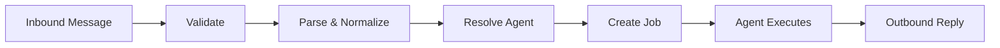

# Chat Gateway & Routing

The chat gateway connects external messaging platforms to Eve agents. It normalizes inbound messages from Slack, Nostr, and WebChat into a common format, routes them to the correct agent or team, creates jobs, and delivers replies. This page covers the gateway architecture, provider adapters, routing engine, and integration setup.

## Gateway architecture

The gateway service uses a pluggable provider architecture. Each provider implements the `GatewayProvider` interface and registers via a factory at startup. Two transport models are supported:

| Transport | Mechanism | Example |
|-----------|-----------|---------|
| **Webhook** | External platform sends HTTP POST to Eve | Slack |
| **Subscription** | Eve connects to external service and listens | Nostr, WebChat |

Webhook providers are stateless between requests. Subscription providers maintain persistent connections for the lifetime of the integration.

The message lifecycle for any provider follows the same path:



## Provider interface

All providers implement a common contract:

| Member | Description |
|--------|-------------|
| `name` | Unique provider identifier (`slack`, `nostr`, `webchat`) |
| `transport` | `'webhook'` or `'subscription'` |
| `capabilities` | Feature flags: threads, reactions, file uploads |
| `initialize(config)` | Lifecycle hook for setup (load secrets, open connections) |
| `shutdown()` | Lifecycle hook for teardown (close sockets, flush state) |

### Webhook-specific methods

| Method | Description |
|--------|-------------|
| `validateWebhook(req)` | Verify request authenticity (signatures, challenge handling) |
| `parseWebhook(req)` | Parse payload into `message`, `handshake`, or `ignored` |

### Shared methods

| Method | Description |
|--------|-------------|
| `sendMessage(target, content)` | Deliver outbound message to provider-specific target |
| `resolveIdentity(externalUserId, accountId)` | Map external user to Eve identity |

### Provider registry

Factories register at startup. Instances are created per integration (one per org integration). The `WebhookController` dispatches `POST /gateway/providers/:provider/webhook` to the correct provider instance.

## Provider adapters

### Slack (webhook transport)

Slack is the primary webhook-based provider. Events arrive via HTTP POST and are processed through signature validation, integration resolution, and agent dispatch.

**Endpoints:**

| Endpoint | Purpose |
|----------|---------|
| `POST /gateway/providers/slack/webhook` | Generic provider endpoint |
| `POST /integrations/slack/events` | Legacy endpoint (preserved for existing installations) |

**Signature validation:** Slack requests are validated using the signing secret (`EVE_SLACK_SIGNING_SECRET`). The provider computes `HMAC-SHA256(signing_secret, v0:timestamp:body)` and compares against the `X-Slack-Signature` header. Invalid signatures are rejected before parsing.

**Event flow:**

1. Event arrives at the webhook endpoint.
2. Signature validated.
3. Integration resolved: `team_id` maps to `org_id`.
4. Event type determines the dispatch path:

| Event Type | Trigger | Dispatch |
|------------|---------|----------|
| `app_mention` | User writes `@eve ...` | Parsed as `@eve <agent-slug> <command>`, routed to specific agent |
| `message` | Any message in subscribed channel | Dispatched to channel/thread listeners only |

For `app_mention` events, the first word after `@eve` is tested as an agent slug. If it matches a known slug, the message routes directly to that agent's project. If no match, the org `default_agent_slug` receives the full message as the command.

**Outbound:** Responses are delivered via the Slack Web API (`chat.postMessage`), threaded to the originating message.

### Nostr (subscription transport)

The Nostr provider connects to relay(s) via WebSocket and subscribes to events targeting the platform pubkey.

**Inbound event types:**

| Kind | Type | Description |
|------|------|-------------|
| Kind 4 | NIP-04 Encrypted DM | Private message to platform pubkey |
| Kind 1 | Public Mention | Public note tagging platform pubkey |

**Inbound flow:**

1. Relay broadcasts event matching subscription filters.
2. Provider verifies Schnorr signature.
3. Kind 4 events are decrypted using NIP-04.
4. Message normalized to standard inbound format.
5. Agent slug extracted from content.
6. Routed through the same dispatch pipeline as Slack.

**Agent slug extraction patterns:**

| Pattern | Example |
|---------|---------|
| `/agent-slug <text>` | `/mission-control review PR` |
| `agent-slug: <text>` | `mission-control: review PR` |
| First word of public mention | `mission-control review PR` |

If no slug matches, the org default agent is used.

**Outbound:** DM replies use Kind 4 (NIP-04 encrypted). Public replies use Kind 1 with NIP-10 reply threading tags.

**Deduplication:** Event IDs are tracked in a bounded set (10k entries) to handle cross-relay duplicates.

### WebChat (subscription transport)

Browser-native agent chat via WebSocket. Follows the subscription transport model.

**Connection:**

```
ws://gateway:4820/?token=<jwt>
```

**Send message:**

```json
{"type": "message", "text": "Hello", "agent_slug": "coder", "thread_id": "optional"}
```

**Receive reply:**

```json
{"type": "message", "text": "Queued 1 job(s)...", "thread_id": "...", "timestamp": "..."}
```

**Features:**
- JWT authentication in WebSocket handshake
- Heartbeat ping/pong (30-second interval)
- Thread continuity across reconnections
- Multi-tab support (same user, multiple connections)

## Routing engine

The routing engine determines which agent or team handles an inbound message. Two routing paths exist: direct slug routing and `chat.yaml` rule matching.

### Direct slug routing

When a message includes an agent slug (e.g., `@eve coder review this PR`), the gateway bypasses `chat.yaml` and routes directly to the agent. Agent slugs are org-unique and resolve to a specific `{project_id, agent_id}` pair.

If no slug is recognized, the org `default_agent_slug` receives the message.

### chat.yaml schema

For rule-based routing, define routes in `chat.yaml`:

```yaml
version: 1
default_route: route_default
routes:
  - id: deploy-route
    match: "deploy|release|ship"
    target: agent:deploy-agent
    permissions:
      project_roles: [admin, member]

  - id: review-route
    match: "review|PR|pull request"
    target: team:review-council

  - id: route_default
    match: ".*"
    target: team:ops
    permissions:
      project_roles: [member, admin, owner]
```

### Route matching rules

1. Routes are evaluated in order.
2. The `match` field is a regex tested against the message text.
3. First match wins.
4. If no route matches, `default_route` is used.

### Target types

| Prefix | Description | Example |
|--------|-------------|---------|
| `agent:<id>` | Dispatch to a single agent | `agent:deploy-agent` |
| `team:<id>` | Dispatch using team mode (fanout, council, relay) | `team:review-council` |
| `workflow:<name>` | Invoke a workflow | `workflow:nightly-audit` |
| `pipeline:<name>` | Launch a pipeline | `pipeline:deploy` |

## Gateway discovery policy

Agents control their visibility to gateway clients via the `gateway` section in `agents.yaml`:

```yaml
agents:
  mission-control:
    gateway:
      policy: routable
      clients: [slack]
```

| Policy | Listed in directory | Direct chat | Internal dispatch |
|--------|--------------------|----|---|
| `none` | Hidden | Rejected | Works |
| `discoverable` | Visible | Rejected (with hint) | Works |
| `routable` | Visible | Works | Works |

The `clients` field restricts which providers can reach the agent. Omitting it allows all providers.

Resolution order: pack `gateway.default_policy` (defaults to `none`) then agent `gateway.policy` then project overlay.

## Listener subscriptions

Agents can passively listen to channels and threads without requiring explicit mentions. This enables monitoring, logging, and reactive workflows.

### Slack listener commands

```
@eve agents listen <agent-slug>      # Listen in this channel (or thread)
@eve agents unlisten <agent-slug>    # Remove listener
@eve agents listening                # Show active listeners
@eve agents list                     # Directory of available slugs
```

### Scope behavior

- Command issued in a **channel**: creates a channel-level listener. All `message` events in that channel are dispatched.
- Command issued inside a **thread**: creates a thread-level listener. Only messages in that specific thread are dispatched.
- Multiple agents can listen to the same channel or thread.
- Listening uses `message.channels` events; explicit `@eve` commands use `app_mention`.

Each listener agent receives a separate job in its own project for every matching message.

## Message lifecycle

Understanding the full message lifecycle helps when debugging routing issues or building custom integrations.

1. **Inbound:** External message arrives via webhook POST or subscription connection.
2. **Validation:** Provider verifies authenticity (Slack signature, Nostr Schnorr signature, WebChat JWT).
3. **Integration resolution:** Provider identity maps to Eve org (`team_id` to `org_id` for Slack, pubkey for Nostr).
4. **Normalization:** Provider-specific payload is converted to a standard inbound message format.
5. **Agent resolution:** Slug extracted from message text. If recognized, routes to that agent. If not, routes to org default.
6. **Thread creation:** Thread key computed from account, channel, and optional thread ID. Existing thread matched or new thread created.
7. **Job creation:** Job created for the resolved agent in the agent's project. Thread and event recorded.
8. **Execution:** Orchestrator claims the job and dispatches to a worker. Agent executes.
9. **Outbound:** Agent's response is delivered back through the originating provider (Slack `chat.postMessage`, Nostr Kind 4/1 event, WebChat WebSocket message).

The gateway logs each step, making it possible to trace why a message was routed to a particular agent or dropped.

## Multi-tenant mapping

Integrations are org-scoped. The mapping from provider identity to Eve organization is established at integration connect time:

- Slack: `team_id` maps to `org_id`.
- Nostr: Platform pubkey maps to the org.
- WebChat: JWT claims map to user and org.

External identities (Slack user IDs, Nostr pubkeys) are stored in `external_identities` and linked to Eve users for permission checks and audit trails.

## Thread keys

Thread continuity uses a canonical key format scoped to the integration account:

```
account_id:channel[:thread_id]
```

| Provider | Example |
|----------|---------|
| Slack | `T123ABC:C456DEF:1234567890.123456` |
| Nostr | `<platform-pubkey>:<sender-pubkey>` |

Thread keys enable the gateway to maintain conversation context across messages and reconnections. See [Threads & Coordination](./threads.md) for the full thread model.

## Syncing configuration

Agent, team, and chat route configuration lives in YAML files in the repository and is synced to the platform:

```bash
# Sync from committed ref (production)
eve agents sync --project proj_xxx --ref abc123def456...

# Sync local state (development)
eve agents sync --project proj_xxx --local --allow-dirty

# Preview effective config without syncing
eve agents config --repo-dir ./my-app
```

Sync resolves AgentPacks from `x-eve.packs`, deep-merges pack agents/teams/chat with local overrides, validates org-wide slug uniqueness, and pushes the merged configuration to the API.

## Integration setup

### Connecting Slack

```bash
eve integrations slack connect --org <org_id> --team-id T123 --token xoxb-test
eve integrations test <integration_id> --org <org_id>
```

Required: subscribe to `app_mention` (for commands) and `message.channels` (for listeners) in your Slack app configuration.

### Setting a default agent

```bash
eve org update <org_id> --default-agent <slug>
```

When a message does not start with a known slug, the default agent receives it.

### Simulation

Test the full routing pipeline without a live provider:

```bash
eve chat simulate --project <id> --team-id T123 --channel-id C123 \
  --user-id U123 --text "hello" --json
```

Returns `thread_id` and `job_ids` showing how the message would be dispatched.

## CLI commands

| Command | Description |
|---------|-------------|
| [eve integrations slack connect](/docs/reference/cli-appendix#eve-integrations) | Connect a Slack workspace |
| [eve integrations list](/docs/reference/cli-appendix#eve-integrations) | List integrations for an org |
| [eve integrations test](/docs/reference/cli-appendix#eve-integrations) | Test an integration |
| [eve chat simulate](/docs/reference/cli-appendix#eve-chat-simulate) | Simulate a chat message |
| [eve org update](/docs/reference/cli-appendix#eve-org) | Set default agent and org config |
| [eve agents sync](/docs/reference/cli-appendix#eve-agents-sync) | Sync agents, teams, and routes |

## API endpoints

```
POST /gateway/providers/:provider/webhook    # Generic webhook ingress
POST /integrations/slack/events              # Legacy Slack endpoint

GET  /internal/orgs/{org_id}/agents          # Agent directory (filtered by policy)
POST /internal/orgs/{org_id}/chat/route      # Slug-based routing

POST /chat/simulate                          # Simulate chat message
POST /chat/listen                            # Subscribe agent to channel/thread
POST /chat/unlisten                          # Unsubscribe agent
GET  /chat/listeners                         # List active listeners
```

## Next steps

Learn how threads enable conversation continuity and agent coordination: [Threads & Coordination](./threads.md)
