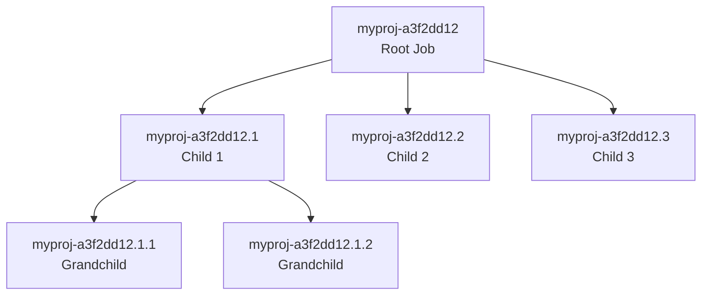
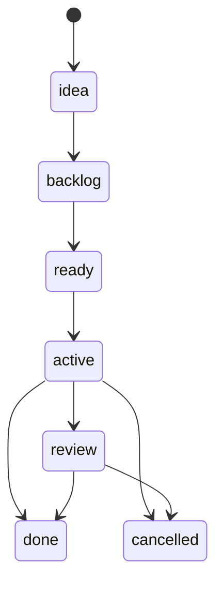
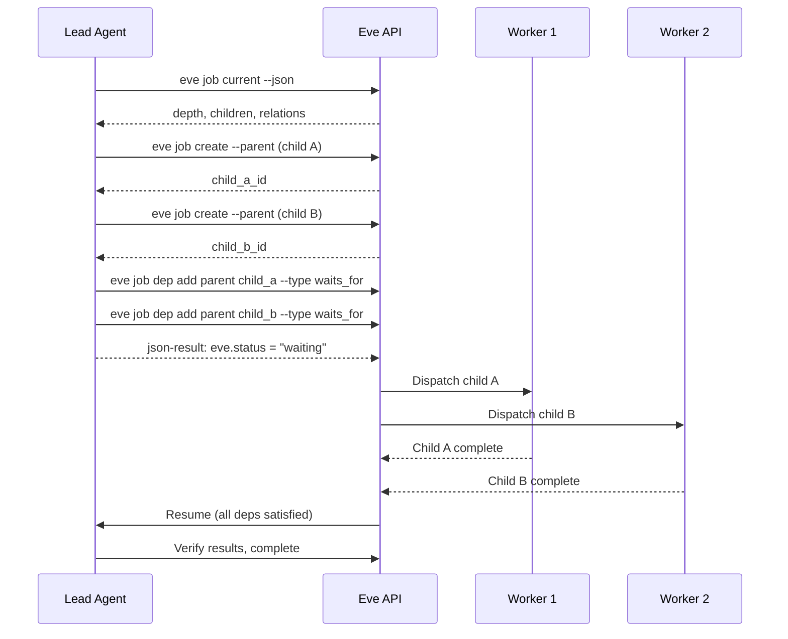

# Orchestration Patterns

Eve's orchestrator is the engine that drives job execution. It claims ready jobs, dispatches them to workers, enforces dependency order, and manages concurrency. This page covers the orchestrator architecture and the patterns agents use to decompose complex work into parallel job trees.

## Orchestrator architecture

The orchestrator runs as a polling loop inside the API service. Each replica maintains a concurrency limiter that controls how many jobs are dispatched in parallel.

### Core responsibilities

- **Claim** ready jobs and dispatch them to workers.
- **Enforce** job gates, dependency order, and environment locks.
- **Route** pipeline triggers into job graphs.
- **Apply** concurrency limits per orchestrator replica.
- **Recover** stuck jobs via watchdog loops.

### Concurrency control

Each orchestrator replica dispatches up to `ORCH_CONCURRENCY` jobs in parallel (default: 4). Claims and dispatches are decoupled: each dispatch reserves a slot, and slots are released when dispatch completes or is force-recovered.

Key settings:

| Setting | Default | Description |
|---------|---------|-------------|
| `ORCH_LOOP_INTERVAL_MS` | `5000` | Polling interval between claim loops |
| `ORCH_CONCURRENCY` | `4` | Max parallel dispatches per replica |
| `ORCH_CONCURRENCY_MIN` | — | Minimum bound for auto-tuner |
| `ORCH_CONCURRENCY_MAX` | — | Maximum bound for auto-tuner |

Ticks are serialized to avoid double-claim races. When a dispatch completes, it requests an immediate follow-up tick if capacity is available. Cancelled jobs are treated as terminal and unblock dependents. Gate-blocked jobs are requeued with backoff to avoid rapid claim/fail loops.

### Auto-tuner

An optional resource-aware tuner adjusts concurrency within min/max bounds based on CPU and memory pressure. When enabled, it reads cgroup metrics and nudges concurrency up or down.

| Setting | Description |
|---------|-------------|
| `ORCH_TUNER_ENABLED` | Enable/disable the tuner |
| `ORCH_TUNER_INTERVAL_MS` | How often the tuner checks metrics |
| `ORCH_TUNER_CPU_THRESHOLD` | CPU pressure threshold for scaling down |
| `ORCH_TUNER_MEMORY_THRESHOLD` | Memory pressure threshold for scaling down |

### Attempt recovery

The orchestrator runs recovery loops to prevent stuck jobs:

- **Completed-attempt recovery:** Finalizes attempts that emitted a completion event but were never closed.
- **Stale-attempt watchdog:** Fails attempts that exceed timeout or remain idle past stale thresholds.
- **Orphan recovery (startup):** Resets orphaned active jobs from previous orchestrator instances and releases gate locks.

## Job hierarchy

Jobs form parent-child relationships via `parent_id`. Child job IDs use the format `{parent}.{n}` (e.g., `myproj-a3f2dd12.1`). Maximum depth is 3 levels.



### Job lifecycle

Every job flows through phases:



The orchestrator claims jobs in `ready` phase, transitions them to `active`, and dispatches them to workers. Selection order: priority (0 highest, 4 lowest), then `created_at` (FIFO within priority).

## Depth propagation

Depth propagation is how agents decide whether to orchestrate or execute directly. The parent sets a target depth and passes it to children. Each child reads the target depth and decides its own behavior.

### Default depth rules

| Scope | Target depth | Behavior |
|-------|-------------|----------|
| **EPIC** | 3 | Root orchestrates children; children may orchestrate grandchildren; grandchildren execute |
| **Story** | 2 | Root orchestrates children; children execute |

If no target depth is provided, agents default to Story depth (2) unless the scope clearly indicates EPIC-level work.

### The depth decision

```
Current depth < target depth → may create child jobs
Current depth >= target depth → execute directly
```

This creates a natural recursion limit. Each level of the tree independently makes the same decision, and the system converges toward execution at the leaf nodes.

## Parallel decomposition

Parallel decomposition is the pattern of breaking large tasks into independent sub-jobs that run concurrently. It is the primary way agents scale complex work across the platform.

### When to orchestrate vs execute directly

Not every job needs decomposition. Use this heuristic:

- **Execute directly** when the work is atomic, self-contained, and fits comfortably in a single agent's context. Examples: fix a single bug, write one document section, run a diagnostic check.
- **Orchestrate** when the work has independent sub-parts that benefit from parallelism, when scope exceeds a single agent's context window, or when different parts require different skills.
- **Default to direct execution.** Orchestration has overhead (job creation, waiting, resumption). Only decompose when parallelism or scope genuinely demands it.

### The orchestration flow

The following sequence shows how a lead agent decomposes work into parallel children.



### Creating child jobs

Create children with `--parent` and self-contained descriptions. Each child agent starts cold with no access to the parent's conversation, context, or reasoning. Everything the child needs must be in the description:

```bash
eve job create --project $EVE_PROJECT_ID \
  --parent $EVE_JOB_ID \
  --description $'Target depth: 3 (EPIC). Current depth: 1.
Scope: Implement authentication module
Deliverable: All tests in src/auth/ pass
Constraints: Use existing JWT library, no new dependencies' \
  --phase ready
```

After creating children, add dependencies so the parent waits:

```bash
eve job dep add $EVE_JOB_ID $CHILD_A_ID --type waits_for
eve job dep add $EVE_JOB_ID $CHILD_B_ID --type waits_for
```

### Child description template

Every child description must be self-contained:

```
Target depth: 3 (EPIC). Current depth: 1.
If current depth < target, you may create child jobs and use waits_for.
If current depth >= target, execute directly.

Context: <why this work exists>
Scope: <concise child objective>
Inputs: <specific file paths, data references>
Deliverable: <clear, verifiable outcome>
Constraints: <boundaries, standards, requirements>
```

Key rules:
- **Name specific files and paths.** "Update the auth module" is ambiguous; "Update `/src/auth/handler.ts`" is actionable.
- **Include decisions already made.** If the parent chose an approach, tell the child.
- **State the deliverable as a verifiable condition.** "Tests pass" beats "implement feature."
- **Never assume the child can read the parent's mind.**

## Dependencies and relations

Relations encode the dependency graph between jobs. The orchestrator uses them to determine which jobs are ready to run.

```bash
eve job dep add $PARENT $CHILD --type waits_for
eve job dep add $CHILD_A $CHILD_B --type blocks
eve job dep list $JOB_ID
```

| Relation | Purpose | When to use |
|----------|---------|-------------|
| `waits_for` | Parent waits for child completion | Standard parent-child gating |
| `blocks` | Strict ordering between jobs | When output of one is genuine input to another |
| `conditional_blocks` | Conditional dependency | When dependency applies only in some cases |

:::tip
Add relations *before* returning a waiting control signal. Returning `waiting` without any blockers triggers a short backoff and wastes an execution cycle.
:::

## Control signals

Control signals are how agents communicate their state back to the platform. They use a `json-result` block embedded in the agent's output.

### Waiting (spawn children and pause)

```json
{
  "eve": {
    "status": "waiting",
    "summary": "Spawned 3 parallel child jobs; waiting on waits_for relations"
  }
}
```

Returning `waiting` requeues the job to `ready` while it stays blocked by its relations. When all dependencies are satisfied, the orchestrator resumes the parent.

### Success (work complete)

```json
{
  "eve": {
    "status": "success",
    "summary": "All authentication tests passing, module complete"
  }
}
```

### Failed (unrecoverable)

```json
{
  "eve": {
    "status": "failed",
    "summary": "Unable to resolve dependency conflict in auth module"
  }
}
```

## Dispatch modes

When teams dispatch work, three modes control how child jobs are created and coordinated.

| Mode | Behavior | Use case |
|------|----------|----------|
| **fanout** | Root job plus parallel child jobs per team member | Independent parallel work |
| **council** | All agents respond; results merged by strategy | Multi-perspective review or analysis |
| **relay** | Sequential delegation from lead through members | Work that requires handoff between specialists |

Dispatch modes are configured in `teams.yaml`:

```yaml
teams:
  review-council:
    lead: mission-control
    members: [code-reviewer, security-auditor]
    dispatch:
      mode: fanout
      max_parallel: 3
      lead_timeout: 300
      member_timeout: 300
      merge_strategy: majority
```

## Coordination threads

When a team dispatch creates child jobs, a coordination thread is automatically created and linked to the parent job. This thread enables inter-agent communication.

The thread key follows the pattern `coord:job:{parent_job_id}`. Child agents receive `EVE_PARENT_JOB_ID` in their environment and derive the thread key from it.

### End-of-attempt relay

When a child job's attempt completes, the orchestrator automatically posts a summary message to the coordination thread. This gives the lead agent and any sibling agents visibility into team progress.

### Coordination inbox

When a coordination thread exists, the worker writes a lightweight inbox file at `.eve/coordination-inbox.md` in the workspace. This file is regenerated from recent coordination thread messages at job start, giving the agent immediate visibility into sibling progress without needing to poll the thread API.

For more detail on threads, see [Threads & Coordination](./threads.md).

## Supervision

Lead agents can monitor their job tree using the supervision stream:

```bash
eve supervise                         # Supervise current job
eve supervise <job-id> --timeout 60   # Supervise specific job with timeout
```

The `supervise` command long-polls child job events, giving the lead agent real-time awareness of progress, failures, and completion across the entire tree.

## Context management

The orchestrator agent's most precious resource is its context window. Protect it:

- **Do not read large files in the orchestrator.** If analysis is needed, create a child job for it.
- **Keep the orchestrator's role to planning, dispatching, and synthesizing.** Delegate actual work.
- **Avoid accumulating child outputs inline.** On resume, read only summaries and outcomes.
- **Front-load decomposition thinking.** Spend context on planning the breakdown, not on partial work.

A well-run orchestrator should finish with most of its context budget unspent.

## Failure handling

When a child job fails:

1. Re-check context and determine whether to retry, replace, or stop.
2. Remove or adjust relations if the plan changes.
3. Do not leave the parent waiting on a permanently failed child.

The orchestrator does not automatically retry failed children. The lead agent makes that decision based on the failure context.

## CLI reference

| Command | Description |
|---------|-------------|
| [eve job create](/docs/reference/cli-appendix#eve-job-create) | Create a job with optional `--parent` |
| [eve job current](/docs/reference/cli-appendix#eve-job-current) | Fetch current job context (depth, children, relations) |
| [eve job dep add](/docs/reference/cli-appendix#eve-job-dep) | Add a dependency relation |
| [eve job dep list](/docs/reference/cli-appendix#eve-job-dep) | List dependencies for a job |
| [eve job result](/docs/reference/cli-appendix#eve-job-result) | Fetch the result of a completed job |
| [eve job wait](/docs/reference/cli-appendix#eve-job-wait) | Block until a job completes |
| [eve job follow](/docs/reference/cli-appendix#eve-job-follow) | Stream job logs in real-time |
| [eve supervise](/docs/reference/cli-appendix#eve-supervise) | Long-poll child events for supervision |

## Quick checklist

When orchestrating complex work:

1. Read context and depth (`eve job current --json`).
2. Determine target depth and current level.
3. Decide: execute directly or orchestrate? Default to direct if work is atomic.
4. If orchestrating: plan the decomposition, then create children with self-contained descriptions.
5. Favor parallel children over sequential chains.
6. Add relations before signaling `waiting`.
7. Return `json-result` with `eve.status = "waiting"`.
8. On resume: read child summaries (not full outputs), verify, and complete.

## Next steps

Learn how messages flow from chat providers to agents: [Chat Gateway & Routing](./chat-gateway.md)
