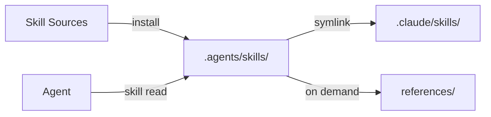

# Skills System

Skills are portable instructions that tell agents how to perform specific tasks. They are the primary mechanism for extending agent capabilities in Eve Horizon. This page covers the skills architecture in depth: the SKILL.md format, installation flows, resolution order, pack structure, and distribution patterns.

## Architecture overview

Skills use Anthropic's OpenSkills `SKILL.md` format and follow a progressive disclosure model:

1. **Metadata** (name, description) is always available for discovery and routing.
2. **Instructions** (the SKILL.md body) are loaded when the skill is invoked.
3. **Resources** (`references/`, `scripts/`, `assets/`) are loaded on demand.

This layered approach means agents can browse available skills cheaply (metadata only) and load full instructions only when needed. Heavy reference material stays out of the agent's context until explicitly requested.

Skills are installed from manifest-declared sources into a local directory at clone time. The repository is the source of truth. No system-level skill configuration is needed.



## SKILL.md format specification

Every skill is a directory containing a `SKILL.md` file with YAML frontmatter and a markdown body.

### Frontmatter fields

```yaml
---
name: my-skill
description: Brief description of what this skill does
---
```

| Field | Required | Description |
|-------|----------|-------------|
| `name` | Yes | Hyphen-case identifier. Must match the directory name. |
| `description` | Yes | One to two sentence summary of what the skill does. |

Additional frontmatter fields (such as `triggers`) are optional and used by some tooling for skill routing, but `name` and `description` are the only required fields.

### Body structure

The body uses imperative form ("Check the config", not "You should check the config") and follows a consistent structure:

```markdown
---
name: my-skill
description: Handles X when working on Y
---

# My Skill

Brief overview of what this skill enables.

## When to Use

Load this skill when:
- Condition A applies
- Condition B applies

## Instructions

To accomplish X:
1. Check the configuration in `config/`
2. Apply the standard patterns from references/patterns.md
3. Validate the output

## References

- `references/patterns.md` — standard patterns to apply
- `references/edge-cases.md` — known edge cases
```

### Authoring guidelines

- **Size limit:** Keep SKILL.md under 5,000 words. Move detailed content to `references/`.
- **Imperative form:** Write instructions as commands, not suggestions.
- **When to Use section:** Always include one so agents can self-select the right skill.
- **Specificity:** Name files, paths, and commands explicitly. Avoid vague instructions like "update the auth module" when "update `/src/auth/handler.ts`" is what you mean.

## Bundled resources

Each skill directory can contain subdirectories for additional content:

| Directory | Purpose | When loaded |
|-----------|---------|-------------|
| `references/` | Detailed documentation, guides, examples | On demand (agent reads explicitly) |
| `scripts/` | Executable utilities | Never auto-loaded (executed via CLI) |
| `assets/` | Templates, images, config files | Never auto-loaded (used by scripts) |

Resources are resolved relative to the skill's base directory. When an agent runs `skill read my-skill`, the output includes both the SKILL.md content and the base directory path, allowing the agent to resolve references like `references/patterns.md`.

## Skill resolution order

When `skill read <name>` is invoked, the skills CLI searches these locations in order. The first match wins:

| Priority | Path | Scope |
|----------|------|-------|
| 1 | `./.agents/skills/` | Project universal |
| 2 | `~/.agents/skills/` | Global universal |
| 3 | `./.claude/skills/` | Project Claude-specific |
| 4 | `~/.claude/skills/` | Global Claude-specific |

### Skill shadowing

Project skills shadow global skills with the same name. This means you can override a global skill by placing a skill with the same name in your project's `.agents/skills/` directory.

The practical implication: a team can distribute skills via a shared Git repository (installed globally) while individual projects override specific skills as needed.

## Installation

Skills are installed at clone time from a manifest into the `.agents/skills/` directory. Two installation flows are supported.

### AgentPacks (preferred)

AgentPacks are the recommended approach. Declare packs in `.eve/manifest.yaml` under `x-eve.packs`:

```yaml
x-eve:
  packs:
    # Remote pack (full repo)
    - source: github.com/incept5/eve-skillpacks
      ref: 0123456789abcdef0123456789abcdef01234567

    # Remote pack (subset + pins)
    - source: github.com/incept5/eve-skillpacks
      ref: 0123456789abcdef0123456789abcdef01234567
      packs: [eve-work, eve-se]
```

Resolution produces a lockfile at `.eve/packs.lock.yaml` that pins exact versions for reproducible builds.

```bash
eve packs status              # Show current pack state
eve packs resolve --dry-run   # Preview resolution without writing lockfile
eve agents sync               # Resolve and write packs.lock.yaml
```

### skills.txt (legacy)

The legacy flow uses a `skills.txt` manifest file with one source per line:

```txt
# Local skills
./skillpacks/my-pack/*

# Remote sources
https://github.com/incept5/eve-skillpacks
git@github.com:org/private-skills
```

Rules for `skills.txt`:
- Blank lines and `#` comments are ignored.
- Local paths must use explicit prefixes (`./`, `../`, `/`, or `~`) to avoid ambiguity with `org/repo` identifiers.
- Glob patterns expand to directories containing `SKILL.md`.

| Pattern | Meaning | Example |
|---------|---------|---------|
| `./path/*` | All direct child skills | `./skillpacks/my-pack/*` |
| `./path/**` | All nested skills recursively | `./skillpacks/**` |
| `./path/skill` | Single specific skill | `./skillpacks/my-pack/my-skill` |

Install with:

```bash
./bin/eh skills install
```

This reads `skills.txt`, installs each source into `.agents/skills/`, and symlinks `.claude/skills` to `.agents/skills/` when possible.

### AgentPack lockfile

The lockfile `.eve/packs.lock.yaml` pins exact versions for each resolved pack. This ensures that every clone produces identical skill installations, regardless of when the install runs. The lockfile is checked into version control alongside the manifest.

To check for drift between the lockfile and the current pack sources:

```bash
eve packs status
```

To preview what a fresh resolution would produce without writing the lockfile:

```bash
eve packs resolve --dry-run
```

### Pack overlay

Local YAML overlays pack defaults via deep merge. This lets you customize pack-provided agents and skills without forking the pack:

```yaml
agents:
  pack-agent:
    harness_profile: my-custom-profile   # override pack default
  unwanted-agent:
    _remove: true                         # remove from pack
```

### Migrating from skills.txt to AgentPacks

```bash
eve migrate skills-to-packs
```

Review the generated YAML fragment, add it under `x-eve.packs` in `.eve/manifest.yaml`, and remove `skills.txt` once verified.

## Pack structure

Skills are grouped into **packs** — directories of related skills organized by domain. The public `eve-skillpacks` repository ships three packs:

```
eve-skillpacks/
├── eve-work/                  # Productive work patterns
│   ├── README.md
│   ├── eve-orchestration/     # Parallel decomposition, job relations
│   ├── eve-job-lifecycle/     # Job states, completion, failure
│   ├── eve-job-debugging/     # Diagnosing stuck/failed jobs
│   ├── eve-read-eve-docs/     # Platform reference lookup
│   └── eve-skill-distillation/
├── eve-se/                    # Platform-specific engineering
│   ├── README.md
│   ├── eve-manifest-authoring/
│   ├── eve-deploy-debugging/
│   ├── eve-pipelines-workflows/
│   └── ...
├── eve-design/                # Architecture & design thinking
│   ├── README.md
│   └── eve-agent-native-design/
└── ARCHITECTURE.md
```

Each pack includes a `README.md` documenting its purpose, audience, skills, and installation instructions.

### Creating a custom skill pack

**1. Create the pack directory:**

```bash
mkdir -p skillpacks/my-pack
```

**2. Add a skill:**

```bash
mkdir -p skillpacks/my-pack/my-skill
```

Write the `SKILL.md` file in the new directory.

**3. Register the pack:**

For skills.txt, add `./skillpacks/my-pack/*`. For AgentPacks, add the source under `x-eve.packs` and run `eve agents sync`.

**4. Commit:** Track pack sources and the manifest. Never commit install targets (`.agents/skills/`, `.claude/skills/`).

### Naming conventions

- Use **hyphen-case**: `my-skill`, not `mySkill` or `my_skill`.
- Prefix domain-specific skills to avoid collisions: `eve-`, `team-`, `app-`.
- The directory name is the skill identifier. Choose it carefully; renaming later changes the invocation command.

## Integration with Eve Horizon

Skills are integrated into the Eve job execution flow at multiple points.

### Worker-side installation

When a job runs, the worker handles skill installation automatically:

1. Worker clones the repository.
2. `.eve/hooks/on-clone.sh` executes.
3. The hook prefers `./bin/eh skills install` when the project provides it.
4. If `.agents/skills/` is already tracked in the repo, installation is skipped.
5. Fallback: `eve-skills install` (a minimal helper bundled in worker images).

Install targets (`.agents/skills/`, `.claude/skills/`) are always gitignored. Tracked sources live under repo-local pack paths and are listed in `skills.txt` or resolved from `packs.lock.yaml`.

### Harness integration

After installation, the harness reads skills directly from `.agents/skills/`. No additional configuration is required. The skills CLI provides the `skill read <name>` command that outputs the SKILL.md content along with the base directory path for resolving bundled resources.

Agents invoke skills explicitly when they need specialized knowledge. The progressive disclosure model means the agent's context window is not consumed by skills that are not relevant to the current task.

### Agent-skill binding

In `agents.yaml`, each agent declares its primary skill:

```yaml
agents:
  mission-control:
    skill: eve-orchestration
```

This binding tells the platform which skill to associate with the agent. The agent can still read any installed skill at runtime, but the primary skill is used for routing and discovery purposes.

## Skill manifest (skills.txt) reference

The `skills.txt` file is a flat manifest of skill sources. The install hook reads it and processes each line:

```txt
# Local packs (all skills)
./skillpacks/my-pack/*

# Single skill from a pack
./skillpacks/another-pack/special-skill

# Remote sources
https://github.com/incept5/eve-skillpacks
git@github.com:your-org/team-skills
```

The installer expands globs, finds directories containing `SKILL.md`, and installs each. The directory name becomes the skill identifier.

## Skills vs workflows

Skills and workflows serve different purposes in Eve:

| Aspect | Skill | Workflow |
|--------|-------|---------|
| **Format** | SKILL.md (markdown with frontmatter) | YAML in manifest |
| **Execution** | Agent reads and follows instructions | Platform executes deterministic steps |
| **Authoring** | Natural language instructions | Structured step definitions |
| **Flexibility** | Agent adapts to context | Fixed sequence of operations |
| **Use case** | Teaching agents *how* to approach problems | Automating *what* happens on triggers |

Skills are composable knowledge. Workflows are composable automation. Both are building blocks. An agent might use a skill to decide what work to do, then trigger a workflow to execute it.

## CLI commands

| Command | Description |
|---------|-------------|
| `skill read <name>` | Read a skill's SKILL.md content and base directory |
| `./bin/eh skills install` | Install skills from `skills.txt` |
| [eve agents sync](/docs/reference/cli-appendix#eve-agents-sync) | Resolve AgentPacks, write lockfile, install skills |
| [eve packs status](/docs/reference/cli-appendix#eve-packs-status) | Show current pack state |
| [eve packs resolve --dry-run](/docs/reference/cli-appendix#eve-packs-resolve) | Preview pack resolution |
| [eve migrate skills-to-packs](/docs/reference/cli-appendix#eve-migrate) | Convert skills.txt to AgentPacks |

## Distribution patterns

| Pattern | Where sources live | Install path |
|---------|--------------------|-------------|
| **Project-specific** | In-repo (`skillpacks/`) | `.agents/skills/` |
| **Team-shared** | Shared Git repository | `.agents/skills/` via skills.txt or packs |
| **Personal** | Local directory | `~/.agents/skills/` |
| **Organization-wide** | AgentPack registry | `.agents/skills/` via packs.lock.yaml |

## Best practices

- **Group by domain, not by team.** Keep packs cohesive around a subject area.
- **Include a "When to Use" section** in every skill so agents can self-select.
- **Push detail to references.** Keep the SKILL.md body focused on instructions; put deep documentation, examples, and edge cases in `references/`.
- **Version control sources, not targets.** Commit pack sources and manifests. Gitignore install targets.
- **Write for cold starts.** The agent reading your skill has no prior context. Include everything it needs to act.

## Next steps

Learn how agents orchestrate complex work across multiple jobs: [Orchestration Patterns](./orchestration.md)
