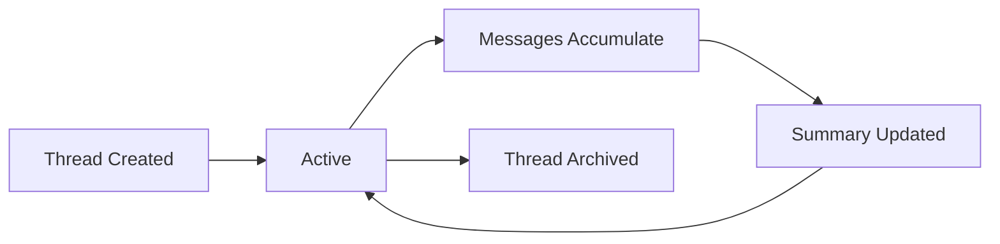

# Threads & Coordination

Threads provide continuity for chat-driven work in Eve Horizon. A thread captures the route, participants, and message history for a conversation or coordination session. This page covers the thread model, thread types, coordination patterns, and the CLI and API interfaces.

## Thread model

Every thread is identified by a deterministic key and tracks a sequence of messages between participants. Threads are the primitive that enables multi-turn conversations, cross-message context, and inter-agent coordination.

### Core fields

| Field | Description |
|-------|-------------|
| `project_id` | Owning project |
| `key` | Deterministic thread key (account + channel + optional thread ID) |
| `channel` | Provider channel ID |
| `peer` | Provider user ID |
| `policy_json` | Permissions snapshot |
| `summary` | Optional rolling summary |
| `workspace_key` | Stable key for shared workspace context |

### Thread key format

Thread keys use a canonical format scoped to the integration account:

```
account_id:channel[:thread_id]
```

| Provider | Example |
|----------|---------|
| Slack | `T123ABC:C456DEF:1234567890.123456` |
| Nostr | `<platform-pubkey>:<sender-pubkey>` |

The key is deterministic: the same conversation always maps to the same thread, enabling continuity across messages, reconnections, and provider restarts.

## Thread scopes

Threads exist at two scopes:

### Project threads

Project-scoped threads belong to a specific project and emit project chat events. These are the standard threads created by the gateway when routing messages to project-level agents.

### Org threads

Org-scoped threads provide continuity for multi-project or cross-channel coordination. They are keyed independently from project threads but follow the same message schema.

Org thread keys use the format:

```
org:{org_id}:{user_key}
```

The `key_prefix` filter in `eve thread list` matches against this canonical prefix, making it straightforward to query threads by scope.

## Thread types

Threads serve different purposes depending on their context.

### Chat threads

Chat threads are conversations between users and agents, initiated through the gateway. They maintain context across messages so agents can handle multi-turn conversations and reference earlier parts of the discussion.

### Coordination threads

Coordination threads enable inter-agent communication within team dispatches. When a team dispatch creates child jobs, a coordination thread is automatically created and linked to the parent job.

**Key convention:** `coord:job:{parent_job_id}`

The thread ID is stored in the parent job's `hints.coordination.thread_id` field along with the `dispatch_mode`.

**How child agents find the thread:** Child agents receive `EVE_PARENT_JOB_ID` in their environment and derive the coordination thread key:

```
coord:job:${EVE_PARENT_JOB_ID}
```

This allows any child agent to read messages from siblings, post updates to the lead, and maintain awareness of the broader team effort.

### Message kinds

Thread messages use a JSON body with `kind` and `body` fields. Common kinds for coordination:

| Kind | Purpose | Direction |
|------|---------|-----------|
| `status` | Automatic end-of-attempt summary | System to thread |
| `directive` | Lead-to-member instruction | Lead to members |
| `question` | Member-to-lead question | Member to lead |
| `update` | Progress update | Member to thread |

### End-of-attempt relay

When a child job's attempt completes, the orchestrator automatically posts a summary message to the coordination thread:

```json
{
  "kind": "status",
  "job_id": "myproj-a3f2dd12.1",
  "assignee": "code-reviewer",
  "body": "Completed code review. Found 3 issues, all addressed."
}
```

This gives the lead agent (and any other team members reading the thread) visibility into sibling progress without requiring explicit polling.

### Coordination inbox

When a coordination thread exists, the worker writes a lightweight inbox file into the repo workspace:

```
.eve/coordination-inbox.md
```

This file is regenerated from recent coordination thread messages at job start. It provides the agent with immediate context about sibling progress without consuming API calls or context window on thread polling at startup.

## Thread lifecycle



1. **Creation:** The gateway creates a thread when a new conversation begins (or when a coordination thread is needed for team dispatch).
2. **Active:** Messages accumulate as participants interact. The thread key ensures all related messages land in the same thread.
3. **Summary:** Optionally, a rolling summary is maintained for threads with long histories.
4. **Archival:** Threads are retained for audit and context but may be archived after inactivity.

## Message logging

Messages are recorded in the `thread_messages` table with:

- Direction (inbound/outbound)
- Actor metadata (who sent it)
- Optional job linkage (which job produced this message)
- Timestamp

Both user tokens (RBAC) and job tokens (project-scoped) are accepted for reading and writing messages.

## Listener subscriptions

Passive listeners enable agents to monitor threads without being directly addressed. Listener subscriptions are stored in `thread_subscriptions` with:

| Field | Description |
|-------|-------------|
| `thread_id` | The thread being monitored |
| `subscriber_type` | Currently `agent` |
| `subscriber_id` | Agent ID |

### Managing listeners (Slack)

```
@eve agents listen <agent-slug>      # Listen in this channel or thread
@eve agents unlisten <agent-slug>    # Remove listener
@eve agents listening                # Show active listeners
```

- Channel-level listeners subscribe to the channel thread key (no `thread_ts`).
- Thread-level listeners subscribe when the command is issued inside a thread.
- Multiple agents can listen to the same channel or thread.

## Follow behavior

The `eve thread follow` command polls for new messages every 3 seconds using a `?since=` timestamp parameter. It is not SSE or WebSocket-based; it is a polling loop designed for agent consumption.

```bash
eve thread follow <thread-id>
```

This is typically used by lead agents during supervision to monitor coordination thread activity in real-time.

## Supervision stream

Lead agents use the supervision stream to monitor their entire job tree:

```bash
eve supervise                         # Supervise current job
eve supervise <job-id> --timeout 60   # Supervise specific job with timeout
```

The supervision command long-polls child job events, providing real-time awareness of completions, failures, and state transitions across the job tree. It complements coordination threads by surfacing job-level events (not just thread messages).

## CLI commands

| Command | Description |
|---------|-------------|
| [eve thread list](/docs/reference/cli-appendix#eve-thread) | List threads (supports `--org` for org threads) |
| [eve thread show](/docs/reference/cli-appendix#eve-thread) | Show thread details |
| [eve thread messages](/docs/reference/cli-appendix#eve-thread) | List messages with optional `--since` filter |
| [eve thread post](/docs/reference/cli-appendix#eve-thread) | Post a message to a thread |
| [eve thread follow](/docs/reference/cli-appendix#eve-thread) | Poll for new messages in real-time |
| [eve supervise](/docs/reference/cli-appendix#eve-supervise) | Long-poll child job events |

### Usage examples

```bash
# List org threads
eve thread list --org org_xxx

# Show a specific thread
eve thread show --org org_xxx --id thr_xxx

# Read recent messages
eve thread messages thr_xxx --org org_xxx --since 10m

# Post a directive to a coordination thread
eve thread post thr_xxx --body '{"kind":"directive","body":"focus on auth module"}'

# Follow a thread in real-time
eve thread follow thr_xxx
```

## API endpoints

### Project threads

```
GET  /threads/{id}/messages?since=<iso>&limit=<n>   # List messages
POST /threads/{id}/messages                          # Post a message
```

### Org threads

```
POST /orgs/{org_id}/threads                          # Create an org thread
GET  /orgs/{org_id}/threads                          # List org threads
GET  /orgs/{org_id}/threads/{thread_id}              # Get thread details
GET  /orgs/{org_id}/threads/{thread_id}/messages     # List messages
POST /orgs/{org_id}/threads/{thread_id}/messages     # Post a message
```

Both endpoints accept user tokens (RBAC) and job tokens (project-scoped).

## Next steps

Learn how agents discover this documentation programmatically: [llms.txt Spec](./llms-txt.md)
