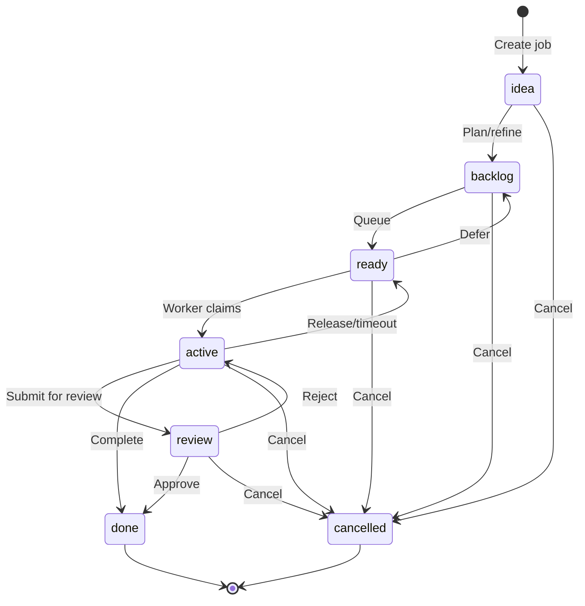
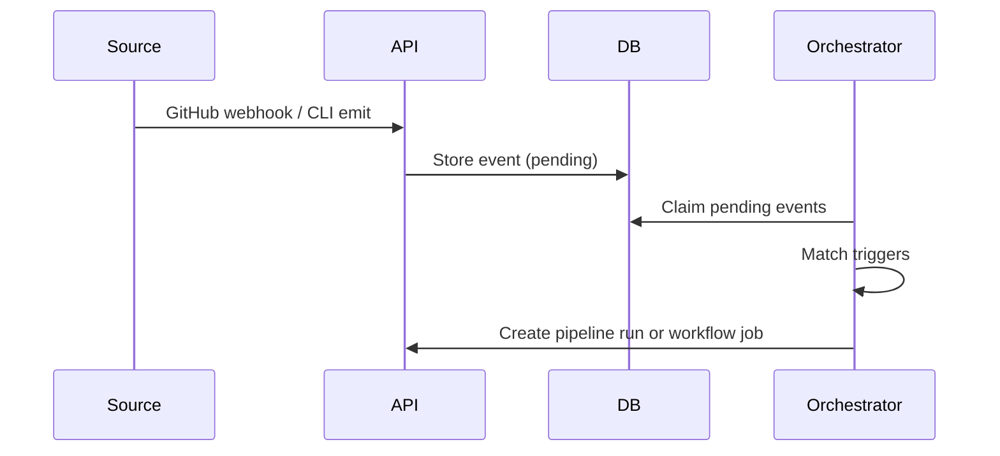

# Core Concepts

Eve Horizon is built around a small set of composable primitives. Understanding these eight concepts gives you the mental model for everything the platform does.

## Organizations and projects

**Organizations** are the top-level container for billing, users, and access control. An organization holds one or more projects.

**Projects** represent a single Git repository. A project has a `slug` (4-8 characters, like `myproj`) that becomes part of every job ID and deployment URL. Projects are identified by TypeIDs (e.g., `proj_01H455VBFQG3GRPZXYXR8TJKM`).

```bash
eve org ensure "Acme Corp"
eve project ensure --name "My App" --slug myapp \
  --repo-url git@github.com:acme/myapp.git --branch main
```

The project slug is immutable after creation — it appears in job IDs (`myapp-a3f2dd12`) and deployment URLs (`web.acme-myapp-staging.eh1.incept5.dev`), so choose it carefully.

## Jobs

A **job** is the fundamental unit of work. Every action in Eve — running an AI task, executing a build, deploying a service — is a job with a tracked lifecycle.

### Job lifecycle

Jobs flow through six phases:



| Phase | Description |
|-------|-------------|
| **idea** | Initial creation, not yet scheduled. Use this for brainstorming or backlog grooming. |
| **backlog** | Planned but not ready — deferred or blocked by dependencies. |
| **ready** | Schedulable. The orchestrator picks up ready jobs by priority, then FIFO. |
| **active** | Currently executing in an agent harness. |
| **review** | Awaiting human or agent approval before completing. |
| **done** | Successfully completed. Result and logs are stored. |
| **cancelled** | Terminated. |

### Job IDs

Job IDs are human-readable. Root jobs use the format `{slug}-{hash8}` (e.g., `myapp-a3f2dd12`). Child jobs append a numeric suffix: `myapp-a3f2dd12.1`, `myapp-a3f2dd12.1.1`, up to three levels deep.

### Priority

Priority ranges from 0 (critical) to 4 (backlog). Higher-priority jobs are scheduled first within the ready pool. New jobs default to priority 2.

### Creating a job

```bash
eve job create --description "Fix the login timeout bug in auth.ts"
```

A job requires only a `description` — the natural-language prompt that tells the agent what to do. You can optionally set title, priority, labels, and scheduling hints.

## Skills

**Skills** are reusable AI capabilities defined in `SKILL.md` files following the OpenSkills format. They live in your repository under `.agents/skills/` and are loaded by the agent harness at runtime.

A skill is a directory containing:
- `SKILL.md` — instructions in imperative form
- `references/` — detailed documentation loaded on demand
- `scripts/` — executable utilities
- `assets/` — templates, images, and other files

```markdown
---
name: pr-review
description: Review a pull request for correctness, style, and security
---

# PR Review

To review a pull request:
1. Read the diff and understand the intent
2. Check for correctness, edge cases, and security issues
3. Post a structured review with actionable feedback
```

Skills are installed from **skill packs** — repositories or local directories listed in `skills.txt` or configured under `x-eve.packs` in the manifest. Installation happens automatically when a worker clones your repo.

```bash
# Install skills from skills.txt
eve skills install
```

## Manifest

The `.eve/manifest.yaml` file is the **single source of truth** for how a project builds, deploys, and runs. It uses Docker Compose-style service definitions with Eve-specific extensions under `x-eve`.

```yaml
schema: eve/compose/v2
project: myapp

services:
  api:
    build:
      context: ./apps/api
    ports: [3000]
    environment:
      DATABASE_URL: postgres://app:${secret.DB_PASSWORD}@db:5432/app
    x-eve:
      ingress:
        public: true
        port: 3000

environments:
  staging:
    pipeline: deploy

pipelines:
  deploy:
    steps:
      - name: build
        action: { type: build }
      - name: deploy
        depends_on: [build]
        action: { type: deploy }
```

The manifest defines services, environments, pipelines, workflows, and Eve extensions (agent profiles, skill packs, job defaults) — all in one file. Sync it to the platform with:

```bash
eve project sync
```

## Pipelines

**Pipelines** are deterministic sequences of steps that expand into job graphs. Each step becomes a job, and dependencies between steps are enforced by the orchestrator.

Step types:
- **action** — built-in operations: `build`, `release`, `deploy`, `run`, `job`, `create-pr`, `notify`
- **script** — a shell command executed by the worker
- **agent** — an AI agent job driven by a prompt

```yaml
pipelines:
  deploy-staging:
    trigger:
      github:
        event: push
        branch: main
    steps:
      - name: build
        action: { type: build }
      - name: test
        script:
          run: "pnpm test"
          timeout: 1800
      - name: deploy
        depends_on: [build, test]
        action: { type: deploy }
```

Pipelines can be triggered by events (GitHub push, pull request) or run manually via the CLI:

```bash
eve pipeline run deploy-staging --ref main --repo-dir .
```

## Workflows

**Workflows** are on-demand, agent-driven processes defined in the manifest. Unlike pipelines (which are deterministic step sequences), workflows are typically AI-powered — you give the agent a prompt and it figures out how to accomplish the goal.

```yaml
workflows:
  nightly-audit:
    db_access: read_only
    steps:
      - agent:
          prompt: "Audit error logs and summarize anomalies"
```

Workflows can also include triggers and hints (harness preferences, gates, timeouts). Invoking a workflow creates a job with the workflow metadata attached.

## Events

**Events** are the automation spine of the platform. They are stored in Postgres and routed by the orchestrator into pipelines and workflows via trigger matching.



Event sources include:
- **GitHub** — push, pull request webhooks
- **Slack** — messages and commands via the chat gateway
- **System** — job failures, pipeline failures, document mutations
- **Manual** — emitted via the CLI with `eve event emit`
- **Runner** — lifecycle events from job execution (started, progress, completed, failed)

Events carry a `type` (e.g., `github.push`), a `source`, an optional `payload_json`, and context fields like `env_name`, `ref_sha`, and `ref_branch`. Deduplication is supported via an optional `dedupe_key`.

## Agents and teams

**Agents** are AI personas with specific skills, harness preferences, and policies. They are configured in YAML and synced to the platform from your repository.

```yaml
agents:
  mission_control:
    slug: mission-control
    description: "Primary ops agent for deploys and incident response"
    skill: eve-mission-control
    harness_profile: primary-orchestrator
    policies:
      permission_policy: auto_edit
      git: { commit: manual, push: never }
    gateway:
      policy: routable
      clients: [slack]
```

**Teams** group agents for coordinated work. A team has a lead agent and members, with a dispatch mode that controls how work is distributed:

```yaml
teams:
  ops:
    lead: mission_control
    members: [reviewer]
    dispatch:
      mode: fanout
      max_parallel: 3
```

Agents can be made routable through the chat gateway, allowing Slack users to invoke them with `@eve <agent-slug> <command>`.

**Harness profiles** define which AI provider and model an agent uses. Profiles support fallback chains — if the primary harness is unavailable, the next one in the list is tried.

## How it all connects

A typical flow ties these concepts together:

1. A developer pushes code to GitHub.
2. GitHub sends a webhook, creating an **event**.
3. The orchestrator matches the event to a **pipeline** trigger in the **manifest**.
4. The pipeline expands its steps into **jobs** with dependencies.
5. Workers execute each job — running **skills** via **agent** harnesses.
6. On completion, results and logs are stored, and the deployment goes live in the target **environment**.

All of this is defined declaratively in one manifest file and driven by the same CLI that humans and agents share.

## Next steps

Put these concepts into practice by deploying a real service to a staging environment.

[Your First Deploy →](./first-deploy.md)
