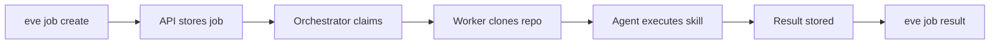

# Quickstart

This guide takes you from zero to a running AI job in about five minutes. You will initialize a project from the starter template, authenticate with the platform, create a job, and watch the result.

## Prerequisites

- The `eve` CLI installed and on your PATH ([Install the CLI](./install.md))
- Node.js 22+ and Git
- An SSH key at `~/.ssh/id_ed25519` (or equivalent)

## 1. Initialize a project

The `eve init` command clones the starter template, sets up a fresh Git repo, and installs skills:

```bash
eve init my-project
cd my-project
```

This creates a directory with:
- A `.eve/manifest.yaml` ready for customization
- Pre-installed skills in `.agents/skills/`
- A clean Git history (template history is removed)

:::tip Already have a repo?
You can add Eve to an existing repository by creating `.eve/manifest.yaml` manually and running `eve skills install`. See [Your First Deploy](./first-deploy.md) for the manifest format.
:::

## 2. Set up your profile and authenticate

If you already created a profile during installation, skip to authentication. Otherwise, create one now:

```bash
eve profile create staging --api-url https://api.eh1.incept5.dev
eve profile use staging
```

### New users: run the bootstrap skill

Open the project in your AI coding agent (Claude Code, Cursor, or similar) and ask it:

> "Run the eve-bootstrap skill"

The bootstrap skill handles the full onboarding flow:
1. Creates your profile if it does not exist
2. Submits an access request with your SSH key
3. Waits for admin approval (an admin runs `eve admin access-requests approve <id>`)
4. Logs you in automatically once approved
5. Helps you configure your project and manifest

### Existing users: log in directly

```bash
eve auth login
eve auth status
```

### Set your defaults

Once authenticated, bind your CLI to your organization and project:

```bash
eve org list
eve project list

eve profile set --org org_xxx --project proj_xxx
```

If you need to create the project:

```bash
eve project ensure --name "My Project" --slug myproj \
  --repo-url git@github.com:yourorg/my-project.git --branch main
```

## 3. Create your first job

A job is the fundamental unit of work in Eve. Create one with a natural-language description:

```bash
eve job create --description "Review the codebase and suggest improvements"
```

The CLI returns a job ID:

```
Created myproj-a3f2dd12
Phase: ready
Priority: 2
```

The job is now in the `ready` phase, waiting for the orchestrator to pick it up.

## 4. Watch the execution

Follow the job logs in real time as the agent works:

```bash
eve job follow myproj-a3f2dd12
```

You will see a live stream of the agent's actions — reading files, running tools, and producing output. The stream ends when the job completes.

If you prefer to wait silently:

```bash
eve job wait myproj-a3f2dd12 --timeout 120
```

This blocks until the job finishes, with exit code `0` for success, `1` for failure, or `124` for timeout.

## 5. Check the result

Once the job completes, retrieve the result:

```bash
eve job result myproj-a3f2dd12
```

For specific output formats:

```bash
# Plain text output only
eve job result myproj-a3f2dd12 --format text

# Full JSON structure
eve job result myproj-a3f2dd12 --format json
```

View the full job details including phase, timing, and attempt history:

```bash
eve job show myproj-a3f2dd12
```

## What just happened?

Here is the sequence of events behind that single `eve job create` command:

1. **Job created** — The CLI sent a `POST` request to the API, which stored the job in Postgres with phase `ready` and priority `2`.

2. **Orchestrator claimed the job** — The orchestrator polls for ready jobs every few seconds. It claimed yours, created a `JobAttempt`, and routed it to an available worker.

3. **Worker prepared the workspace** — The worker cloned your repository into an isolated workspace. It ran the post-clone hook to install skills from `skills.txt`.

4. **Agent executed** — The worker spawned an agent harness (by default, `mclaude` for Claude Code). The harness loaded the skill instructions from `.agents/skills/` and executed them against your code.

5. **Result stored** — When the agent finished, the worker captured the result, execution logs, and a cost receipt (token usage and timing). The job phase transitioned to `done`.

6. **You retrieved the result** — The `eve job result` command fetched the stored result from the API.



Every step is tracked and auditable. You can inspect attempt logs, compare multiple attempts, and view execution receipts with cost breakdowns.

## Useful commands

| Command | Description |
|---------|-------------|
| `eve job list` | List jobs in your project |
| `eve job list --phase active` | Filter by phase |
| `eve job show <id>` | Full job details |
| `eve job follow <id>` | Stream logs in real time |
| `eve job wait <id>` | Wait for completion |
| `eve job result <id>` | Get the result |
| `eve auth status` | Check authentication |
| `eve system health` | Verify platform connectivity |

## Next steps

You have created and run your first job. To understand the building blocks of the platform — jobs, skills, pipelines, events, and more — continue to Core Concepts.

[Core Concepts →](./core-concepts.md)
