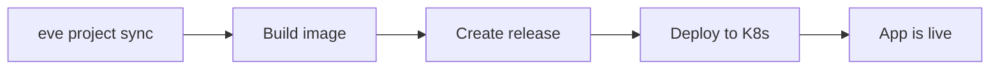

# Quickstart

This guide takes a new user from zero to a deployed app on the Eve platform. Every command below has been tested against the live staging environment. By the end, you will have a running fullstack app with a public URL.

Your AI coding agent (Claude Code, Cursor, Codex, etc.) handles the code. These instructions are for *you* — the human at the controls.

## Prerequisites

- **Node.js 22+** and **Git** installed
- An **SSH key** — `~/.ssh/id_ed25519` recommended. Generate one with `ssh-keygen -t ed25519` if you don't have one.
- The **`eve` CLI** installed and on your PATH ([Install the CLI](./install.md))

## 1. Get access

You need an account on the Eve platform before you can do anything.

**If an admin is onboarding you** — ask them to run:

```bash
eve admin invite --email you@example.com --ssh-key ~/.ssh/id_ed25519.pub
```

**If you're requesting access yourself:**

```bash
eve auth request-access \
  --org "Your Org" \
  --ssh-key ~/.ssh/id_ed25519.pub \
  --email you@example.com \
  --wait
```

This submits a request and polls until an admin approves it. The admin approves with:

```bash
eve admin access-requests approve <request-id>
```

## 2. Log in

Once your access is approved:

```bash
eve auth login --email you@example.com
```

Verify you're authenticated:

```bash
eve auth status
```

## 3. Create your org and project

```bash
eve org ensure "My Company" --slug myco
eve project ensure --name "My App" --slug myapp
```

Note the project ID returned (e.g., `proj_xxx`) — you'll need it in the next step.

## 4. Scaffold from the starter template

```bash
eve init my-app
cd my-app
```

This creates a fullstack app with a Node.js API, HTML frontend, agent definitions, and 24 pre-installed skills. It also initializes a fresh Git repo.

## 5. Configure

Three things need setting up inside your new project directory.

**Set profile defaults** — this tells the CLI which org and project to target:

```bash
eve profile create staging --api-url https://api.eh1.incept5.dev
eve profile use staging
eve profile set --org org_MyCompany --project proj_xxx
```

:::warning Run from the project directory
The CLI reads `.eve/profile.yaml` relative to your working directory. Always run `eve` commands from inside your project root.
:::

**Update the manifest slug** — open `.eve/manifest.yaml` and change the project slug from the template default to your actual project slug. The generated manifest looks like this:

```yaml
schema: eve/compose/v2
project: eve-starter          # ← change this to your project slug

registry: "eve"

services:
  api:
    build:
      context: apps/api
    ports: [3000]
    environment:
      NODE_ENV: production
    healthcheck:
      test: curl -f http://localhost:3000/health || exit 1
    x-eve:
      ingress:
        public: true
        port: 3000
      api_spec:
        spec_url: /openapi.json

environments:
  sandbox:
    type: persistent

pipelines:
  deploy-sandbox:
    steps:
      - name: build
        action: { type: build }
      - name: release
        depends_on: [build]
        action: { type: release }
      - name: deploy
        depends_on: [release]
        action: { type: deploy, env_name: sandbox }
```

Change `project: eve-starter` to your slug:

```yaml
project: myapp
```

The manifest declares everything the platform needs — a single `api` service with public ingress, a `sandbox` environment, and a deploy pipeline that builds, releases, and deploys. You'll customize this later as your app grows.

## 6. Push to GitHub and link the repo

The platform needs to clone your code to build it. Push to a Git remote and link it.

### Public repo

```bash
# Create the remote and push (using GitHub CLI)
gh repo create my-org/my-app --public --source . --push

# Tell Eve where your code lives
eve project update proj_xxx --repo-url https://github.com/my-org/my-app
```

:::tip No GitHub CLI?
You can create the repo manually and use standard Git commands:
```bash
git remote add origin https://github.com/my-org/my-app.git
git push -u origin main
```
:::

### Private repo

If your repo is private, the platform needs a token to clone it. Create a **fine-grained personal access token** on GitHub with **Contents → Read** permission scoped to your repo, then store it as a project secret:

```bash
# Create a private repo
gh repo create my-org/my-app --private --source . --push

# Store the token so Eve can clone during builds
eve secrets set GITHUB_TOKEN ghp_xxxxxxxxxxxx --project proj_xxx

# Link the repo
eve project update proj_xxx --repo-url https://github.com/my-org/my-app
```

Eve automatically injects `GITHUB_TOKEN` into the clone URL when building from a private repo. If the token is missing or lacks the right permissions, the build will fail with a clear error telling you to set it.

:::tip Creating a fine-grained PAT
Go to **GitHub → Settings → Developer settings → Personal access tokens → Fine-grained tokens**. Set:
- **Repository access** → Only select repositories → pick your repo
- **Permissions** → Repository permissions → **Contents** → Read-only

This follows the principle of least privilege — the token can only read code from the repos you choose.
:::

## 7. Sync and deploy

Sync your manifest to the platform, then deploy:

```bash
eve project sync
eve env deploy sandbox --ref main
```

`eve env deploy` is the single deploy command. Because the sandbox environment has a pipeline configured in the manifest, it automatically triggers the full build → release → deploy flow. The command watches progress and reports when done:

```
Resolved ref 'main' → 3666f989...
Deploying commit 3666f989 to sandbox...
Using manifest e8cc7d59...

Deployment submitted.
  Release ID:  rel_xxx
  Environment: sandbox
  Status:      ready (1/1 ready)
```

## 8. Verify

Your app is live. The URL follows this pattern:

```
https://api.{orgSlug}-{projectSlug}-sandbox.eh1.incept5.dev
```

Test it:

```bash
curl https://api.myco-myapp-sandbox.eh1.incept5.dev/health
# {"status":"ok"}
```

The starter template includes a todos API and a simple HTML frontend. Try it out:

```bash
# List todos (empty at first)
curl https://api.myco-myapp-sandbox.eh1.incept5.dev/todos

# Create one
curl -X POST https://api.myco-myapp-sandbox.eh1.incept5.dev/todos \
  -H "Content-Type: application/json" \
  -d '{"title":"Hello from Eve"}'
```

Open the root URL in a browser to see the frontend.

## What's in the box

The starter template gives you a working app with Eve's full deployment toolchain:

| Path | What it does |
|------|-------------|
| `apps/api/` | Node.js API — todos CRUD, health check, OpenAPI spec, static file serving |
| `.eve/manifest.yaml` | Services, environments, pipelines, and agent configuration |
| `agents/` | Agent definitions, team composition, and chat routing |
| `skills/` | 24 pre-installed skills across 39 agent configurations |
| `docker-compose.yml` | Local development setup |

## What just happened?



1. **Sync** pushed your manifest to the platform — services, pipelines, environments
2. **Build** cloned your repo and built a container image from the Dockerfile
3. **Release** created a versioned release artifact tied to your Git SHA
4. **Deploy** rolled out the release to the sandbox environment on Kubernetes

Every subsequent deploy follows the same flow. Push code, sync if the manifest changed, and deploy again.

## Key commands

```bash
# Re-deploy after code changes
eve env deploy sandbox --ref main

# Sync manifest after changing it
eve project sync

# Check environment health
eve env health proj_xxx sandbox

# View deploy logs
eve env logs proj_xxx sandbox

# Run locally
cd apps/api && npm start
```

## Next steps

You have a deployed app. Now hand it to your agents.

- **Create a job** — `eve job create --description "Add a dark mode toggle to the frontend"` — and let agents write the code
- **[Core Concepts](./core-concepts.md)** — understand jobs, skills, pipelines, events, and agents
- **[Your First Deploy](./first-deploy.md)** — customize the manifest with managed databases, secrets, and multi-service setups
- **[eve-quickstart repo](https://github.com/eve-horizon/eve-quickstart)** — the companion repo built alongside this guide, with every step verified
