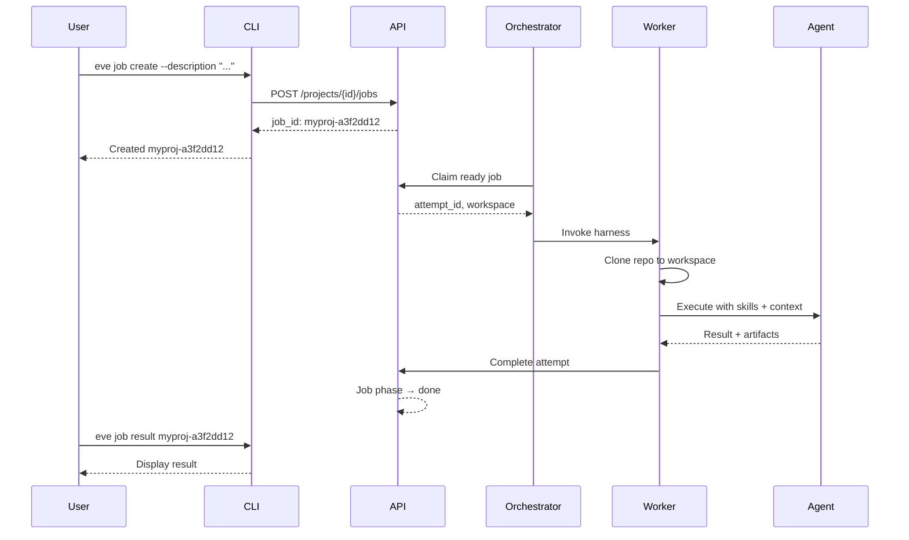
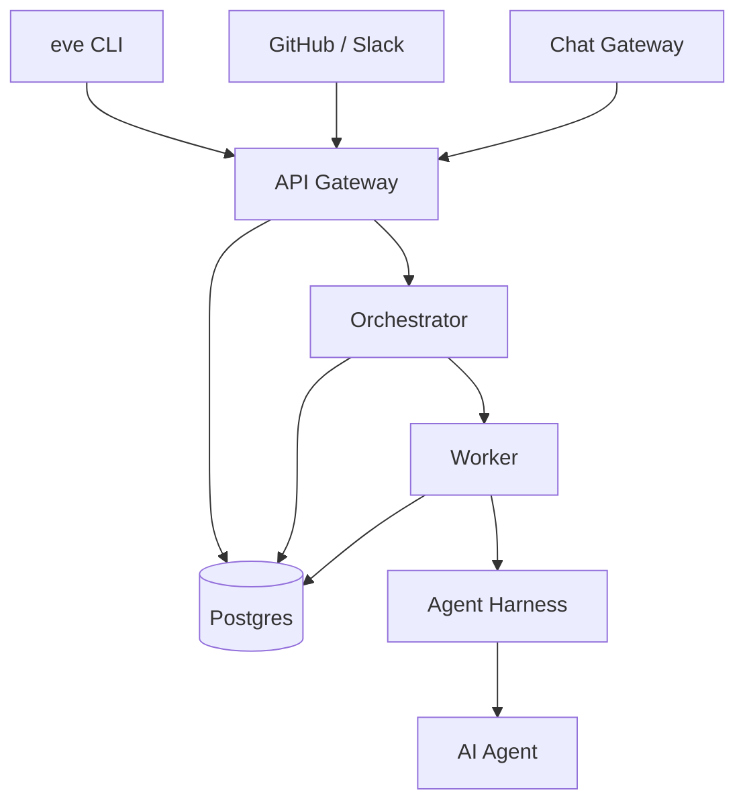

# What is Eve Horizon?

Eve Horizon is a **job-first platform for running AI-powered skills against Git repositories**. It orchestrates AI agents — Claude, Z.ai, Gemini, and others — to execute development tasks in isolated workspaces with full auditability. Think of it as the operating system for your AI-augmented engineering team: you describe the work, Eve runs it, and everything is tracked from request to result.

## Core philosophy

Five ideas shape every design decision in the platform.

**CLI-first.** Humans and AI agents use the same `eve` CLI. There is no hidden admin panel or separate agent API. If an agent can do it, you can do it, and vice versa.

**Job-centric.** Every unit of work is a *job* with a lifecycle, priority, and audit trail. Jobs flow through phases — `idea`, `backlog`, `ready`, `active`, `review`, `done` — so you always know where work stands.

**Event-driven.** A central event spine in Postgres routes GitHub webhooks, Slack messages, cron ticks, and custom events into pipelines and workflows. Automation is declared in the manifest, not scattered across CI configs.

**Skills-based.** Reusable AI capabilities live in your repository as `SKILL.md` files following the OpenSkills format. Skills are installed from skill packs and read at runtime — no syncing, no copying, no drift.

**Isolated execution.** Each job attempt runs in a fresh workspace with a clean clone of your repository. No shared mutable state between runs. Every log line and token usage event is captured for observability.

## Who is it for?

| Audience | What Eve gives you |
|---|---|
| **App teams** | CI/CD pipelines, deployment environments, and AI-powered code review — defined in a single manifest file. |
| **AI-augmented teams** | A structured way to run agents against your code: job queues, skills, review gates, and cost tracking. |
| **Solo operators & technical founders** | A full platform in one CLI. Create a project, deploy to staging, and run AI jobs without stitching together five SaaS tools. |
| **Platform engineers** | Extensible primitives — harnesses, worker types, event triggers, agent teams — to build internal developer platforms with agent-native capabilities. |

## How it works

When you create a job, the platform takes it from request to result through a series of well-defined steps.

1. You create a job via the CLI (or an event trigger fires).
2. The API stores the job and marks it `ready`.
3. The orchestrator claims the job and routes it to a worker.
4. The worker clones your repo, installs skills, and spawns an agent harness.
5. The agent executes the skill instructions against your code.
6. Results, logs, and cost receipts are stored and queryable.

## What can it do?

| Capability | Examples |
|---|---|
| **CI/CD** | Build containers, run tests, deploy to Kubernetes environments, promote releases across stages. |
| **Code review** | AI-powered PR review, security scanning, architecture analysis. |
| **Documentation** | Generate changelogs, API docs, README files from code. |
| **Development** | Bug fixes, refactoring, feature scaffolding, database migrations — all as tracked jobs. |
| **Custom workflows** | Nightly audits, incident remediation, on-demand agent tasks triggered by events. |

## Architecture at a glance

| Component | Role |
|---|---|
| **API Gateway** | REST API for all operations — jobs, projects, secrets, events. OpenAPI at `/docs`. |
| **Orchestrator** | Claims ready jobs, routes events to triggers, drives the job lifecycle. |
| **Worker** | Clones repos, spawns agent harnesses, captures logs and artifacts. |
| **Agent Harness** | Adapts agents (Claude, Z.ai, Gemini) to the execution model. |
| **Postgres** | Single source of truth — jobs, events, secrets, logs. No hidden queues. |
| **Chat Gateway** | Normalizes Slack and web chat into Eve events for conversational workflows. |

The platform runs on Kubernetes (primary) or Docker Compose (dev convenience). Each job attempt executes in an isolated runner pod with its own workspace.

## Next steps

Ready to get started? Install the CLI and connect to the platform.

[Install the CLI →](./install.md)
