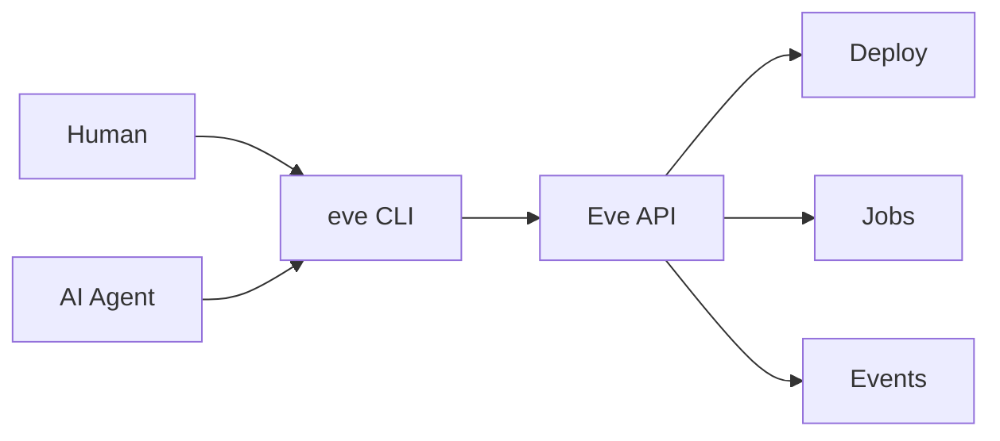
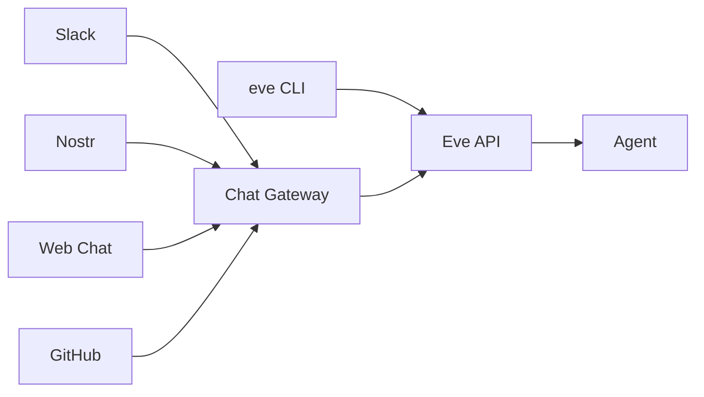
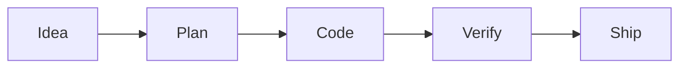
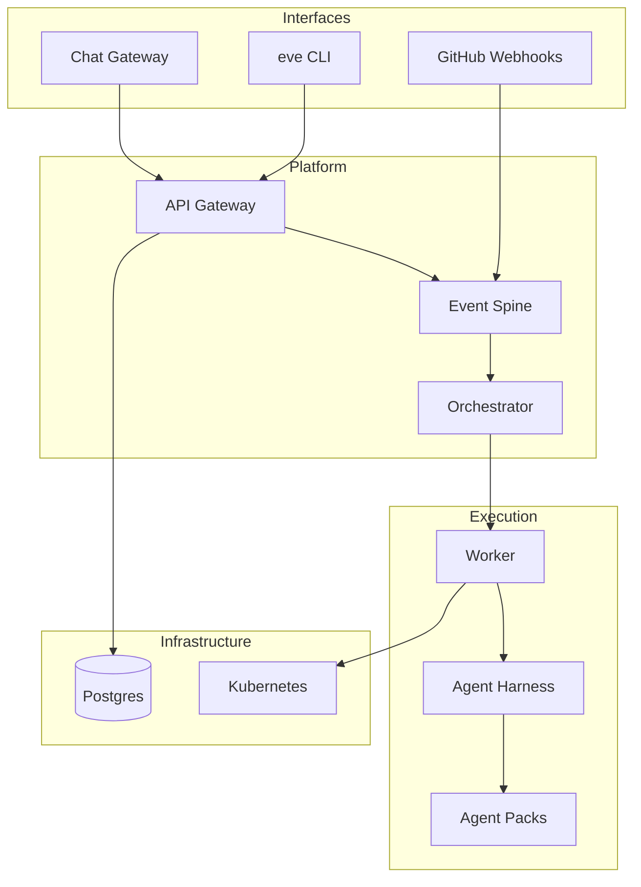

# What is Eve Horizon?

Eve Horizon is an **agent-native development and deployment platform**. Agents and humans share the same CLI and API with full parity — anything a human can do, an agent can do, and vice versa. Build, deploy, and operate any application, but especially applications where agents are first-class runtime components that autonomously develop, review, test, and ship software.

Think of it as the operating system for an automated software factory: requirements arrive from any channel — CLI, Slack, Nostr, GitHub, web chat — and agents bring them to life, with optional human review at any stage.

## Core philosophy

Five ideas shape every design decision in the platform.

**Agent-native.** Agents are first-class citizens, not bolted-on afterthoughts. They authenticate with the same credentials, use the same CLI commands, and operate under the same permission model as human developers. The platform is designed so that agents can do *everything* — create projects, deploy services, run jobs, review code, and ship releases.

**CLI-first.** One interface for humans and agents alike. There is no hidden admin panel or separate agent API. The `eve` CLI is the universal entry point, whether you're typing commands or an agent is executing them programmatically.

**Manifest-driven.** Services, pipelines, environments, skills, and agent teams are all declared in a single `manifest.yaml`. One file describes your entire deployment shape — what gets built, how it flows through stages, and where it runs.

**Event-driven.** A central event spine in Postgres routes GitHub webhooks, Slack messages, cron ticks, and custom events into pipelines and workflows. Automation is declared in the manifest, not scattered across CI configs.

**Skills-based.** Reusable AI capabilities live in your repository as `SKILL.md` files following the OpenSkills format. Skills are installed from skill packs and read at runtime — no syncing, no copying, no drift.



## Agents, packs, and the software factory

Eve agents receive work from anywhere — a Slack mention, a Nostr DM, a GitHub webhook, a web chat session, or a CLI command. The **Chat Gateway** normalizes all these channels through a pluggable provider architecture, routing messages to the right agent by slug or by pattern-matching rules.



Agents, skills, and teams are distributed through **Agent Packs** — composable bundles declared in your manifest:

```yaml
x-eve:
  packs:
    - source: incept5/eve-skillpacks
      ref: abc123...
    - source: ./skillpacks/my-team
```

Packs define how agents work together. A pack might define a **software factory** — agents that take ideas from brief to production — or a **review council**, an **incident response team**, or any other knowledge-work pattern. Teams coordinate through dispatch modes (fanout, council, relay) with persistent coordination threads.



The software factory is one pattern, not a fixed pipeline. Each stage is an agent (or a team of agents) defined in a pack. By default agents work autonomously — human approval gates are opt-in, configured per environment or per skill when you want them.

## What can you build?

| Use case | Description |
|---|---|
| **Any application** | Web apps, APIs, and microservices deployed to Kubernetes with managed pipelines, environments, and secrets. |
| **Agentic-native apps** | Applications where agents are runtime components — not just dev tools, but active participants in the running system. |
| **Automated workflows** | CI/CD pipelines, code review, documentation generation, incident response — all triggered by events and executed by agents. |
| **Software factories** | End-to-end autonomous development — agents take ideas from brief to production, with optional human review gates where you want them. |

## Who is it for?

| Audience | What Eve gives you |
|---|---|
| **Engineering teams** | Deploy apps with managed pipelines and let agents handle review, testing, and documentation — defined in a single manifest file. |
| **AI-forward organizations** | Run autonomous agents at scale with governance, cost tracking, audit trails, and configurable approval gates. |
| **Solo builders** | A full platform in one CLI. Agents are your team — create a project, deploy to staging, and ship features without stitching together five SaaS tools. |
| **Platform teams** | Extensible primitives — harnesses, worker types, event triggers, agent teams — to build internal developer platforms with agent-native capabilities. |

## Architecture at a glance



| Component | Role |
|---|---|
| **Chat Gateway** | Pluggable provider architecture — routes Slack, Nostr, and web chat messages to agents by slug or pattern-matching rules. |
| **API Gateway** | REST API for all operations — projects, jobs, deployments, secrets, events. OpenAPI spec at `/docs`. |
| **Event Spine** | Central Postgres-backed bus that routes webhooks, messages, cron, and custom events into automation. |
| **Orchestrator** | Claims ready jobs, routes events to triggers, drives the job and deployment lifecycle. |
| **Worker** | Clones repos, spawns agent harnesses, captures logs and artifacts in isolated workspaces. |
| **Agent Harness** | Adapts agents (Claude, Z.ai, Gemini, and others) to the execution model with skill loading and context injection. |
| **Agent Packs** | Composable bundles of agents, skills, and team definitions — installed from registries or local repos via `x-eve.packs`. |
| **Postgres** | Single source of truth — jobs, events, secrets, logs, cost receipts. No hidden queues. |
| **Kubernetes** | Primary runtime. Each job attempt and service runs in isolated pods with dedicated workspaces. |

The platform runs on Kubernetes (primary) or Docker Compose (dev convenience).

## Next steps

Ready to get started? Install the CLI and connect to the platform.

[Install the CLI →](./install.md)
