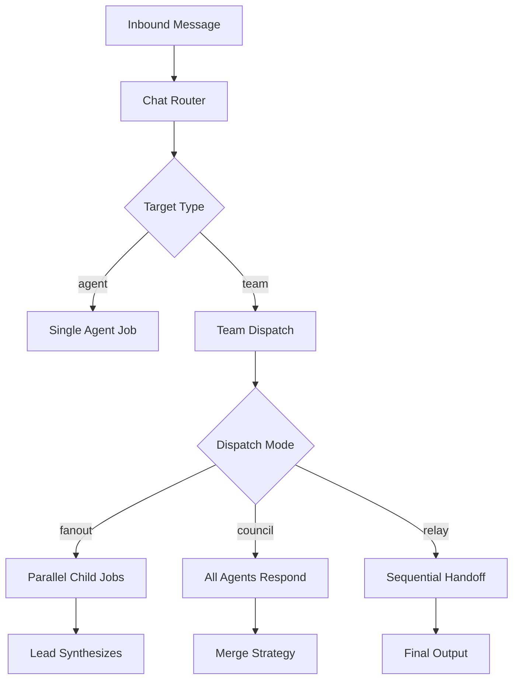
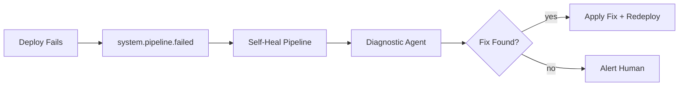

# Agentic App Design

This guide transforms a fullstack Eve application into one where agents are primary actors — reasoning, coordinating, remembering, and communicating alongside humans. Everything here builds on the PaaS foundation covered in the [Fullstack App Design](./fullstack-app-design) guide. That foundation is a prerequisite, not a suggestion.

The progression is deliberate:

1. **Agent-native principles** — parity, granularity, composability, emergent capability
2. **Fullstack foundation** — manifest, services, DB, pipelines, deploys
3. **This guide** — agents, teams, inference, memory, events, chat, coordination

Each layer assumes the previous. Skip none.

## Agent-native design principles

Before wiring any configuration, internalize the four principles that distinguish agent-native apps from apps that happen to have agents bolted on.

### Parity

Agents can do everything users can. The CLI is the parity layer — if a user can do it through `eve ...`, an agent can too. When building your own app, apply the same principle: every UI action must have an API or CLI equivalent. If there are UI-only workflows, agents are second-class citizens.

### Granularity

Features emerge from agent loops, not monolithic tools. A function like `deploy_and_monitor(app)` bundles judgment into code. Instead, provide atomic primitives — `eve build create`, `eve build run`, `eve env deploy`, `eve job follow` — and let agents decide the sequence. The design test: to change behavior, do you edit prose (prompts and skills) or refactor code? If code, your tools are not atomic enough.

### Composability

When tools are atomic and parity exists, you add capabilities by writing prompts, not code. A new skill teaches agents to compose existing primitives in new ways without new API endpoints. If adding a feature requires new endpoints, you may be bundling logic.

### Emergent capability

Build atomic tools. Agents compose unexpected solutions. You observe patterns. Optimize common patterns. Repeat. Eve agents compose `eve job create --parent` + `eve job dep add` + depth propagation to build arbitrary work hierarchies the platform never explicitly prescribed.

## Agent architecture

### Defining agents in agents.yaml

Agents are defined in `agents.yaml` (path set via `x-eve.agents.config_path` in the manifest). Each agent is a persona with a skill, access scope, and policies.

```yaml
version: 1
agents:
  coder:
    slug: coder
    description: "Implements features and fixes bugs"
    skill: eve-orchestration
    harness_profile: primary-coder
    access:
      envs: [staging]
      services: [api, worker]
    policies:
      permission_policy: auto_edit
      git:
        commit: auto
        push: on_success
    gateway:
      policy: routable
```

Every agent requires a set of deliberate design decisions:

| Decision | Options | Guidance |
|----------|---------|----------|
| Slug | Lowercase, alphanumeric + dashes | Org-unique. Used for chat routing: `@eve coder fix the login bug` |
| Skill | Any installed skill name | The agent's core competency. One skill per agent. |
| Harness profile | Named profile from manifest | Decouples agent from specific models. Use profiles, never hardcode harnesses. |
| Gateway policy | `none`, `discoverable`, `routable` | Default to `none`. Make `routable` only for agents that should receive direct chat. |
| Permission policy | `default`, `auto_edit`, `never`, `yolo` | Start with `auto_edit` for worker agents. Use `default` for agents that need human approval. |
| Git policies | `commit`, `push` | `auto` commit + `on_success` push for coding agents. `never` for read-only agents. |

Agents can also declare a schedule for periodic work:

```yaml
schedule:
  heartbeat_cron: "*/15 * * * *"
```

Slugs must be unique across the org — sync will fail if a slug already exists in another project. Set a default agent slug with `eve org update <org_id> --default-agent <slug>` for messages that do not target a specific agent.

### Wiring agent config in the manifest

Reference agent and team configuration files from the manifest:

```yaml
x-eve:
  agents:
    config_path: agents/agents.yaml
    teams_path: agents/teams.yaml
    skills_root: skills/
  chat:
    config_path: agents/chat.yaml
```

Sync with `eve agents sync --project <proj_id> --ref <git_sha> --repo-dir <path>`.

## Team design

Teams group agents under a lead with a dispatch strategy. Define them in `teams.yaml`.

```yaml
version: 1
teams:
  review-council:
    lead: mission-control
    members: [code-reviewer, security-auditor]
    dispatch:
      mode: council
      merge_strategy: majority
  deploy-ops:
    lead: ops-lead
    members: [deploy-agent, monitor-agent]
    dispatch:
      mode: relay
  feature-squad:
    lead: architect
    members: [frontend-dev, backend-dev, tester]
    dispatch:
      mode: fanout
      max_parallel: 3
```

### Dispatch modes

Choose the right dispatch mode for the work pattern:

| Mode | When to use | How it works |
|------|-------------|--------------|
| `fanout` | Independent parallel work | Root job + parallel child per member. Best for decomposable tasks. |
| `council` | Collective judgment | All agents respond, results merged by strategy (majority, unanimous, lead-decides). Best for reviews and audits. |
| `relay` | Sequential handoff | Lead delegates to first member, output passes to next. Best for staged workflows. |

Most work is `fanout`. Use `council` only when multiple perspectives genuinely improve the outcome. Use `relay` only when each stage's output is the next stage's input.

The following diagram shows how a team dispatch flows from an inbound message to agent execution:



## Multi-model inference

### Harness profiles

Define named profiles in the manifest. Agents reference profiles, never specific harnesses. Profile entries form a fallback chain — if the first harness is unavailable, the next is tried.

```yaml
x-eve:
  agents:
    profiles:
      primary-coder:
        - harness: claude
          model: opus-4.5
          reasoning_effort: high
        - harness: codex
          model: gpt-5.2-codex
          reasoning_effort: high
      fast-reviewer:
        - harness: mclaude
          model: sonnet-4.5
          reasoning_effort: medium
      triage-router:
        - harness: mclaude
          model: haiku-4
          reasoning_effort: low
```

Design profiles around capability needs, not provider loyalty.

### Model selection matrix

| Task type | Profile strategy |
|-----------|-----------------|
| Complex coding, architecture | High-reasoning model (opus, gpt-5.2-codex) |
| Code review, documentation | Medium-reasoning model (sonnet, gemini) |
| Triage, routing, classification | Fast model (haiku-equivalent, low reasoning) |
| Specialized domains | Choose the model with strongest domain performance |

Use managed models (`managed/<name>`) for org-wide or project-wide model policies. The registry merges across scopes: platform, then org, then project.

## Memory design

The right storage primitive depends on what kind of information you are storing, who needs it, and how long it should live.

### Storage primitives

| Information type | Storage primitive | Why |
|-----------------|-------------------|-----|
| Scratch notes during a job | Workspace files (`.eve/`) | Ephemeral, dies with the job |
| Job outputs passed to parent | Job attachments | Survives job completion, addressable by job ID |
| Rolling conversation context | Threads | Continuity across sessions, summarizable |
| Curated knowledge | Org Document Store | Versioned, searchable, shared across projects |
| File trees and assets | Org Filesystem (sync) | Bidirectional sync, local editing |
| Structured queries | Managed database | SQL, relationships, RLS |
| Reusable workflows | Skills | Highest-fidelity long-term memory |

### Namespace conventions

Organize org docs by agent and purpose:

```
/agents/{agent-slug}/learnings/      — discoveries and patterns
/agents/{agent-slug}/decisions/      — decision records
/agents/{agent-slug}/runbooks/       — operational procedures
/agents/shared/                      — cross-agent shared knowledge
/projects/{project-slug}/            — project-scoped knowledge
```

### Lifecycle strategy

Memory without expiry becomes noise. For every storage location, answer four questions:

1. **Who writes?** Which agents create and update this knowledge.
2. **Who reads?** Which agents query it and when (job start? on demand?).
3. **When does it expire?** Tag with creation dates. Build periodic cleanup jobs.
4. **How does it stay current?** Search before writing. Update beats create.

## Event-driven coordination

Events are the nervous system of an agentic app. Use them for reactive automation — things that should happen in response to other things.

### Trigger patterns

| Trigger | Event | Response |
|---------|-------|----------|
| Code pushed to main | `github.push` | Run CI pipeline |
| PR opened | `github.pull_request` | Run review council |
| Deploy pipeline failed | `system.pipeline.failed` | Run self-healing workflow |
| Job failed | `system.job.failed` | Run diagnostic agent |
| Org doc created | `system.doc.created` | Notify subscribers, update indexes |
| Scheduled maintenance | `cron.tick` | Run audit, cleanup, reporting |
| Custom app event | `app.*` | Application-specific automation |

### Self-healing pattern

Wire system failure events to recovery pipelines. When a deploy fails, a diagnostic agent can automatically investigate and suggest or apply a fix.

```yaml
pipelines:
  self-heal:
    trigger:
      system:
        event: job.failed
        pipeline: deploy
    steps:
      - name: diagnose
        agent:
          prompt: "Diagnose the failed deploy and suggest a fix"
```

The flow looks like this:



### Custom app events

Emit application-specific events from your services and wire them to agent automation:

```bash
eve event emit --type app.invoice.created --source app --payload '{"invoice_id":"inv_123"}'
```

Design your app's event vocabulary intentionally — events are the API between your app logic and your agent automation.

## Chat and human-agent interface

### Gateway providers

Eve supports multiple chat providers through a unified gateway:

| Provider | Transport | Best for |
|----------|-----------|----------|
| Slack | Webhook | Team collaboration, existing Slack workspaces |
| Nostr | Subscription | Decentralized, privacy-focused communication |
| WebChat | WebSocket | Browser-native, embedded in your app |

### Routing via chat.yaml

Define routes to map inbound messages to agents or teams:

```yaml
version: 1
default_route: route_default
routes:
  - id: deploy-route
    match: "deploy|release|ship"
    target: agent:deploy-agent
  - id: review-route
    match: "review|PR|pull request"
    target: team:review-council
  - id: route_default
    match: ".*"
    target: agent:mission-control
```

Route targets can be `agent:<key>`, `team:<key>`, `workflow:<name>`, or `pipeline:<name>`.

### Gateway vs backend-proxied chat

| Approach | When to use |
|----------|-------------|
| **Gateway provider** (WebSocket to Eve) | Simple chat widgets, admin consoles, no backend needed |
| **Backend-proxied** (`POST /internal/orgs/:id/chat/route`) | Production SaaS where you need to intercept, enrich, or store conversations |

If your app needs to add context, filter messages, or maintain its own chat history, proxy through your backend. Otherwise, connect directly to the gateway.

### Thread continuity

Chat threads maintain context across messages. Thread keys are scoped to the integration account using the format `account_id:channel[:thread_id]`. Design your chat UX to preserve thread context — agents are dramatically more effective when they can reference conversation history.

## Jobs as coordination primitive

### Parent-child orchestration

Jobs are the fundamental unit of agent work. Design complex workflows as job trees:

```
Parent (orchestrator)
├── Child A (research)
├── Child B (implementation)
└── Child C (testing)
```

The parent dispatches, waits, resumes, and synthesizes. Children execute independently. Use `waits_for` relations to express dependencies.

### Structured context via attachments

Pass structured data between agents using job attachments, not giant description strings:

```bash
# Child stores findings
eve job attach $EVE_JOB_ID --name findings.json --content '{"patterns": [...]}'

# Parent reads on resume
eve job attachment $CHILD_JOB_ID findings.json --out ./child-findings.json
```

Attachments are text-only (markdown, JSON, YAML). For binary content, store a URL reference.

### Resource refs for document mounting

Pin specific org document versions as job inputs:

```bash
eve job create \
  --description "Review the approved plan" \
  --resource-refs='[{"uri":"org_docs:/pm/features/FEAT-123.md@v3","label":"Plan","mount_path":"pm/plan.md"}]'
```

The document is hydrated into the workspace at the mount path. Events track hydration success or failure.

### Coordination threads

When teams dispatch work, a coordination thread (`coord:job:{parent_job_id}`) links parent and children. Children read `.eve/coordination-inbox.md` for sibling context. Post updates via `eve thread post`. The lead agent can `eve supervise` to monitor the job tree with long-poll child events.

Message kinds in coordination threads:

| Kind | Purpose |
|------|---------|
| `status` | Automatic end-of-attempt summary |
| `directive` | Lead-to-member instruction |
| `question` | Member-to-lead question |
| `update` | Progress update from a member |

## Access and security

### Service accounts

Backend services need non-user tokens for API calls. Use `eve auth mint` to create scoped tokens:

```bash
eve auth mint --email app-bot@example.com --project proj_xxx --role admin
```

Design each service account with minimal necessary scope. Every app with a backend talking to the Eve API needs this.

### Access groups

Segment data-plane access using groups in `.eve/access.yaml`. Groups control who can read and write org docs, org filesystem paths, and database schemas:

```yaml
version: 2
access:
  groups:
    eng-team:
      name: Engineering
      description: Scoped access for engineering collaborators
  roles:
    app_editor:
      scope: org
      permissions:
        - orgdocs:read
        - orgdocs:write
        - orgfs:read
        - orgfs:write
        - envdb:read
  bindings:
    - subject: { type: group, id: eng-team }
      roles: [app_editor]
      scope:
        orgdocs: { allow_prefixes: ["/agents/shared/"] }
        orgfs: { allow_prefixes: ["/groups/app/**"] }
        envdb: { schemas: ["public"] }
```

Sync with `eve access sync --file .eve/access.yaml --org org_xxx`. Declare all access as code so it is version-controlled, reviewable, and reproducible.

### Permission policies

| Policy | Use case |
|--------|----------|
| `default` | Interactive agents that need human approval for risky actions |
| `auto_edit` | Worker agents that edit code and files autonomously |
| `never` | Read-only agents (auditors, reviewers) |
| `yolo` | Fully autonomous agents in controlled environments (use carefully) |

## Is this app truly agent-native?

Use this checklist to evaluate your design. The first section covers the agentic layer specifically. The final section is the real test.

**Agent architecture:**
- [ ] Agents defined in `agents.yaml` with clear slug, skill, and harness profile
- [ ] Teams defined in `teams.yaml` with appropriate dispatch modes
- [ ] Gateway policies set intentionally (not everything routable)
- [ ] Chat routes defined for inbound message handling

**Inference:**
- [ ] Harness profiles defined in manifest (agents reference profiles, not harnesses)
- [ ] Fallback chains in profiles for resilience
- [ ] Model choice matches task complexity

**Memory:**
- [ ] Storage primitive chosen for each information type
- [ ] Namespace conventions established for org docs
- [ ] Lifecycle and expiry strategy defined
- [ ] Agents search before writing (update beats create)

**Events:**
- [ ] Trigger patterns wired for key events (push, PR, failures)
- [ ] Self-healing pipeline exists for deploy and job failures
- [ ] Custom app events defined for domain-specific automation

**Chat:**
- [ ] Gateway provider chosen (Slack, Nostr, WebChat, or multiple)
- [ ] Chat routing configured in `chat.yaml`
- [ ] Gateway vs backend-proxied decision made
- [ ] Thread continuity preserved in UX

**Coordination:**
- [ ] Complex work decomposed as job trees (parent-child)
- [ ] Attachments used for structured context passing
- [ ] Coordination threads used for team communication
- [ ] Resource refs used for document mounting

**Security:**
- [ ] Service accounts created for backend services
- [ ] Access groups defined for data-plane segmentation
- [ ] Agent permission policies appropriate to each agent's role
- [ ] Access policy declared as code (`.eve/access.yaml`)

**The real test:**
- [ ] Agents can do everything users can (parity)
- [ ] Adding capability means writing prompts, not code (composability)
- [ ] Agents coordinate through platform primitives, not custom glue (granularity)
- [ ] Agents have surprised you with unexpected solutions (emergent capability)

## What's next?

Explore the reference material for the primitives used in this guide:
- [CLI Commands](/docs/reference/cli-commands) for the full command reference
- [Events & Webhooks](/docs/reference/events-and-webhooks) for event types and webhook configuration
- [Harnesses & Workers](/docs/reference/harnesses-and-workers) for harness profiles and worker types
