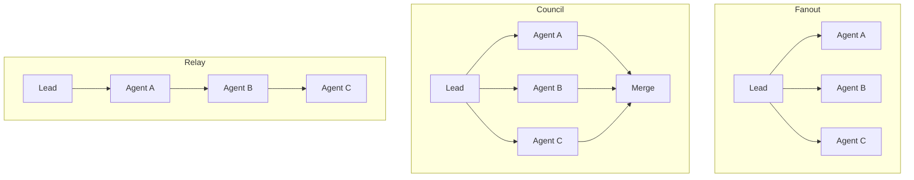

# Agents & Teams

Agents are AI personas with specific skills, access policies, and harness profiles. Teams group agents for coordinated work under a lead with a dispatch strategy. Both are defined in YAML files in your repository and synced to the platform via `eve agents sync`.

## What are agents?

An agent is a named persona that combines:

- **A skill** — what the agent knows how to do
- **A harness profile** — which model(s) power the agent
- **Access policies** — which environments and services the agent can touch
- **Gateway exposure** — whether the agent is addressable from chat

Agents are not generic AI assistants. Each one has a narrow, well-defined role. A `coder` agent writes code. A `reviewer` agent reviews pull requests. A `deploy-agent` handles deployments. Specialization makes agents reliable and predictable.

## agents.yaml structure

Agents are defined in a YAML file whose path is set via `x-eve.agents.config_path` in the manifest. The conventional location is `agents/agents.yaml`.

```yaml
version: 1
agents:
  mission-control:
    slug: mission-control
    description: "Primary orchestration agent for deploys and incident response"
    skill: eve-orchestration
    workflow: assistant
    harness_profile: primary-orchestrator
    access:
      envs: [staging, production]
      services: [api, web]
      api_specs: [openapi]
    policies:
      permission_policy: auto_edit
      git:
        commit: manual
        push: never
    schedule:
      heartbeat_cron: "*/15 * * * *"
    gateway:
      policy: routable
      clients: [slack]
```

### Field reference

| Field | Required | Description |
|-------|----------|-------------|
| `slug` | No | Org-unique identifier for chat routing. Lowercase alphanumeric + dashes. |
| `description` | No | Human-readable summary of the agent's purpose |
| `skill` | Yes | Name of the installed skill that defines this agent's capability |
| `workflow` | No | Named workflow to execute (from `workflows` in the manifest) |
| `harness_profile` | No | Named profile from `x-eve.agents.profiles` in the manifest |
| `access` | No | Scope restrictions: `envs`, `services`, `api_specs` |
| `policies` | No | Permission and git policies |
| `schedule` | No | Cron-based heartbeat for periodic agents |
| `gateway` | No | Chat gateway exposure settings |

### Permission policies

The `permission_policy` field controls how much autonomy an agent has:

| Policy | Behavior |
|--------|----------|
| `default` | Interactive — requires human approval for risky actions |
| `auto_edit` | Autonomous — edits files and code without approval |
| `never` | Read-only — cannot modify anything |
| `yolo` | Fully autonomous in controlled environments (use carefully) |

### Git policies

Git policies control how agents interact with version control:

```yaml
policies:
  git:
    commit: auto       # never | manual | auto | required
    push: on_success   # never | on_success | required
```

- **commit:** `auto` creates commits automatically. `manual` lets the agent decide when to commit. `required` mandates a commit before the job completes.
- **push:** `on_success` pushes when the job succeeds. `never` means the agent's changes stay local. `required` mandates a push before completion.

For coding agents, `auto` commit with `on_success` push is the common pattern. For read-only agents (auditors, reviewers), set both to `never`.

### Hard guardrails from repo policy files

Policy files like `AGENTS.md` can define hard constraints that override general autonomy settings. Example: forbidding direct AWS infrastructure mutations and requiring Terraform-only changes in a separate infra repository. Treat these rules as mandatory runtime policy, even when `permission_policy` is permissive.

## Agent slugs and gateway exposure

### Slugs

An agent slug is an org-unique identifier used for direct chat routing. When a user sends `@eve mission-control deploy to staging` in Slack, Eve routes the message to the agent with slug `mission-control`.

Slug rules:
- Lowercase alphanumeric characters and dashes only
- Must be unique across the entire organization (not just the project)
- Sync fails if a slug already exists in another project

Organizations can set a default agent that receives messages when no slug is specified:

```bash
eve org update org_xxx --default-agent mission-control
```

### Gateway exposure policy

The `gateway` block controls whether an agent is visible and addressable from external chat providers. Internal dispatch (teams, pipelines, routes) is unaffected by this setting.

```yaml
gateway:
  policy: routable
  clients: [slack]
```

| Policy | Listed in `@eve agents list` | Responds to `@eve <slug> msg` | Internal dispatch |
|--------|------------------------------|-------------------------------|-------------------|
| `none` | Hidden | Rejected | Works |
| `discoverable` | Visible | Rejected (with hint) | Works |
| `routable` | Visible | Works | Works |

Default to `none`. Make agents `routable` only when they should receive direct messages from chat. `discoverable` is useful for agents that should appear in listings but only respond when routed through a team.

## Agent runtime and warm pods

Chat requests can be served from pre-provisioned, org-scoped runtime containers (warm pods) to reduce first-response latency for conversational flows.

- Warm runtimes are intended for low-latency chat and small helper jobs.
- Heavy or untrusted tasks should prefer full runner execution.
- Set `EVE_AGENT_RUNTIME_EXECUTION_MODE` to:
  - `inline` to reuse the warm runtime path
  - `runner` to run each request in an ephemeral runner pod

Inspect current runtime status with:

```bash
eve agents runtime-status
```

If warm pods are disabled, first response times are higher but isolation is stronger.

## Teams and dispatch modes

Teams group agents under a lead for coordinated work. When work is dispatched to a team, the lead agent orchestrates the members according to the team's dispatch mode.

### teams.yaml structure

Teams are defined in a separate YAML file whose path is set via `x-eve.agents.teams_path` in the manifest. The conventional location is `agents/teams.yaml`.

```yaml
version: 1
teams:
  review-council:
    lead: mission-control
    members: [code-reviewer, security-auditor]
    dispatch:
      mode: council
      max_parallel: 3
      lead_timeout: 300
      member_timeout: 300
      merge_strategy: majority

  deploy-ops:
    lead: ops-lead
    members: [deploy-agent, monitor-agent]
    dispatch:
      mode: fanout
      max_parallel: 2

  pipeline-crew:
    lead: orchestrator
    members: [builder, tester, deployer]
    dispatch:
      mode: relay
```

### Dispatch modes



**Fanout** is the most common mode. The lead creates a root job and dispatches parallel child jobs — one per member. Members work independently. Use fanout when work can be cleanly decomposed into independent tasks.

```yaml
dispatch:
  mode: fanout
  max_parallel: 3
```

**Council** sends the same prompt to all members and merges their responses using a merge strategy. Use council for collective judgment — code reviews, security audits, design decisions.

```yaml
dispatch:
  mode: council
  merge_strategy: majority  # majority | unanimous | lead-decides
```

**Relay** is sequential delegation. The lead delegates to the first member, whose output passes to the next member, and so on. Use relay when each stage's output is the next stage's input — for example, a research-then-implement-then-test pipeline.

```yaml
dispatch:
  mode: relay
```

### Choosing the right mode

| Scenario | Mode | Why |
|----------|------|-----|
| Implement multiple features in parallel | `fanout` | Independent work, no dependencies between members |
| Review a pull request from multiple perspectives | `council` | Multiple opinions merged into a single verdict |
| Research, implement, then test | `relay` | Each stage depends on the previous stage's output |

Most work is fanout. Use council only when multiple perspectives genuinely improve the outcome. Use relay only when stages are strictly sequential.

## Syncing agent configuration

All agent and team configuration is repo-first. The repository is the source of truth, and `eve agents sync` pushes it to the platform.

```bash
# Sync from committed ref (production)
eve agents sync --project proj_xxx --ref 0123456789abcdef0123456789abcdef01234567

# Sync local state (development)
eve agents sync --project proj_xxx --local --allow-dirty

# Preview effective config without syncing
eve agents config --repo-dir ./my-app
```

Sync performs several operations:
1. Reads `agents.yaml`, `teams.yaml`, and `chat.yaml` from the paths specified in the manifest
2. Resolves AgentPacks from `x-eve.packs` and writes `.eve/packs.lock.yaml`
3. Deep-merges pack agents, teams, and chat config with local overrides
4. Validates org-wide slug uniqueness
5. Pushes the merged configuration to the API

### Pack overlay

When using AgentPacks, local YAML overlays pack defaults via deep merge. You can override specific fields or remove pack-provided agents entirely:

```yaml
agents:
  # Override a field from the pack
  pack-provided-agent:
    harness_profile: my-custom-profile

  # Remove a pack agent you don't need
  unwanted-pack-agent:
    _remove: true
```

## Harness profiles

Harness profiles decouple agents from specific AI models. Instead of hardcoding a model in the agent definition, you define named profiles in the manifest and agents reference them by name.

```yaml
x-eve:
  agents:
    profiles:
      primary-orchestrator:
        - harness: mclaude
          model: opus-4.5
          reasoning_effort: high
      primary-reviewer:
        - harness: mclaude
          model: opus-4.5
          reasoning_effort: high
        - harness: codex
          model: gpt-5.2-codex
          reasoning_effort: x-high
      fast-triage:
        - harness: mclaude
          model: sonnet-4.5
          reasoning_effort: medium
```

Each profile is a **fallback chain** — if the first harness is unavailable, the next one is tried. This provides resilience against provider outages and lets you mix models by capability:

| Task type | Profile strategy |
|-----------|-----------------|
| Complex coding, architecture | High-reasoning model (opus, gpt-5.2-codex) |
| Code review, documentation | Medium-reasoning model (sonnet, gemini) |
| Triage, routing, classification | Fast model (haiku-class, low reasoning) |

### Availability policy

The manifest can configure what happens when a harness in a profile is unavailable:

```yaml
x-eve:
  agents:
    availability:
      drop_unavailable: true
```

When `drop_unavailable` is true, unavailable harnesses are silently skipped and the next entry in the fallback chain is tried.

## Planning councils

Planning councils are a specialized use of harness profiles where multiple models collaborate on a planning task. Define a profile with multiple entries, and the orchestrator runs them in parallel to produce a merged plan.

```yaml
x-eve:
  agents:
    profiles:
      planning-council:
        - profile: primary-planner
        - harness: gemini
          model: gemini-3
```

A profile entry can reference another profile by name (using the `profile` key instead of `harness`), enabling composition of complex multi-model strategies.

## Agent install targets

The `x-eve.install_agents` field controls which agent runtimes receive installed skills. By default, skills are installed for `claude-code` only.

```yaml
x-eve:
  install_agents: [claude-code, codex, gemini-cli]
```

This affects where skill files are placed during installation. Each agent runtime has its own skills directory convention, and the installer writes to all specified targets.

You can also override install targets per-pack:

```yaml
x-eve:
  packs:
    - source: ./skillpacks/claude-only
      install_agents: [claude-code]

    - source: ./skillpacks/universal
      install_agents: [claude-code, codex, gemini-cli]
```

## Coordination threads

When a team dispatches work, a coordination thread links the parent job to all child agents. This enables real-time communication between the lead and members during execution.

- **Thread key:** `coord:job:{parent_job_id}`
- **Child agents** receive `EVE_PARENT_JOB_ID` as an environment variable and derive the thread key from it
- **End-of-attempt summaries** are automatically posted to the coordination thread
- **Coordination inbox:** `.eve/coordination-inbox.md` is regenerated at job start from recent thread messages

### Message kinds

| Kind | Purpose |
|------|---------|
| `status` | Automatic end-of-attempt summary |
| `directive` | Lead-to-member instruction |
| `question` | Member-to-lead question |
| `update` | Progress update from a member |

The lead agent can monitor the entire job tree:

```bash
eve supervise                          # supervise current job
eve supervise <job-id> --timeout 60    # supervise specific job
```

## Putting it all together

A complete agent configuration ties together the manifest, agents, teams, and chat:

```yaml
# .eve/manifest.yaml
x-eve:
  agents:
    config_path: agents/agents.yaml
    teams_path: agents/teams.yaml
    profiles:
      primary-orchestrator:
        - harness: mclaude
          model: opus-4.5
          reasoning_effort: high
  chat:
    config_path: agents/chat.yaml
  install_agents: [claude-code]
  packs:
    - source: incept5/eve-skillpacks
      ref: 0123456789abcdef0123456789abcdef01234567
```

Sync everything in one command:

```bash
eve agents sync --project proj_xxx --ref <sha>
```

This resolves packs, merges configuration, validates slugs, and pushes agents, teams, and chat routes to the platform in a single atomic operation.

## What's next?

Set up chat integrations to talk to your agents: [Chat & Conversations](./chat.md)
