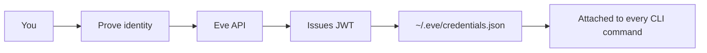
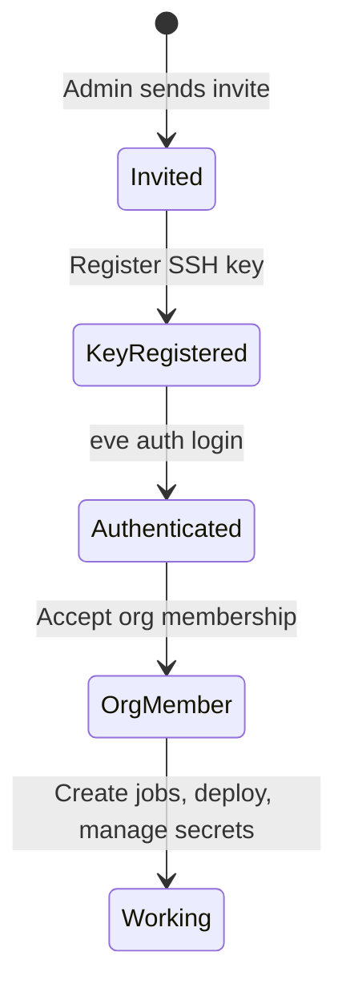
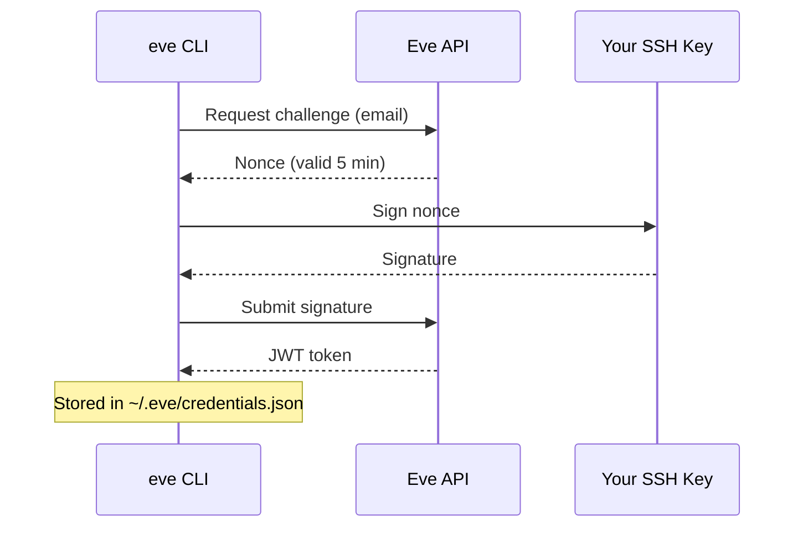
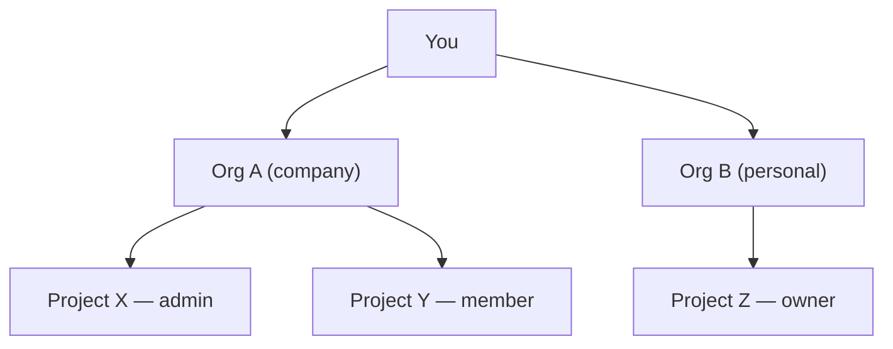

# Authentication & Identity

Before you deploy, create jobs, or manage secrets, Eve needs to know who you are. This guide walks through how identity works in Eve — from your first login to managing teams across multiple organizations.

## What does it mean to be authenticated?

Eve uses a **stateless authentication model**. There are no server-side sessions. When you log in, Eve issues a **signed JWT token** that proves your identity. The token is stored locally on your machine and attached to every CLI command you run.



What this means in practice:

- **No central session to expire on the server** — your token is self-contained. Eve verifies the signature, not a session store.
- **Your token lives in `~/.eve/credentials.json`** — scoped by API URL so you can authenticate against multiple Eve instances.
- **If you delete the file, you're logged out.** Re-run `eve auth login` to get a new token.
- **Tokens have a TTL** (default 24 hours). When it expires, you re-authenticate — there's no silent refresh.

:::tip
Run `eve auth whoami` at any time to see your current identity, org memberships, and token expiry.
:::

## The user journey

A new user goes through a clear progression from invitation to productive work:



Each state is distinct:

| State | What happened | What you can do |
|-------|---------------|-----------------|
| **Invited** | Admin created an invite for your email | Nothing yet — register your key |
| **Key registered** | Your SSH public key is stored in Eve | Authenticate with `eve auth login` |
| **Authenticated** | You hold a valid JWT token | Access the API, but no org resources yet |
| **Org member** | You belong to at least one organization | Access projects within that org |
| **Working** | Full access to assigned projects | Deploy, create jobs, manage secrets |

## How login works: SSH vs Web SSO

Eve supports two ways to prove your identity. **SSH challenge-response** is the default for CLI users. **Web SSO** (via Supabase Auth) is available for browser-based login.

### SSH challenge-response

The CLI handles this automatically — you don't need to understand the protocol to use it. But if you're curious:



The key insight: **Eve never sees your private key.** It only verifies that you can sign a challenge with the key whose public half is registered to your account.

### Comparison

| | SSH challenge-response | Web SSO |
|---|---|---|
| **Used by** | CLI, agents, scripts | Browser UI |
| **Identity proof** | SSH key signature | OAuth provider (GitHub, Google, etc.) |
| **Token algorithm** | RS256 JWT | HS256 JWT (Supabase-issued) |
| **Where stored** | `~/.eve/credentials.json` | Browser cookie |
| **Best for** | Developer workflows, CI/CD | Casual browsing, dashboards |

:::note
**GitHub is NOT required for SSH login.** Eve uses your SSH key directly. GitHub is only used as a convenience for discovering and importing your public key — you can register any SSH key manually.
:::

## Your first login

```bash
eve auth login --email user@example.com
```

That's it. The CLI handles the challenge-response flow, stores the token, and you're ready to work.

### Options

```bash
eve auth login --email user@example.com --ssh-key ~/.ssh/id_rsa --ttl 7
```

| Flag | Default | Description |
|------|---------|-------------|
| `--email` | Profile default | Your registered email |
| `--ssh-key` | `~/.ssh/id_ed25519` | Path to SSH private key |
| `--ttl` | Server-configured (1 day) | Token TTL in days (1–90) |

### Profile defaults

Set defaults so future logins are a single command:

```bash
eve config set --default-email user@example.com
eve config set --default-ssh-key ~/.ssh/id_ed25519

# With defaults set, login becomes:
eve auth login
```

### GitHub key auto-discovery

When login fails because no SSH key is registered, the CLI offers to fetch your keys from GitHub:

```
$ eve auth login --email user@example.com
Error: No SSH key registered for this email

Would you like to fetch your SSH keys from GitHub? [y/N]: y
GitHub username: myuser

Found 2 SSH keys for myuser:
  1. ssh-ed25519 AAAA... (added 2024-01-15)
  2. ssh-rsa AAAA...     (added 2023-06-20)

Select a key to register [1]: 1
Key registered successfully. Retrying login...
```

This is a convenience feature. You can always register a key manually if you don't use GitHub.

## Organizations and roles

Eve's access model is built around **organizations**. Every project belongs to an org. Every user belongs to one or more orgs with a specific role.



You can belong to multiple organizations simultaneously, with different roles in each. You can also create your own organizations.

### Org roles

| Role | Capabilities |
|------|-------------|
| `owner` | Full control — can delete the org |
| `admin` | Manage members, projects, and settings |
| `member` | Access projects and create jobs |

### Managing membership

```bash
# List org members
eve org members --org org_xxx

# Add a member
eve org members add user@example.com --role admin --org org_xxx

# Remove a member
eve org members remove user_abc --org org_xxx
```

Project-level membership follows the same pattern:

```bash
eve project members --project proj_xxx
eve project members add user@example.com --role admin --project proj_xxx
eve project members remove user_abc --project proj_xxx
```

### Checking your permissions

```bash
# See your identity, orgs, and roles
eve auth whoami

# View the full permission catalog
eve auth permissions
```

## Getting invited and requesting access

### Receiving an invite

If someone invites you, they'll share an email or link. On your side:

1. Register your SSH key (or let auto-discovery handle it).
2. Run `eve auth login --email your-email@example.com`.
3. You're in — the invite automatically grants org membership.

### Inviting users (admin)

```bash
# Invite with GitHub key auto-fetch
eve admin invite --email newuser@example.com --github newuser

# Invite with a specific role
eve admin invite --email newuser@example.com --github newuser --role admin

# Send a web-auth invite email (Supabase)
eve admin invite --email newuser@example.com --web
eve admin invite --email newuser@example.com --web --redirect-to https://app.example.com
```

### Identity-targeted invites

For Nostr users or other identity providers:

```bash
curl -X POST "$EVE_API_URL/auth/invites" \
  -H "Authorization: Bearer $TOKEN" \
  -H "Content-Type: application/json" \
  -d '{
    "org_id": "org_xxx",
    "role": "member",
    "provider_hint": "nostr",
    "identity_hint": "<pubkey>"
  }'
```

When an unregistered pubkey authenticates and matches an invite's `identity_hint`, Eve auto-provisions a user account and org membership.

### Self-service access requests

Users without an invite can request access directly:

```bash
eve auth request-access --org "My Company" --email you@example.com
eve auth request-access --org "My Company" --ssh-key ~/.ssh/id_ed25519.pub
eve auth request-access --org "My Company" --nostr-pubkey <hex>

# Check request status
eve auth request-access --status <request_id>
```

Admins review requests:

```bash
eve admin access-requests list
eve admin access-requests approve <request_id>
eve admin access-requests reject <request_id> --reason "..."
```

Approval is atomic — a single DB transaction. Failed attempts don't leave partial state. Re-approving a completed request is idempotent.

## Token types

Eve issues three kinds of tokens for different purposes:

| Token type | Issued to | Purpose | Lifetime |
|------------|-----------|---------|----------|
| **User** | Human users | CLI access, interactive work | 1–90 days (configurable) |
| **Job** | Running jobs | Scoped API access during execution | Job duration |
| **Minted** | Service accounts, bots | Programmatic access without SSH keys | 1–90 days |

### Minting tokens for service accounts

```bash
# Mint a token (creates user + membership if needed)
eve auth mint --email app-bot@example.com --org org_xxx

# With custom TTL and role
eve auth mint --email app-bot@example.com --project proj_xxx --role admin --ttl 90
```

## Bootstrap: creating the first admin

On a fresh Eve deployment with no users, someone needs to become the first admin. Eve supports three bootstrap modes:

| Mode | Trigger | Token required | Use case |
|------|---------|----------------|----------|
| **auto-open** | Fresh deploy, no users | No | Initial setup (10-minute window) |
| **recovery** | Trigger file on host | No | Lost admin access |
| **secure** | `EVE_BOOTSTRAP_TOKEN` set | Yes | Production lockdown |

### Auto-open mode (default)

On a fresh deployment with no users, the bootstrap endpoint is open for 10 minutes:

```bash
# Check bootstrap status
eve auth bootstrap --status

# Bootstrap with your real email
eve auth bootstrap --email your-email@example.com
```

:::warning
Use your **actual email address** during bootstrap. The bootstrap email becomes the admin account you'll log in with. Using a placeholder like `admin@example.com` will lock you out since you won't have the matching SSH key.
:::

The window closes after 10 minutes or after the first admin is created.

### Recovery mode

If you lose admin access, create a trigger file on the host:

```bash
# On the server or pod
touch /tmp/eve-bootstrap-enable

# Then from your machine (within 10 minutes)
eve auth bootstrap --email admin@example.com
```

The trigger file is automatically deleted after successful bootstrap.

### Secure mode (recommended for production)

Set `EVE_BOOTSTRAP_TOKEN` to require a token for all bootstrap attempts:

```bash
# Server environment
EVE_BOOTSTRAP_TOKEN=your-secure-random-token

# Bootstrap requires the token
eve auth bootstrap --email admin@example.com --token your-secure-random-token
```

When `NODE_ENV=production`, bootstrap requires the token. If it is not set, the bootstrap window is closed entirely.

## Syncing OAuth tokens

Sync local OAuth tokens (Claude, Codex) into Eve secrets so agent harnesses can use them:

```bash
eve auth sync                       # Sync to user-level
eve auth sync --org org_xxx         # Sync to org-level
eve auth sync --project proj_xxx    # Sync to project-level
eve auth sync --dry-run             # Preview without syncing
```

Check local credential availability:

```bash
eve auth creds              # Show Claude + Codex credential status
eve auth creds --claude     # Only Claude
eve auth creds --codex      # Only Codex
```

## Nostr authentication

Eve supports Nostr identity via **Schnorr challenge-response** and **NIP-98 request authentication**. This allows Nostr-native users to authenticate without SSH keys.

The flow mirrors SSH auth: Eve issues a challenge, you sign it with your Nostr private key, and Eve verifies the signature against your registered public key.

To create invites targeting Nostr identities, see [Identity-targeted invites](#identity-targeted-invites) above.

## Troubleshooting

| Problem | Fix |
|---------|-----|
| Not authenticated | `eve auth login` |
| Token expired | Re-run `eve auth login` |
| Bootstrap already completed | Use `eve auth login` (existing user) or `eve admin invite` (new users) |
| No matching key for token | Token was signed with a rotated key — re-authenticate |
| Challenge expired | Challenges are valid for 5 minutes — request a new one |

## What's next?

- **[Secrets & Credentials](./secrets.md)** — manage multi-scope secrets for deployments and agent harnesses.
- **[Security & Key Rotation](/docs/operations/security)** — JWT key rotation, incident response, and production hardening.
- **[CLI Reference](/docs/reference/cli-commands)** — full command reference for `eve auth` and `eve admin`.
