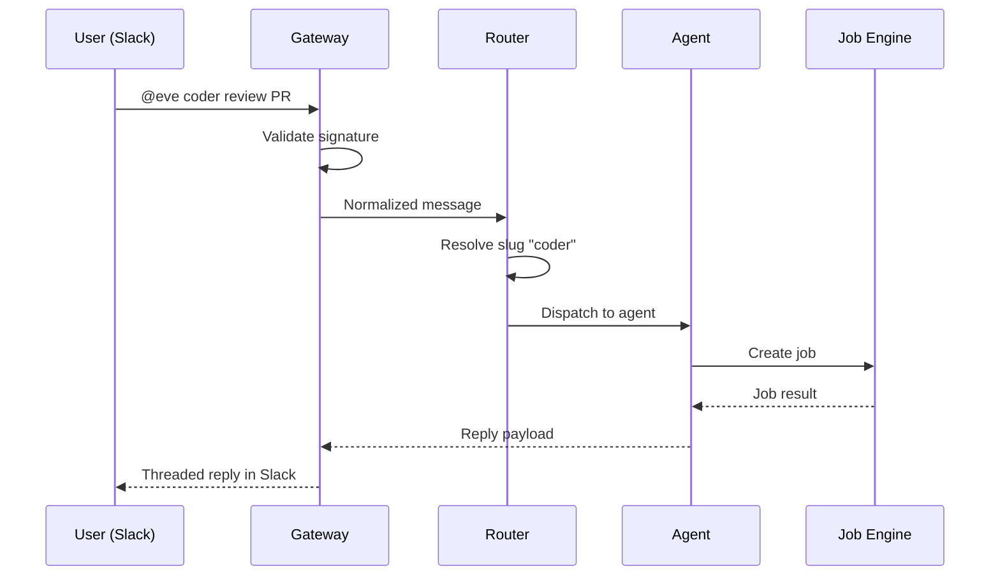

# Chat & Conversations

Eve connects agents to messaging platforms through the **chat gateway** — a pluggable service that normalizes external chat events into Eve events. Users talk to agents from Slack, Nostr, or a browser-based WebChat client, and the gateway handles the rest: authentication, routing, job creation, and threaded replies.

## Chat gateway overview

The gateway uses a provider architecture with two transport models:

| Transport | Mechanism | Provider |
|-----------|-----------|----------|
| **Webhook** | Platform sends HTTP POST to Eve | Slack |
| **Subscription** | Eve opens a persistent connection and listens | Nostr, WebChat |

Every provider implements the `GatewayProvider` interface:

- **`name`** — unique identifier (e.g. `slack`, `nostr`, `webchat`)
- **`transport`** — `webhook` or `subscription`
- **`capabilities`** — feature flags: threads, reactions, file uploads
- **`initialize(config)` / `shutdown()`** — lifecycle hooks for setup and teardown
- **`sendMessage(target, content)`** — deliver an outbound reply
- **`resolveIdentity(externalUserId, accountId)`** — map an external user to an Eve identity

Webhook providers also expose `validateWebhook(req)` for signature verification and `parseWebhook(req)` for payload normalization. Subscription providers open their connections during `initialize()` and tear them down on `shutdown()`.

Provider instances are created per integration — one instance per org integration — and managed by the provider registry.

### Multi-tenant mapping

Each external workspace maps to an Eve organization. When a Slack workspace or Nostr relay is connected as an integration, the mapping (`team_id` to `org_id`) is stored at connect time. Agent slugs in `agents.yaml` are unique per org, so the gateway can resolve any slug to a specific `{project_id, agent_id}` pair.

### Identity resolution

The `resolveIdentity` method maps an external user (Slack user ID, Nostr pubkey) to an Eve identity. External identities are stored in the `external_identities` table and linked to Eve users and orgs for permission checks and audit trails.

## Slack integration

Slack is the most common gateway provider. It uses the webhook transport model.

### Endpoints

| Endpoint | Purpose |
|----------|---------|
| `POST /gateway/providers/slack/webhook` | Slack webhook ingress |
| `POST /gateway/providers/slack/interactive` | Slack interactive actions ingress |

### Inbound flow

1. Slack sends an event to the webhook endpoint.
2. The provider validates the request signature using `HMAC-SHA256(signing_secret, v0:timestamp:body)` against the `X-Slack-Signature` header.
3. Duplicate delivery is checked via Slack `event_id` (retries are acknowledged and dropped).
4. The integration mapping resolves `team_id` to `org_id`.
5. Identity is resolved before agent routing.
6. The event type determines the dispatch path:

| Event type | Trigger | Dispatch |
|------------|---------|----------|
| `app_mention` | User writes `@eve ...` | Parsed as `@eve <agent-slug> <command>` and routed to that agent |
| `message` | Any message in a subscribed channel (no mention) | Dispatched to channel/thread listeners only |

For `app_mention` events, the first word after `@eve` is tested as an agent slug. If it matches a known slug, the message routes directly to that agent's project. If no match is found, Eve falls back to the org's `default_agent_slug` and passes the full text as the command.

If identity cannot be resolved, the gateway returns a provider-specific linking message instead of a generic routing failure.

### Reserved command: `link`

`@eve link` is intercepted before slug resolution and always starts the identity-link flow.

```text
@eve link
```

### Deduplication and timeouts

Slack retries webhook deliveries when a response takes more than ~3 seconds. The gateway acknowledges quickly and performs slower work asynchronously. Retries are de-duplicated by `event_id` in a short-lived in-memory cache.

### Outbound replies

Responses are delivered via the Slack Web API (`chat.postMessage`), threaded to the originating message.

### Listener commands

Agents can passively monitor channels and threads using listener subscriptions:

```bash
@eve agents listen <agent-slug>     # Subscribe agent to this channel (or thread)
@eve agents unlisten <agent-slug>   # Remove listener
@eve agents listening               # Show active listeners
@eve agents list                    # Directory of available agent slugs
```

When a listener is set from within a channel, it creates a **channel-level** listener — all messages in that channel are dispatched. When set from inside a thread, it creates a **thread-level** listener — only messages within that specific thread are dispatched.

Multiple agents can listen to the same channel or thread. Each listener agent receives a separate job in its own project.

## Nostr integration

The Nostr provider uses the subscription transport model. It connects to configured relay(s) via WebSocket and subscribes to events targeting the platform's public key.

### Inbound event types

| Kind | Type | Description |
|------|------|-------------|
| Kind 4 | NIP-04 encrypted DM | Private message addressed to the platform pubkey |
| Kind 1 | Public mention | Public note tagging the platform pubkey |

### Inbound flow

1. A relay broadcasts an event matching the subscription filters.
2. The provider verifies the Schnorr signature (BIP-340).
3. Kind 4 events are decrypted using NIP-04 (shared secret derived from sender pubkey and platform private key).
4. The message is normalized to the standard inbound format.
5. The agent slug is extracted from the content.
6. The message is routed through the same dispatch pipeline as Slack.

### Agent slug extraction

| Pattern | Example |
|---------|---------|
| `/agent-slug <text>` | `/mission-control review PR` |
| `agent-slug: <text>` | `mission-control: review PR` |
| First word of public mention | `mission-control review PR` |

If no slug matches a known agent, the org's default agent is used.

### Outbound replies

| Context | Event kind | Details |
|---------|-----------|---------|
| DM reply | Kind 4 | NIP-04 encrypted, published to relays |
| Public reply | Kind 1 | NIP-10 reply threading tags (`e` and `p` tags) |

Cross-relay deduplication tracks event IDs in a bounded set (10k entries). Duplicate events from multiple relays are dropped.

## WebChat

WebChat is a browser-native agent chat provider that uses the subscription transport model (like Nostr) over WebSocket.

### Connection

```
ws://gateway:4820/?token=<jwt>
```

Authentication is performed during the WebSocket handshake using a JWT token.

### Message protocol

Send a message:

```json
{"type": "message", "text": "Hello", "agent_slug": "coder", "thread_id": "optional"}
```

Receive a reply:

```json
{"type": "message", "text": "Queued 1 job(s)...", "thread_id": "...", "timestamp": "..."}
```

### Features

- **JWT auth** — validated during the WebSocket handshake
- **Heartbeat** — ping/pong at 30-second intervals
- **Thread continuity** — threads persist across reconnections
- **Multi-tab** — same user, multiple simultaneous connections

WebChat is configured as an integration with `provider: webchat`.

## Chat routing

Chat routing controls how inbound messages reach the right agent, team, or workflow. Routes are defined in `chat.yaml`.

### chat.yaml

```yaml
version: 1
default_route: route_default
routes:
  - id: route_default
    match: ".*"
    target: team:ops
    permissions:
      project_roles: [member, admin, owner]
```

### Matching rules

1. Routes are evaluated in order.
2. The first regex match wins.
3. If no route matches, the `default_route` is used.

### Route targets

| Target | Behavior |
|--------|----------|
| `agent:<id>` | Dispatch to a single agent |
| `team:<id>` | Dispatch using the team's configured mode (fanout, council, relay) |
| `workflow:<name>` | Invoke a named workflow |
| `pipeline:<name>` | Launch a pipeline run |

### Direct slug routing

When a user writes `@eve <agent-slug> <command>`, the gateway resolves the agent slug across the org and dispatches directly to that agent's project. This **bypasses** `chat.yaml` matching and is intended for cross-project routing.

If the first word is not a known slug, Eve uses the org's `default_agent_slug` and passes the full message as the command.

## Message flow

The following sequence shows the end-to-end path of a chat message from Slack through to an agent reply:



## Threads and continuity

Threads provide continuity for chat-driven work. A thread captures the route, participants, and message history for a conversation session.

### Thread key format

Thread continuity uses a canonical key scoped to the integration account:

```
account_id:channel[:thread_id]
```

Examples:

- **Slack**: `T123ABC:C456DEF:1234567890.123456`
- **Nostr**: `<platform-pubkey>:<sender-pubkey>`

### Thread scopes

| Scope | Description |
|-------|-------------|
| `project` | Belongs to a project, emits project chat events |
| `org` | Org-wide, used for multi-project or cross-channel coordination |

### Coordination threads

When a team dispatch creates child jobs, a **coordination thread** is automatically created and linked to the parent job. Child agents receive `EVE_PARENT_JOB_ID` in their environment and derive the coordination thread key:

```
coord:job:{parent_job_id}
```

When a child job's attempt completes, the orchestrator posts a summary to the coordination thread, giving the lead agent and team members visibility into sibling progress.

### Coordination inbox

When a coordination thread exists, the worker writes a lightweight inbox file into the repo workspace for quick review:

```
.eve/coordination-inbox.md
```

This file is regenerated from recent coordination thread messages at job start, giving agents immediate context about sibling activity.

### Supervision

Lead agents can long-poll child events for a job:

```bash
eve supervise
eve supervise <job-id> --timeout 60
```

### Org threads

Org-scoped threads provide continuity for multi-project or cross-channel coordination. They follow the same message schema as project threads but are keyed independently:

```
org:{org_id}:{user_key}
```

```bash
# Org thread API
eve thread list --org org_xxx
eve thread show --org org_xxx --id thr_xxx
```

### Thread CLI

```bash
eve thread list --org org_xxx
eve thread show --org org_xxx --id thr_xxx
eve thread messages thr_xxx --org org_xxx --since 10m
eve thread post thr_xxx --body '{"kind":"directive","body":"focus on auth"}'
eve thread follow thr_xxx
```

`eve thread follow` uses SSE-style streaming (`/threads/{id}/follow`) for near-real-time updates.

### Message kinds

Coordination thread messages use a JSON body with `kind` and `body` fields:

| Kind | Purpose |
|------|---------|
| `status` | Automatic end-of-attempt summary |
| `directive` | Lead-to-member instruction |
| `question` | Member-to-lead question |
| `update` | Progress update from a member |

## Org-wide agent directory

Every agent can declare how it appears to gateway clients via the `gateway_exposure` field in `agents.yaml`:

| Policy | Directory | Direct chat | Internal dispatch |
|--------|-----------|-------------|-------------------|
| `none` | Hidden | Rejected | Works |
| `discoverable` | Visible | Rejected (with hint) | Works |
| `routable` | Visible | Works | Works |

Use `@eve agents list` to view the org's agent directory. Set the default agent for your org with:

```bash
eve org update <org_id> --default-agent <slug>
```

## Simulation

Test the full routing pipeline without a live provider connection:

```bash
eve chat simulate \
  --team-id T123 \
  --text "hello" \
  --json
```

Use `--project` only for legacy simulation mode. Without `--project`, simulation goes through the gateway routing path and supports additional fields such as `--thread-id`, `--external-email`, `--event-type`, and `--dedupe-key`.

The response includes normalized routing output (`thread_id`, `route_id`, `target`, `job_ids`, `event_id`) plus gateway metadata like `duplicate` and `immediate_reply`.

:::tip
Simulation is available via both API paths:
- Legacy: `POST /projects/{project_id}/chat/simulate`
- Gateway: `POST /gateway/providers/simulate`
:::

## API endpoints

The gateway exposes several endpoints for chat operations:

| Endpoint | Purpose |
|----------|---------|
| `POST /gateway/providers/:provider/webhook` | Generic webhook ingress |
| `POST /gateway/providers/slack/interactive` | Slack interactive actions ingress |
| `GET /internal/orgs/{org_id}/agents` | Agent directory (filtered by exposure policy) |
| `POST /internal/orgs/{org_id}/chat/route` | Slug-based routing (enforces `routable` policy) |
| `POST /gateway/providers/simulate` | Simulate via gateway routing |
| `POST /projects/{project_id}/chat/simulate` | Legacy project-scoped simulate API |
| `POST /chat/listen` | Subscribe an agent to a channel/thread |
| `POST /chat/unlisten` | Unsubscribe an agent |
| `GET /chat/listeners` | List active listeners |

## What's next?

Set up your local dev environment: [Local Development](./local-development.md)
