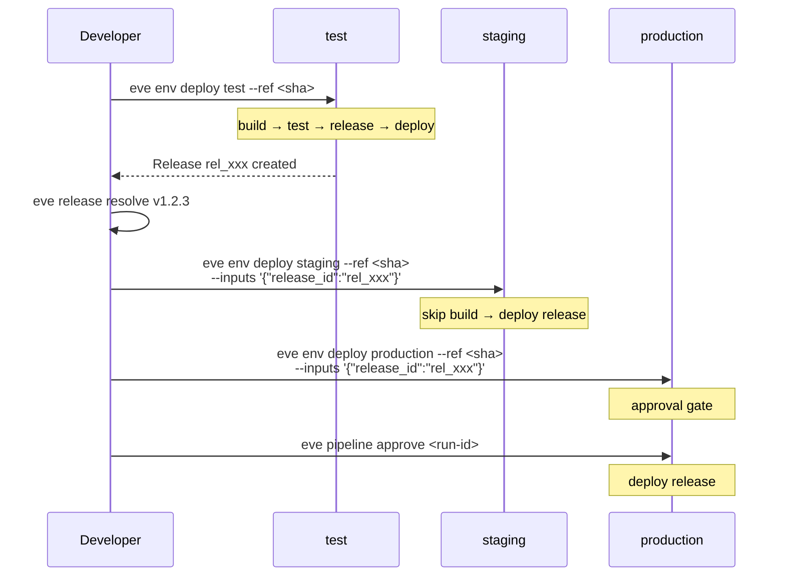

# Environments & Promotion

Environments are named deploy targets — staging, production, preview — each with its own service overrides, pipeline bindings, and approval policies. Eve treats environments as first-class manifest objects so that every deploy follows a repeatable, auditable path from code to production.

## Defining environments in the manifest

Environments live under the `environments` key in `.eve/manifest.yaml`. Each entry names a deploy target and optionally binds it to a pipeline, sets approval policy, and provides service overrides.

```yaml
environments:
  test:
    pipeline: deploy-test
  staging:
    pipeline: deploy
    pipeline_inputs:
      smoke_test: true
      timeout: 1800
  production:
    pipeline: deploy
    approval: required
```

| Field | Description |
|-------|-------------|
| `pipeline` | Pipeline to run when deploying to this environment |
| `pipeline_inputs` | Default inputs passed to the pipeline run |
| `approval` | Set to `required` to gate deploy and job steps |
| `overrides` | Compose-style service overrides for this environment |
| `workers` | Worker pool selection for this environment |

When a `pipeline` is configured, [eve env deploy](/docs/reference/cli-commands) becomes a pipeline alias — it triggers a pipeline run instead of performing a direct deployment. This is the recommended pattern for all non-local environments.

## Environment overrides

Overrides let you customize service configuration per environment without duplicating your entire service definition. The `overrides.services` block follows the same structure as your top-level `services` block.

```yaml
environments:
  staging:
    pipeline: deploy
    overrides:
      services:
        api:
          environment:
            NODE_ENV: staging
            LOG_LEVEL: debug
            FEATURE_FLAGS: '{"beta_ui": true}'
  production:
    pipeline: deploy
    approval: required
    overrides:
      services:
        api:
          environment:
            NODE_ENV: production
            LOG_LEVEL: warn
```

Overrides are merged into the base service definition at deploy time. You can override environment variables, ports, health check parameters, or any other service-level field. The base definition stays clean with sensible defaults while each environment applies its own tuning.

### Variable interpolation

Environment values support built-in variables that resolve at deploy time:

| Variable | Resolves to | Example |
|----------|-------------|---------|
| `${ENV_NAME}` | Environment name | `staging` |
| `${PROJECT_ID}` | Project ID | `proj_01kfew...` |
| `${ORG_ID}` | Organization ID | `org_Example...` |
| `${ORG_SLUG}` | Organization slug | `acme` |
| `${secret.KEY}` | Secret value | `${secret.DB_PASSWORD}` |
| `${managed.<svc>.<field>}` | Managed DB field | `${managed.db.url}` |

```yaml
services:
  api:
    environment:
      DATABASE_URL: postgres://app:${secret.DB_PASSWORD}@${ENV_NAME}-db:5432/app
```

## Pipeline-linked environments

When an environment has a `pipeline` field, `eve env deploy` stops being a direct deployment command and starts acting as a pipeline trigger. This is the key mechanism that makes environments and pipelines work together.

```yaml
environments:
  test:
    pipeline: deploy-test

pipelines:
  deploy-test:
    steps:
      - name: build
        action: { type: build }
      - name: unit-tests
        script:
          run: "pnpm test"
          timeout: 1800
      - name: deploy
        depends_on: [build, unit-tests]
        action: { type: deploy }
```

With this configuration, running `eve env deploy test --ref <sha>` triggers the `deploy-test` pipeline, which builds, tests, and deploys in sequence. The environment gets a consistent, repeatable deployment workflow every time.

## Pipeline inputs

Environments can declare default inputs that are passed to the pipeline on every run. These are useful for environment-specific behavior like smoke tests, timeouts, or feature flags.

```yaml
environments:
  staging:
    pipeline: deploy
    pipeline_inputs:
      smoke_test: true
      timeout: 1800
```

CLI-level inputs override manifest defaults for matching keys:

```bash
eve env deploy staging \
  --ref 0123456789abcdef0123456789abcdef01234567 \
  --inputs '{"release_id":"rel_xxx","smoke_test":false}'
```

In this example, `smoke_test` is overridden to `false` while `timeout` keeps the manifest default of `1800`.

## Approval gates

Setting `approval: required` on an environment prevents deploy and job steps from executing until an authorized user explicitly approves the pipeline run.

```yaml
environments:
  production:
    pipeline: deploy
    approval: required
```

When a pipeline run reaches an approval-gated environment, it pauses and waits for explicit approval:

```bash
# Check pending runs
eve pipeline runs my-pipeline --status pending_approval

# Approve
eve pipeline approve <run-id>

# Or cancel
eve pipeline cancel <run-id> --reason "Blocking bug found in staging"
```

Approval gates are the safety net for production deployments. They ensure that a human reviews the pipeline state before changes reach end users.

## Direct deploy vs. pipeline deploy

Even when an environment has a pipeline binding, you can bypass it with the `--direct` flag for emergency deployments or one-off debugging:

```bash
# Normal: triggers the pipeline
eve env deploy staging --ref 0123456789abcdef0123456789abcdef01234567

# Direct: bypasses the pipeline, deploys immediately
eve env deploy staging --ref 0123456789abcdef0123456789abcdef01234567 --direct
```

:::caution
Direct deploys skip build, test, and release steps. Use them only when you need to bypass the pipeline intentionally — for example, during incident recovery when you need to deploy a known-good image immediately.
:::

## Promotion workflow

The standard promotion pattern is build-once, deploy-many. A release is created in the first environment and promoted through subsequent environments without rebuilding.



### Walkthrough

**Step 1 — Build and release in test:**

```bash
eve env deploy test --ref 0123456789abcdef0123456789abcdef01234567
```

The test pipeline builds images, runs tests, creates a release, and deploys. The release captures the exact image digests from the build, ensuring immutable deployments downstream.

**Step 2 — Resolve the release:**

```bash
eve release resolve v1.2.3
```

This returns the release ID (`rel_xxx`) that was tagged in the test environment. You pass this to subsequent environments so they reuse the same images without rebuilding.

**Step 3 — Promote to staging:**

```bash
eve env deploy staging \
  --ref 0123456789abcdef0123456789abcdef01234567 \
  --inputs '{"release_id":"rel_xxx"}'
```

Staging receives the pre-built release. The pipeline runs any staging-specific steps (like smoke tests) but skips the build because the release already contains the image digests.

**Step 4 — Promote to production:**

```bash
eve env deploy production \
  --ref 0123456789abcdef0123456789abcdef01234567 \
  --inputs '{"release_id":"rel_xxx"}'
```

Production has `approval: required`, so the pipeline run pauses until you approve it. After approval, the same release is deployed — the exact same image digests that ran in test and staging.

## Release resolution

The `eve release resolve` command looks up a release by tag or version and returns its ID. This is the bridge between environments in a promotion workflow.

```bash
# Resolve by version tag
eve release resolve v1.2.3

# The returned release_id contains:
# - Build ID reference
# - Image digests (sha256) for each service
# - Git ref and metadata
```

Releases reference images by digest, not by tag. This means `v1.2.3` in production is byte-for-byte identical to `v1.2.3` in test — there is no possibility of tag mutation causing drift between environments.

## Environment gating

Environment gating prevents concurrent deployments to the same environment. When a job targets a named environment, the platform automatically acquires an exclusive gate to ensure only one deployment runs at a time.

### How it works

When a job has `env_name` set, the system creates an environment-scoped gate:

```
Gate key: env:{project_id}:{env_name}
Example:  env:proj_abc123:staging
```

If another job is already deploying to the same environment, the new job blocks in the `ready` phase with `blocked_on_gates` populated. Once the first job completes (success, failure, or cancellation), the gate is released and the next job proceeds.

### Key behaviors

- **Automatic:** You do not need to configure gating manually. Any job with `env_name` gets gated automatically.
- **Project-scoped:** Gates include the project ID, so `staging` in project A and `staging` in project B are independent.
- **TTL-protected:** Gates have a TTL matching the job timeout (default 30 minutes). If a job crashes without releasing its gate, the TTL ensures eventual cleanup.
- **Combinable:** You can add custom gates alongside the automatic environment gate for additional concurrency control (for example, a `db-migration` gate to prevent two migrations from running simultaneously).

### Mutex use case

You can use environment gating for non-deployment scenarios by setting `env_name` to any unique string:

```bash
eve job create \
  --project proj_abc123 \
  --description "Run database backup" \
  --env-name db-backup
```

This ensures only one backup job runs at a time, even though `db-backup` is not a traditional deploy environment.

## Environment CLI

The `eve env` command group manages all environment operations.

### Deploy

```bash
# Pipeline deploy (default when pipeline is configured)
eve env deploy staging --ref 0123456789abcdef0123456789abcdef01234567

# With inputs
eve env deploy staging --ref <sha> --inputs '{"release_id":"rel_xxx"}'

# Direct deploy (bypass pipeline)
eve env deploy staging --ref <sha> --direct
```

### Inspect

```bash
# Show environment status, deployed release, and service health
eve env show staging

# Run diagnostics on a failing environment
eve env diagnose staging
```

[eve env show](/docs/reference/cli-commands) returns the current deployed release, service replicas, and health status. [eve env diagnose](/docs/reference/cli-commands) runs a deeper check — inspecting pod status, recent events, and common failure patterns.

### Rollback

```bash
# Roll back to the previously deployed release
eve env rollback staging
```

Rollback redeploys the previous release. It does not undo database migrations or other side effects — it replaces the running containers with the prior image set.

### Reset

```bash
# Reset environment state (clear stuck deployments)
eve env reset staging
```

Reset clears the environment's deployment state without deploying anything. Use it to recover from stuck or corrupted state when `rollback` is not sufficient.

## Platform environment variables

Eve automatically injects environment variables into all deployed services so they can interact with the platform:

| Variable | Description |
|----------|-------------|
| `EVE_API_URL` | Internal cluster URL for server-to-server calls |
| `EVE_PUBLIC_API_URL` | Public ingress URL for browser-facing apps |
| `EVE_PROJECT_ID` | The project ID |
| `EVE_ORG_ID` | The organization ID |
| `EVE_ENV_NAME` | The current environment name |

Use `EVE_API_URL` for backend calls from your containers. Use `EVE_PUBLIC_API_URL` for client-side code running in the browser. Services can override these values by defining them explicitly in their `environment` section.

## What's next?

Add agent skills to your project: [Skills & Skill Packs](./skills.md)
