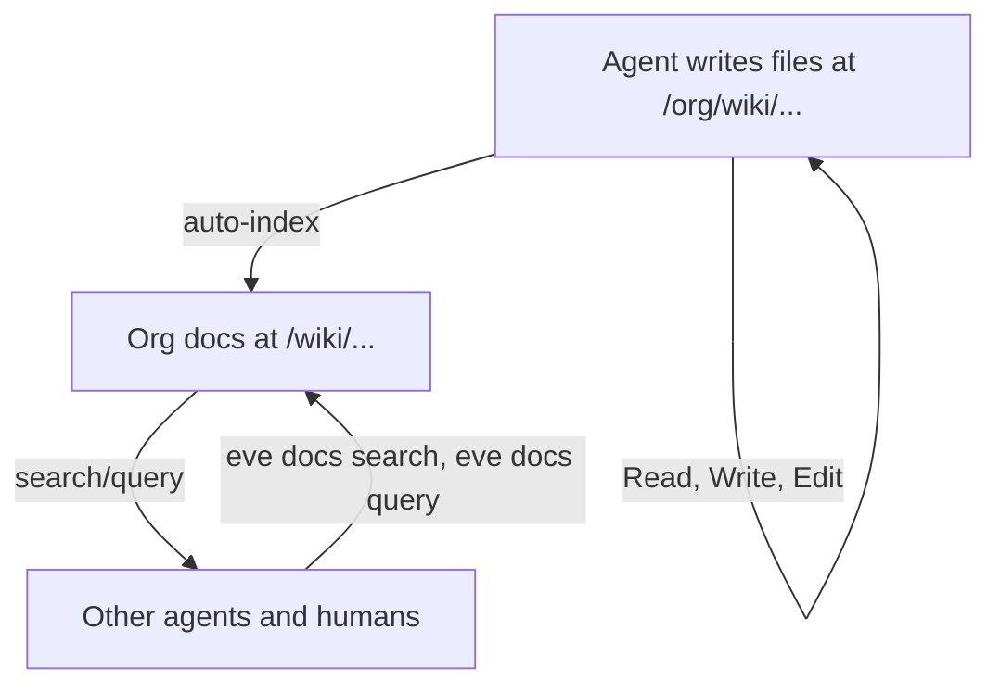

# LLM Wiki

Build persistent, structured knowledge bases where agents do the writing and maintenance — not humans.

## The Pattern

Most LLM-document workflows look like RAG: upload files, retrieve chunks at query time, generate an answer. The LLM rediscovers knowledge from scratch on every question. Nothing accumulates.

The LLM Wiki pattern is different. Instead of retrieving from raw documents at query time, the agent **incrementally builds and maintains a persistent wiki** — a structured, interlinked collection of pages that sits between you and the raw sources. When you add a new source, the agent reads it, extracts key information, and integrates it into the existing wiki — updating entity pages, revising summaries, flagging contradictions, strengthening the evolving synthesis.

**The wiki is a compounding artifact.** Cross-references are already there. Contradictions are already flagged. The synthesis already reflects everything ingested. The wiki gets richer with every source added and every question asked.

This pattern was [described by Andrej Karpathy](https://github.com/karpathy/LLM-Wiki) and applies broadly: research wikis, company knowledge bases, competitive analysis, personal learning, and more.

## Three Layers

| Layer | What | Who owns it | Eve primitive |
|-------|------|-------------|---------------|
| **Raw sources** | Curated source documents (articles, reports, data) | Human or ingest pipeline | Org filesystem, attachments |
| **The wiki** | Structured, interlinked markdown pages | Agent (exclusively) | Org docs (versioned, searchable) |
| **The schema** | Conventions, structure, workflows | Human + agent (co-evolved) | CLAUDE.md, agent config |

The human curates sources, directs analysis, asks questions, and thinks about meaning. The agent does everything else — summarizing, cross-referencing, filing, bookkeeping.

## Eve's Wiki Substrate

Eve provides a two-layer substrate for the LLM Wiki pattern:



- **Write path**: Agents use normal file tools on the org-fs mount. Zero friction.
- **Read path**: Agents use normal file tools on the org-fs mount. Zero friction.
- **Search path**: `eve docs search --path /wiki --context 3` for targeted search with surrounding lines.
- **Patch path**: `eve docs patch` for surgical edits without full document rewrites.
- **Navigation**: `eve docs list --tree` to see wiki structure at a glance.

Changes flow automatically from org-fs to org docs via the indexing pipeline. With LISTEN/NOTIFY, indexing latency is sub-second.

## Agent Workflow

A wiki-maintaining agent uses normal file tools for reading and writing, and CLI commands for search, navigation, and coordination:

```bash
# Read a wiki page (normal file tool)
Read /org/world-model/state.yaml

# Edit a wiki page (normal file tool)
Edit /org/world-model/state.yaml
  old: "health: green"
  new: "health: amber"

# Search the wiki (CLI)
eve docs search --org $ORG_ID --query "deploy failure" --context 3 --path /world-model

# Navigate wiki structure (CLI)
eve docs list --org $ORG_ID --path /operating-model --tree

# Surgical patch without fetching full doc (CLI)
eve docs patch --org $ORG_ID --path /world-model/state.yaml \
  --replace "health: green" "health: amber"

# Check what changed between versions (CLI)
eve docs diff --org $ORG_ID --path /world-model/state.yaml

# Watch for changes from other agents (CLI)
eve docs watch --org $ORG_ID --path /world-model --since now
```

## Operations

### Ingest

Drop a source into the raw collection. The agent reads it, extracts key information, writes summary pages, updates the index, updates entity and concept pages across the wiki. A single source might touch 10-15 wiki pages.

```bash
# Bulk populate a wiki from a local directory
eve docs write-dir --org $ORG_ID --source ./wiki-seed --path-prefix /operating-model
```

### Query

Ask questions against the wiki. The agent searches with context, reads relevant pages, synthesizes an answer. Good answers can be filed back as new wiki pages — explorations compound.

```bash
eve docs search --org $ORG_ID --query "deployment risk" --path /world-model --context 5
```

### Lint

Periodically health-check the wiki. Look for contradictions, stale claims, orphan pages, missing cross-references. The agent suggests new questions to investigate.

```bash
eve docs stale --org $ORG_ID --prefix /wiki --overdue-by 7d
```

### Sync

Synchronize a local wiki directory with org docs. Always preview with `--dry-run` first.

```bash
eve docs sync --org $ORG_ID --source ./wiki --path-prefix /operating-model --dry-run --delete
eve docs sync --org $ORG_ID --source ./wiki --path-prefix /operating-model --delete
```

## Near-Instant Indexing

The org-fs to org-docs indexing pipeline uses PostgreSQL LISTEN/NOTIFY for sub-second wake on file changes:

1. Agent writes file to org-fs mount
2. `org_fs_events` trigger fires NOTIFY
3. Index processor wakes immediately, drains the queue
4. Document is searchable via `eve docs search`

If the LISTEN connection drops, a 2-second polling fallback ensures nothing is lost.

## Why This Works

The tedious part of maintaining a knowledge base is not reading or thinking — it's bookkeeping. Updating cross-references, keeping summaries current, noting contradictions, maintaining consistency across dozens of pages. Humans abandon wikis because maintenance grows faster than value.

Agents don't get bored. They don't forget cross-references. They can touch 15 files in one pass. The wiki stays maintained because the cost of maintenance is near zero.

## Further Reading

- [Andrej Karpathy's LLM Wiki](https://github.com/karpathy/LLM-Wiki) — the original pattern description
- [CLI Reference: eve docs](/docs/reference/cli-appendix#eve-docs) — full command reference including patch, diff, tree, sync, and watch
- [Storage Guide](/docs/guides/storage) — org filesystem and object store
