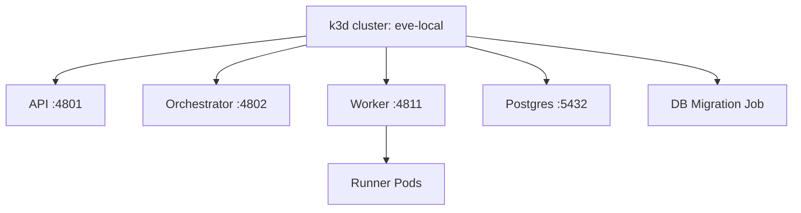

# Local Development

Eve supports two local runtime modes: **Docker Compose** for fast iteration and **k3d (Kubernetes)** for production-parity testing. This guide covers both paths, prerequisite setup, local configuration, and diagnostics.

## Runtime modes

Eve Horizon's runtime is controlled by the `EVE_RUNTIME` environment variable:

| Mode | `EVE_RUNTIME` | Startup | Runner execution | Best for |
|------|---------------|---------|------------------|----------|
| Docker Compose | `docker` (default) | ~10 seconds | Local process | Daily development, quick iteration |
| Kubernetes (k3d) | `k8s` | ~60 seconds | Ephemeral pods | Integration testing, manual validation |

Both modes run the same core services — API, Orchestrator, Worker, and Postgres — but differ in how they execute agent jobs. Docker Compose runs jobs as local processes, while k3d spawns ephemeral Kubernetes pods that mirror production behavior.

## Docker Compose quick start

Docker Compose is the fastest path to a running local stack.

```bash
# Start the stack
./bin/eh start docker
```

This brings up the API (port 4801), Orchestrator, Worker (port 4811), and Postgres. Services are accessible on `localhost` without any ingress or port-forwarding configuration.

```bash
# View logs
docker compose logs -f

# Stop and clean up
docker compose down -v
```

### Keep Compose and manifest in sync

When developing locally with Docker Compose, your `compose.yaml` and `.eve/manifest.yaml` should stay aligned:

- Match service names and exposed ports between both files.
- If a service is public in production, set `x-eve.ingress.public: true` in the manifest.
- Use `${secret.KEY}` in the manifest and keep local values in `.eve/dev-secrets.yaml`.

:::caution
Docker Compose is for development only. It exposes services on localhost and uses simple defaults. Do not run it in shared or internet-exposed environments.
:::

## k3d quick start

k3d provides a production-like Kubernetes environment for integration testing and manual validation.

### Published CLI path

The simplest way to manage the local k3d cluster:

```bash
# Create cluster and deploy the full stack
eve local up

# Check health and status
eve local health
eve local status

# Stop when done
eve local down
```

`eve local up` auto-installs and manages `k3d` and `kubectl` in `~/.eve/bin`.

### Contributor path

If you're working from the Eve Horizon monorepo:

```bash
# Create cluster and apply manifests
./bin/eh k8s start

# Build images and deploy
./bin/eh k8s deploy

# Check status
./bin/eh k8s status

# Stop when done
./bin/eh k8s stop
```

### Architecture

The k3d cluster runs all services in the `eve` namespace:



- **API, Orchestrator, Worker** — cluster-scoped deployments in the `eve` namespace
- **Postgres** — StatefulSet with 5Gi PVC
- **Runner pods** — ephemeral pods spawned per job attempt for isolated execution
- **Ingress** — access via `http://api.eve.lvh.me` (no port-forwarding needed; `lvh.me` resolves to `127.0.0.1`)

## When to use which mode

| Aspect | Docker Compose | k3d (Kubernetes) |
|--------|----------------|------------------|
| Startup time | ~10 seconds | ~60 seconds |
| Resource usage | Lower | Higher (8GB+ RAM) |
| Production parity | Moderate | High |
| Runner pods | No (local process) | Yes (ephemeral pods) |
| Ingress routing | No | Yes (`*.lvh.me`) |
| Primary use case | Daily dev, quick iteration | Integration tests, manual validation |

**Use Docker Compose** when you're iterating on application code and need fast feedback loops. **Use k3d** when you need to validate the full job lifecycle including runner pod creation, workspace provisioning, and ingress routing.

## macOS prerequisites

### Docker Desktop

Open Docker Desktop and allocate adequate resources under **Settings > Resources**:

| Resource | Minimum | Recommended |
|----------|---------|-------------|
| Memory | 8 GB | 12 GB |
| CPUs | 4 | 6+ |
| Disk | 50 GB | 100 GB |

### Required tools

| Tool | Required for | Installation |
|------|-------------|-------------|
| Docker Desktop | Both modes | [docker.com](https://docker.com) |
| Node.js | Both modes | `brew install node` |
| pnpm | Both modes | `npm install -g pnpm` |
| k3d | k3d mode only | Auto-installed by `eve local up`, or `brew install k3d` |
| kubectl | k3d mode only | Auto-installed by `eve local up`, or `brew install kubectl` |

## Local config files

### .eve/profile.yaml

Profiles let you switch between environments (local, staging, production):

```bash
# Set the active profile
eve profile use local

# Check active profile and API target
eve auth status
```

### .eve/dev-secrets.yaml

Local secrets for manifest interpolation. This file is normally gitignored.

```yaml
# .eve/dev-secrets.yaml
secrets:
  default:
    DB_PASSWORD: dev_password
    API_KEY: local-dev-key
  test:
    DB_PASSWORD: test_password
  staging:
    DB_PASSWORD: staging_password
```

The `default` block provides fallback values for any environment. Environment-specific blocks override individual keys. Local secrets take precedence over API secrets for developer convenience.

### .env

Use `.env` at the repo root for Docker Compose environment variables and internal tokens:

```bash
EVE_SECRETS_MASTER_KEY=replace-me
EVE_INTERNAL_API_KEY=replace-me
GITHUB_TOKEN=ghp_xxx
```

Both `.env` and `.eve/dev-secrets.yaml` should be listed in `.gitignore`. Default development works without a `.env` unless you need private repo access or external API keys.

## Development workflow

The typical k3d development workflow follows these steps:

1. **Ensure cluster** — creates the k3d cluster if it doesn't exist (`eve local up` or `./bin/eh k8s start`).
2. **Build images** — `docker build` for API, Orchestrator, and Worker.
3. **Import to k3d** — `k3d image import` pushes local images into the cluster.
4. **Apply manifests** — `kubectl apply -k k8s/overlays/local`.
5. **Run migration** — the DB migration job runs and waits for completion.
6. **Wait for rollout** — all deployments must report ready.
7. **Access services** — API and Worker are accessible via ingress (`api.eve.lvh.me`) or port-forward.

For Docker Compose, the workflow is simpler: `./bin/eh start docker` handles everything.

### Testing tiers

Eve uses a two-tier test architecture across both runtime modes:

| Test type | Docker Compose | k3d | What it tests |
|-----------|:--------------:|:---:|---------------|
| Integration | Yes | Yes | API endpoints, job flow, secrets (direct HTTP calls) |
| Manual (k8s) | No | Yes | Full job flow with real repos and harnesses |

Integration tests live in `apps/api/test/integration/` and validate API functionality via direct HTTP calls — org creation, job lifecycle, secrets CRUD, and harness configuration.

Manual tests run against the k3d stack and validate end-to-end workflows: harness authentication, real repository cloning, workspace provisioning, and job completion. They use `eve job follow` for real-time visibility.

## Creating orgs and projects locally

With the local stack running, create an org and project to start working:

```bash
# Ensure an org exists (idempotent)
eve org ensure "my-org"

# Create a project pointing to a local repo
eve project create --name my-app --org org_myorg --repo-url file:///path/to/repo

# Import secrets for the project
eve secrets import --org org_myorg --file ./secrets.env
```

For k3d stacks, you can run the manual test setup:

```bash
eve org ensure "manual-test-org" --json
eve secrets import --org org_manualtestorg --file manual-tests.secrets
```

## Running jobs against local repos

Once your org and project exist, you can create and follow jobs:

```bash
# Deploy to a local environment
eve env deploy staging --ref main --repo-dir .

# Or create a direct job
eve job create --project proj_xxx --prompt "Run tests"

# Follow the job in real time
eve job list --phase active
eve job follow <job-id>
eve job result <job-id>
```

### Promoting from local to staging

When your local work looks good, promote to a remote environment:

```bash
# Ensure profile and auth are set
eve profile use staging
eve auth status

# Set required secrets
eve secrets set API_KEY "value" --project proj_xxx

# Deploy to staging
eve env deploy staging --ref main --repo-dir .
```

Use `--direct` to bypass the pipeline and deploy directly:

```bash
eve env deploy staging --ref main --repo-dir . --direct
```

## Local stack diagnostics

### Health and status

```bash
# Published CLI
eve local health     # Service health checks
eve local status     # Pod/container status

# Contributor path (k3d)
./bin/eh k8s status  # Namespace resources and PVCs
```

### Viewing logs

For Docker Compose:

```bash
docker compose logs -f           # All services
docker compose logs -f api       # Single service
```

For k3d:

```bash
# API logs
kubectl --context k3d-eve-local -n eve logs -l app=eve-api -f

# Worker logs
kubectl --context k3d-eve-local -n eve logs -l app=eve-worker -f

# Migration logs
kubectl --context k3d-eve-local -n eve logs job/eve-db-migrate
```

### Kube context safety

Local k8s operations are locked to the `k3d-eve-local` context. Use the safe wrapper for local operations:

```bash
./bin/eh kubectl get pods -n eve
```

If your context drifts, recover with:

```bash
# Check active vs expected context
./bin/eh kctx

# Switch back to local context
kubectl config use-context k3d-eve-local
```

## Troubleshooting

### Connection EOF / load balancer issues

k3d's load balancer can become stale after sleep/wake cycles:

```bash
docker restart k3d-eve-local-serverlb
kubectl --context k3d-eve-local get nodes
```

### TLS handshake timeout

Delete and recreate the cluster with explicit localhost binding:

```bash
k3d cluster delete eve-local
k3d cluster create eve-local --api-port 127.0.0.1:6443
```

### Port already in use

```bash
lsof -i :4801
pkill -f "port-forward.*4801"
```

### Image pull errors

```bash
# Verify images exist in k3d
docker images | grep eve-horizon

# Re-import images
./bin/eh k8s-image push
```

### Pod stuck in pending

```bash
kubectl --context k3d-eve-local -n eve describe pod <pod-name>
```

Common causes: insufficient Docker Desktop resources or an unbound PVC. Increase the memory and CPU allocation in Docker Desktop settings.

### Local works but staging fails

If your application works locally but fails after promoting to a remote environment:

1. Re-check manifest parity with `compose.yaml`.
2. Verify secrets exist in Eve: `eve secrets list --project proj_xxx`.
3. Use `eve job diagnose <job-id>` for failure details.

### Environment variables

Key environment variables for local stack configuration:

| Variable | Purpose | Default |
|----------|---------|---------|
| `EVE_RUNTIME` | Runtime mode (`docker` or `k8s`) | `docker` |
| `EVE_API_URL` | API endpoint | `http://localhost:4801` |
| `EVE_SECRETS_MASTER_KEY` | Encryption key for secrets at rest | (required) |
| `EVE_INTERNAL_API_KEY` | Internal token for service-to-service calls | (required) |
| `EVE_AUTH_ENABLED` | Enable authentication | `true` |

For the k3d stack, additional configuration lives in k8s manifests:

| Source | Description |
|--------|-------------|
| `k8s/base/configmap.yaml` | Non-sensitive config |
| `k8s/overlays/local/secrets.yaml` | Local secrets (gitignored) |
| `system-secrets.env.local` | Auth keys for JWT signing |

## What's next?

Manage secrets and authentication: [Secrets & Auth](./secrets-and-auth.md)
