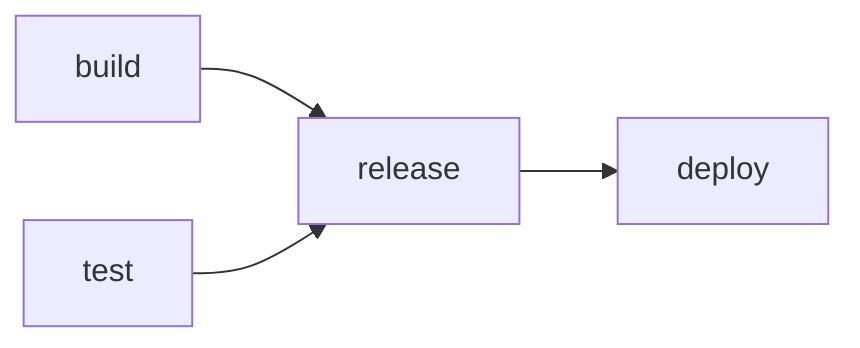
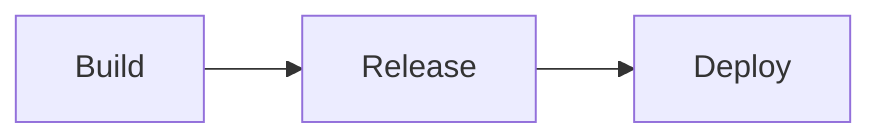
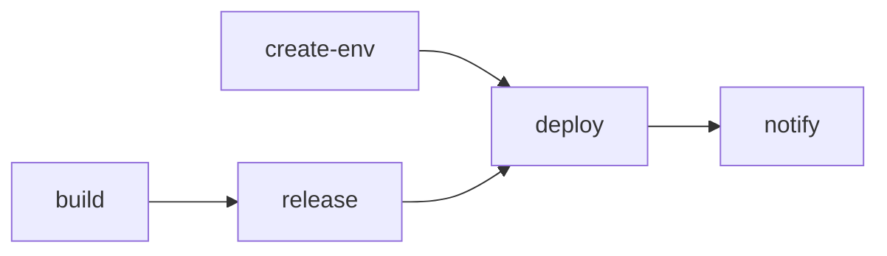

# Pipelines & CI/CD

Pipelines are deterministic sequences of steps that Eve expands into job graphs. They are the backbone of your CI/CD workflow — defining how code moves from a commit to a running deployment. This guide covers pipeline definitions, step types, triggers, the canonical build-release-deploy flow, and PR preview environments.

## What is a pipeline?

A pipeline is a named sequence of steps declared in `.eve/manifest.yaml` under the `pipelines` key. When you run a pipeline, Eve's pipeline expander converts each step into a job, wires up dependencies, and executes the resulting job graph.

```yaml
pipelines:
  deploy:
    steps:
      - name: build
        action: { type: build }
      - name: test
        script:
          run: "pnpm test"
          timeout: 1800
      - name: release
        depends_on: [build, test]
        action: { type: release }
      - name: deploy
        depends_on: [release]
        action: { type: deploy }
```

The expander creates a pipeline run (`prun_xxx`) containing one job per step, with dependency edges matching the `depends_on` declarations. Steps without dependencies run in parallel.

Here is how the pipeline above expands into a job graph:



The `build` and `test` steps execute concurrently. Once both complete, `release` runs. Finally, `deploy` runs after the release is created.

## Step types

Every pipeline step must define exactly one of four execution types: `action`, `script`, `agent`, or `run`.

### Action steps

Action steps invoke built-in Eve operations. The `type` field determines the operation:

```yaml
steps:
  - name: build
    action:
      type: build
```

Available action types:

| Type | Description |
|------|-------------|
| `build` | Build container images from service `build` contexts |
| `release` | Create a release from build artifacts |
| `deploy` | Deploy services to the target environment |
| `run` | Run a command in a container |
| `job` | Execute a job-role service (e.g., migrations) |
| `create-pr` | Create a GitHub pull request |
| `notify` | Send a notification |
| `env-ensure` | Create an environment if it does not exist |
| `env-delete` | Delete an environment |

Action steps can pass additional configuration through a `with` block:

```yaml
steps:
  - name: migrate
    action:
      type: job
      service: migrate

  - name: deploy-staging
    action:
      type: deploy
      with:
        env_name: staging

  - name: notify-team
    action:
      type: notify
      with:
        channel: slack
        message: "Deployment complete"
```

### Script steps

Script steps execute shell commands on the worker:

```yaml
steps:
  - name: unit-tests
    script:
      run: "pnpm test"
      timeout: 1800          # Timeout in seconds (default varies)
```

The `script` block accepts `run` (or `command`) for the shell command and an optional `timeout`.

### Agent steps

Agent steps create AI agent jobs with a prompt:

```yaml
steps:
  - name: code-review
    agent:
      prompt: "Review the changes in this PR for security issues"
```

Agent steps are dispatched to the configured harness and model based on the project's `x-eve.defaults` or the step-level configuration.

### Run shorthand

The `run` field is a shorthand for `script.run`:

```yaml
steps:
  - name: lint
    run: "pnpm lint"
```

This is equivalent to:

```yaml
steps:
  - name: lint
    script:
      run: "pnpm lint"
```

## Dependencies between steps

Use `depends_on` to declare that a step must wait for other steps to complete:

```yaml
steps:
  - name: build
    action: { type: build }
  - name: unit-tests
    script:
      run: "pnpm test"
  - name: e2e-tests
    depends_on: [build]
    script:
      run: "pnpm test:e2e"
      timeout: 3600
  - name: release
    depends_on: [build, unit-tests, e2e-tests]
    action: { type: release }
```

Steps without `depends_on` are eligible to run immediately. This means `build` and `unit-tests` in the example above start concurrently.

When a step fails, Eve marks the pipeline run as failed and cascades cancellation to all downstream steps that depend on the failed step. Cancelled steps are terminal — they do not block independent branches of the graph.

## GitHub triggers

Pipelines can trigger automatically in response to GitHub events. The `trigger.github` block defines which events fire the pipeline.

### Push triggers

Trigger a pipeline when commits are pushed to a branch:

```yaml
pipelines:
  deploy-main:
    trigger:
      github:
        event: push
        branch: main
    steps:
      - name: build
        action: { type: build }
      - name: release
        depends_on: [build]
        action: { type: release }
      - name: deploy
        depends_on: [release]
        action: { type: deploy }
```

### Pull request triggers

Trigger a pipeline on PR lifecycle events:

```yaml
pipelines:
  pr-ci:
    trigger:
      github:
        event: pull_request
        action: [opened, synchronize, reopened]
        base_branch: main
    steps:
      - name: build
        action: { type: build }
      - name: test
        script:
          run: "pnpm test"
          timeout: 1800
```

Pull request trigger fields:

| Field | Description |
|-------|-------------|
| `event` | `pull_request` |
| `action` | One or more PR actions: `opened`, `synchronize`, `reopened`, `closed` |
| `base_branch` | Target branch pattern (supports wildcards) |

Supported PR actions:

| Action | When it fires |
|--------|---------------|
| `opened` | A new PR is created |
| `synchronize` | New commits are pushed to an existing PR |
| `reopened` | A closed PR is reopened |
| `closed` | A PR is closed or merged |

## Branch pattern matching

Both push `branch` and pull request `base_branch` fields support wildcard patterns:

| Pattern | Matches |
|---------|---------|
| `main` | Exact match on `main` |
| `release/*` | `release/v1.0`, `release/v2.0`, etc. |
| `*-prod` | `staging-prod`, `main-prod`, etc. |
| `feature/*` | `feature/dashboard`, `feature/auth`, etc. |

Use separate pipelines to run different steps on different branches:

```yaml
pipelines:
  pr-main:
    trigger:
      github:
        event: pull_request
        action: [opened, synchronize]
        base_branch: main
    steps:
      - name: build
        action: { type: build }
      - name: e2e
        depends_on: [build]
        script:
          run: "pnpm test:e2e"
          timeout: 3600

  pr-develop:
    trigger:
      github:
        event: pull_request
        action: [opened, synchronize]
        base_branch: develop
    steps:
      - name: unit-tests
        script:
          run: "pnpm test:unit"
          timeout: 1800
```

## Running pipelines

### Manual execution

Trigger a pipeline run from the CLI:

```bash
eve pipeline run deploy --ref 0123456789abcdef0123456789abcdef01234567
```

The `--ref` flag accepts a 40-character git SHA. If you are in a git working directory, you can resolve HEAD automatically:

```bash
eve pipeline run deploy --ref $(git rev-parse HEAD)
```

Pass an environment or additional inputs:

```bash
eve pipeline run deploy \
  --ref 0123456789abcdef0123456789abcdef01234567 \
  --env staging \
  --inputs '{"smoke_test": true}'
```

Run a subset of steps:

```bash
eve pipeline run deploy \
  --ref 0123456789abcdef0123456789abcdef01234567 \
  --only build,test
```

### Environment deploy as pipeline alias

When an environment has a `pipeline` configured in the manifest, [eve env deploy](/docs/reference/cli-appendix#eve-env-deploy) becomes a pipeline alias:

```bash
# This triggers the pipeline configured for the staging environment
eve env deploy staging --ref 0123456789abcdef0123456789abcdef01234567
```

To bypass the pipeline and perform a direct deployment:

```bash
eve env deploy staging \
  --ref 0123456789abcdef0123456789abcdef01234567 \
  --direct
```

## Monitoring pipeline runs

### Listing runs

```bash
eve pipeline runs deploy
eve pipeline runs deploy --status running
eve pipeline runs deploy --status failed
```

### Viewing run details

```bash
eve pipeline show-run deploy prun_01abc123
```

### Snapshot logs

View logs from a completed or running pipeline:

```bash
# All step logs
eve pipeline logs deploy prun_01abc123

# Single step logs
eve pipeline logs deploy prun_01abc123 --step build
```

### Live streaming

Follow logs in real time using SSE streaming:

```bash
eve pipeline logs deploy prun_01abc123 --follow
eve pipeline logs deploy prun_01abc123 --follow --step build
```

Output is timestamped and prefixed with the step name:

```
[14:23:07] [build] Cloning repository...
[14:23:09] [build] buildkit addr: tcp://buildkitd.eve.svc:1234
[14:23:15] [build] [api] #5 [dependencies 1/4] COPY pnpm-lock.yaml ...
[14:24:01] [deploy] Deployment started; waiting up to 180s
[14:24:12] [deploy] Deployment status: 1/1 ready
```

### Failure diagnostics

When a build step fails, the CLI automatically shows:

- The error type and classification (e.g., `auth_error`, `build_error`)
- An actionable hint (e.g., "Run `eve build diagnose bld_xxx`")
- The build ID for cross-referencing

Use `eve build diagnose` for full failure analysis:

```bash
eve build diagnose bld_01abc123
```

This shows the build spec, all runs, artifacts, recent logs, and error classification with actionable hints.

## Approving and cancelling runs

### Approval gates

When an environment has `approval: required`, pipeline steps that target that environment pause and wait for approval:

```bash
eve pipeline approve prun_01abc123
```

### Cancellation

Cancel a running pipeline:

```bash
eve pipeline cancel prun_01abc123
eve pipeline cancel prun_01abc123 --reason "Found a critical bug"
```

Cancellation cascades to all running and pending jobs in the pipeline run. Cancelled jobs are terminal and unblock downstream steps (they do not block independent branches of the graph).

## Pipeline inputs

Pipelines can receive inputs from two sources:

**1. Manifest-level defaults** — declared in the environment configuration:

```yaml
environments:
  staging:
    pipeline: deploy
    pipeline_inputs:
      smoke_test: true
      timeout: 1800
```

**2. CLI-level overrides** — passed at run time:

```bash
eve pipeline run deploy \
  --ref 0123456789abcdef0123456789abcdef01234567 \
  --inputs '{"release_id": "rel_01abc123"}'
```

When both are present, CLI inputs override manifest inputs for matching keys.

### Secret requirements

Steps can declare secret dependencies for pre-flight validation:

```yaml
steps:
  - name: integration-tests
    script:
      run: "pnpm test:integration"
    requires:
      secrets: [DATABASE_URL, API_KEY]
```

Validate secret availability before running:

```bash
eve manifest validate --validate-secrets
```

## Build, release, deploy: the canonical flow

The standard Eve CI/CD pipeline follows a three-phase pattern:



**Build** creates container images from your service `build` contexts. Each build produces a BuildSpec (what to build), a BuildRun (how it built), and BuildArtifacts (image digests).

**Release** creates an immutable release record that references the build artifacts by digest. Releases are the unit of promotion — the same release can be deployed to multiple environments without rebuilding.

**Deploy** takes a release and applies it to a target environment. Images are referenced by digest, ensuring the exact same bytes run in staging and production.

### Full example

```yaml
pipelines:
  deploy:
    steps:
      - name: build
        action: { type: build }
      - name: unit-tests
        script:
          run: "pnpm test"
          timeout: 1800
      - name: release
        depends_on: [build, unit-tests]
        action: { type: release }
      - name: deploy
        depends_on: [release]
        action: { type: deploy }
```

### Promotion across environments

The build-once, deploy-many pattern uses release IDs to skip rebuilds when promoting:

```bash
# 1. Deploy to test (builds images, creates release)
eve env deploy test --ref 0123456789abcdef0123456789abcdef01234567

# 2. Find the release created in test
eve release resolve v1.2.3

# 3. Promote to staging (reuses release, no rebuild)
eve env deploy staging \
  --ref 0123456789abcdef0123456789abcdef01234567 \
  --inputs '{"release_id": "rel_01abc123"}'

# 4. Promote to production (approval gate)
eve env deploy production \
  --ref 0123456789abcdef0123456789abcdef01234567 \
  --inputs '{"release_id": "rel_01abc123"}'
```

Define the promotion chain in your manifest:

```yaml
environments:
  test:
    pipeline: deploy-test
  staging:
    pipeline: deploy
    pipeline_inputs:
      smoke_test: true
  production:
    pipeline: deploy
    approval: required
```

## PR preview environments

A common pattern is to deploy a preview environment for every pull request, then tear it down when the PR closes. This requires two pipelines and two environment management actions.

### Deploy on PR open/update

```yaml
pipelines:
  pr-preview:
    trigger:
      github:
        event: pull_request
        action: [opened, synchronize]
        base_branch: main
    steps:
      - name: create-env
        action:
          type: env-ensure
          with:
            env_name: pr-${{ github.pull_request.number }}
            kind: preview
      - name: build
        action: { type: build }
      - name: release
        depends_on: [build]
        action: { type: release }
      - name: deploy
        depends_on: [create-env, release]
        action:
          type: deploy
          with:
            env_name: pr-${{ github.pull_request.number }}
      - name: notify
        depends_on: [deploy]
        action:
          type: notify
          with:
            channel: pr
            message: "Preview deployed"
```

The job graph for this pipeline:



The `env-ensure` action creates the preview environment if it does not exist. The `build` and `create-env` steps run concurrently, and `deploy` waits for both the environment and the release to be ready.

### Cleanup on PR close

```yaml
pipelines:
  pr-cleanup:
    trigger:
      github:
        event: pull_request
        action: closed
        base_branch: main
    steps:
      - name: delete-env
        action:
          type: env-delete
          with:
            env_name: pr-${{ github.pull_request.number }}
```

When the PR is closed (merged or abandoned), the cleanup pipeline deletes the preview environment and all its resources.

### Preview URL format

Preview environments follow a consistent naming pattern:

- **Environment name:** `pr-<number>` (e.g., `pr-123`)
- **Ingress URL:** `{service}.{project}-pr-{number}.{domain}` (e.g., `web.acme-pr-123.example.com`)

Find the preview URL with:

```bash
eve env list --project proj_01abc123
```

### Sharing preview access

Generate a short-lived token for reviewers:

```bash
eve auth token
```

Share the token along with the preview URL. Tokens are valid for 24 hours by default. See [PR Preview Environments](/docs/operations/deployment) for full details on reviewer access patterns.

## Build backends and diagnostics

Eve supports multiple build backends:

| Backend | When used |
|---------|-----------|
| **BuildKit** | Default for Kubernetes deployments |
| **Docker Buildx** | Default for local builds |
| **Kaniko** | Fallback when BuildKit is unavailable |

### Build CLI reference

```bash
# Create a build spec
eve build create --project proj_01abc123 --ref 0123456789abcdef0123456789abcdef01234567

# List builds
eve build list --project proj_01abc123

# View build details
eve build show bld_01abc123

# View build logs
eve build logs bld_01abc123

# View artifacts (image digests)
eve build artifacts bld_01abc123

# Full diagnostic output
eve build diagnose bld_01abc123

# Cancel a running build
eve build cancel bld_01abc123
```

### Error classification

When builds fail, Eve classifies the error automatically:

| Code | Description | Typical fix |
|------|-------------|-------------|
| `auth_error` | Authentication failure | Check `GITHUB_TOKEN` with [eve secrets set](/docs/reference/cli-appendix#eve-secrets-set) |
| `clone_error` | Git clone failed | Verify repo URL and access permissions |
| `build_error` | Dockerfile build failed | Run `eve build diagnose` for buildkit output |
| `timeout_error` | Build exceeded time limit | Check resource allocation and timeouts |
| `resource_error` | Disk or memory exhaustion | Check cluster resource limits |
| `registry_error` | Image push failed | Check registry credentials |

## Complete CI/CD example

Here is a full manifest with triggered pipelines for main-branch deploys and PR previews:

```yaml
schema: eve/compose/v2
project: acme-web
registry: "eve"

services:
  db:
    x-eve:
      role: managed_db
      managed:
        class: db.p1
        engine: postgres
        engine_version: "16"

  api:
    build:
      context: ./apps/api
    image: acme-api
    ports: [3000]
    environment:
      DATABASE_URL: ${managed.db.url}
    depends_on:
      db:
        condition: service_healthy
    x-eve:
      ingress:
        public: true
        port: 3000

  migrate:
    image: flyway/flyway:10
    depends_on:
      db:
        condition: service_healthy
    x-eve:
      role: job

environments:
  staging:
    pipeline: deploy
  production:
    pipeline: deploy
    approval: required

pipelines:
  deploy:
    trigger:
      github:
        event: push
        branch: main
    steps:
      - name: build
        action: { type: build }
      - name: test
        script:
          run: "pnpm test"
          timeout: 1800
      - name: migrate
        depends_on: [build]
        action: { type: job, service: migrate }
      - name: release
        depends_on: [build, test]
        action: { type: release }
      - name: deploy
        depends_on: [release, migrate]
        action: { type: deploy }

  pr-preview:
    trigger:
      github:
        event: pull_request
        action: [opened, synchronize]
        base_branch: main
    steps:
      - name: create-env
        action:
          type: env-ensure
          with:
            env_name: pr-${{ github.pull_request.number }}
            kind: preview
      - name: build
        action: { type: build }
      - name: release
        depends_on: [build]
        action: { type: release }
      - name: deploy
        depends_on: [create-env, release]
        action:
          type: deploy
          with:
            env_name: pr-${{ github.pull_request.number }}

  pr-cleanup:
    trigger:
      github:
        event: pull_request
        action: closed
        base_branch: main
    steps:
      - name: delete-env
        action:
          type: env-delete
          with:
            env_name: pr-${{ github.pull_request.number }}
```

## What's next?

- Manage deploy targets and promotion: [Environments & Promotion](./environments.md)
- See the full pipeline schema: [Pipelines Reference](/docs/reference/pipelines)
- CLI command reference: [eve pipeline](/docs/reference/cli-appendix#eve-pipeline)
- Build diagnostics: [eve build diagnose](/docs/reference/cli-appendix#eve-build-diagnose)
