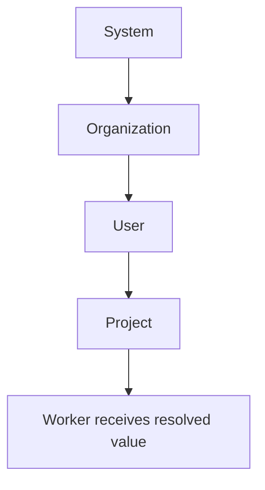

# Secrets & Auth

Eve provides multi-scope secret management and flexible authentication for users, agents, and services. Secrets are encrypted at rest and never returned in plaintext by the API.

## Secret scopes

Secrets cascade through four levels. When the same key exists at multiple scopes, the most specific scope wins:



**Resolution order** (highest priority first): **project > user > org > system**.

API scope resolution takes precedence. Local files are a fallback for convenience in local development.

For example, if `GITHUB_TOKEN` is set at both the org and project level, the project value is used. System secrets provide a baseline for all orgs and projects.

## Setting secrets

### Individual secrets

```bash
# Set a project-level secret
eve secrets set API_KEY "your-api-key" --project proj_xxx

# Set an org-level secret (shared across projects)
eve secrets set GITHUB_TOKEN "ghp_xxx" --scope org --org org_xxx

# List keys (values are never shown)
eve secrets list --project proj_xxx

# Show a masked value (first/last characters only)
eve secrets show API_KEY --project proj_xxx

# Delete a secret
eve secrets delete API_KEY --project proj_xxx
```

### Importing from a file

Batch-import secrets from an env-style file (`KEY=VALUE` per line):

```bash
# Import into an org
eve secrets import --org org_xxx --file ./secrets.env

# Import into a project
eve secrets import --project proj_xxx --file .env
```

Lines starting with `#` are ignored. Values are read verbatim after the `=` sign — quotes are not stripped. Imports upsert each key.

Supported scope flags: `--project`, `--org`, `--user`, `--system` (admin only).

## Manifest secret interpolation

Reference secrets in `.eve/manifest.yaml` using `${secret.KEY}` syntax. At deploy time, Eve resolves each reference against the secret scope chain and injects the values:

```yaml
services:
  api:
    environment:
      DATABASE_URL: postgres://app:${secret.DB_PASSWORD}@db:5432/mydb
      API_KEY: ${secret.EXTERNAL_API_KEY}
  db:
    environment:
      POSTGRES_PASSWORD: ${secret.DB_PASSWORD}
```

Other interpolation variables are also available in manifests:

| Variable | Replaced with | Example |
|----------|---------------|---------|
| `${ENV_NAME}` | Environment name | `test`, `staging`, `production` |
| `${PROJECT_ID}` | Project ID | `proj_01kfew...` |
| `${ORG_ID}` | Organization ID | `org_Example...` |
| `${ORG_SLUG}` | Organization slug | `acme` |
| `${COMPONENT_NAME}` | Current service name | `api`, `web` |
| `${secret.KEY}` | Secret value | `${secret.DB_PASSWORD}` |
| `${managed.<svc>.<field>}` | Managed DB value | `${managed.db.url}` |

## Local dev secrets

For local development, create `.eve/dev-secrets.yaml` in your project root (gitignored):

```yaml
# .eve/dev-secrets.yaml
secrets:
  # Default secrets (fallback for any environment)
  default:
    DB_PASSWORD: dev_password
    API_KEY: local-dev-key

  # Environment-specific overrides
  test:
    DB_PASSWORD: test_password
  staging:
    DB_PASSWORD: staging_password
  production:
    DB_PASSWORD: ${REQUIRE_REAL_SECRET}  # Placeholder — set via API
```

For local work, `.env` and `system-secrets.env.local` are available in addition to `.eve/dev-secrets.yaml`:

- `.env` for process-level values used by local tooling and docker-compose services
- `system-secrets.env.local` for host-level system secret defaults (local stacks)
- `.eve/dev-secrets.yaml` for manifest interpolation overrides

`.eve/dev-secrets.yaml` is usually sufficient for most local interpolation cases. The local files are read for local/runtime convenience and do not replace platform-managed resolution order.

:::note
For k8s deployments, `.eve/dev-secrets.yaml` only works when the project uses a `file://` repo URL and the worker has filesystem access to that path. For production k8s deployments, set secrets via the API instead.
:::

## Harness credentials

Agent runtimes require provider secrets from this same project/org scope:

| Harness | Required secret |
|---------|-----------------|
| `mclaude`, `claude`, `zai` | `ANTHROPIC_API_KEY` |
| `code`, `coder` | `OPENAI_API_KEY` + `CODEX_AUTH_JSON_B64` |
| `gemini` | `GEMINI_API_KEY` or `GOOGLE_API_KEY` |
| `zai` | `Z_AI_API_KEY` |

These keys are expected by the platform bridges when those models are selected for jobs.

## Secret validation

Manifests can declare required secrets via `x-eve.requires.secrets`. Validate that all required secrets are present before deploying:

```bash
# Validate secret references
eve secrets validate --project proj_xxx

# Validate during project sync
eve project sync --validate-secrets

# Strict mode — fail on any missing secret
eve project sync --strict
```

Validation reports missing secrets with scope-aware remediation hints, such as `eve secrets set KEY value --scope project --project proj_xxx`.

## Safe secrets (ensure and export)

Certain secrets can be auto-generated and exported for configuring external systems. Currently allowlisted: `GITHUB_WEBHOOK_SECRET`.

```bash
# Generate if missing
eve secrets ensure --project proj_xxx --keys GITHUB_WEBHOOK_SECRET

# Export plaintext value (for webhook setup)
eve secrets export --project proj_xxx --keys GITHUB_WEBHOOK_SECRET
```

:::caution
`eve secrets export` returns the plaintext value. Treat it as sensitive.
:::

## Authentication overview

Eve uses **RS256 JWT tokens** for authentication. When Supabase Auth is enabled, Eve also accepts Supabase-issued HS256 access tokens for browser login.

| Token source | Algorithm | Use case |
|--------------|-----------|----------|
| Eve internal | RS256 | CLI login, job tokens, service accounts |
| Supabase Auth | HS256 | Browser login, SSO-based sessions |

Eve supports pluggable identity providers. The auth guard implements a two-stage chain: Bearer JWT first, then provider-specific request auth.

| Provider | Auth method | Use case |
|----------|------------|----------|
| `github_ssh` | SSH challenge-response | Default CLI login |
| `nostr` | Schnorr challenge-response + NIP-98 request auth | Nostr-native users |

## CLI login

The CLI handles the SSH challenge-response flow automatically:

```bash
eve auth login --email user@example.com
```

Under the hood, the CLI:

1. Requests a challenge from the server.
2. Signs the nonce with your SSH key (`~/.ssh/id_ed25519` by default).
3. Submits the signature for verification.
4. Stores the access token in `~/.eve/credentials.json` (scoped by API URL).

### Options

```bash
eve auth login --email user@example.com --ssh-key ~/.ssh/id_rsa --ttl 7
```

| Flag | Default | Description |
|------|---------|-------------|
| `--email` | Profile default | Your registered email |
| `--ssh-key` | `~/.ssh/id_ed25519` | Path to SSH private key |
| `--ttl` | Server-configured (1 day) | Token TTL in days (1-90) |

### Profile defaults

Set defaults to simplify repeated commands:

```bash
eve config set --default-email user@example.com
eve config set --default-ssh-key ~/.ssh/id_ed25519

# With defaults set, login becomes:
eve auth login
```

### GitHub key auto-discovery

When login fails because no SSH key is registered, the CLI offers to fetch your keys from GitHub:

```
$ eve auth login --email user@example.com
Error: No SSH key registered for this email

Would you like to fetch your SSH keys from GitHub? [y/N]: y
GitHub username: myuser

Found 2 SSH keys for myuser:
  1. ssh-ed25519 AAAA... (added 2024-01-15)
  2. ssh-rsa AAAA...     (added 2023-06-20)

Select a key to register [1]: 1
Key registered successfully. Retrying login...
```

## Bootstrap flow

The first admin user is created via the bootstrap endpoint. Eve supports three security modes:

| Mode | Trigger | Token required | Use case |
|------|---------|----------------|----------|
| **auto-open** | Fresh deploy, no users exist | No | Initial setup (10-minute window) |
| **recovery** | Trigger file on host | No | Lost admin access |
| **secure** | `EVE_BOOTSTRAP_TOKEN` set | Yes | Production lockdown |

### Auto-open mode (default)

On a fresh deployment with no users, the bootstrap endpoint is open for 10 minutes:

```bash
# Check bootstrap status
eve auth bootstrap --status

# Bootstrap with your real email
eve auth bootstrap --email your-email@example.com
```

:::warning
Use your actual email address during bootstrap. The bootstrap email becomes the admin account you'll log in with. Using a placeholder like `admin@example.com` will lock you out since you won't have the matching SSH key.
:::

The window closes after 10 minutes elapse or the first admin is successfully created.

### Recovery mode

If you lose admin access, create a trigger file on the host to re-open the window:

```bash
# On the server or pod
touch /tmp/eve-bootstrap-enable

# Then from your machine (within 10 minutes)
eve auth bootstrap --email admin@example.com
```

The trigger file is automatically deleted after successful bootstrap.

### Secure mode (recommended for production)

Set `EVE_BOOTSTRAP_TOKEN` to require a token for all bootstrap attempts:

```bash
# Server environment
EVE_BOOTSTRAP_TOKEN=your-secure-random-token

# Bootstrap requires the token
eve auth bootstrap --email admin@example.com --token your-secure-random-token
```

When `NODE_ENV=production`, bootstrap requires the token. If it is not set, the bootstrap window is closed entirely.

## Inviting users

Admins can invite new users with automatic SSH key discovery from GitHub:

```bash
# Invite with GitHub key auto-fetch
eve admin invite --email newuser@example.com --github newuser

# Invite with a specific role
eve admin invite --email newuser@example.com --github newuser --role admin

# Send a Supabase web-auth invite email
eve admin invite --email newuser@example.com --web
eve admin invite --email newuser@example.com --web --redirect-to https://app.example.com
```

### Identity-targeted invites

For Nostr users or other identity providers, create invites targeting a specific identity:

```bash
curl -X POST "$EVE_API_URL/auth/invites" \
  -H "Authorization: Bearer $TOKEN" \
  -H "Content-Type: application/json" \
  -d '{
    "org_id": "org_xxx",
    "role": "member",
    "provider_hint": "nostr",
    "identity_hint": "<pubkey>"
  }'
```

When an unregistered pubkey authenticates and matches an invite's `identity_hint`, Eve auto-provisions a user account and org membership.

## Access requests

Users without an invite can submit self-service access requests:

```bash
eve auth request-access --org "My Company" --email you@example.com
eve auth request-access --org "My Company" --ssh-key ~/.ssh/id_ed25519.pub
eve auth request-access --org "My Company" --nostr-pubkey <hex>

# Poll request status
eve auth request-access --status <request_id>
```

Admins review, approve, or reject requests:

```bash
eve admin access-requests list
eve admin access-requests approve <request_id>
eve admin access-requests reject <request_id> --reason "..."
```

Approval is atomic (single DB transaction). Failed attempts do not leave partial org or user state. Re-approving a completed request is idempotent and returns the existing record.

## Syncing OAuth tokens

Sync local OAuth tokens (Claude, Codex) into Eve secrets:

```bash
eve auth sync                       # Sync to user-level
eve auth sync --org org_xxx         # Sync to org-level
eve auth sync --project proj_xxx    # Sync to project-level
eve auth sync --dry-run             # Preview without syncing
```

Check local credential availability:

```bash
eve auth creds              # Show Claude + Codex credential status
eve auth creds --claude     # Only Claude
eve auth creds --codex      # Only Codex
```

## RBAC

Eve uses role-based access control at the organization level.

### Org roles

| Role | Capabilities |
|------|-------------|
| `owner` | Full control, can delete org |
| `admin` | Manage members, projects, settings |
| `member` | Access projects, create jobs |

### Managing membership

```bash
# List org members
eve org members --org org_xxx

# Add a member
eve org members add user@example.com --role admin --org org_xxx

# Remove a member
eve org members remove user_abc --org org_xxx
```

Project-level membership follows the same pattern:

```bash
eve project members --project proj_xxx
eve project members add user@example.com --role admin --project proj_xxx
eve project members remove user_abc --project proj_xxx
```

### Minting tokens for service accounts

Mint tokens for bot or service users that don't have SSH keys:

```bash
# Mint a token (creates user + membership if needed)
eve auth mint --email app-bot@example.com --org org_xxx

# With custom TTL and role
eve auth mint --email app-bot@example.com --project proj_xxx --role admin --ttl 90
```

### Checking permissions

```bash
# View the permission catalog
eve auth permissions

# View your effective permissions
eve auth whoami
```

## Worker secret injection

At job execution time, resolved secrets are injected as **environment variables** into the worker container. The allowlisted set of secrets is available to the agent process.

For Git authentication:

- **HTTPS clone**: `github_token` secrets are injected into the clone URL for private repo access.
- **SSH clone**: `ssh_key` secrets are written to a temp key and wired via `GIT_SSH_COMMAND`.

Missing auth surfaces explicit errors with remediation hints.

## Key rotation

When you need to rotate the JWT signing key:

```bash
# 1. Generate new key pair
openssl genrsa -out eve-auth-new.key 2048
openssl rsa -in eve-auth-new.key -pubout -out eve-auth-new.pub

# 2. Configure grace period (old key still verifies, new key signs)
export EVE_AUTH_PRIVATE_KEY="$(cat eve-auth-new.key)"
export EVE_AUTH_PUBLIC_KEY="$(cat eve-auth-new.pub)"
export EVE_AUTH_PUBLIC_KEY_OLD="$(cat eve-auth-old.pub)"
export EVE_AUTH_KEY_ID="key-2"
export EVE_AUTH_KEY_ID_OLD="key-1"

# 3. Restart API servers

# 4. Wait for old tokens to expire (default: 24 hours)

# 5. Remove old key configuration
```

During the grace period, new tokens are signed with the new key while old tokens still verify against `EVE_AUTH_PUBLIC_KEY_OLD`. After the grace period, remove the old key variables.

For **emergency rotation** (compromised key), deploy the new key without a grace period and unset `EVE_AUTH_PUBLIC_KEY_OLD`. All existing tokens are immediately invalidated and users must re-authenticate.

## Troubleshooting

| Problem | Fix |
|---------|-----|
| Not authenticated | `eve auth login` |
| Token expired | Re-run `eve auth login` |
| Bootstrap already completed | Use `eve auth login` (existing user) or `eve admin invite` (new users) |
| Secret missing at deploy | Confirm with `eve secrets list` and set the key |
| Interpolation error | Verify `${secret.KEY}` spelling; run `eve secrets validate` |
| Git clone failed | Check that `github_token` or `ssh_key` is set |
| No matching key for token | Token was signed with a rotated key. Re-authenticate. |
| Challenge expired | Challenges are valid for 5 minutes. Request a new one. |

### Incident response (secret leak)

If a secret may be compromised:

1. **Contain** — rotate the affected secret at the source (GitHub, cloud provider, etc.) and update via `eve secrets set`.
2. **Invalidate** — restart affected services to flush cached credentials.
3. **Audit** — review recent job logs for leakage patterns.
4. **Recover** — re-run failed jobs or deployments after rotation.
5. **Document** — record what leaked, where it appeared, and why.
