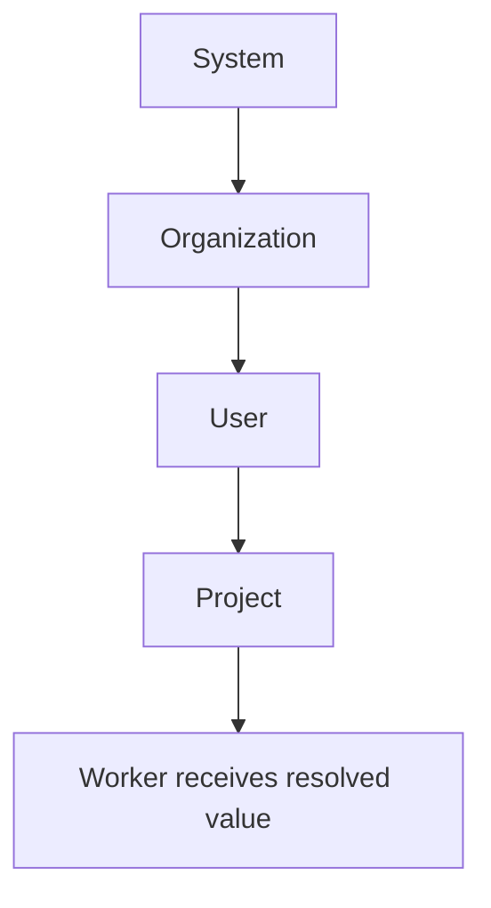

# Secrets & Credentials

Eve provides multi-scope secret management for deployments, agent harnesses, and local development. Secrets are encrypted at rest and never returned in plaintext by the API.

## Secret scopes

Secrets cascade through four levels. When the same key exists at multiple scopes, the most specific scope wins:



**Resolution order** (highest priority first): **project > user > org > system**.

API scope resolution takes precedence. Local files are a fallback for convenience in local development.

For example, if `GITHUB_TOKEN` is set at both the org and project level, the project value is used. System secrets provide a baseline for all orgs and projects.

## Setting secrets

### Individual secrets

```bash
# Set a project-level secret
eve secrets set API_KEY "your-api-key" --project proj_xxx

# Set an org-level secret (shared across projects)
eve secrets set GITHUB_TOKEN "ghp_xxx" --scope org --org org_xxx

# List keys (values are never shown)
eve secrets list --project proj_xxx

# Show a masked value (first/last characters only)
eve secrets show API_KEY --project proj_xxx

# Delete a secret
eve secrets delete API_KEY --project proj_xxx
```

### Importing from a file

Batch-import secrets from an env-style file (`KEY=VALUE` per line):

```bash
# Import into an org
eve secrets import --org org_xxx --file ./secrets.env

# Import into a project
eve secrets import --project proj_xxx --file .env
```

Lines starting with `#` are ignored. Values are read verbatim after the `=` sign — quotes are not stripped. Imports upsert each key.

Supported scope flags: `--project`, `--org`, `--user`, `--system` (admin only).

## Manifest secret interpolation

Reference secrets in `.eve/manifest.yaml` using `${secret.KEY}` syntax. At deploy time, Eve resolves each reference against the secret scope chain and injects the values:

```yaml
services:
  api:
    environment:
      DATABASE_URL: postgres://app:${secret.DB_PASSWORD}@db:5432/mydb
      API_KEY: ${secret.EXTERNAL_API_KEY}
  db:
    environment:
      POSTGRES_PASSWORD: ${secret.DB_PASSWORD}
```

Other interpolation variables are also available in manifests:

| Variable | Replaced with | Example |
|----------|---------------|---------|
| `${ENV_NAME}` | Environment name | `test`, `staging`, `production` |
| `${PROJECT_ID}` | Project ID | `proj_01kfew...` |
| `${ORG_ID}` | Organization ID | `org_Example...` |
| `${ORG_SLUG}` | Organization slug | `acme` |
| `${COMPONENT_NAME}` | Current service name | `api`, `web` |
| `${secret.KEY}` | Secret value | `${secret.DB_PASSWORD}` |
| `${managed.<svc>.<field>}` | Managed DB value | `${managed.db.url}` |

## Local dev secrets

For local development, create `.eve/dev-secrets.yaml` in your project root (gitignored):

```yaml
# .eve/dev-secrets.yaml
secrets:
  # Default secrets (fallback for any environment)
  default:
    DB_PASSWORD: dev_password
    API_KEY: local-dev-key

  # Environment-specific overrides
  test:
    DB_PASSWORD: test_password
  staging:
    DB_PASSWORD: staging_password
  production:
    DB_PASSWORD: ${REQUIRE_REAL_SECRET}  # Placeholder — set via API
```

For local work, `.env` and `system-secrets.env.local` are available in addition to `.eve/dev-secrets.yaml`:

- `.env` for process-level values used by local tooling and docker-compose services
- `system-secrets.env.local` for host-level system secret defaults (local stacks)
- `.eve/dev-secrets.yaml` for manifest interpolation overrides

`.eve/dev-secrets.yaml` is usually sufficient for most local interpolation cases. The local files are read for local/runtime convenience and do not replace platform-managed resolution order.

:::note
For k8s deployments, `.eve/dev-secrets.yaml` only works when the project uses a `file://` repo URL and the worker has filesystem access to that path. For production k8s deployments, set secrets via the API instead.
:::

## Harness credentials

Agent runtimes require provider secrets from this same project/org scope:

| Harness | Required secret |
|---------|-----------------|
| `mclaude`, `claude`, `zai` | `ANTHROPIC_API_KEY` |
| `code`, `coder` | `OPENAI_API_KEY` + `CODEX_AUTH_JSON_B64` |
| `gemini` | `GEMINI_API_KEY` or `GOOGLE_API_KEY` |
| `zai` | `Z_AI_API_KEY` |

These keys are expected by the platform bridges when those models are selected for jobs.

## Secret validation

Manifests can declare required secrets via `x-eve.requires.secrets`. Validate that all required secrets are present before deploying:

```bash
# Validate secret references
eve secrets validate --project proj_xxx

# Validate during project sync
eve project sync --validate-secrets

# Strict mode — fail on any missing secret
eve project sync --strict
```

Validation reports missing secrets with scope-aware remediation hints, such as `eve secrets set KEY value --scope project --project proj_xxx`.

## Safe secrets (ensure and export)

Certain secrets can be auto-generated and exported for configuring external systems. Currently allowlisted: `GITHUB_WEBHOOK_SECRET`.

```bash
# Generate if missing
eve secrets ensure --project proj_xxx --keys GITHUB_WEBHOOK_SECRET

# Export plaintext value (for webhook setup)
eve secrets export --project proj_xxx --keys GITHUB_WEBHOOK_SECRET
```

:::caution
`eve secrets export` returns the plaintext value. Treat it as sensitive.
:::

## Worker secret injection

At job execution time, resolved secrets are injected as **environment variables** into the worker container. The allowlisted set of secrets is available to the agent process.

For Git authentication:

- **HTTPS clone**: `github_token` secrets are injected into the clone URL for private repo access.
- **SSH clone**: `ssh_key` secrets are written to a temp key and wired via `GIT_SSH_COMMAND`.

Missing auth surfaces explicit errors with remediation hints.

## Troubleshooting

| Problem | Fix |
|---------|-----|
| Secret missing at deploy | Confirm with `eve secrets list` and set the key |
| Interpolation error | Verify `${secret.KEY}` spelling; run `eve secrets validate` |
| Git clone failed | Check that `github_token` or `ssh_key` is set |

## What's next?

- **[Authentication & Identity](./authentication.md)** — login methods, organizations, roles, and user management.
- **[Security & Key Rotation](/docs/operations/security)** — JWT key rotation, incident response, and production hardening.
