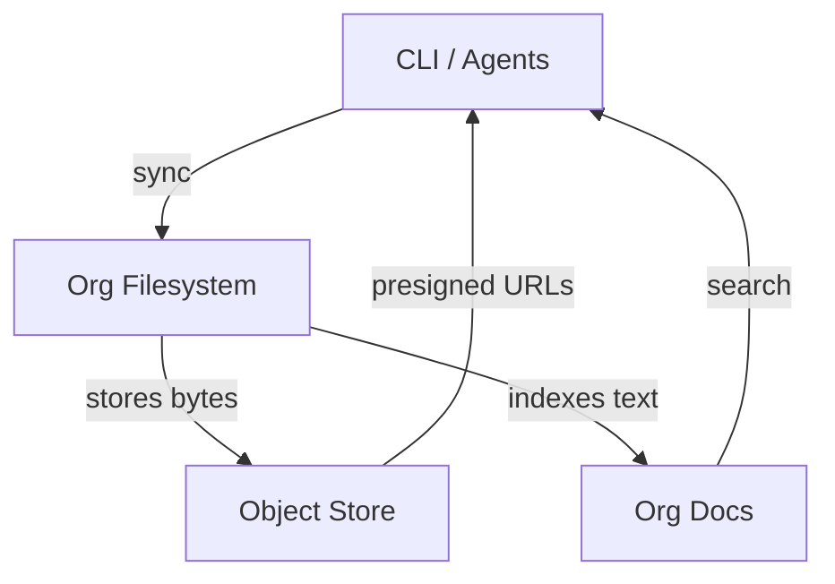

# Storage & Filesystem

Eve provides three storage primitives that work together to give your org durable file storage, real-time sync, and searchable knowledge — without managing infrastructure.

| Primitive | What it does | Best for |
|-----------|-------------|----------|
| **Object Store** | S3-compatible binary storage | App uploads, build artifacts, large files |
| **Org Filesystem** | Synced file namespace across devices and agents | Shared workspace, multi-device collaboration |
| **Org Docs** | Versioned document store with full-text search | Knowledge base, specs, structured content |

The object store is the storage engine. The org filesystem is a sync protocol built on top of it. Org docs is a Postgres-native document store that automatically indexes text files from the org filesystem.

The following diagram shows how the three primitives relate:



## Object store

Every Eve org gets S3-compatible object storage backed by the platform's storage layer. Files transfer directly between your client and the store using presigned URLs — no file content flows through the Eve API, so uploads and downloads are fast regardless of file size.

### Supported backends

The platform supports multiple storage backends behind a unified `ObjectStorageClient` interface. Your org administrator selects the backend; your code interacts with the same API regardless of which one is active.

| Backend | Auth | Notes |
|---------|------|-------|
| MinIO | Access key / secret | Default for local development |
| AWS S3 | IAM / access key | Cloud-native deployments |
| Google Cloud Storage (native) | Workload Identity / ADC | No static keys needed on GKE |
| Google Cloud Storage (HMAC) | HMAC access key / secret | S3-compatible XML API path |
| Cloudflare R2 | Access key / secret | Zero egress fees |
| Tigris | Access key / secret | S3-compatible |

#### Native GCS via Workload Identity

When running on GKE, Eve can authenticate to Google Cloud Storage using Workload Identity instead of static HMAC keys. Set `EVE_STORAGE_BACKEND=gcs` and omit the HMAC credentials -- the platform automatically uses Application Default Credentials (ADC) to authenticate.

This means no service account keys are stored as secrets and no key rotation is required. The GCS client module is only loaded at runtime when this path is active, so AWS deployments are completely unaffected.

| Configuration | Behavior |
|---------------|----------|
| `EVE_STORAGE_BACKEND=gcs` + no HMAC keys | Native GCS client with Workload Identity |
| `EVE_STORAGE_BACKEND=gcs` + HMAC keys set | S3-compatible client via HMAC (existing behavior) |
| `EVE_STORAGE_BACKEND=s3` | AWS S3 client (unchanged) |
| `EVE_STORAGE_BACKEND=minio` | MinIO client (unchanged) |

### How transfers work

When you upload or download a file, the Eve API generates a short-lived presigned URL (5-minute TTL, up to 500 MB) and your client transfers bytes directly to the storage backend. This keeps the API lightweight and means large file transfers don't bottleneck on a single server.

```bash
# Upload a file to the org filesystem
eve fs sync init --org acme --local ./reports --remote-path /reports

# The CLI handles presigned URL negotiation automatically:
# 1. Computes SHA-256 hash of the file
# 2. Requests a presigned upload URL from the API
# 3. PUTs the file directly to the storage backend
# 4. Confirms the upload with the API
```

### App object buckets

For application-level storage, declare named buckets in your manifest. Each bucket is provisioned per environment with credentials injected automatically.

```yaml
services:
  api:
    build:
      context: ./apps/api
    x-eve:
      object_store:
        buckets:
          - name: uploads
            visibility: private
          - name: avatars
            visibility: public
            cors:
              allowed_origins: ["*"]
```

| Field | Description |
|-------|-------------|
| `name` | Logical bucket name (e.g., `uploads`, `avatars`) |
| `visibility` | `private` (default) or `public` for anonymous reads |
| `cors` | CORS configuration for browser-based uploads |

The platform provisions the physical bucket and injects connection details as environment variables when you deploy. Your service code uses standard S3 SDKs to interact with the bucket.

```bash
# List buckets for a project environment
eve store buckets --project my-app --env staging

# List objects in a bucket
eve store ls --project my-app --env staging --bucket uploads

# Upload a file
eve store put --project my-app --env staging --bucket uploads --file ./report.pdf

# Get a presigned download URL
eve store url --project my-app --env staging --bucket uploads --key report.pdf
```

## Org filesystem

The org filesystem provides a shared, synced file namespace scoped to your organization. Every device you enroll, every agent warm pod, and the Eve API itself share the same file tree. Changes propagate in real time via server-sent events.

### Setting up sync

To start syncing a local directory with your org filesystem, initialize a sync link:

```bash
eve fs sync init --org acme --local ./workspace \
  --mode two-way \
  --remote-path /team \
  --include "**/*.md" \
  --exclude "**/.git/**"
```

| Flag | Description |
|------|-------------|
| `--local` | Local directory to sync |
| `--mode` | `two-way`, `push-only`, or `pull-only` |
| `--remote-path` | Root path in the org filesystem (default: `/`) |
| `--include` | Glob patterns to include |
| `--exclude` | Glob patterns to exclude |

This enrolls your machine as a device and creates a sync link binding your local path to the org filesystem path. The CLI watches for file changes and syncs them automatically.

### Sync modes

| Mode | Local changes | Remote changes |
|------|--------------|----------------|
| `two-way` | Pushed to remote | Pulled to local |
| `push-only` | Pushed to remote | Ignored |
| `pull-only` | Ignored | Pulled to local |

You can change the mode of an existing link at any time:

```bash
eve fs sync mode --org acme --set push-only
```

### Monitoring sync status

```bash
# Overview of all sync links and gateway health
eve fs sync status --org acme

# Tail the event log
eve fs sync logs --org acme --follow

# Run diagnostics if something looks wrong
eve fs sync doctor --org acme
```

### Managing sync links

Pause, resume, or disconnect sync links without losing data:

```bash
# Pause syncing (keeps the link, stops transfers)
eve fs sync pause --org acme

# Resume a paused link
eve fs sync resume --org acme

# Permanently disconnect (revokes the link)
eve fs sync disconnect --org acme
```

### Conflict resolution

When both the local and remote sides modify the same file before syncing, Eve detects a conflict and pauses that file until you resolve it.

```bash
# List open conflicts
eve fs sync conflicts --org acme --open-only

# Resolve by keeping the remote version
eve fs sync resolve --org acme --conflict fscf_abc123 --strategy pick-remote

# Resolve by keeping the local version
eve fs sync resolve --org acme --conflict fscf_abc123 --strategy pick-local

# Resolve with manually merged content
eve fs sync resolve --org acme --conflict fscf_abc123 \
  --strategy manual --merged-content "$(cat merged-file.md)"
```

:::tip
In most workflows, `pick-remote` is the safest default — it preserves whatever was committed to the shared namespace. Use `pick-local` when you're certain your local copy is the authoritative version.
:::

### Agent access

Agent runtime warm pods mount the org filesystem as a persistent volume at `/org`. Agents can read and write files directly at that path without making API calls. Changes are synced to the object store and indexed automatically.

```bash
# Inside an agent workspace, the org filesystem is at /org
ls /org/docs/
cat /org/specs/feature-design.md
```

This means agents and human developers share the same file namespace. An agent can write a report to `/org/reports/analysis.md` and a developer syncing that path will see it appear locally.

## Org docs

Org docs is a versioned document store built on top of the org filesystem. When text files (Markdown, YAML, JSON, plain text under 512 KB) land in the org filesystem, they are automatically indexed into org docs for full-text search, versioning, and lifecycle management.

### Writing and reading documents

```bash
# Write a document
eve docs write --org acme --path /specs/auth-redesign.md --file auth-redesign.md

# Write with lifecycle settings
eve docs write --org acme --path /specs/auth-redesign.md --file auth-redesign.md \
  --metadata '{"owner":"alice","status":"draft"}' \
  --review-in 30d \
  --expires-in 90d

# Read a document
eve docs read --org acme --path /specs/auth-redesign.md

# Read a specific version
eve docs read --org acme --path /specs/auth-redesign.md --version 3
```

Every update creates an immutable version entry. You can retrieve any historical version by number.

### Searching

Org docs supports full-text search with relevance ranking and context snippets:

```bash
# Search across all org docs
eve docs search --org acme --query "authentication flow"

# Search within a path prefix
eve docs search --org acme --query "rate limiting" --prefix /specs/

# Structured metadata query
eve docs query --org acme --where 'metadata.owner eq alice' \
  --path-prefix /specs/ --limit 20
```

:::info
Search weights document paths higher than content, so searching for "auth" will prioritize documents with "auth" in their path over documents that merely mention authentication in their body.
:::

### Lifecycle management

Documents can track review schedules and expiration dates. This is useful for keeping specs and runbooks current.

```bash
# Find documents overdue for review
eve docs stale --org acme --overdue-by 7d

# Find stale docs in a specific area
eve docs stale --org acme --overdue-by 7d --prefix /runbooks/

# Mark a document as reviewed and set the next review date
eve docs review --org acme --path /runbooks/incident-response.md --next-review 30d
```

### Version history

```bash
# List all versions of a document
eve docs versions --org acme --path /specs/auth-redesign.md

# Read a specific version
eve docs read --org acme --path /specs/auth-redesign.md --version 2
```

## File sharing

Eve provides two mechanisms for sharing files outside your org: share tokens for individual files and public paths for entire directory prefixes.

### Share tokens

Share tokens give time-limited, revocable access to a single file. The recipient gets a URL that resolves to a presigned download link.

```bash
# Create a share token (expires in 7 days)
eve fs share /reports/q4-results.pdf --org acme --expires 7d --label "Q4 board deck"

# List active share tokens
eve fs shares --org acme

# Revoke a share token
eve fs revoke share_abc123 --org acme
```

Share tokens are ideal for sending files to external collaborators or embedding download links in emails and chat messages. Revoking a token immediately prevents further access.

### Public paths

Public paths make an entire directory prefix permanently accessible without authentication. Anyone with the URL can download files under that prefix.

```bash
# Publish a path prefix
eve fs publish /public/assets/ --org acme --label "Marketing assets"

# List published paths
eve fs public-paths --org acme

# Unpublish a path prefix
eve fs unpublish fspub_abc123 --org acme
```

:::warning
Public paths expose files without authentication. Only publish paths that contain content you intend to be publicly accessible. Use share tokens with expiration dates for temporary access to sensitive files.
:::

### How access resolution works

When someone accesses a file URL, Eve resolves access in this order:

1. **Share token** — If a valid, unexpired token is provided, grant access
2. **Public path** — If the file falls under a published path prefix, grant access
3. **Deny** — No matching token or public path means no access

In both cases, the client receives a redirect to a presigned download URL. The actual file bytes always come directly from the object store.

## Access control

The org filesystem uses a three-tier permission model:

| Permission | Allows |
|------------|--------|
| `orgfs:read` | List files, download, view sync status and shares |
| `orgfs:write` | Upload files, create sync links, resolve conflicts |
| `orgfs:admin` | Manage share tokens, publish and unpublish paths |

Sync links can be scoped to specific path prefixes, restricting what a particular device or integration can access:

```bash
# Create a link scoped to specific directories
eve fs sync init --org acme --local ./docs \
  --remote-path /docs \
  --include "/docs/**" --include "/assets/**"
```

## CLI reference

### Org filesystem (`eve fs`)

```bash
# Sync management
eve fs sync init       # Initialize a sync link
eve fs sync status     # Show sync status
eve fs sync logs       # View event log
eve fs sync doctor     # Run diagnostics
eve fs sync pause      # Pause syncing
eve fs sync resume     # Resume syncing
eve fs sync disconnect # Revoke a sync link
eve fs sync mode       # Change sync mode
eve fs sync conflicts  # List conflicts
eve fs sync resolve    # Resolve a conflict

# File sharing
eve fs share           # Create a share token
eve fs shares          # List active shares
eve fs revoke          # Revoke a share token
eve fs publish         # Publish a path prefix
eve fs public-paths    # List published paths
```

### Org docs (`eve docs`)

```bash
eve docs write         # Create or update a document
eve docs read          # Read a document (optionally at a version)
eve docs list          # List documents by path prefix
eve docs search        # Full-text search
eve docs query         # Structured metadata query
eve docs stale         # Find documents overdue for review
eve docs review        # Mark reviewed and set next review date
eve docs versions      # List version history
eve docs delete        # Delete a document
```

### App storage (`eve store`)

```bash
eve store buckets      # List buckets for a project environment
eve store ls           # List objects in a bucket
eve store put          # Upload a file to a bucket
eve store get          # Download a file from a bucket
eve store url          # Get a presigned URL for an object
```

## Cloud filesystem mounts

Eve can mount external cloud storage providers (Google Drive, with more coming) into your workspace. Cloud FS mounts give agents and workflows direct access to files in your team's shared drives.

Cloud FS is configured through the [Integrations guide](./integrations.md#google-drive). Key concepts:

- **Mounts** link a cloud provider folder to an Eve project
- **OAuth credentials** are per-org (each org registers their own OAuth app)
- **Token refresh** is automatic — Eve handles access token renewal using the org's OAuth credentials
- **RBAC** controls access: `cloud_fs:read`, `cloud_fs:write`, `cloud_fs:admin`

```bash
eve cloud-fs list --org <org_id>
eve cloud-fs ls <mount_id> --org <org_id>
eve cloud-fs search <mount_id> --query "report" --org <org_id>
```

For setup instructions, see the [Integrations guide](./integrations.md#google-drive).

## What's next?

- Set up agents that use the org filesystem: [Agents & Teams](./agents-and-teams.md)
- Define skills that read and write shared files: [Skills & Skill Packs](./skills.md)
- Connect cloud drives and external services: [Integrations](./integrations.md)
