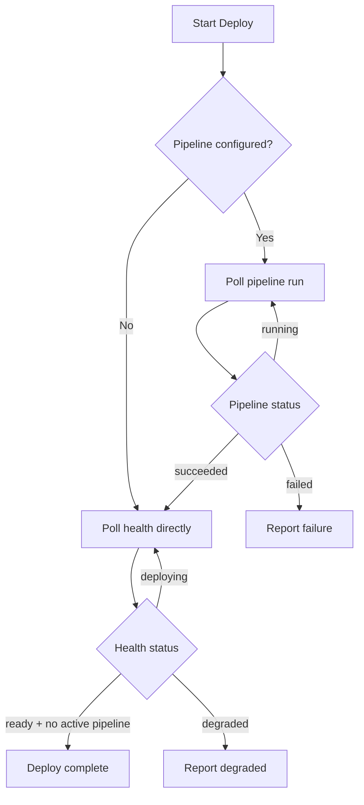

# Deployment Guide

Eve Horizon deploys your services to Kubernetes with automatic ingress, TLS, health checking, and pipeline-driven workflows. This guide covers the deployment architecture, strategies, monitoring, and recovery procedures.

## Deployment overview

Every deployment in Eve follows a consistent flow: resolve the manifest, build container images, create a release, and roll out to the target environment. The platform handles namespace creation, ingress routing, secret injection, and health verification automatically.

The deployment flow from commit to live traffic looks like this:


## Kubernetes architecture

Eve runs three core deployments in the `eve` namespace, plus ephemeral runner pods for job execution:

| Component | Type | Purpose |
|-----------|------|---------|
| **API** | Deployment | REST API, auth, project management |
| **Orchestrator** | Deployment | Job scheduling, claim/dispatch loop |
| **Worker** | Deployment | Runner pod management, build execution |
| **Postgres** | StatefulSet | Platform database with persistent volume |
| **Runner pods** | Ephemeral pods | Isolated per-job execution containers |

The worker is not deployed per-environment. It manages ephemeral runner pods that are spawned for each job attempt and destroyed after completion.

When web auth is enabled, the stack also includes Supabase Auth (GoTrue), an SSO broker, and Mailpit for local email capture.

### Ingress routing

Deployed app services are accessible via Ingress resources with automatic URL generation:

```
URL pattern:   {service}.{orgSlug}-{projectSlug}-{env}.{domain}
Example:       web.acme-myapp-staging.apps.yourdomain.com
Namespace:     eve-{orgSlug}-{projectSlug}-{env}
```

Domain resolution follows a priority order:

1. **Manifest override** -- `x-eve.ingress.domain` on the service (per-app)
2. **Cluster default** -- `EVE_DEFAULT_DOMAIN` environment variable
3. **No ingress** -- if neither is set, no Ingress resource is created

For local development, Eve uses `lvh.me` which resolves to `127.0.0.1` -- no `/etc/hosts` editing required.

### TLS certificates

App ingresses can be issued TLS certificates automatically via cert-manager:

| Variable | Purpose |
|----------|---------|
| `EVE_DEFAULT_TLS_CLUSTER_ISSUER` | Cert-manager issuer (e.g., `letsencrypt-prod`) |
| `EVE_DEFAULT_TLS_SECRET` | Wildcard cert secret name (optional alternative) |
| `EVE_DEFAULT_INGRESS_CLASS` | Ingress controller class (e.g., `traefik`) |

When `EVE_DEFAULT_TLS_CLUSTER_ISSUER` is set, every app ingress includes a `tls` block and cert-manager annotations so certificates are issued per host automatically.

## Deployment strategies

Eve supports two deployment paths: **pipeline deploy** and **direct deploy**. The path is determined by your environment configuration.

### Pipeline deploy (recommended)

When an environment has a `pipeline` configured in the manifest, `eve env deploy` triggers that pipeline. This is the standard path for production workflows:

```yaml
environments:
  staging:
    pipeline: deploy
    pipeline_inputs:
      smoke_test: true

pipelines:
  deploy:
    steps:
      - name: build
        action: { type: build }
      - name: release
        depends_on: [build]
        action: { type: release }
      - name: deploy
        depends_on: [release]
        action: { type: deploy }
```

```bash
eve env deploy staging --ref main --repo-dir .
```

The CLI automatically syncs the manifest when `--repo-dir` points to a repository containing `.eve/manifest.yaml`, eliminating the need for a separate `eve project sync` step.

### Direct deploy

Bypass the pipeline and deploy immediately using the `--direct` flag:

```bash
eve env deploy staging --ref main --repo-dir . --direct
```

Direct deploys skip build and release steps -- useful when you already have a release or need to redeploy an existing image.

### Manifest auto-sync on deploy

When `--repo-dir` is provided and the directory contains `.eve/manifest.yaml`, the CLI:

1. Reads `.eve/manifest.yaml` from the repo directory
2. Posts the manifest YAML with the current git SHA and branch
3. Uses the returned manifest hash for the deploy request

If no manifest exists in the repo directory, the CLI falls back to fetching the latest manifest hash from the server.

## Environment variable interpolation

Manifest environment values support variable interpolation at deploy time:

| Variable | Replaced with | Example value |
|----------|---------------|---------------|
| `${ENV_NAME}` | Environment name | `staging` |
| `${PROJECT_ID}` | Project ID | `proj_01abc...` |
| `${ORG_ID}` | Organization ID | `org_01xyz...` |
| `${ORG_SLUG}` | Organization slug | `acme` |
| `${COMPONENT_NAME}` | Current service name | `api` |
| `${secret.KEY}` | Secret value | `${secret.DB_PASSWORD}` |
| `${managed.<svc>.<field>}` | Managed DB value | `${managed.db.url}` |

### Platform-injected variables

Eve automatically injects these environment variables into every deployed service container:

| Variable | Purpose |
|----------|---------|
| `EVE_API_URL` | Internal cluster URL for server-to-server calls |
| `EVE_PUBLIC_API_URL` | Public ingress URL for browser-facing apps |
| `EVE_PROJECT_ID` | Current project ID |
| `EVE_ORG_ID` | Current organization ID |
| `EVE_ENV_NAME` | Current environment name |

Use `EVE_API_URL` for backend calls from your containers. Use `EVE_PUBLIC_API_URL` for browser or client-side code.

## Zero-downtime deployments

Eve uses Kubernetes rolling updates by default. When a deploy step executes, the worker applies new manifests and Kubernetes rolls out pods progressively -- new pods start before old pods terminate.

The deploy polling flow ensures the CLI waits for full health before declaring success:



### Health check endpoint

The environment health endpoint is pipeline-aware -- it reports `deploying` while a pipeline run is active, preventing false-positive "ready" results from stale pods:

| Status | Meaning |
|--------|---------|
| `ready` | All pods healthy, no in-flight pipeline |
| `deploying` | Pods rolling out or pipeline active |
| `degraded` | Some pods unhealthy |
| `unknown` | Kubernetes unavailable |

A deploy is fully complete when all three conditions hold: `ready === true`, `active_pipeline_run === null`, and `status === "ready"`.

## Container registry

Eve supports three registry modes:

| Mode | Manifest value | Behavior |
|------|---------------|----------|
| **Eve-native** | `registry: "eve"` | Uses internal registry with API-issued JWT -- no external setup needed |
| **External** | `registry: { host: ..., auth: ... }` | Uses external registry with configured credentials |
| **None** | `registry: "none"` | Disables registry handling -- assumes public images |

For external registries, configure auth secrets:

```yaml
registry:
  host: public.ecr.aws/w7c4v0w3
  namespace: eve-horizon
  auth:
    username_secret: REGISTRY_USERNAME
    token_secret: REGISTRY_PASSWORD
```

### Worker image registry

Eve publishes pre-built worker images to public ECR for runner pods:

| Image | Contents |
|-------|----------|
| `worker-base` | Node.js, worker harness, base utilities |
| `worker-python` | Base + Python 3.11, pip, uv |
| `worker-rust` | Base + Rust 1.75, cargo |
| `worker-java` | Base + OpenJDK 21 |
| `worker-kotlin` | Base + Kotlin 2.0, JDK 21 |
| `worker-full` | All toolchains (default) |

Configure the runner image via `EVE_RUNNER_IMAGE` on the worker deployment. Pin to semantic versions in production (e.g., `worker-full:0.1.0`). Use SHA tags or `latest` only in development.

## Rollback procedures

If a deployment introduces issues, you can redeploy a known-good release:

```bash
# List recent releases
eve release list --project proj_xxx

# Deploy a specific release tag
eve env deploy staging --ref <known-good-sha> --direct
```

For pipeline-driven rollbacks, you can promote a previous release:

```bash
# Resolve the release from a previous deploy
eve release resolve v1.1.0

# Deploy that release to the target environment
eve env deploy production --ref <sha> --inputs '{"release_id":"rel_xxx"}'
```

## Deployment monitoring

### Real-time observation

Monitor deployments with a three-terminal approach:

```bash
# Terminal 1: Pipeline/job progress
eve job follow <job-id>

# Terminal 2: Environment health
eve env diagnose <project> <env>

# Terminal 3: System-level logs
eve system logs worker
```

### Environment diagnostics

```bash
# Deep diagnostics including pod state, events, and conditions
eve env diagnose <project> <env>

# Quick health check
eve system health
```

## Debugging failed deploys

When a deployment fails, follow this recovery ladder:

### 1. Check the pipeline run

```bash
eve job list --phase active
eve job diagnose <job-id>
```

The `diagnose` command shows the job timeline, attempt history, error messages, and diagnostic recommendations.

### 2. Check build logs

If the failure is in the build step:

```bash
eve build list --project <project_id>
eve build diagnose <build_id>
eve build logs <build_id>
```

Common build failures include registry auth issues (verify `REGISTRY_USERNAME` and `REGISTRY_PASSWORD` secrets for custom registries), missing Dockerfiles (check `build.context` path in manifest), and workspace errors.

### 3. Check environment health

```bash
# Health endpoint with pod readiness details
eve env diagnose <project> <env>
```

### 4. Check system logs

```bash
eve system logs api
eve system logs orchestrator
eve system logs worker
```

### Common deploy errors

| Error | Cause | Fix |
|-------|-------|-----|
| `401 Unauthorized` | Token expired | `eve auth login` |
| `git clone failed` | Missing credentials | Set `github_token` or `ssh_key` secret |
| `service not provisioned` | Environment not created | `eve env create <env>` |
| `image pull backoff` | Registry auth failed | Verify registry credentials; use `registry: "eve"` for managed apps |
| `healthcheck timeout` | App not starting | Check app logs, verify ports in manifest |

## Workspace janitor

Production deployments require active disk management for agent workspaces. The worker runs a janitor that enforces budgets and TTLs:

| Variable | Purpose |
|----------|---------|
| `EVE_WORKSPACE_MAX_GB` | Total workspace budget per instance |
| `EVE_WORKSPACE_MIN_FREE_GB` | Hard floor -- refuse new claims below this |
| `EVE_WORKSPACE_TTL_HOURS` | Idle TTL for job worktrees |
| `EVE_SESSION_TTL_HOURS` | Idle TTL for session workspaces |
| `EVE_MIRROR_MAX_GB` | Cap for bare git mirrors |

The janitor uses LRU eviction when over budget and TTL cleanup for idle worktrees. In Kubernetes, per-attempt PVCs are deleted after completion.

### Runner pod reaper

The worker runs a periodic reaper that cleans up orphaned runner pods and PVCs after job completion, preventing resource leaks if the worker restarts mid-poll:

| Variable | Purpose |
|----------|---------|
| `EVE_RUNNER_REAPER_ENABLED` | Enable the pod reaper |
| `EVE_RUNNER_REAPER_INTERVAL_MS` | Sweep interval |
| `EVE_RUNNER_REAPER_GRACE_SECONDS` | Grace period before cleanup |

## Runtime modes

Eve supports two runtime modes for different stages of development:

| Aspect | Docker Compose | Kubernetes (k3d) |
|--------|----------------|-------------------|
| Startup time | ~10 seconds | ~60 seconds |
| Resource usage | Lower | Higher |
| Production parity | Moderate | High |
| Runner pods | No (local process) | Yes (ephemeral pods) |
| Primary use | Daily dev, quick iteration | Integration testing, staging, production |

For local Kubernetes development:

```bash
# Start the local k3d cluster
eve local up

# Check health
eve local health

# Stop when done
eve local down
```

:::info
Docker Compose mode is for development only. It exposes services on localhost with simple defaults and should never run in shared or internet-exposed environments.
:::

## CLI reference

| Command | Purpose |
|---------|---------|
| `eve env deploy <env> --ref <sha>` | Deploy to an environment |
| `eve env deploy <env> --ref <sha> --direct` | Bypass pipeline, deploy directly |
| `eve env diagnose <project> <env>` | Deep environment diagnostics |
| `eve job follow <job-id>` | Stream deployment job logs |
| `eve job diagnose <job-id>` | Full job diagnostic |
| `eve build diagnose <build-id>` | Build failure diagnostic |
| `eve system health` | Quick platform health check |
| `eve system logs <service>` | View platform service logs |
| `eve release list --project <id>` | List releases for rollback |
| `eve local up` | Start local k3d cluster |
| `eve local health` | Check local cluster health |

See [CLI Commands](/docs/reference/cli-commands) for the full command reference.
