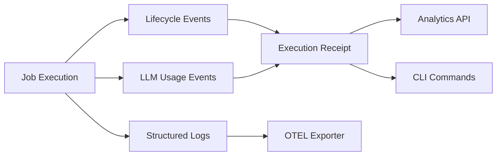

# Observability & Receipts

Eve Horizon provides built-in observability through structured logging, correlation IDs, execution receipts, org-level analytics, and OpenTelemetry integration. Every job produces a receipt with timing, token usage, and cost data -- giving you full visibility into what ran, how long it took, and what it cost.

## Observability overview

The observability stack is designed for CLI-first debugging. Rather than requiring separate dashboards, Eve surfaces the data you need through CLI commands and API endpoints:



## Correlation IDs

Every request that enters the Eve API receives a correlation ID via the `x-eve-correlation-id` header. If the caller provides one, it is preserved; otherwise a UUID is generated and echoed back in the response.

Correlation IDs propagate across the full request chain:

```
API --> Orchestrator --> Worker --> Runner Pod
```

This means you can trace a single job execution from the initial API call through to the harness output using one identifier.

## Structured logging

All Eve services emit JSON logs with a consistent set of standard fields:

| Field | Description |
|-------|-------------|
| `timestamp` | ISO 8601 timestamp |
| `level` | Log level (info, warn, error) |
| `service` | Emitting service (api, orchestrator, worker) |
| `message` | Human-readable log message |
| `correlation_id` | Request correlation ID |
| `trace_id` | OpenTelemetry trace ID (when OTEL is enabled) |
| `job_id` | Associated job ID (when available) |
| `attempt_id` | Associated attempt ID (when available) |

Job execution lifecycle events are also written to `execution_logs` with correlation fields embedded in the lifecycle metadata, allowing you to reconstruct the full timeline of any job attempt.

## Execution receipts

Every completed job attempt produces an **execution receipt** -- an immutable snapshot of what happened during execution. Receipts are the primary tool for understanding job performance and cost.

### What receipts contain

| Section | Data |
|---------|------|
| **Timing** | Billable milliseconds, phase durations |
| **LLM usage** | Total input/output tokens, model breakdown |
| **Base cost** | Cost in USD from rate card pricing |
| **Billed cost** | Cost in org currency (after exchange rates) |
| **Compute** | Resource class usage |

Receipts are assembled from two sources:

1. **Lifecycle events** -- timing and phase transitions recorded by the orchestrator
2. **`llm.call` events** -- usage-only events (no content) emitted by harnesses after each provider call

### Viewing receipts

```bash
# Receipt for the latest attempt on a job
eve job receipt <job-id>

# Receipt for a specific attempt
eve job receipt <job-id> --attempt 2

# Compare two attempts (with receipt data)
eve job compare <job-id> 1 2 --receipt
```

The `eve job follow` command also displays live cost totals as `llm.call` events stream during execution.

### Receipt API endpoints

| Endpoint | Purpose |
|----------|---------|
| `GET /jobs/{job_id}/receipt` | Receipt for latest attempt |
| `GET /jobs/{job_id}/attempts/{attempt_id}/receipt` | Receipt for specific attempt |
| `GET /jobs/{job_id}/compare?a=1&b=2&include_receipt=true` | Compare attempts with receipts |

Receipts are immutable snapshots. Recomputation is only needed for backfills or pricing corrections:

```bash
eve admin receipts recompute --since 7d --project proj_xxx --dry-run
```

## Analytics dashboard

Eve provides org-level analytics for operational reporting across jobs, pipelines, and environments. These are read-only endpoints designed for dashboards and health checks.

### Analytics summary

The summary endpoint gives a high-level view of org activity within a time window:

```bash
eve analytics summary --org org_xxx --window 7d
```

Returns:

```json
{
  "as_of": "2026-02-12T12:00:00Z",
  "window": "7d",
  "projects": 3,
  "jobs": { "created": 12, "completed": 9, "failed": 1, "active": 2 },
  "pipelines": { "runs": 4, "success_rate": 75, "avg_duration_seconds": 420 },
  "environments": { "total": 5, "healthy": 4, "degraded": 1, "unknown": 0 }
}
```

### Job analytics

Drill into job-level metrics across the org:

```bash
eve analytics jobs --org org_xxx --window 7d
```

Returns individual job records with phase, duration, and outcome data. The `window` parameter accepts `1d`, `7d`, `30d`, or `90d`.

### Metric definitions

| Metric | Definition |
|--------|------------|
| `jobs.created` | Jobs created within the time window |
| `jobs.completed` | Jobs that reached the `done` phase |
| `jobs.failed` | Jobs that failed (any attempt) |
| `jobs.active` | Jobs currently in an active phase |
| `pipelines.success_rate` | `succeeded / total` for pipeline runs in the window |
| `pipelines.avg_duration_seconds` | Mean duration from `started_at` to `completed_at` |

## Environment health

Monitor the health of all environments across the org:

```bash
eve analytics env-health --org org_xxx
```

Returns the latest known deploy and health snapshot per environment:

```json
{
  "environments": [
    { "name": "staging", "project_id": "proj_xxx", "status": "healthy" },
    { "name": "production", "project_id": "proj_xxx", "status": "healthy" }
  ]
}
```

Environment status values: `healthy`, `degraded`, or `unknown` (based on the latest health snapshot).

### Pipeline analytics

Track pipeline performance and reliability:

```bash
eve analytics pipelines --org org_xxx --window 30d
```

Returns per-pipeline metrics including run count, success rate, and average duration.

## Cost tracking

Eve tracks costs at two levels: per-job (via receipts) and per-org (via the balance ledger).

### Pricing model

Costs are driven by **rate cards** and **exchange-rate snapshots**:

- Rate cards are immutable versioned documents (name + version + effective date)
- Exchange-rate snapshots are stored for auditable currency conversions
- Pricing is resolved per attempt based on the effective rate card at execution time

### Per-job budgets

Jobs can set per-attempt budgets via scheduling hints in the manifest or at job creation:

```yaml
x-eve:
  defaults:
    hints:
      max_cost:
        currency: usd
        amount: 5
      max_tokens: 200000
      resource_class: job.c1
```

The worker tracks `llm.call` events during execution and terminates attempts with `BUDGET_EXCEEDED` when limits are breached. Budget enforcement is **fail-open** -- if pricing configuration cannot be resolved, the job continues rather than blocking.

### Org balance and usage

Org balances are tracked via an immutable ledger. Non-job resources (services, PVCs, managed databases) are periodically metered into `usage_records` and charged against org balances.

```bash
# View org balance
eve admin balance show <org_id>

# Credit an org
eve admin balance credit <org_id> --amount 100 --currency usd --reason "Monthly allocation"

# View transaction history
eve admin balance transactions <org_id> --since 2026-01-01

# View non-job resource usage
eve admin usage summary --org <org_id>
```

### Environment suspension

When org balances fall below thresholds, the suspension controller can suspend environments. Suspended environments block deploys and job creation until resumed:

```bash
eve env suspend <project> <env> --reason "Balance depleted"
eve env resume <project> <env>
```

## Provider and model discovery

Eve surfaces available LLM providers and models through public endpoints:

```bash
# List providers
eve providers list

# List models from a specific provider
eve providers models <name>

# List all available managed models
eve models list
```

Managed models are used by setting `harness_options.model` to `managed/<name>` in the manifest or job creation.

## OpenTelemetry integration

Eve supports OpenTelemetry (OTEL) for integration with external observability platforms. OTEL uses the OTLP HTTP exporter with automatic Node.js instrumentation.

### Configuration

| Variable | Purpose |
|----------|---------|
| `OTEL_ENABLED` | Enable OTEL (`true` / `false`) |
| `OTEL_DISABLED` | Hard disable OTEL (`true` to override) |
| `OTEL_EXPORTER_OTLP_ENDPOINT` | Collector endpoint (e.g., `http://otel-collector:4318`) |

OTEL is automatically enabled when `OTEL_EXPORTER_OTLP_ENDPOINT` is set. Traces include correlation IDs and job context, allowing you to link Eve operations to your existing observability stack.

## Real-time monitoring

### Job-level monitoring

```bash
# Stream harness logs as they happen (SSE)
eve job follow <job-id>

# Combined status + logs streaming
eve job watch <job-id>

# Stream K8s runner pod logs
eve job runner-logs <job-id>

# Wait with status updates
eve job wait <job-id> --verbose
```

### System-level monitoring

```bash
# Quick health check
eve system health

# Platform service logs
eve system logs api
eve system logs orchestrator
eve system logs worker
eve system logs postgres
```

## CLI reference

| Command | Purpose |
|---------|---------|
| `eve job receipt <job-id>` | View execution receipt |
| `eve job compare <job-id> <a> <b> --receipt` | Compare attempts with receipts |
| `eve job follow <job-id>` | Stream logs with live cost totals |
| `eve analytics summary --org <id>` | Org-wide analytics summary |
| `eve analytics jobs --org <id> --window 7d` | Job analytics for time window |
| `eve analytics pipelines --org <id>` | Pipeline performance metrics |
| `eve analytics env-health --org <id>` | Environment health snapshot |
| `eve system health` | Platform health check |
| `eve system logs <service>` | Platform service logs |
| `eve admin balance show <org_id>` | View org balance |
| `eve admin usage summary --org <org_id>` | View resource usage |
| `eve providers list` | List LLM providers |
| `eve models list` | List available models |

:::note
Analytics endpoints require `orgs:read` permission. Empty orgs return zeroed summaries rather than 404 errors. The `window` parameter accepts `1d`, `7d`, `30d`, or `90d`.
:::

See [CLI Commands](/docs/reference/cli-commands) for the full command reference.
