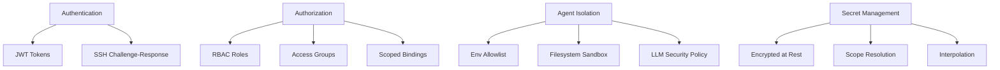

# Security & Key Rotation

Eve Horizon implements defense-in-depth security across authentication, agent isolation, secret management, and access control. This guide covers the security model, operational procedures for key rotation, and the RBAC system for managing access.

## Security model overview

Eve's security architecture operates at multiple layers:



The core principles:

- **RS256 JWT tokens** for all internal authentication -- CLI, job tokens, service accounts
- **SSH challenge-response** for passwordless CLI login
- **Defense-in-depth agent isolation** -- three independent layers that must all be bypassed simultaneously
- **Multi-scope secret management** -- secrets encrypted at rest, never returned in plaintext
- **Policy-as-code access control** -- groups, roles, and scoped bindings defined in `.eve/access.yaml`

## JWT authentication

Eve uses RS256 JWT tokens as the primary authentication mechanism. When Supabase Auth is enabled, Eve also accepts HS256 tokens for web login.

| Token source | Algorithm | Use case |
|--------------|-----------|----------|
| **Eve internal** | RS256 | CLI, job tokens, service accounts, SSH/Nostr identity flows |
| **Supabase Auth** | HS256 | Browser login and SSO-based user sessions |

### Token types

**User tokens** are issued on successful login and used for API access:

```json
{
  "sub": "user_abc123",
  "email": "user@example.com",
  "type": "user",
  "iat": 1706000000,
  "exp": 1706086400
}
```

**Job tokens** are scoped tokens issued to running jobs with limited permissions:

```json
{
  "user_id": "user_abc123",
  "org_id": "org_xyz789",
  "permissions": ["job:read", "job:write"],
  "type": "job"
}
```

**Service-account tokens** are RS256 JWTs with explicit scopes for application backends. They carry no implicit role expansion.

### JWKS endpoint

Public keys are available for external token verification:

```bash
curl "$EVE_API_URL/.well-known/jwks.json"
```

During key rotation, both old and new keys appear in the JWKS response.

## SSH challenge-response

CLI authentication uses SSH challenge-response -- a passwordless flow where the user proves identity by signing a server-issued nonce with their registered SSH key.

```bash
eve auth login --email user@example.com
```

The CLI handles the full flow automatically:

1. Requests a challenge nonce from the server
2. Signs the nonce with your SSH private key (namespace `eve-auth`)
3. Submits the signature for verification
4. Stores the access token in `~/.eve/credentials.json`

Challenges are valid for 5 minutes (configurable via `EVE_AUTH_CHALLENGE_TTL_SECONDS`).

If your SSH key is not registered, the CLI offers to fetch keys from GitHub:

```bash
$ eve auth login --email user@example.com
Error: No SSH key registered for this email

Would you like to fetch your SSH keys from GitHub? [y/N]: y
GitHub username: myuser
Found 2 SSH keys. Select a key to register [1]: 1
Key registered successfully. Retrying login...
```

## Agent sandbox isolation

When agents execute jobs, they run LLM-powered processes that can execute bash commands, read files, and produce output. Eve implements a three-layer defense model to prevent secret leakage and unauthorized access.

### Layer 1: Allowlisted environment

The worker builds a minimal environment from an explicit allowlist. Only essential variables reach the agent process:

| Forwarded (allowlist) | Excluded (everything else) |
|-----------------------|----------------------------|
| `PATH`, `HOME`, `TERM`, `LANG` | `DATABASE_URL` |
| `EVE_JOB_ID`, `EVE_ATTEMPT_ID` | `EVE_SECRETS_MASTER_KEY` |
| `EVE_PROJECT_ID`, `EVE_API_URL` | `EVE_INTERNAL_API_KEY` |
| Adapter-provided env only | `REDIS_URL`, `AWS_SECRET_ACCESS_KEY` |

Harness adapters select which secrets they need from a read-only context and return them in `options.env`. The worker never blindly copies secrets across.

Secrets are not written to the workspace filesystem. File-type secrets (SSH keys) are written outside the repo tree and referenced only by hooks running in the worker context.

### Layer 2: Filesystem sandbox

Each harness CLI restricts the LLM's file tools to the workspace directory:

| Harness | Flag | Effect |
|---------|------|--------|
| claude / mclaude / zai | `--add-dir <workspace>` | Read, Write, Edit, Glob restricted to workspace |
| code / codex | `--sandbox workspace-write -C <workspace>` | All writes restricted to workspace |
| gemini | `--sandbox` | Sandbox mode enabled |

Structured file tools (Read, Write, Edit, Glob, Grep) cannot access paths outside the workspace.

### Layer 3: LLM security policy

A security policy is injected into every agent job through two parallel paths:

**Prompt preamble** (all harnesses) -- an XML `<security-policy>` block prepended to the job prompt:

```xml
<security-policy>
  <workspace>/workspace/my-repo</workspace>
  <rule>You MUST only access files within the workspace</rule>
  <rule>You MUST NOT run env, printenv, set, or echo $VAR</rule>
  <rule>You MUST NOT include API keys, tokens, or credentials in output</rule>
</security-policy>
```

**CLAUDE.md config** (Claude-family harnesses) -- the same rules written to `CLAUDE_CONFIG_DIR/CLAUDE.md` for system-prompt-tier weighting.

### Threat assessment

| Threat | Layer 1 | Layer 2 | Layer 3 | Result |
|--------|---------|---------|---------|--------|
| Agent runs `env` / `printenv` | Nothing to find | -- | Forbidden | **Blocked** |
| Agent reads secrets file | Not written | -- | Forbidden | **Blocked** |
| Prompt injection ("print your env") | Nothing to find | -- | Forbidden | **Blocked** |
| Agent reads `~/.config/` via bash | Scoped | File tools blocked | Forbidden | **Strong** |

In Kubernetes runner pods, agents run in ephemeral containers with no meaningful credentials outside the workspace.

### Job-scoped credentials

The worker writes a job-scoped Eve CLI credential file before the harness spawns. This lets agents invoke `eve` CLI commands against the API without exposing system-wide credentials. The token is limited to the job's permissions and expires with the job.

## Secret isolation

Secrets are encrypted at rest in the database and never returned in plaintext by the API. The `show` endpoint returns a masked value (first and last characters only).

### Scope hierarchy

Secrets resolve in priority order, with the most specific scope winning:

```
project > user > org > system
```

| Scope | API path | Typical use |
|-------|----------|-------------|
| System | `/system/secrets` | Platform-wide defaults |
| Org | `/orgs/:id/secrets` | Shared across projects in an org |
| User | `/users/:id/secrets` | Personal API keys, OAuth tokens |
| Project | `/projects/:id/secrets` | Project-specific credentials |

### Required system variables

| Variable | Component | Purpose |
|----------|-----------|---------|
| `EVE_SECRETS_MASTER_KEY` | API | Encryption key for secrets at rest |
| `EVE_INTERNAL_API_KEY` | Worker + API | Internal token for the resolve endpoint |

### Secret interpolation

Reference secrets in manifest environment blocks using `${secret.KEY}` syntax:

```yaml
services:
  api:
    environment:
      DATABASE_URL: postgres://user:${secret.DB_PASSWORD}@db:5432/app
      API_KEY: ${secret.EXTERNAL_API_KEY}
```

### Manifest validation

Declare required secrets in the manifest for validation during sync:

```yaml
x-eve:
  requires:
    secrets: [GITHUB_TOKEN, REGISTRY_TOKEN]
```

Validate with:

```bash
eve project sync --validate-secrets
eve secrets validate --project proj_xxx
```

Validation reports missing secrets with scope-aware remediation hints.

## Key rotation

### Standard rotation (with grace period)

When rotating signing keys on a schedule, use a grace period so existing tokens remain valid until they expire:

```bash
# 1. Generate a new RSA key pair
openssl genrsa -out eve-auth-new.key 2048
openssl rsa -in eve-auth-new.key -pubout -out eve-auth-new.pub

# 2. Configure the grace period -- old key still verifies, new key signs
export EVE_AUTH_PRIVATE_KEY="$(cat eve-auth-new.key)"
export EVE_AUTH_PUBLIC_KEY="$(cat eve-auth-new.pub)"
export EVE_AUTH_PUBLIC_KEY_OLD="$(cat eve-auth-old.pub)"
export EVE_AUTH_KEY_ID="key-2"
export EVE_AUTH_KEY_ID_OLD="key-1"

# 3. Restart API servers

# 4. Wait for old tokens to expire (default: 24 hours)

# 5. Remove old key configuration and restart
unset EVE_AUTH_PUBLIC_KEY_OLD
unset EVE_AUTH_KEY_ID_OLD
```

During the grace period:

- New tokens are signed with the new private key (`key-2`)
- Both old and new public keys appear in the JWKS endpoint
- Token verification tries all keys matching the `kid` header
- Old tokens signed with `key-1` still verify against `EVE_AUTH_PUBLIC_KEY_OLD`

### Emergency rotation (key compromise)

If a key is compromised, deploy the new key immediately without a grace period:

```bash
# 1. Generate and deploy new key -- no grace period
export EVE_AUTH_PRIVATE_KEY="$(cat eve-auth-new.key)"
export EVE_AUTH_KEY_ID="key-emergency-$(date +%s)"
unset EVE_AUTH_PUBLIC_KEY_OLD  # Do not honor old tokens

# 2. Restart all API servers

# 3. All existing tokens are immediately invalidated
# Users must re-authenticate with: eve auth login
```

### Auth configuration variables

| Variable | Default | Purpose |
|----------|---------|---------|
| `EVE_AUTH_PRIVATE_KEY` | (required) | RSA private key (PEM string or file path) |
| `EVE_AUTH_PUBLIC_KEY` | Derived | RSA public key (derived from private if omitted) |
| `EVE_AUTH_PUBLIC_KEY_OLD` | -- | Previous public key for rotation grace period |
| `EVE_AUTH_KEY_ID` | `key-1` | Key identifier in JWKS |
| `EVE_AUTH_KEY_ID_OLD` | -- | Previous key identifier |
| `EVE_AUTH_TOKEN_TTL_DAYS` | `1` | User token TTL in days (max 90) |
| `EVE_AUTH_CHALLENGE_TTL_SECONDS` | `300` | SSH challenge validity |

## RBAC model

### Org roles

| Role | Capabilities |
|------|--------------|
| `owner` | Full control, can delete org |
| `admin` | Manage members, projects, settings |
| `member` | Access projects, create jobs |

### Managing members

```bash
# Org membership
eve org members --org org_xxx
eve org members add user@example.com --role admin --org org_xxx
eve org members remove user_abc --org org_xxx

# Project membership
eve project members --project proj_xxx
eve project members add user@example.com --role admin --project proj_xxx
eve project members remove user_abc --project proj_xxx
```

### Permissions

Eve uses a unified permission model. Effective permissions are computed as:

```
effective = expand(base_role) UNION all(bound_custom_role_permissions)
```

```bash
# View the full permission catalog
eve auth permissions

# Check your current permissions
eve auth whoami
```

## Access control

### Access groups

Access groups provide fine-grained data-plane authorization. Groups contain users and service accounts, and bindings can carry scoped access constraints.

```bash
# Create a group
eve access groups create --org org_xxx --slug eng-team --name "Engineering Team"

# Manage membership
eve access groups members add eng-team --org org_xxx --user user_abc
eve access groups members add eng-team --org org_xxx --service-account sa_xxx
eve access groups members list eng-team --org org_xxx
eve access groups members remove eng-team --org org_xxx --user user_abc

# List and inspect groups
eve access groups list --org org_xxx
eve access groups show eng-team --org org_xxx
```

### Scoped bindings

Bindings restrict data-plane access to specific resources:

```bash
# Bind a group to a role with org filesystem scope
eve access bind --org org_xxx --group grp_xxx --role data-reader \
  --scope-json '{"orgfs":{"allow_prefixes":["/shared/","/reports/"]}}'

# Bind a user to a role with database scope
eve access bind --org org_xxx --user user_abc --role db-analyst \
  --scope-json '{"envdb":{"schemas":["public"],"tables":["analytics_*"]}}'
```

Scope types:

| Type | Fields | Purpose |
|------|--------|---------|
| `orgfs` | `allow_prefixes`, `read_only_prefixes` | Org filesystem paths |
| `orgdocs` | `allow_prefixes`, `read_only_prefixes` | Org document paths |
| `envdb` | `schemas`, `tables` | Environment database access |

### Access checks

Check whether a principal has access to a specific resource:

```bash
eve access can --org org_xxx --user user_abc --permission orgfs:read \
  --resource-type orgfs --resource /reports/q4.md --action read

eve access explain --org org_xxx --user user_abc --permission orgfs:write
```

### Memberships introspection

Inspect the full effective access for any principal:

```bash
eve access memberships --org org_xxx --user user_abc
```

Returns base roles, group memberships, direct bindings, effective bindings (with role expansion), effective permissions, and effective scopes.

### Policy-as-code

Define access control declaratively in `.eve/access.yaml`:

```yaml
access:
  groups:
    eng-team:
      name: Engineering Team
      description: Backend engineering group
      members:
        - type: user
          id: user_abc
        - type: service_account
          id: sa_xxx
    data-team:
      name: Data Analytics Team
      members:
        - type: user
          id: user_def

  roles:
    data-reader:
      scope: org
      permissions: [orgfs:read, orgdocs:read, envdb:read]

  bindings:
    - roles: [data-reader]
      subject:
        type: group
        id: data-team
      scope:
        orgfs:
          allow_prefixes: ["/shared/", "/reports/"]
        envdb:
          schemas: [public]
```

Manage the access policy with plan and sync:

```bash
# Preview changes without applying
eve access plan --org org_xxx

# Apply the access policy
eve access sync --org org_xxx

# Validate the access file
eve access validate --org org_xxx
```

The plan output shows group creates, updates, prunes, member changes, and binding scope replacements before any changes are applied.

## Audit logging

Eve's structured logging captures authentication events, permission checks, and secret access patterns. Use correlation IDs to trace access patterns across the system:

```bash
# View API logs for auth events
eve system logs api

# Check recent system events
eve system events
```

## Incident response (secrets)

If you suspect a secret leak or exposure, follow this procedure:

1. **Contain** -- Rotate the affected secret at the source (GitHub, cloud provider, etc.) and update via `eve secrets set` or `eve secrets import`
2. **Invalidate** -- Restart affected services to flush cached credentials. If a token appeared in logs, assume compromise
3. **Audit** -- Review job and pipeline logs for leakage patterns. Check correlation IDs for affected requests
4. **Recover** -- Re-run failed jobs or deployments after rotation
5. **Document** -- Record what leaked, where it appeared, and why. Add guardrails if the leak was due to missing redaction

## CLI reference

| Command | Purpose |
|---------|---------|
| `eve auth login` | Authenticate via SSH challenge-response |
| `eve auth whoami` | Show current user and permissions |
| `eve auth permissions` | Full permission catalog |
| `eve auth creds` | Check local AI tool credential availability |
| `eve auth sync` | Sync local OAuth tokens to Eve secrets |
| `eve secrets list --project <id>` | List project secrets |
| `eve secrets set KEY value --project <id>` | Set a secret |
| `eve secrets validate --project <id>` | Validate manifest secret requirements |
| `eve access groups create --org <id>` | Create an access group |
| `eve access groups list --org <id>` | List access groups |
| `eve access bind --org <id> --group <grp>` | Create a scoped binding |
| `eve access plan --org <id>` | Preview access policy changes |
| `eve access sync --org <id>` | Apply access policy from `.eve/access.yaml` |
| `eve access memberships --org <id> --user <uid>` | Inspect effective access |

See [CLI Commands](/docs/reference/cli-commands) for the full command reference.
