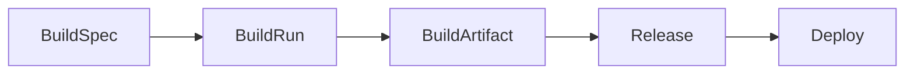
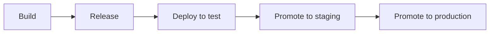

# Builds & Releases

Builds are first-class primitives in Eve. They provide a stable record of **what** was built (spec), **how** it was built (run), and **what** was produced (artifacts). Releases reference a `build_id` and derive image digests from artifacts, giving you deterministic, digest-based deploys.

## Build model

The build system uses a three-tier model:



### BuildSpec

An immutable record of build inputs. Created once per unique build configuration.

| Field | Type | Description |
|-------|------|-------------|
| `id` | string | TypeID (`bld_xxx`) |
| `project_id` | string | Owning project |
| `git_sha` | string | 40-character commit SHA |
| `manifest_hash` | string | Hash of the manifest at build time |
| `services` | string[]? | Service names to build (null = all) |
| `inputs` | object? | Additional build inputs |
| `registry` | object? | Registry configuration override |
| `cache` | object? | Cache configuration |
| `created_by` | string? | User or system that created the build |

### BuildRun

An execution instance of a build. Multiple runs can exist per spec (for retries).

| Field | Type | Description |
|-------|------|-------------|
| `id` | string | Run identifier |
| `build_id` | string | Parent BuildSpec |
| `status` | enum | `pending` &rarr; `building` &rarr; `completed` / `failed` / `cancelled` |
| `backend` | string | `buildkit` (K8s), `buildx` (local), or `kaniko` (fallback) |
| `runner_ref` | string? | Pod or runner name |
| `logs_ref` | string? | Log storage reference |
| `error_message` | string? | Failure reason |
| `started_at` | timestamp? | When the run began |
| `completed_at` | timestamp? | When the run finished |

### BuildArtifact

Output images from a successful build.

| Field | Type | Description |
|-------|------|-------------|
| `service_name` | string | Which service was built |
| `image_ref` | string | Full image reference (e.g., `registry.eh1.incept5.dev/org/api`) |
| `digest` | string | `sha256:...` content digest |
| `platforms` | string[]? | Target platforms (e.g., `["linux/amd64", "linux/arm64"]`) |
| `size_bytes` | number? | Image size |

## Build backends

| Backend | Environment | Notes |
|---------|-------------|-------|
| BuildKit | Kubernetes (production) | Runs as a K8s job. Recommended for all cluster builds. |
| Buildx | Local development | Uses the local Docker daemon. Default for `eve build run` locally. |
| Kaniko | Kubernetes (fallback) | No Docker daemon required. Used only if BuildKit is unavailable. |

## Build triggers

Builds typically run as part of a pipeline `build` step, but can also be created directly via the CLI or API.

### Pipeline build steps

When a pipeline step has `action: { type: build }`, the expander creates a BuildSpec and BuildRun automatically. On success, the step emits `build_id` and `image_digests` as outputs that flow to downstream steps.

```yaml
pipelines:
  deploy:
    steps:
      - name: build
        action: { type: build }
      - name: release
        depends_on: [build]
        action: { type: release }
      - name: deploy
        depends_on: [release]
        action: { type: deploy, env_name: staging }
```

### Direct builds

```bash
eve build create --project <id> --ref <sha> --manifest-hash <hash> \
  --services api,web --repo-dir .
eve build run <build_id>
```

## Build context

Each buildable service in your manifest specifies its build context and Dockerfile:

```yaml
services:
  api:
    image: registry.eh1.incept5.dev/myorg/my-project-api
    build:
      context: ./apps/api
      dockerfile: ./apps/api/Dockerfile
```

### Image name auto-derivation

When a service has `build` config and a `registry` is configured, the `image` field is optional. The platform derives the image name from the service key:

```yaml
services:
  api:
    build:
      context: ./apps/api
```

The derived name is prefixed with the registry host at build time (e.g., `registry.eh1.incept5.dev/api:sha-abc123`). You can set `image` explicitly to override this default.

### Image tags

Tags are determined by the workflow context:

| Context | Tag format |
|---------|------------|
| Local development | `:local` |
| Pipeline builds | Git SHA (`:sha-abc123`) or version (`:v1.0.0`) |

### Zero-artifact failure

Builds that discover services with `build` config but produce zero buildable artifacts **fail with guidance** instead of silently succeeding. This catches common misconfigurations such as missing Dockerfiles, non-existent build contexts, or services with build config but no actual output.

## Build reuse

Build actions reuse the most recent successful build artifacts when all of the following match:

- `project_id`
- `git_sha`
- `manifest_hash`
- Requested services

This speeds up repeated local deploy loops where the ref and manifest have not changed.

**Controls:**

| Scope | How to disable |
|-------|---------------|
| Per-run | Action input `force_rebuild: true` |
| Global | Set `EVE_BUILD_REUSE=false` in worker environment |

## Container registry

### Registry configuration

The project manifest (`.eve/manifest.yaml`) includes a `registry` section that configures where images are stored. Three modes are supported:

#### Eve-native registry

```yaml
registry: "eve"
```

The worker requests a short-lived JWT from the internal API (`POST /internal/registry/token`) using `EVE_INTERNAL_API_KEY`. No manual credential setup is needed.

#### BYO (bring your own) registry

```yaml
registry:
  host: public.ecr.aws/w7c4v0w3
  namespace: myorg
  auth:
    username_secret: REGISTRY_USERNAME
    token_secret: REGISTRY_PASSWORD
```

| Field | Description |
|-------|-------------|
| `host` | Container registry hostname (e.g., `docker.io`, `public.ecr.aws/w7c4v0w3`) |
| `namespace` | Registry namespace or organization |
| `auth.username_secret` | Name of the secret containing the registry username (defaults to `REGISTRY_USERNAME`) |
| `auth.token_secret` | Name of the secret containing the registry token (defaults to `REGISTRY_PASSWORD`) |

Set the required secrets:

```bash
eve secrets set REGISTRY_USERNAME your-registry-username
eve secrets set REGISTRY_PASSWORD your-registry-token
```

#### Disabled

```yaml
registry: "none"
```

Skips registry handling entirely. Use this for public images or when cluster auth is pre-configured.

### Deployer ImagePullSecret

When deploying to Kubernetes with a BYO registry, the deployer automatically:

1. Resolves `username_secret` and `token_secret` from the secrets system
2. Creates a Docker config JSON with registry auth
3. Creates or updates a Kubernetes Secret of type `kubernetes.io/dockerconfigjson`
4. Attaches the secret to the deployment's `imagePullSecrets`

When `registry` is `"eve"` or `"none"`, no ImagePullSecret is created.

### BuildKit transport controls

For local or air-gapped environments, two optional environment variables control BuildKit registry transport:

| Variable | Description |
|----------|-------------|
| `EVE_BUILDKIT_INSECURE_REGISTRIES` | Comma-separated hosts that use insecure/plain-HTTP transport |
| `EVE_BUILDKIT_INSECURE_ALL` | Set to `true` for local troubleshooting only |

## Releases

Releases capture a deployable snapshot: a git SHA, a manifest hash, and image digests.

| Field | Type | Description |
|-------|------|-------------|
| `id` | string | TypeID (`rel_xxx`) |
| `project_id` | string | Owning project |
| `git_sha` | string | 40-character commit SHA |
| `manifest_hash` | string | Hash of the manifest |
| `image_digests` | object? | `{ "api": "sha256:...", "web": "sha256:..." }` |
| `build_id` | string? | Source build (if from a pipeline) |
| `version` | string? | Semantic version |
| `tag` | string? | Release tag (e.g., `v1.0.0`) |

Releases are typically created automatically by pipeline `release` steps. The release action receives `build_id` from the upstream build step and derives `image_digests` from BuildArtifacts.

### Release resolution

Resolve a release by tag to retrieve its details:

```bash
eve release resolve v1.0.0 --project <id>
```

This returns the full release record including image digests — useful for promotion workflows.

## Promotion pattern

The standard promotion workflow builds once and deploys the same artifacts across environments:



1. **Deploy to test** — triggers a pipeline that builds, creates a release, and deploys:
   ```bash
   eve env deploy test --ref <sha>
   ```

2. **Resolve the release** — retrieve the release created by the test deployment:
   ```bash
   eve release resolve v1.2.3
   ```

3. **Promote to staging** — deploy the same release without rebuilding:
   ```bash
   eve env deploy staging --ref <sha> --inputs '{"release_id":"rel_xxx"}'
   ```

4. **Promote to production** — same pattern, possibly with an approval gate:
   ```bash
   eve env deploy production --ref <sha> --inputs '{"release_id":"rel_xxx"}'
   ```

This guarantees that what was tested is exactly what gets deployed — no tag mutation, no ambiguity.

## Deploy model

Deploy requests can reference a release tag or a raw SHA with manifest hash.

| Field | Description |
|-------|-------------|
| `git_sha` | 40-character SHA (required unless `release_tag` is provided) |
| `manifest_hash` | Manifest hash (required with `git_sha`) |
| `release_tag` | Resolve from an existing release (alternative to sha + hash) |
| `image_digests` | Service-to-digest map (skips build) |
| `image_tag` | Tag for pre-built images (e.g., `local`, `sha-abc123`) |
| `direct` | Bypass pipeline and deploy directly |
| `inputs` | Additional pipeline inputs |

```bash
# Deploy via pipeline (recommended)
eve env deploy staging --ref main --repo-dir ./my-app

# Deploy with a specific release
eve env deploy staging --inputs '{"release_tag": "v1.0.0"}'

# Direct deploy (bypass pipeline)
eve env deploy staging --ref <sha> --direct

# Deploy with pre-built images
eve env deploy staging --ref <sha> --direct --image-tag sha-abc123
```

## Build observability

### Build logs

```bash
eve build logs <build_id>                # Timestamped build output
eve build logs <build_id> --run <id>     # Specific run's logs
eve build logs <build_id> --run <id> --follow  # Stream logs
```

Each log line is prefixed with `[HH:MM:SS]` timestamps. Clone, checkout, and workspace preparation phases all produce observable log entries — not just the Dockerfile execution phase.

### Build diagnosis

```bash
eve build diagnose <build_id>
```

Shows a consolidated view of:

- Build spec (git SHA, manifest hash, services)
- All runs with status, backend, and timestamps
- Build artifacts (images and digests)
- Recent logs (last 30 entries)
- Error classification with actionable hints

### Error classification

When builds fail, errors are classified automatically:

| Error code | Cause | Fix |
|------------|-------|-----|
| `auth_error` | Registry or git authentication failure | Check credentials via `eve secrets set` |
| `clone_error` | Git clone failure | Verify repo URL and `GITHUB_TOKEN` |
| `build_error` | Dockerfile build step failure | Check build logs for the failing stage |
| `timeout_error` | Execution timeout | Increase timeout or optimize build |
| `resource_error` | Resource exhaustion (disk, memory) | Check pod resource limits |
| `registry_error` | Registry push failure | Verify registry auth and namespace |

### BuildKit failure output

Build failures include the last 30 lines of BuildKit output and identify the failed Dockerfile stage:

```
Error: buildctl failed with exit code 1 at [build 3/5] RUN pnpm install
--- Last 12 lines ---
#8 [build 3/5] RUN pnpm install --frozen-lockfile
#8 ERROR: process "pnpm install --frozen-lockfile" did not complete successfully
...
```

## Validation and errors

- `manifest_hash` must match the synced manifest for the project ref. Mismatches surface explicit errors.
- Releases require a valid `build_id` that exists for the project.
- If validation fails, re-run the build or re-sync the manifest.

## CLI reference

### Build commands

```bash
eve build list [--project <id>]                    # List build specs
eve build show <build_id>                          # Build spec details
eve build create --project <id> --ref <sha> \
  --manifest-hash <hash> [--services s1,s2] \
  [--repo-dir <path>]                              # Create a build spec
eve build run <build_id>                           # Start a build run
eve build runs <build_id>                          # List runs for a build
eve build logs <build_id> [--run <id>] [--follow]  # View or stream build logs
eve build artifacts <build_id>                     # List image artifacts
eve build diagnose <build_id>                      # Full diagnostic dump
eve build cancel <build_id>                        # Cancel active build
```

### Release commands

```bash
eve release resolve <tag> [--project <id>]         # Resolve release by tag
```

See [eve build](/docs/reference/cli-commands) and [eve release](/docs/reference/cli-commands) in the CLI reference for the full flag list.

## API endpoints

### Builds

```
POST /projects/{project_id}/builds              # Create build spec
GET  /projects/{project_id}/builds              # List builds
GET  /builds/{build_id}                          # Get build spec
POST /builds/{build_id}/runs                     # Start build run
GET  /builds/{build_id}/runs                     # List runs
GET  /builds/{build_id}/artifacts                # List artifacts
GET  /builds/{build_id}/logs                     # View logs
POST /builds/{build_id}/cancel                   # Cancel build
```

### Releases

```
POST /projects/{project_id}/releases             # Create release
GET  /projects/{project_id}/releases             # List releases
GET  /releases/{tag}                              # Resolve by tag
```

### Deploy

```
POST /projects/{project_id}/environments/{env}/deploy   # Deploy to environment
```

## Local development workflow

For fast iteration without pushing to a remote registry:

```bash
# Build with :local tag
docker build -t registry.eh1.incept5.dev/myorg/my-project-api:local ./apps/api

# Import directly into k3d cluster (skips push/pull roundtrip)
k3d image import registry.eh1.incept5.dev/myorg/my-project-api:local -c eve-local

# Deploy
eve env deploy test --ref main --repo-dir .
```

This avoids the push/pull roundtrip to the registry, making local iteration much faster. Use this pattern when developing and testing deployment configuration before committing to a full pipeline run.
