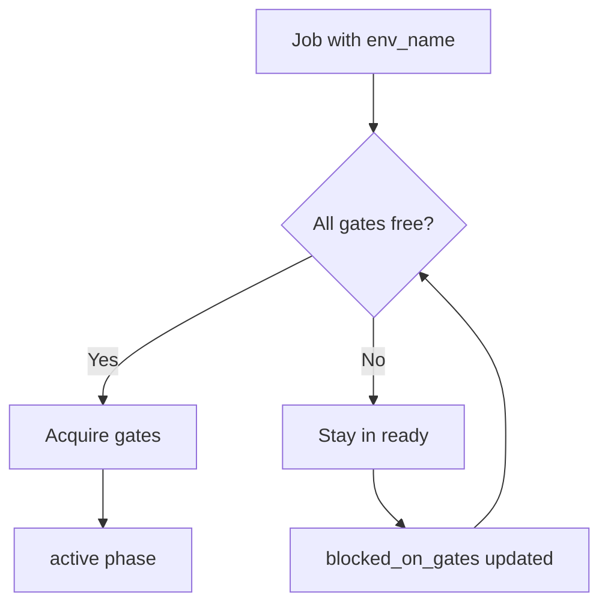

# Environment Gating

Environment gating prevents concurrent jobs from operating on the same environment. When a job targets a named environment via `env_name`, the orchestrator automatically acquires an environment-specific gate to ensure exclusive access during execution.

This is a safety mechanism for deployment-type work -- scenarios where only one job should operate on an environment at a time, such as deploying to staging or running database migrations.

## When to use environment gating

Environment gating is designed for **deployment-type jobs** where concurrent operations would cause conflicts. Set `env_name` on a job when it needs exclusive access to an environment.

**Do not** use `env_name` for general parallel work. Jobs without `env_name` run freely in parallel with no gating. If you are running compute tasks, builds, or other parallelizable work, omit the `env_name` field.

**Mutex enforcement.** You can repurpose `env_name` with special names to enforce mutex behavior for non-deployment scenarios. For example, setting `env_name: "db-backup"` ensures only one backup job runs at a time, even though it is not a traditional environment.

## How it works

### Gate key pattern

When a job has `env_name` set, the system constructs an environment gate key:

```
env:{project_id}:{env_name}
```

For example, a job targeting `staging` in project `proj_abc123` produces the gate key `env:proj_abc123:staging`.

This gate is acquired **in addition to** any explicit gates specified in `job.hints.gates`. The system combines both sets and attempts to acquire all gates atomically.

### Database schema

Environment gating relies on the following database structures:

| Table / Column | Purpose |
|---------------|---------|
| `jobs.env_name` | Target environment name (nullable). When set, triggers automatic gate acquisition. |
| `jobs.blocked_on_gates` | Array of gate keys currently blocking the job from progressing. |
| `job_gates.gate_key` | The unique gate key (e.g., `env:proj_abc123:staging`). |
| `job_gates.job_id` | The job currently holding this gate. |
| `job_gates.acquired_at` | Timestamp when the gate was acquired. |
| `job_gates.ttl_expires_at` | Timestamp when the gate expires if not released. |

### Automatic gate acquisition

The orchestrator does not require you to manually specify environment gates. When it encounters a job with `env_name` set:

1. It combines explicit gates from `hints.gates` with the implicit environment gate
2. It attempts to acquire all gates atomically
3. If any gate is held by another job, the current job remains in `ready` phase with `blocked_on_gates` updated
4. If all gates are free, the job transitions to `active`



### Project-scoped isolation

Environment gates include the `project_id` to ensure isolation between projects. Different projects can deploy to environments with the same name without interference:

- `env:proj_abc123:staging` and `env:proj_xyz789:staging` are independent gates
- Each project maintains its own concurrency control

## Gate lifecycle

The gate lifecycle follows the job lifecycle:

### 1. Gate acquisition (job claim)

When the orchestrator or API claims a job with `env_name`:

- Explicit gates from `hints.gates` are combined with the implicit environment gate
- All gates are acquired atomically -- partial acquisition is not possible
- If blocked, the job's `blocked_on_gates` field is updated with the blocking gate keys

### 2. Gate held (job execution)

The environment gate is held for the entire duration of job execution. No other job targeting the same environment can proceed until the gate is released.

### 3. Gate release (job completion)

When the job completes -- whether by success, failure, or cancellation -- all gates are released. Other jobs waiting for the same environment can then acquire the gate.

### TTL and timeout

Gates have a time-to-live (TTL) set to the job's `hints.timeout_seconds` (default: 30 minutes). This provides a safety net against orphaned locks:

- If a job crashes without releasing its gates, the TTL ensures the gate expires automatically
- Expired gates are cleaned up during subsequent gate acquisition attempts
- This prevents permanent deadlocks from orphaned gates

The TTL is a last-resort mechanism. Under normal operation, gates are released explicitly when the job completes. The TTL only comes into play when the worker process crashes or loses connectivity without running its cleanup logic.

:::tip
If you run long-running workflows that exceed the default 30-minute timeout, set `hints.timeout_seconds` to a higher value. The gate TTL automatically matches the timeout, so the gate will not expire prematurely while the job is still executing.
:::

## Gate types

### Implicit environment gates

Created automatically when a job has `env_name` set. You never need to specify these manually.

| Gate key | Created when |
|----------|-------------|
| `env:{project_id}:{env_name}` | Job has `env_name` set |

### Explicit gates

Specified manually in `hints.gates` for additional concurrency control beyond environment isolation. Use these for cross-cutting concerns:

| Example gate key | Purpose |
|-----------------|---------|
| `db-migration` | Ensure only one migration runs at a time |
| `api:third-party` | Respect external API rate limits |
| `infra:cdn-purge` | Serialize CDN cache invalidation |

### Combined gates

A single job can hold both implicit and explicit gates. All gates must be acquired atomically:

```bash
eve job create \
  --project proj_abc123 \
  --description "Deploy database migration to production" \
  --env-name production \
  --hints '{"gates": ["db-migration"]}'

# This job acquires TWO gates:
# 1. env:proj_abc123:production (automatic)
# 2. db-migration (explicit)
```

## Gate configuration

### Setting env_name on a job

```bash
# Create a job targeting the staging environment
eve job create \
  --project proj_abc123 \
  --description "Deploy API to staging" \
  --env-name staging
```

### Adding explicit gates

```bash
# Job with environment gate plus a custom mutex gate
eve job create \
  --project proj_abc123 \
  --description "Run database migration" \
  --env-name production \
  --hints '{"gates": ["db-migration"]}'
```

### Workflow gate configuration

Workflows can declare gates in their `hints` block. These are applied every time the workflow is invoked:

```yaml
# .eve/manifest.yaml
workflows:
  fix-ci-failure:
    hints:
      gates: ["remediate:proj_abc123:staging"]
```

## Concurrent deploy prevention

The core use case for environment gating is preventing two deploys from running simultaneously on the same environment.

### Scenario: Concurrent staging deploys

Two developers trigger deploys to staging at the same time.

1. **Job A** is claimed first. Gate `env:proj_abc123:staging` is acquired. Job A transitions to `active`.
2. **Job B** attempts to claim. Gate acquisition fails because Job A holds `env:proj_abc123:staging`. Job B stays in `ready` with `blocked_on_gates: ["env:proj_abc123:staging"]`.
3. **Job A completes.** Gate is released.
4. **Job B** is claimed on the next orchestration cycle. Gate is now free. Job B transitions to `active`.

The blocked job is not cancelled or rejected -- it simply waits. The orchestrator retries gate acquisition on each cycle until the gate becomes available.

### Scenario: Database migration with explicit gate

A production deploy and a database migration both target production, but the migration additionally requires a `db-migration` mutex:

1. **Deploy job** acquires `env:proj_abc123:production`. Proceeds normally.
2. **Migration job** needs both `env:proj_abc123:production` and `db-migration`. Blocked on the environment gate.
3. **Deploy completes.** Environment gate released.
4. **Migration job** acquires both gates atomically. Proceeds.
5. **Another deploy** arrives during migration. Blocked on `env:proj_abc123:production` until migration completes.

### Multi-environment concurrency

Jobs targeting **different** environments can run simultaneously:

- A job deploying to `staging` and a job deploying to `production` acquire different gates
- Both can be `active` at the same time
- Each environment maintains independent concurrency control

This means you can safely run parallel deploy pipelines across environments without artificial serialization.

## Gate status and monitoring

### API responses

When claiming a blocked job, the API returns a 409 Conflict:

```json
{
  "statusCode": 409,
  "message": "Job blocked on gates",
  "blocked_on_gates": ["env:proj_abc123:staging"],
  "jobId": "staging-deploy-a3f2dd12"
}
```

### Checking blocked jobs

```bash
# List jobs blocked on gates
eve job list --project proj_abc123 --json | jq '.jobs[] | select(.blocked_on_gates | length > 0)'
```

### Orchestrator logs

The orchestrator logs gate operations with context:

```
Job staging-deploy-a3f2dd12 blocked on environment gate
  (another job is deploying to staging): env:proj_abc123:staging
```

```
Acquired gates for job staging-deploy-a3f2dd12:
  env:proj_abc123:staging (environment lock), db-migration
```

### Database queries

For operators with database access, active gates can be inspected directly:

```sql
-- Active environment gates
SELECT gate_key, job_id, acquired_at, ttl_expires_at
FROM job_gates
WHERE gate_key LIKE 'env:%'
ORDER BY acquired_at DESC;

-- Jobs blocked on environment gates
SELECT id, env_name, blocked_on_gates, phase
FROM jobs
WHERE blocked_on_gates IS NOT NULL
  AND array_length(blocked_on_gates, 1) > 0
ORDER BY updated_at DESC;
```

## Design rationale

### Why automatic gates?

1. **Safety by default** -- Developers do not need to remember to add environment gates. Targeting an environment is enough.
2. **Consistency** -- All environment-targeted jobs follow the same concurrency pattern.
3. **Simplicity** -- No need to manually construct `env:{project}:{env}` gate keys in hints.

### Why atomic acquisition?

Partial gate acquisition would create deadlock risk. If Job A holds gate X and wants gate Y, while Job B holds gate Y and wants gate X, neither can proceed. Atomic all-or-nothing acquisition prevents this.

### Why project-scoped gates?

Independent projects should not block each other. Including `project_id` in the gate key ensures that `proj_abc.staging` and `proj_xyz.staging` are completely independent.

### Why TTL-based expiry?

In distributed systems, processes can crash without running cleanup logic. If a worker holding a gate crashes mid-deploy, the gate would be held indefinitely without TTL-based expiry. The TTL ensures that even in the worst case (worker crash, network partition, process kill), the gate will eventually be released and other jobs can proceed. The 30-minute default aligns with the default job timeout, meaning the gate expires at the same time the job would be considered timed out.

## CLI commands

### Create a gated job

```bash
eve job create \
  --project proj_abc123 \
  --description "Deploy API to staging" \
  --env-name staging
```

See [eve job create](/docs/reference/cli-appendix#eve-job-create).

### List blocked jobs

```bash
eve job list --project proj_abc123 --json \
  | jq '.jobs[] | select(.blocked_on_gates | length > 0)'
```

### Inspect gate status on a job

```bash
eve job show proj_abc123 42 --json \
  | jq '{phase, env_name, blocked_on_gates}'
```

## Planned enhancements

The following features are planned but not yet implemented:

- **Gate monitoring CLI** -- `eve gate list` to show active gates and contention
- **Manual gate release** -- `eve gate release <key>` for admin recovery of stuck gates
- **Gate analytics** -- Track gate wait times and contention patterns
- **Priority-based acquisition** -- Higher priority jobs can preempt lower priority jobs
- **Cross-project gates** -- Shared gates between related projects (e.g., monorepo services)
