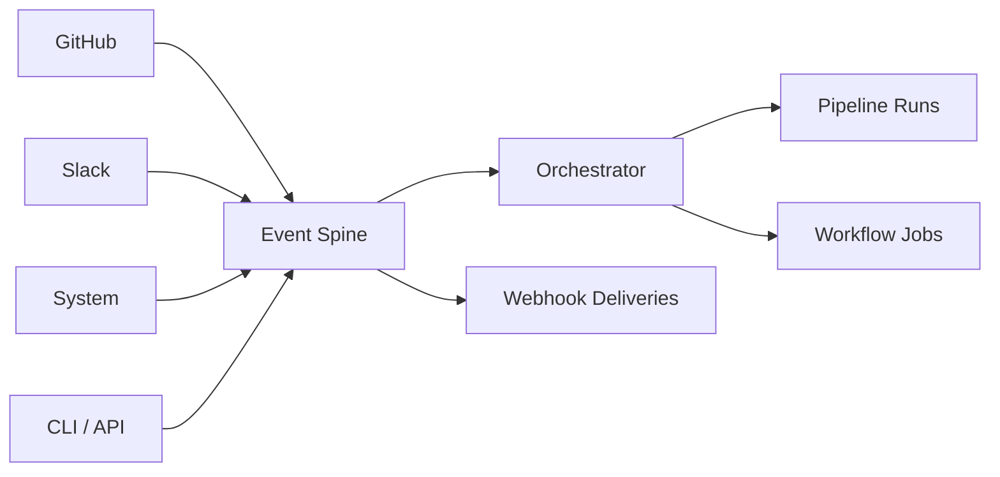
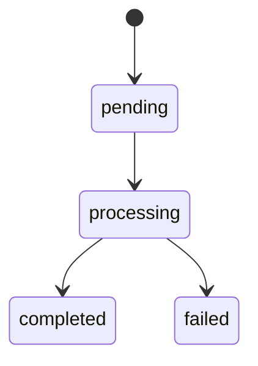

# Events & Webhooks

Eve's event system is a Postgres-backed **event spine** that powers triggers, webhooks, and automation. Every meaningful thing that happens in the platform — a push to GitHub, a failed job, a Slack mention — becomes an event that can trigger pipelines, fire webhooks, or drive self-healing workflows.

## Architecture



Events are stored in Postgres and consumed from the event queue. The orchestrator matches new events against manifest triggers and creates pipeline runs or workflow jobs when matches occur.

Multiple orchestrator instances can safely process the queue in parallel. Events are claimed in batches using `FOR UPDATE SKIP LOCKED`, which prevents double-claiming without requiring external locks.

## Event model

Every event shares a common set of core fields.

| Field | Type | Description |
|-------|------|-------------|
| `id` | string | TypeID (`evt_xxx`) |
| `project_id` | string | Owning project |
| `type` | string | Namespaced event type (e.g., `github.push`) |
| `source` | enum | Event origin — see sources below |
| `status` | enum | `pending` &rarr; `processing` &rarr; `completed` / `failed` |
| `payload_json` | object | Event-specific data (varies by type) |
| `env_name` | string? | Target environment |
| `ref_sha` | string? | Git commit SHA |
| `ref_branch` | string? | Git branch name |
| `actor_type` | enum? | `user`, `system`, or `app` |
| `actor_id` | string? | Actor identifier |
| `dedupe_key` | string? | Idempotency key (prevents duplicate processing) |

### Event sources

| Source | Description |
|--------|-------------|
| `github` | GitHub webhook events (push, pull_request) |
| `slack` | Slack messages and mentions |
| `cron` | Scheduled triggers |
| `manual` | User-created via CLI or API |
| `app` | Application-emitted custom events |
| `system` | Platform-generated lifecycle events |
| `runner` | Worker pod lifecycle events |
| `chat` | Chat-originated events |

### Event status lifecycle



Events enter as `pending`, transition to `processing` when claimed by the orchestrator, and resolve to `completed` or `failed` once routing is finished.

## Event types

### GitHub events

| Type | Trigger | Payload |
|------|---------|---------|
| `github.push` | Push to branch | `{ ref, commits, repository, sender, head_commit }` |
| `github.pull_request` | PR lifecycle | `{ action, number, pull_request: { head, base, title, ... } }` |

GitHub events arrive via webhook at `POST /integrations/github/events/{project_id}`. The API verifies `X-Hub-Signature-256`, normalizes the payload, and stores it in the event spine.

### Slack events

| Type | Trigger | Payload |
|------|---------|---------|
| `slack.message` | Message in channel | `{ text, channel, user, ts, thread_ts }` |
| `slack.app_mention` | `@eve` mention | `{ text, channel, user, ts }` |

Slack events are handled by the **Gateway** service, not the API. The gateway verifies Slack signing secrets, resolves `team_id` to `org_id`, and forwards normalized events into chat routing and dispatch.

### System events

System events are emitted automatically by the orchestrator and other platform components. They are the foundation for self-healing automation.

| Type | Trigger | Payload |
|------|---------|---------|
| `system.job.failed` | Job execution failure | `{ job_id, attempt_id, error_message, error_code, exit_code, mutation_id, request_id, metadata }` |
| `system.pipeline.failed` | Pipeline run failure | `{ run_id, pipeline_name, error_message, error_code, exit_code, mutation_id, request_id, metadata }` |
| `system.doc.created` | Org document created | `{ org_id, project_id, doc_id, doc_version_id, path, version, content_hash, mutation_id, request_id, metadata }` |
| `system.doc.updated` | Org document updated | `{ org_id, project_id, doc_id, doc_version_id, path, version, content_hash, mutation_id, request_id, metadata }` |
| `system.doc.deleted` | Org document deleted | `{ org_id, project_id, doc_id, path, version, content_hash, mutation_id, request_id, metadata }` |
| `system.resource.hydration.started` | Worker begins resource hydration | `{ job_id, attempt_id, resource_count, resources }` |
| `system.resource.hydration.completed` | Worker completes hydration | `{ job_id, attempt_id, resolved_count, missing_optional_count, resources }` |
| `system.resource.hydration.failed` | Worker hydration failed | `{ job_id, attempt_id, resolved_count, failed_required_count, resources }` |

### Runner events

Runner pods emit lifecycle events for worker coordination.

| Type | Trigger | Payload |
|------|---------|---------|
| `runner.started` | Runner pod launched | `{ attemptId, jobId }` |
| `runner.progress` | Execution progress update | `{ attemptId, jobId, message, percentage }` |
| `runner.completed` | Runner finished successfully | `{ attemptId, jobId, result }` |
| `runner.failed` | Runner execution failed | `{ attemptId, jobId, error, exitCode }` |

Runner payloads use `snake_case` field names:

* `runner.started`: `{ attempt_id, job_id }`
* `runner.progress`: `{ attempt_id, job_id, message, percentage }`
* `runner.completed`: `{ attempt_id, job_id, result }`
* `runner.failed`: `{ attempt_id, job_id, error, exit_code }`

### LLM usage events

Harnesses emit `llm.call` events after each provider call. These contain usage-only metadata — token counts and model identifiers — used for receipts and live cost tracking. No prompt or response content is included in these events.

### Cron events

| Type | Trigger | Payload |
|------|---------|---------|
| `cron.tick` | Schedule fires | `{ schedule, trigger_name }` |

### Custom events

| Type | Trigger | Payload |
|------|---------|---------|
| `manual.*` | User-created via CLI or API | Any JSON |
| `app.*` | Application-emitted | Any JSON |

Custom events accept any `type` string. There is no schema enforcement — the payload can be arbitrary JSON.

## Trigger configuration

Triggers connect events to pipeline runs and workflow jobs. They are defined in `.eve/manifest.yaml` under `pipelines.<name>.trigger` or `workflows.<name>.trigger`.

### How triggers work

1. An event arrives in the events table with status `pending`
2. The orchestrator checks queued events
3. It loads the project manifest and checks all pipeline and workflow triggers
4. If a trigger matches, it creates a pipeline run or workflow job
5. The event is marked `completed` (or `failed` if routing errors)

### GitHub triggers

#### Push events

```yaml
trigger:
  github:
    event: push
    branch: main
```

#### Pull request events

```yaml
trigger:
  github:
    event: pull_request
    action: [opened, synchronize, reopened]
    base_branch: main
```

Supported PR actions: `opened`, `synchronize`, `reopened`, `closed`.

**Branch patterns** support wildcards for both push and PR triggers:

| Pattern | Matches |
|---------|---------|
| `main` | Exact match |
| `release/*` | `release/v1.0`, `release/v2.0`, etc. |
| `*-prod` | `staging-prod`, `main-prod`, etc. |

### System triggers

Use system triggers to build self-healing automation. When a job or pipeline fails, the system event can trigger a recovery pipeline.

```yaml
trigger:
  system:
    event: job.failed
    pipeline: deploy      # Optional: scope to a specific pipeline
```

### Cron triggers

```yaml
trigger:
  cron:
    schedule: "0 */6 * * *"   # Standard cron expression
```

### Manual triggers

```yaml
trigger:
  manual: true   # Only runs when explicitly invoked via CLI or API
```

### Complete trigger example

```yaml
pipelines:
  ci:
    trigger:
      github:
        event: pull_request
        action: [opened, synchronize]
        base_branch: main
    steps:
      - name: test
        script: { run: "pnpm test" }

  deploy:
    trigger:
      github:
        event: push
        branch: main
    steps:
      - name: build
        action: { type: build }
      - name: deploy
        depends_on: [build]
        action: { type: deploy, env_name: staging }

  self-heal:
    trigger:
      system:
        event: job.failed
        pipeline: deploy
    steps:
      - name: diagnose
        agent: { prompt: "Diagnose the failed deploy and suggest a fix" }
```

## Deduplication

Events can include a `dedupe_key` to prevent duplicate processing. The API checks for an existing event with the same key before creating a new record. This is useful for idempotent webhook handlers and retry-safe event emission.

## Webhook subscriptions

Eve supports org-wide and project-scoped webhook subscriptions. Each webhook receives event payloads emitted by the system — job lifecycle changes, pipeline runs, deploys, and more.

### Creating a subscription

```bash
eve webhooks create --org org_xxx \
  --url https://example.com/hook \
  --events job.completed,job.failed \
  --secret <secret>
```

The request body (when using the API directly):

```json
{
  "url": "https://example.com/hook",
  "events": ["job.completed", "job.failed"],
  "filter": { "project_id": "proj_xxx" },
  "secret": "<min-16-chars>"
}
```

- The `events` field supports wildcards (e.g., `system.job.*`).
- The `secret` must be 16 to 256 characters.

### Payload format

Webhook deliveries use a **CloudEvents 1.0** envelope:

```json
{
  "specversion": "1.0",
  "type": "job.completed",
  "source": "eve://orgs/org_xxx/projects/proj_xxx",
  "id": "evt_...",
  "time": "2026-02-12T12:00:00Z",
  "data": {
    "job_id": "myproj-a3f2dd12",
    "status": "done"
  }
}
```

### Signature verification

Each delivery includes two headers for verification:

| Header | Description |
|--------|-------------|
| `X-Eve-Signature-256` | `sha256=<hex>` HMAC of the payload |
| `X-Eve-Delivery` | Unique delivery ID |

Compute the HMAC-SHA256 using your webhook secret and compare it to the `X-Eve-Signature-256` header value.

### Delivery and retry

Deliveries follow an exponential backoff schedule:

| Attempt | Delay |
|---------|-------|
| 1 | 1 minute |
| 2 | 5 minutes |
| 3 | 30 minutes |
| 4 | 2 hours |
| 5 | 12 hours |

- HTTP timeout: 30 seconds per delivery.
- Response bodies are truncated to 4096 characters for storage.
- Subscriptions **auto-disable** after 10 consecutive failures.

### Replay semantics

Failed or filtered deliveries can be replayed:

```bash
eve webhooks replay wh_xxx --org org_xxx \
  --from-event evt_xxx \
  --max-events 100 \
  --dry-run
```

Replay rules:
- `--dry-run` shows how many deliveries would be enqueued without sending them.
- `max_events` defaults to 5000 (range 1 to 10,000).
- `from` anchors by event ID; `to` limits by time.
- Deduplication is enforced per `(subscription_id, event_id)` — the same event is not delivered twice.
- A subscription allows up to 3 concurrent replays.

Check replay progress:

```bash
eve webhooks replay-status wh_xxx rep_xxx --org org_xxx
```

## Event filtering

Webhook subscriptions can include a `filter` object to narrow which events are delivered. The most common filter is `project_id`, which limits deliveries to events from a specific project.

```json
{
  "url": "https://example.com/hook",
  "events": ["system.job.*"],
  "filter": { "project_id": "proj_xxx" }
}
```

## CLI reference

### Event commands

```bash
# List events (with filters)
eve event list [project] --type github.push --source github --status completed

# Show event details
eve event show <event-id>

# Emit a custom event
eve event emit --type manual.test --source manual --payload '{"key":"value"}'
eve event emit --type app.deploy-check --source app --env staging --ref-branch main
```

See [eve event](/docs/reference/cli-commands) in the CLI reference for the full flag list.

### Webhook commands

```bash
# List subscriptions
eve webhooks list --org org_xxx

# Create a subscription
eve webhooks create --org org_xxx --url https://example.com/hook \
  --events job.completed,job.failed --secret <secret>

# Show subscription details
eve webhooks show wh_xxx --org org_xxx

# Delete a subscription
eve webhooks delete wh_xxx --org org_xxx

# Re-enable a disabled subscription
eve webhooks enable wh_xxx --org org_xxx

# List recent deliveries
eve webhooks deliveries wh_xxx --org org_xxx --limit 50

# Send a test delivery
eve webhooks test wh_xxx --org org_xxx

# Replay deliveries
eve webhooks replay wh_xxx --org org_xxx --from-event evt_xxx --max-events 100 --dry-run

# Check replay status
eve webhooks replay-status wh_xxx rep_xxx --org org_xxx
```

See [eve webhooks](/docs/reference/cli-commands) in the CLI reference for the full flag list.

## API endpoints

### Events

```
POST /projects/{project_id}/events              # Create event
GET  /projects/{project_id}/events              # List events (filters: type, source, status)
GET  /projects/{project_id}/events/{event_id}   # Get event details
```

### Webhooks

```
POST   /orgs/{org_id}/webhooks                          # Create subscription
GET    /orgs/{org_id}/webhooks                          # List subscriptions
GET    /orgs/{org_id}/webhooks/{wh_id}                  # Get subscription
DELETE /orgs/{org_id}/webhooks/{wh_id}                  # Delete subscription
PATCH  /orgs/{org_id}/webhooks/{wh_id}/enable           # Re-enable subscription
GET    /orgs/{org_id}/webhooks/{wh_id}/deliveries       # List deliveries
POST   /orgs/{org_id}/webhooks/{wh_id}/test             # Send test delivery
POST   /orgs/{org_id}/webhooks/{wh_id}/replays          # Start replay
GET    /orgs/{org_id}/webhooks/{wh_id}/replays/{id}     # Replay status
POST   /projects/{project_id}/webhooks                  # Project-scoped subscription
```

### Integration endpoints

```
POST /integrations/github/events/{project_id}   # GitHub webhook receiver
POST /integrations/slack/events                  # Slack webhook receiver (legacy)
POST /gateway/providers/slack/webhook            # Slack via Gateway (current)
```

## Error responses

Common webhook error codes:

| Code | Meaning |
|------|---------|
| `resource_conflict` | Replay already running or subscription disabled |
| `webhook_replay_window_invalid` | Invalid replay window or max_events value |
| `resource_not_found` | Subscription or delivery not found |
