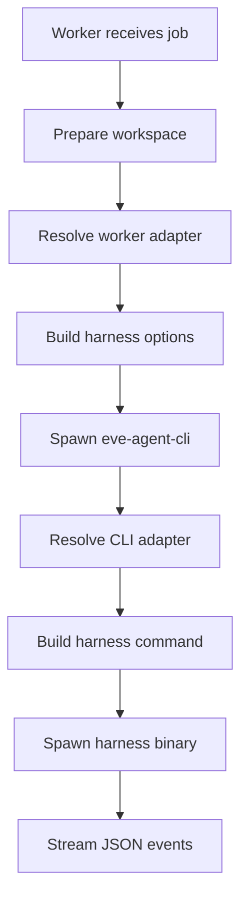

# Harnesses & Workers

Eve executes AI work through **harnesses** -- thin adapters that wrap AI coding CLIs (Claude Code, Gemini CLI, Codex, etc.) behind a uniform invocation contract. **Workers** are the containers that run harnesses. Together they form the execution layer between the orchestrator and the AI models.

## Available harnesses

Each harness wraps a specific AI coding CLI and normalizes its interface for the Eve platform.

| Harness | Binary | Package | Description |
|---------|--------|---------|-------------|
| `mclaude` | `mclaude` | cc-mirror variant | Claude Code with MCP tools and skill installation |
| `claude` | `claude` | @anthropic-ai/claude-code | Official Claude Code CLI |
| `zai` | `zai` | cc-mirror variant | Z.ai provider through Claude Code interface |
| `gemini` | `gemini` | @google/gemini-cli | Google Gemini CLI |
| `code` | `code` | @just-every/code | Every Code CLI (use `coder` alias on host to avoid VS Code clash) |
| `codex` | `codex` | @openai/codex | OpenAI Codex CLI |

:::tip
Do not parse `harness:variant` syntax (e.g., `mclaude:deep`). Use `harness_options.variant` in the job payload instead.
:::

## Invocation flow

Every job attempt follows a two-stage pipeline. The worker never calls harness binaries directly -- it always goes through `eve-agent-cli`, which owns argument construction, permission mapping, and output normalization.



### Stage 1: Worker (InvokeService)

1. **prepareWorkspace()** -- Create the attempt directory and clone the repository
2. **resolveWorkerAdapter(harness)** -- Look up the `WorkerHarnessAdapter` by harness name
3. **adapter.buildOptions(ctx)** -- Resolve authentication (OAuth tokens, API keys), set config directories, prepare environment variables
4. **executeEveAgentCli(invocation, options)** -- Spawn `eve-agent-cli` with the constructed arguments and stream JSON output to `execution_logs`

### Stage 2: eve-agent-cli

1. **resolveCliAdapter(harness)** -- Look up the `CliHarnessAdapter` by harness name
2. **adapter.buildCommand(ctx)** -- Construct the binary path, CLI arguments, and environment variables. Map the abstract permission policy to harness-specific flags.
3. **spawn(binary, args, &#123;cwd, env&#125;)** -- Run the actual harness CLI and normalize its output to JSON events

### eve-agent-cli arguments

```bash
eve-agent-cli \
  --harness <harness>           # mclaude, claude, zai, gemini, code, codex
  --permission <policy>         # default, auto_edit, never, yolo
  --output-format stream-json
  --workspace <workspacePath>
  --prompt "<text>"
  [--variant <variant>]         # optional harness variant
  [--model <model>]             # optional model override
```

## Adapter architecture

Harness-specific logic is split into per-harness adapter modules at two levels. Both registries use static resolution -- there is no dynamic loading.

### Worker adapters

Located in `apps/worker/src/invoke/harnesses/`. Each adapter exports a `WorkerHarnessAdapter` with a `buildOptions()` method that resolves authentication and configuration for the harness.

### CLI adapters

Located in `packages/eve-agent-cli/src/harnesses/`. Each adapter exports a `CliHarnessAdapter` with a `buildCommand()` method that maps job configuration to harness-specific CLI flags.

### Harness naming and aliases

| Harness | Binary | Aliases | Notes |
|---------|--------|---------|-------|
| `mclaude` | `mclaude` | -- | cc-mirror Claude variant |
| `claude` | `claude` | -- | Official @anthropic-ai/claude-code |
| `zai` | `zai` | -- | cc-mirror Z.ai variant |
| `gemini` | `gemini` | -- | @google/gemini-cli |
| `code` | `code` | `coder` | Use `coder` on host to avoid VS Code binary clash |
| `codex` | `codex` | -- | @openai/codex |

## Worker types

Eve supports multiple worker types, each providing a container image with different toolchain combinations. Jobs request a specific worker via `hints.worker_type`, and the orchestrator routes the job accordingly.

### Image variants

| Image | Description |
|-------|-------------|
| **base** | Runtime without toolchains -- Node.js, worker harness, and base utilities only |
| **python** | Python 3.11, pip, uv package manager |
| **rust** | Rust 1.75 via rustup, cargo |
| **java** | OpenJDK 21 |
| **kotlin** | Kotlin 2.0 + OpenJDK 21 |
| **full** | All toolchains combined (default for local development) |

### Worker routing

The orchestrator uses `EVE_WORKER_URLS` to map worker type names to service URLs:

```
EVE_WORKER_URLS=default-worker=http://worker:4811,python-worker=http://worker-python:4811
```

| Worker type | Routes to | Image |
|-------------|-----------|-------|
| `default-worker` | `worker` service | base (or per `EVE_WORKER_VARIANT`) |
| `python-worker` | `worker-python` service | python variant |
| `rust-worker` | `worker-rust` service | rust variant |
| `java-worker` | `worker-java` service | java variant |
| `kotlin-worker` | `worker-kotlin` service | kotlin variant |

If a job specifies a worker type not present in `EVE_WORKER_URLS`, it fails early with a clear error.

### Requesting a worker type

```bash
eve job create \
  --project proj_xxx \
  --description "Run Python tests" \
  --worker-type python-worker
```

When no `worker_type` is specified, the orchestrator uses `default-worker`.

## Workspace structure

Each job attempt gets an isolated workspace directory. The harness runs with `cwd` set to the repository root so it can see project files.

```
$WORKSPACE_ROOT/                     # e.g., /opt/eve/workspaces
  {attemptId}/                       # unique per attempt
    repo/                            # cloned/copied repository
      AGENTS.md                      # project memory for agents
      CLAUDE.md                      # Claude-specific instructions
      .agent/skills/                 # installed skills (gitignored)
      .agent/harnesses/<harness>/    # per-harness config (optional)
```

| Variable | Value | Description |
|----------|-------|-------------|
| `workspacePath` | `$WORKSPACE_ROOT/{attemptId}` | Root workspace for this attempt |
| `repoPath` | `$workspacePath/repo` | Cloned repository location |
| `cwd` (harness) | `$repoPath` | Working directory for harness execution |

### Environment contract

All worker images enforce a deterministic environment contract:

| Variable | Value | Purpose |
|----------|-------|---------|
| `EVE_WORKSPACE_ROOT` | `/opt/eve/workspaces` | Root for all workspace mounts |
| `EVE_CACHE_ROOT` | `/opt/eve/cache` | Shared cache for package managers |
| `EVE_HOME` | `/home/node` | Home directory for the node user |
| `EVE_RUN_AS_UID` | `1000` | User ID for running processes |

Processes run as UID 1000 (non-root). Workspace directories are writable by the worker process. Cache directories are shared across attempts for efficiency.

## Permission policies

Each harness maps the abstract permission policy to its own CLI flags. The policy controls what the agent is allowed to do with the file system and external tools.

| Policy | mclaude / claude / zai | gemini | code / codex |
|--------|----------------------|--------|-------------|
| `default` | `--permission-mode default` | `--approval-mode default` | `--ask-for-approval on-request` |
| `auto_edit` | `--permission-mode acceptEdits` | `--approval-mode auto_edit` | `--ask-for-approval on-failure` |
| `never` | `--permission-mode dontAsk` | (fallback to default) | `--ask-for-approval never` |
| `yolo` | `--dangerously-skip-permissions` | `--yolo` | `--ask-for-approval never` |

Sandbox flags are applied automatically by `eve-agent-cli`:

- **Claude / mclaude / zai:** `--add-dir <workspace>`
- **Code / Codex:** `--sandbox workspace-write -C <workspace>`
- **Gemini:** `--sandbox`

Set the policy on a job via `hints.permission_policy`:

```bash
eve job create \
  --project proj_xxx \
  --description "Refactor auth module" \
  --hints '{"permission_policy": "auto_edit"}'
```

## Harness profiles

Projects define named profiles under `x-eve.agents` in the manifest. Profiles decouple job definitions from specific harness choices, making it easy to swap providers or models without changing job configuration.

```yaml
# .eve/manifest.yaml
x-eve:
  agents:
    version: 1
    availability:
      drop_unavailable: true
    profiles:
      primary-orchestrator:
        - harness: mclaude
          model: opus-4.5
          reasoning_effort: high
      primary-coder:
        - harness: codex
          model: gpt-5.2-codex
          reasoning_effort: high
      primary-reviewer:
        - harness: mclaude
          model: opus-4.5
          reasoning_effort: high
        - harness: codex
          model: gpt-5.2-codex
          reasoning_effort: x-high
      planning-council:
        - profile: primary-planner
```

### Profile fields

| Field | Type | Description |
|-------|------|-------------|
| `harness` | string | Harness name (`mclaude`, `claude`, `zai`, `gemini`, `code`, `codex`) |
| `model` | string | Model identifier (e.g., `opus-4.5`, `gpt-5.2-codex`) |
| `reasoning_effort` | string | Reasoning level: `low`, `medium`, `high`, `x-high` |
| `profile` | string | Reference another profile by name (for composition) |

### Availability policy

When `drop_unavailable: true` is set, entries for harnesses that are not currently authenticated or available are silently dropped from profiles. This lets you define fallback chains where the first available harness is used.

### Using profiles in jobs

Reference a profile by name in `harness_profile`:

```json
{
  "harness": "mclaude",
  "harness_profile": "primary-reviewer",
  "harness_options": {
    "variant": "deep",
    "model": "opus-4.5",
    "reasoning_effort": "high"
  }
}
```

Skills should always reference profiles rather than hardcoding specific harnesses.

## Model selection

### Job-level model override

Jobs can override the model via `harness_options.model`:

```json
{
  "harness": "mclaude",
  "harness_options": {
    "model": "opus-4.5"
  }
}
```

### Default model resolution

If no model is specified, each harness falls back to its default:

| Harness | Model env var | Fallback |
|---------|--------------|----------|
| `mclaude` / `claude` | `CLAUDE_MODEL` | `opus` |
| `zai` | `ZAI_MODEL`, then `CLAUDE_MODEL` | -- |
| `gemini` | -- | Gemini default |
| `code` / `codex` | -- | Provider default |

### Managed models

Models prefixed with `managed/` are resolved server-side to a provider, credentials, and base URL. The worker injects the resolved connection details into the harness environment so the harness can call the managed endpoint without any BYOK secrets.

Managed model catalog endpoints:

- `GET /inference/managed-models` -- list available managed models
- `POST /inference/managed-models` -- register a new managed model
- `DELETE /inference/managed-models/{canonical_model_id}` -- remove a managed model

The `GET /models` endpoint exposes managed models as `managed/<name>` entries for clients.

### Reasoning effort

Jobs pass `harness_options.reasoning_effort` to control how deeply the model reasons:

| Harness family | Mechanism | Notes |
|---------------|-----------|-------|
| mclaude / claude / zai | Thinking tokens | Maps effort level to token budget |
| code / codex | `--reasoning` flag | Passes effort level as CLI flag |
| gemini | Passthrough | Effort level passed directly |

Available levels: `low`, `medium`, `high`, `x-high`.

## Authentication

Each harness family has its own authentication mechanism. The worker resolves credentials before spawning the harness.

### Claude-based harnesses (mclaude, claude, zai)

**Priority order:**

1. `ANTHROPIC_API_KEY` -- if set, used directly; OAuth is skipped
2. OAuth tokens (`CLAUDE_CODE_OAUTH_TOKEN` + `CLAUDE_OAUTH_REFRESH_TOKEN`)

OAuth tokens are refreshed automatically with a 5-minute buffer before expiry. Refreshed tokens are cached in-memory for the worker process lifetime.

Credentials are written to `~/.claude/.credentials.json` by the container entrypoint.

### Zai harness

Requires `Z_AI_API_KEY`. The worker maps this to `ANTHROPIC_API_KEY` when spawning the zai process.

### Gemini harness

Uses `GEMINI_API_KEY` or `GOOGLE_API_KEY`. No special credential setup required.

### Code / Codex harnesses

Use OpenAI OAuth credentials written to `~/.code/auth.json` and `~/.codex/auth.json` by the container entrypoint.

Eve does not auto-refresh Code/Codex tokens. Re-authenticate with `codex auth` or `code auth`, then run `./bin/eh auth extract --save` to update secrets.

## Per-harness configuration

Harness configuration is read from a single root directory with per-harness subfolders:

```
.agent/harnesses/
  <harness>/
    config.toml|json|yaml
    variants/
      <variant>/
        config.toml|json|yaml
```

**Resolution order:**

1. `EVE_HARNESS_CONFIG_ROOT` (if set) -- `<root>/<harness>`
2. `<repo>/.agent/harnesses/<harness>` (in-repo default)

If a `variants/<variant>` directory exists, it overlays the base config directory.

### Per-harness CLI arguments

**mclaude / claude:**

```bash
mclaude --print --verbose --output-format stream-json \
  --model opus --permission-mode default "<prompt>"
```

**zai:**

```bash
zai --print --verbose --output-format stream-json \
  --model <model> --permission-mode default "<prompt>"
```

**gemini:**

```bash
gemini --output-format stream-json \
  --model <model> --approval-mode default "<prompt>"
```

**code / codex:**

```bash
code --ask-for-approval on-request --model <model> \
  --profile <variant> exec --json --skip-git-repo-check "<prompt>"
```

## Execution logging

All harness output is logged to the `execution_logs` table with typed entries:

| Type | Description |
|------|-------------|
| `event` | Normalized harness event (assistant, tool_use, tool_result, etc.) |
| `system` | System events (init, completed) |
| `system_error` | Stderr output |
| `parse_error` | Failed to parse JSON line from harness |
| `spawn_error` | Failed to spawn harness process |

### Usage events

Harnesses emit `llm.call` events after each provider call with usage-only metadata (token counts, model identifiers, timing). These events are stored in `execution_logs` and used to assemble receipts and enforce per-job budgets. No prompt or response content is included.

## CLI commands

### List harnesses

```bash
eve harness list
```

Shows all available harnesses and their authentication status. See [eve harness list](/docs/reference/cli-appendix#eve-harness-list).

### List harnesses with capabilities

```bash
eve harness list --capabilities
```

Shows harnesses with model support, reasoning capabilities, and available variants.

### View project agent config

```bash
eve agents config --json
```

Displays the project's harness policy, profile definitions, and resolved availability. See [eve agents config](/docs/reference/cli-appendix#eve-agents-config).

### Harness auth status (API)

```
GET /harnesses
GET /harnesses/{name}
```

Returns harness details including auth availability, supported variants, and capabilities:

```json
{
  "name": "mclaude",
  "aliases": [],
  "description": "Claude Code with MCP tools",
  "variants": [
    { "name": "default", "description": "Standard variant", "source": "config" }
  ],
  "auth": {
    "available": true,
    "reason": "OAuth credentials present",
    "instructions": []
  },
  "capabilities": {
    "supports_model": true,
    "model_examples": ["opus-4.5"],
    "reasoning": {
      "supported": true,
      "levels": ["low", "medium", "high", "x-high"],
      "mode": "thinking_tokens"
    }
  }
}
```
