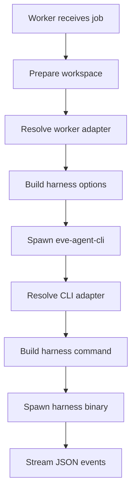
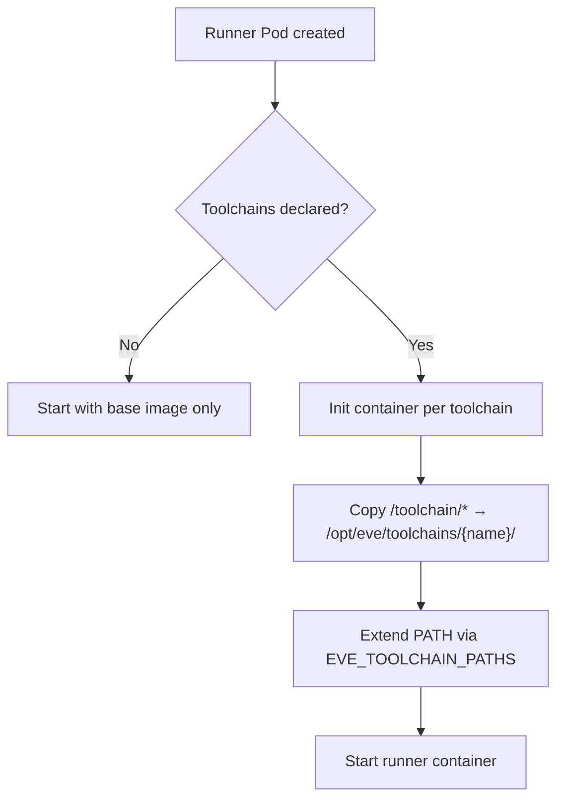

# Harnesses & Workers

Eve executes AI work through **harnesses** -- thin adapters that wrap AI coding CLIs (Claude Code, Gemini CLI, Codex, etc.) behind a uniform invocation contract. **Workers** are the containers that run harnesses. Together they form the execution layer between the orchestrator and the AI models.

## Available harnesses

Each harness wraps a specific AI coding CLI and normalizes its interface for the Eve platform.

| Harness | Binary | Package | Description |
|---------|--------|---------|-------------|
| `mclaude` | `mclaude` | cc-mirror variant | Claude Code with MCP tools and skill installation |
| `claude` | `claude` | @anthropic-ai/claude-code | Official Claude Code CLI |
| `zai` | `zai` | cc-mirror variant | Z.ai provider through Claude Code interface |
| `gemini` | `gemini` | @google/gemini-cli | Google Gemini CLI |
| `code` | `code` | @just-every/code | Every Code CLI (use `coder` alias on host to avoid VS Code clash) |
| `codex` | `codex` | @openai/codex | OpenAI Codex CLI |

:::tip
Do not parse `harness:variant` syntax (e.g., `mclaude:deep`). Use `harness_options.variant` in the job payload instead.
:::

## Invocation flow

Every job attempt follows a two-stage pipeline. The worker never calls harness binaries directly -- it always goes through `eve-agent-cli`, which owns argument construction, permission mapping, and output normalization.


```mermaid
graph TD
  A[Worker receives job] --> B[Prepare workspace]
  B --> C[Resolve worker adapter]
  C --> D[Build harness options]
  D --> E[Spawn eve-agent-cli]
  E --> F[Resolve CLI adapter]
  F --> G[Build harness command]
  G --> H[Spawn harness binary]
  H --> I[Stream JSON events]
```

### Stage 1: Worker (InvokeService)

1. **prepareWorkspace()** -- Create the attempt directory and clone the repository
2. **resolveWorkerAdapter(harness)** -- Look up the `WorkerHarnessAdapter` by harness name
3. **adapter.buildOptions(ctx)** -- Resolve authentication (OAuth tokens, API keys), set config directories, prepare environment variables
4. **executeEveAgentCli(invocation, options)** -- Spawn `eve-agent-cli` with the constructed arguments and stream JSON output to `execution_logs`

### Stage 2: eve-agent-cli

1. **resolveCliAdapter(harness)** -- Look up the `CliHarnessAdapter` by harness name
2. **adapter.buildCommand(ctx)** -- Construct the binary path, CLI arguments, and environment variables. Map the abstract permission policy to harness-specific flags.
3. **spawn(binary, args, &#123;cwd, env&#125;)** -- Run the actual harness CLI and normalize its output to JSON events

### eve-agent-cli arguments

```bash
eve-agent-cli \
  --harness <harness>           # mclaude, claude, zai, gemini, code, codex
  --permission <policy>         # default, auto_edit, never, yolo
  --output-format stream-json
  --workspace <workspacePath>
  --prompt "<text>"
  [--variant <variant>]         # optional harness variant
  [--model <model>]             # optional model override
```

## Adapter architecture

Harness-specific logic is split into per-harness adapter modules at two levels. Both registries use static resolution -- there is no dynamic loading.

### Worker adapters

Located in `apps/worker/src/invoke/harnesses/`. Each adapter exports a `WorkerHarnessAdapter` with a `buildOptions()` method that resolves authentication and configuration for the harness.

### CLI adapters

Located in `packages/eve-agent-cli/src/harnesses/`. Each adapter exports a `CliHarnessAdapter` with a `buildCommand()` method that maps job configuration to harness-specific CLI flags.

### Harness naming and aliases

| Harness | Binary | Aliases | Notes |
|---------|--------|---------|-------|
| `mclaude` | `mclaude` | -- | cc-mirror Claude variant |
| `claude` | `claude` | -- | Official @anthropic-ai/claude-code |
| `zai` | `zai` | -- | cc-mirror Z.ai variant |
| `gemini` | `gemini` | -- | @google/gemini-cli |
| `code` | `code` | `coder` | Use `coder` on host to avoid VS Code binary clash |
| `codex` | `codex` | -- | @openai/codex |

## Worker types

Eve supports multiple worker types, each providing a container image with different toolchain combinations. Jobs request a specific worker via `hints.worker_type`, and the orchestrator routes the job accordingly.

### Image variants

All images are published to public ECR and versioned using git tags (format: `worker-images/vX.Y.Z`).

| Image | ECR Path | Description |
|-------|----------|-------------|
| **base** | `public.ecr.aws/.../worker-base:<version>` | Runtime without toolchains -- Node.js, worker harness, and base utilities only |
| **python** | `public.ecr.aws/.../worker-python:<version>-py3.11` | Python 3.11, pip, uv package manager |
| **rust** | `public.ecr.aws/.../worker-rust:<version>-rust1.75` | Rust 1.75 via rustup, cargo |
| **java** | `public.ecr.aws/.../worker-java:<version>-jdk21` | OpenJDK 21 |
| **kotlin** | `public.ecr.aws/.../worker-kotlin:<version>-kotlin2.0-jdk21` | Kotlin 2.0 + OpenJDK 21 |
| **full** | `public.ecr.aws/.../worker-full:<version>` | All toolchains combined |

The `base` image (~800 MB) is the default for both staging and local development. Override via `EVE_WORKER_VARIANT` (e.g., `EVE_WORKER_VARIANT=full` for the combined image). Each variant is built independently to optimize build caching and image size.

### Toolchain-on-demand

Most agent jobs only need Node.js and AI harness binaries, all of which are included in the `base` image. When a job does need a language toolchain, Eve injects it at pod creation time through Kubernetes init containers rather than shipping a single large image.


```mermaid
graph TD
  A[Runner Pod created] --> B{Toolchains declared?}
  B -- No --> C[Start with base image only]
  B -- Yes --> D[Init container per toolchain]
  D --> E["Copy /toolchain/* → /opt/eve/toolchains/{name}/"]
  E --> F[Extend PATH via EVE_TOOLCHAIN_PATHS]
  F --> G[Start runner container]
```

Each init container runs a small, single-purpose image that copies its payload into a shared `emptyDir` volume at `/opt/eve/toolchains/{name}/`. The runner entrypoint then prepends those paths to `PATH` and sources any `env.sh` files the toolchain ships (for example, Rust sets `RUSTUP_HOME` and `CARGO_HOME`).

#### Available toolchains

| Toolchain | Contents | Notes |
|-----------|----------|-------|
| `python` | Python 3, pip, uv | Sets up `python3` and `uv` in PATH |
| `media` | ffmpeg, ffprobe, whisper-cli, ggml-small.en model | For audio/video processing |
| `rust` | Rust stable via rustup, cargo, rustfmt, clippy | Sets `RUSTUP_HOME` and `CARGO_HOME` |
| `java` | Temurin JDK 21 | Sets `JAVA_HOME` |
| `kotlin` | Kotlin 2.0 + JDK 21 | Bundles its own JDK; sets `JAVA_HOME` |

#### Declaring toolchains in agent config

Agents declare which toolchains they need in the agent configuration. The orchestrator resolves these at job creation time and passes them to the runner pod.

```yaml
# eve/agents.yaml
version: 1
agents:
  data-analyst:
    name: Data Analyst
    skill: analyze-data
    harness_profile: claude-sonnet
    toolchains: [python]

  doc-processor:
    name: Document Processor
    skill: process-documents
    harness_profile: claude-sonnet
    toolchains: [media]

  full-stack:
    name: Full Stack Dev
    skill: full-stack-dev
    harness_profile: claude-opus
    toolchains: [python, rust, java]
```

Workflows can override the agent default per step:

```yaml
# eve/workflows.yaml
steps:
  - name: process
    agent: doc-processor
    toolchains: [media, python]   # overrides agent default
```

When no `toolchains` field is present, the job runs on the base image with no init containers.

#### Why init containers over fat images

| Concern | Fat image (`full`, 2.6 GB) | Base + init containers |
|---------|---------------------------|------------------------|
| Node disk pressure | 2.6 GB cached per version | 800 MB base + 50--300 MB per toolchain |
| Cold pull time | ~45 s | ~15 s base + ~5 s per toolchain |
| Toolchain update | Rebuild and repull 2.6 GB | Repull only the changed toolchain |
| Kubelet GC | All-or-nothing 2.6 GB blob | Small images GC'd independently |

The `full` image remains available via `EVE_WORKER_VARIANT=full` for cases where every toolchain is needed.

### Worker routing

The orchestrator uses `EVE_WORKER_URLS` to map worker type names to service URLs:

```
EVE_WORKER_URLS=default-worker=http://worker:4811,python-worker=http://worker-python:4811,rust-worker=http://worker-rust:4811
```

| Worker type | Routes to | Image |
|-------------|-----------|-------|
| `default-worker` | `worker` service | base (or per `EVE_WORKER_VARIANT`) |
| `python-worker` | `worker-python` service | python variant |
| `rust-worker` | `worker-rust` service | rust variant |
| `java-worker` | `worker-java` service | java variant |
| `kotlin-worker` | `worker-kotlin` service | kotlin variant |

If a job specifies a worker type not present in `EVE_WORKER_URLS`, it fails early with a clear error.

### Requesting a worker type

```bash
eve job create \
  --project proj_xxx \
  --description "Run Python tests" \
  --worker-type python-worker
```

When no `worker_type` is specified, the orchestrator uses `default-worker`.

### Adding a new worker type

To add a custom worker type (for example, a Playwright worker for browser testing):

**1. Add a worker service.**

For Kubernetes, duplicate the worker deployment and service in `k8s/base/worker.yaml`. Give it a new name (e.g., `worker-playwright`) and a unique service port. For Docker Compose, duplicate the `worker` service in `docker-compose.yml`.

**2. Update the routing map.**

Add the new worker to `EVE_WORKER_URLS` in the orchestrator service configuration:

```
EVE_WORKER_URLS=...,playwright-worker=http://worker-playwright:4811
```

**3. Create jobs targeting the worker.**

```bash
eve job create \
  --project proj_xxx \
  --description "Run UI checks" \
  --worker-type playwright-worker
```

:::tip
All worker services must mount the same workspace and skill pack volumes. Docker Compose and Kubernetes worker services use port 4811 by default.
:::

### Building worker images locally

Worker images can be built locally for development and testing. The build system supports individual variants or all variants at once:

```bash
# Build a specific variant
eh worker-image build --variant python

# Build the full variant (all toolchains)
eh worker-image build --variant full
```

For smaller images, disable specific AI harnesses:

```bash
# Build with only Claude Code (saves ~800MB)
eh worker-image build --variant full -- \
  --build-arg INSTALL_CODEX=false \
  --build-arg INSTALL_GEMINI=false \
  --build-arg INSTALL_CODE=false
```

After building, import images into a local k3d cluster with `eh k8s-image push --worker-only`.

## Workspace structure

Each job attempt gets an isolated workspace directory. The harness runs with `cwd` set to the repository root so it can see project files.

```
$WORKSPACE_ROOT/                     # e.g., /opt/eve/workspaces
  {attemptId}/                       # unique per attempt
    repo/                            # cloned/copied repository
      AGENTS.md                      # project memory for agents
      CLAUDE.md                      # Claude-specific instructions
      .agents/skills/                # installed skills (gitignored)
      .agents/harnesses/<harness>/   # per-harness config (optional)
```

| Variable | Value | Description |
|----------|-------|-------------|
| `workspacePath` | `$WORKSPACE_ROOT/{attemptId}` | Root workspace for this attempt |
| `repoPath` | `$workspacePath/repo` | Cloned repository location |
| `cwd` (harness) | `$repoPath` | Working directory for harness execution |

### Environment contract

All worker images enforce a deterministic environment contract to ensure consistent behavior across local development, Kubernetes, and Docker Compose deployments.

**User and directory structure:**

| Variable | Value | Purpose |
|----------|-------|---------|
| `EVE_RUN_AS_UID` | `1000` | User ID for running processes |
| `EVE_RUN_AS_GID` | `1000` | Group ID for running processes |
| `EVE_HOME` | `/home/node` | Home directory for the node user |
| `EVE_WORKSPACE_ROOT` | `/opt/eve/workspaces` | Root for all workspace mounts |
| `EVE_CACHE_ROOT` | `/opt/eve/cache` | Shared cache for package managers |
| `EVE_STATE_ROOT` | `/opt/eve/state` | Root for persistent state |
| `EVE_TOOLCHAIN_ROOT` | `/opt/eve/toolchains` | Root for installed toolchains |

**Cache routing:** Tool-specific caches are redirected to the shared cache root so they survive across attempts:

| Variable | Value |
|----------|-------|
| `XDG_CACHE_HOME` | `/opt/eve/cache` |
| `NPM_CONFIG_CACHE` | `/opt/eve/cache/npm` |
| `PNPM_HOME` | `/opt/eve/cache/pnpm` |
| `PIP_CACHE_DIR` | `/opt/eve/cache/pip` |
| `UV_CACHE_DIR` | `/opt/eve/cache/uv` |
| `CCACHE_DIR` | `/opt/eve/cache/ccache` |

Processes run as UID 1000 (non-root). The entrypoint verifies all required paths are writable and fails fast if any permission check fails. On Kubernetes, runner pods use `runAsUser: 1000` / `fsGroup: 1000` to enforce correct ownership on volume mounts.

## Shared invoke module

The worker and agent-runtime share a common invoke module at `packages/shared/src/invoke/`. This module is the single source of truth for all agent-execution logic -- both services import from it, and new features are added here once rather than duplicated.

### What the shared module provides

| Module | Capabilities |
|--------|-------------|
| `budget-enforcement` | Per-job token and cost budgets, `llm.call` tracking, automatic kill on overshoot |
| `carryover-context` | Memory, org docs, and parent-job attachments materialized into the workspace |
| `security-policy` | Security `CLAUDE.md` generation and placement into `CLAUDE_CONFIG_DIR` |
| `eve-message-relay` | Bidirectional message relay for coordination threads and chat delivery |
| `workspace-secrets` | Secret resolution, git auth, materialization, and cleanup |
| `workspace-hooks` | Acquire and release hooks (e.g., `on-clone`, skill installation) |
| `result-extraction` | Result text, JSON, token usage, and structured error extraction (including Codex formats) |
| `harness-lifecycle` | Start/end lifecycle events with harness name, model, and duration |
| `resource-hydration` | Resource hydration with typed events |
| `coordination` | Coordination inbox and thread context |
| `git-utils` | Git operations, local repo path resolution, attempt metadata |
| `eve-credentials` | Eve CLI credential writing (supports per-job isolated HOME) |
| `job-user-home` | Per-job HOME directory creation and cleanup |

All capabilities listed above are available in both the worker and the agent-runtime. Agent jobs (which route to agent-runtime) have full access to budget enforcement, carryover context, security policy, message relay, and workspace secrets -- the same set of features available in the worker.

### Per-job HOME isolation

Each job attempt gets its own isolated HOME directory so that credential files -- Eve CLI auth, GitHub CLI tokens, harness configs -- are scoped to the job and invisible to other concurrent jobs.

```
/tmp/eve/agent-homes/<attemptId>/home/
  .config/eve/         # Eve CLI credentials
  .config/gh/          # GitHub CLI auth
  .claude/             # Claude config
  .eve/harnesses/      # Harness config
```

The harness process runs with `HOME` overridden to this directory and `EVE_JOB_USER_HOME` set to the same path. Credential writers (e.g., `writeEveCredentials`) target the isolated home when it is present. The directory is cleaned up after the attempt completes.

## Permission policies

Each harness maps the abstract permission policy to its own CLI flags. The policy controls what the agent is allowed to do with the file system and external tools.

| Policy | mclaude / claude / zai | gemini | code / codex |
|--------|----------------------|--------|-------------|
| `default` | `--permission-mode default` | `--approval-mode default` | `--ask-for-approval on-request` |
| `auto_edit` | `--permission-mode acceptEdits` | `--approval-mode auto_edit` | `--ask-for-approval on-failure` |
| `never` | `--permission-mode dontAsk` | (fallback to default) | `--ask-for-approval never` |
| `yolo` | `--dangerously-skip-permissions` | `--yolo` | `--ask-for-approval never` |

Sandbox flags are applied automatically by `eve-agent-cli`:

- **Claude / mclaude / zai:** `--add-dir <workspace>`
- **Code / Codex:** `--sandbox workspace-write -C <workspace>`
- **Gemini:** `--sandbox`

Set the policy on a job via `hints.permission_policy`:

```bash
eve job create \
  --project proj_xxx \
  --description "Refactor auth module" \
  --hints '{"permission_policy": "auto_edit"}'
```

## Harness profiles

Projects define named profiles under `x-eve.agents` in the manifest. Profiles decouple job definitions from specific harness choices, making it easy to swap providers or models without changing job configuration.

```yaml
# .eve/manifest.yaml
x-eve:
  agents:
    version: 1
    availability:
      drop_unavailable: true
    profiles:
      primary-orchestrator:
        - harness: mclaude
          model: opus-4.5
          reasoning_effort: high
      primary-coder:
        - harness: codex
          model: gpt-5.2-codex
          reasoning_effort: high
      primary-reviewer:
        - harness: mclaude
          model: opus-4.5
          reasoning_effort: high
        - harness: codex
          model: gpt-5.2-codex
          reasoning_effort: x-high
      planning-council:
        - profile: primary-planner
```

### Profile fields

| Field | Type | Description |
|-------|------|-------------|
| `harness` | string | Harness name (`mclaude`, `claude`, `zai`, `gemini`, `code`, `codex`) |
| `model` | string | Model identifier (e.g., `opus-4.5`, `gpt-5.2-codex`) |
| `reasoning_effort` | string | Reasoning level: `low`, `medium`, `high`, `x-high` |
| `profile` | string | Reference another profile by name (for composition) |

### Availability policy

When `drop_unavailable: true` is set, entries for harnesses that are not currently authenticated or available are silently dropped from profiles. This lets you define fallback chains where the first available harness is used.

### Using profiles in jobs

Reference a profile by name in `harness_profile`:

```json
{
  "harness": "mclaude",
  "harness_profile": "primary-reviewer",
  "harness_options": {
    "variant": "deep",
    "model": "opus-4.5",
    "reasoning_effort": "high"
  }
}
```

Skills should always reference profiles rather than hardcoding specific harnesses.

### Profile resolution for chat-routed jobs

Harness profiles are resolved for all job creation paths, including chat-routed jobs. When a message arrives through the chat gateway, Eve resolves the `harness_profile` name to a concrete harness and `harness_options` using the project manifest's `x-eve.agents.profiles` section. This applies to:

- Direct agent routing (gateway message to agent target)
- Team lead and coordinator parent jobs
- Team relay and fanout member child jobs
- Direct slug routing (`routeMessageToAgent`)

Profiles defined in agent packs are also resolved correctly. The agent sync process stores the resolved `x-eve` YAML alongside the agent config, and profile resolution checks the agent config first with a manifest fallback for backward compatibility.

## Model selection

### Job-level model override

Jobs can override the model via `harness_options.model`:

```json
{
  "harness": "mclaude",
  "harness_options": {
    "model": "opus-4.5"
  }
}
```

### Default model resolution

If no model is specified, each harness falls back to its default:

| Harness | Model env var | Fallback |
|---------|--------------|----------|
| `mclaude` / `claude` | `CLAUDE_MODEL` | `opus` |
| `zai` | `ZAI_MODEL`, then `CLAUDE_MODEL` | -- |
| `gemini` | -- | Gemini default |
| `code` / `codex` | -- | Provider default |

### Reasoning effort

Jobs pass `harness_options.reasoning_effort` to control how deeply the model reasons:

| Harness family | Mechanism | Notes |
|---------------|-----------|-------|
| mclaude / claude / zai | Thinking tokens | Maps effort level to token budget |
| code / codex | `--reasoning` flag | Passes effort level as CLI flag |
| gemini | Passthrough | Effort level passed directly |

Available levels: `low`, `medium`, `high`, `x-high`.

## Authentication

Each harness family has its own authentication mechanism. The worker resolves credentials before spawning the harness.

### Claude-based harnesses (mclaude, claude, zai)

**Priority order:**

1. `ANTHROPIC_API_KEY` -- if set, used directly; OAuth is skipped
2. OAuth tokens (`CLAUDE_CODE_OAUTH_TOKEN` + `CLAUDE_OAUTH_REFRESH_TOKEN`)

OAuth tokens are refreshed automatically with a 5-minute buffer before expiry. Refreshed tokens are cached in-memory for the worker process lifetime.

Credentials are written to `~/.claude/.credentials.json` by the container entrypoint.

### Zai harness

Requires `Z_AI_API_KEY`. The worker maps this to `ANTHROPIC_API_KEY` when spawning the zai process.

### Gemini harness

Uses `GEMINI_API_KEY` or `GOOGLE_API_KEY`. No special credential setup required.

### Code / Codex harnesses

Use OpenAI OAuth credentials written to `~/.code/auth.json` and `~/.codex/auth.json` by the container entrypoint.

Eve does not auto-refresh Code/Codex tokens. Re-authenticate with `codex auth` or `code auth`, then run `./bin/eh auth extract --save` to update secrets.

## Per-harness configuration

Harness configuration is read from a single root directory with per-harness subfolders:

```
.agents/harnesses/
  <harness>/
    config.toml|json|yaml
    variants/
      <variant>/
        config.toml|json|yaml
```

**Resolution order:**

1. `EVE_HARNESS_CONFIG_ROOT` (if set) -- `<root>/<harness>`
2. `<repo>/.agents/harnesses/<harness>` (in-repo default)
3. `${XDG_CONFIG_HOME:-~/.config}/eve/harnesses/<harness>` (XDG user config)
4. `~/.cc-mirror/harnesses/<harness>` (cc-mirror legacy path)
5. `/etc/eve/harnesses/<harness>` (system fallback)

If a `variants/<variant>` directory exists, it overlays the base config directory.

### Per-harness CLI arguments

**mclaude / claude:**

```bash
mclaude --print --verbose --output-format stream-json \
  --model opus --permission-mode default "<prompt>"
```

**zai:**

```bash
zai --print --verbose --output-format stream-json \
  --model <model> --permission-mode default "<prompt>"
```

**gemini:**

```bash
gemini --output-format stream-json \
  --model <model> --approval-mode default "<prompt>"
```

**code / codex:**

```bash
code --ask-for-approval on-request --model <model> \
  --profile <variant> exec --json --skip-git-repo-check "<prompt>"
```

## Execution logging

All harness output is logged to the `execution_logs` table with typed entries:

| Type | Description |
|------|-------------|
| `event` | Normalized harness event (assistant, tool_use, tool_result, etc.) |
| `system` | System events (init, completed) |
| `system_error` | Stderr output |
| `parse_error` | Failed to parse JSON line from harness |
| `spawn_error` | Failed to spawn harness process |

### Usage events

Harnesses emit `llm.call` events after each provider call with usage-only metadata (token counts, model identifiers, timing). These events are stored in `execution_logs` and used to assemble receipts and enforce per-job budgets. No prompt or response content is included.

## CLI commands

### List harnesses

```bash
eve harness list
```

Shows all available harnesses and their authentication status. See [eve harness list](/docs/reference/cli-appendix#eve-harness-list).

### List harnesses with capabilities

```bash
eve harness list --capabilities
```

Shows harnesses with model support, reasoning capabilities, and available variants.

### View project agent config

```bash
eve agents config --json
```

Displays the project's harness policy, profile definitions, and resolved availability. See [eve agents config](/docs/reference/cli-appendix#eve-agents-config).

### Harness auth status (API)

```
GET /harnesses
GET /harnesses/{name}
```

Returns harness details including auth availability, supported variants, and capabilities:

```json
{
  "name": "mclaude",
  "aliases": [],
  "description": "Claude Code with MCP tools",
  "variants": [
    { "name": "default", "description": "Standard variant", "source": "config" }
  ],
  "auth": {
    "available": true,
    "reason": "OAuth credentials present",
    "instructions": []
  },
  "capabilities": {
    "supports_model": true,
    "model_examples": ["opus-4.5"],
    "reasoning": {
      "supported": true,
      "levels": ["low", "medium", "high", "x-high"],
      "mode": "thinking_tokens"
    }
  }
}
```
