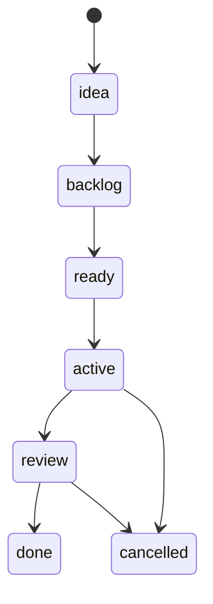

# Job API

Jobs are the fundamental unit of work in Eve. This reference covers the job lifecycle, scheduling hints, and the full REST API.

## Job lifecycle



## Creating a job

```bash
eve job create --prompt "Review the auth module" --env staging
```

## Job phases

Jobs progress through defined phases: idea, backlog, ready, active, review, done, cancelled.

## Scheduling hints

Control execution with hints for resource class, max cost, max tokens, and permission policies.
