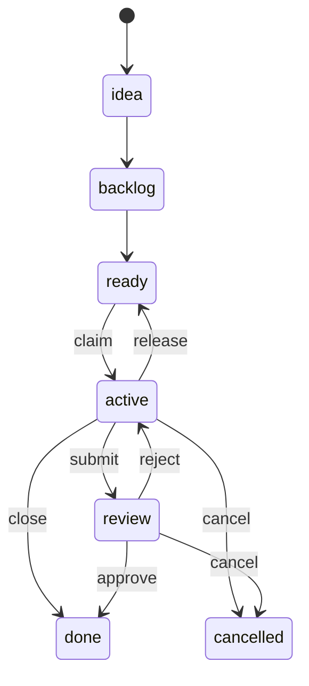

# Job API

Jobs are the fundamental unit of work in Eve Horizon. Every task -- from fixing a bug to running a deployment pipeline -- is a job. Jobs are created with a description (the work prompt), progress through a phase-based lifecycle, and are executed by AI agents via harnesses.

This page covers the complete job API: lifecycle, creation, context, control signals, git controls, and REST endpoints.

## Entity Model

```
Job -> JobAttempt -> Session -> ExecutionProcess
```

- **Job** -- the logical unit of work. ID format: `{slug}-{hash8}` (e.g., `myproj-a3f2dd12`).
- **JobAttempt** -- an isolated execution run. Has a UUID `id` plus a job-scoped `attempt_number` (1, 2, 3...).
- **Session** -- tracks the executor within an attempt. May change on reconstruction; `attempt_id` remains stable.
- **ExecutionProcess** -- a single harness invocation within a session.

### ID Formats

| Entity | Format | Example |
|--------|--------|---------|
| Organization | `org_{base32}` | `org_01H455VBFQG3GRPZXYXR8TJKM` |
| Project | `proj_{base32}` | `proj_01H455VBFQG3GRPZXYXR8TJKM` |
| Root job | `{slug}-{hash8}` | `myproj-a3f2dd12` |
| Child job | `{parent}.{n}` | `myproj-a3f2dd12.1` |
| Attempt | UUID + `attempt_number` | `attempt_number: 2` |

Projects have a short `slug` (4-8 chars) used for job IDs. Child jobs append a numeric suffix to the parent. Maximum depth: 3 levels.

## Job Lifecycle

Jobs progress through these phases:



| Phase | Description |
|-------|-------------|
| `idea` | Captured but not yet planned |
| `backlog` | Planned but not yet prioritized for execution |
| `ready` | Schedulable -- the scheduler can claim and execute this job |
| `active` | Currently being executed by an agent |
| `review` | Execution complete, awaiting review |
| `done` | Work accepted and finalized |
| `cancelled` | Abandoned or superseded |

Jobs default to `ready` phase, making them immediately schedulable. Priority ranges from 0 (highest) to 4 (lowest), defaulting to 2.

### Scheduling Order

The scheduler selects ready jobs in this order:

1. Filter: `phase = ready` AND all blocking dependencies are `done`
2. Sort by priority (ascending -- P0 first)
3. Sort by `created_at` (FIFO within the same priority)

## Creating a Job

### Request

```bash
eve job create --description "Fix the login bug in auth.ts"
```

The only required field is `description` -- the work prompt. Everything else has sensible defaults.

```typescript
interface CreateJobRequest {
  // Required
  description: string;

  // Identity
  title?: string;               // auto-generated from description if omitted
  issue_type?: string;          // task, bug, feature, epic, chore (default: task)
  labels?: string[];
  parent_id?: string | null;    // parent job ID for sub-jobs

  // Scheduling
  phase?: string;               // default: ready
  priority?: number;            // 0-4 (default: 2)
  assignee?: string | null;
  review_required?: string;     // none, human, agent (default: none)
  defer_until?: string | null;  // ISO 8601 -- hide until this date
  due_at?: string | null;       // ISO 8601 deadline

  // Harness selection
  harness?: string;             // e.g., mclaude, codex, gemini
  harness_profile?: string;     // profile from x-eve.agents
  harness_variant?: string;     // config overlay preset
  model?: string;               // model override
  reasoning_effort?: string;    // low, medium, high, x-high

  // Scheduling hints
  hints?: {
    worker_type?: string;       // e.g., default, gpu
    permission_policy?: string; // yolo (default), auto_edit, never
    timeout_seconds?: number;
    resource_class?: string;    // compute SKU (e.g., job.c1, job.c2)
    max_cost?: { currency: string; amount: number };
    max_tokens?: number;
  };

  // Git + workspace controls
  git?: GitControls;
  workspace?: WorkspaceControls;

  // Execution targeting
  env_name?: string | null;
  execution_mode?: string;      // persistent | ephemeral
}
```

### Manifest Defaults

If the project has a synced manifest with `x-eve.defaults`, those defaults are merged on create. Explicit job fields override defaults. The precedence chain is:

1. Explicit job fields (from CLI flags or API body)
2. `x-eve.defaults` from the manifest
3. Project defaults (e.g., default branch)

### Response

```typescript
interface JobResponse {
  id: string;                   // e.g., myproj-a3f2dd12
  project_id: string;
  parent_id?: string | null;
  depth: number;
  title: string;
  description: string | null;
  issue_type: string;
  labels: string[];
  phase: string;
  priority: number;
  assignee?: string | null;
  review_required: string;
  review_status?: string | null;
  hints?: Record<string, unknown>;
  git?: Record<string, unknown> | null;
  resolved_git?: ResolvedGitMetadata | null;
  workspace?: Record<string, unknown> | null;
  env_name?: string | null;
  execution_mode?: string;
  created_at: string;
  updated_at: string;
  closed_at?: string | null;
  close_reason?: string | null;
}
```

### Minimal Example

```bash
eve job create --description "Fix the login bug on mobile"
```

The API also accepts a minimal JSON body:

```json
{
  "description": "Fix the login bug on mobile"
}
```

## Job Context

The context endpoint returns the full job state enriched with derived fields for orchestration.

**Endpoint:** `GET /jobs/{job_id}/context`
**CLI:** `eve job current [<job-id>] [--json|--tree]`

Defaults to `EVE_JOB_ID` when no job ID is provided.

### Response Shape

```json
{
  "job": { ... },
  "parent": { ... },
  "children": [ ... ],
  "relations": {
    "dependencies": [ ... ],
    "dependents": [ ... ],
    "blocking": [ ... ]
  },
  "latest_attempt": { ... },
  "latest_rejection_reason": "...",
  "blocked": false,
  "waiting": false,
  "effective_phase": "active"
}
```

### Derived Fields

| Field | Description |
|-------|-------------|
| `blocked` | `true` when the job has unresolved blocking relations |
| `waiting` | `true` when the latest attempt returned `result_json.eve.status == "waiting"` |
| `effective_phase` | Display phase: `blocked` > `waiting` > `job.phase` |

Use `effective_phase` for display and orchestration decisions instead of the raw `phase`.

## Control Signals

Harnesses signal outcomes to the platform by emitting a fenced `json-result` block. The worker extracts the **last** such block from harness output and stores it as `job_attempts.result_json`.

````
```json-result
{
  "eve": {
    "status": "waiting",
    "summary": "Spawned 3 child jobs and added waits_for relations",
    "reason": "Waiting on child jobs to complete"
  }
}
```
````

### Status Values

| Status | Behavior |
|--------|----------|
| `success` | Normal success path. If `review_required` is set, job moves to `review`; otherwise moves to `done`. |
| `waiting` | Attempt completes as succeeded. Job is requeued to `ready`, assignee is cleared. No review submission. |
| `failed` | Normal failure path. Job may be retried or cancelled. |

When `waiting` is returned without blockers, the orchestrator applies a short `defer_until` backoff to prevent tight reschedule loops.

The `eve.summary` field (when present) is persisted to `job_attempts.result_summary` for quick visibility.

## Git Controls

Job-level git configuration governs ref resolution, branch creation, commit policy, and push behavior.

### Configuration

```yaml
# These can be set on the job or as x-eve.defaults in the manifest
git:
  ref: main                          # branch, tag, or SHA
  ref_policy: auto                   # auto | env | project_default | explicit
  branch: job/${job_id}              # branch to create/checkout
  create_branch: if_missing          # never | if_missing | always
  commit: auto                       # never | manual | auto | required
  commit_message: "job/${job_id}: ${summary}"
  push: on_success                   # never | on_success | required
  remote: origin

workspace:
  mode: job                          # job | session | isolated
  key: "session:${session_id}"
```

:::warning Not Yet Implemented
Workspace reuse is not yet implemented. Today every attempt gets a fresh workspace.
The `mode` and `key` fields are reserved for future use.
:::

### Ref Resolution (`ref_policy`)

| Policy | Behavior |
|--------|----------|
| `auto` | Use environment release SHA (if `env_name` set) -> manifest defaults -> project default branch |
| `env` | Requires `env_name` and a current release SHA |
| `project_default` | Always uses `project.branch` |
| `explicit` | Requires `git.ref` to be set |

### Branch Creation (`create_branch`)

| Value | Behavior |
|-------|----------|
| `never` | Branch must already exist |
| `if_missing` | Create only when missing (default when `branch` is set) |
| `always` | Reset branch to `ref` |

### Commit Policy (`commit`)

| Value | Behavior |
|-------|----------|
| `never` | No commits |
| `manual` | Agent decides when to commit (default) |
| `auto` | Worker runs `git add -A` + commit after execution, even on failure |
| `required` | On success, fail the attempt if the working tree is clean |

### Push Policy (`push`)

| Value | Behavior |
|-------|----------|
| `never` | No push (default) |
| `on_success` | Push only when the worker created commits in this attempt |
| `required` | Attempt push; no-op if no commits. Fail if push fails. |

Push without git credentials fails fast with a remediation hint.

### Precedence

1. Explicit job fields (`--git-ref`, `--git-branch`, etc.)
2. `x-eve.defaults.git` from the manifest
3. Project defaults (`project.branch`)

### Audit Metadata

Resolved git state is stored on each attempt for debugging:

```json
{
  "resolved_ref": "refs/heads/main",
  "resolved_sha": "abc123def456...",
  "resolved_branch": "job/myproj-a3f2dd12",
  "ref_source": "env_release",
  "pushed": true,
  "commits": ["def456abc789..."]
}
```

This metadata is also promoted to `JobResponse.resolved_git` from the latest successful attempt.

### Repo Auth

- **HTTPS**: uses `github_token` secrets (e.g., `GITHUB_TOKEN`)
- **SSH**: uses `ssh_key` secrets via `GIT_SSH_COMMAND`
- Missing auth fails fast with remediation hints (`eve secrets set`)

## Parent-Child Relationships

Jobs form hierarchies via `parent_id`:

```bash
# Create a child job
eve job create --parent myproj-a3f2dd12 --description "Implement token refresh"

# View the hierarchy
eve job tree myproj-a3f2dd12
```

- Child IDs use `{parent}.{n}` format (e.g., `myproj-a3f2dd12.1`)
- Maximum depth: 3 levels
- Enables "spawn sub-jobs from current work" orchestration patterns

## Dependencies

Jobs can declare blocking dependencies. The scheduler respects these when selecting ready jobs.

```bash
# Add a dependency: deploy-job depends on build-job
eve job dep add myproj-deploy myproj-build

# List dependencies
eve job dep list myproj-deploy

# Remove a dependency
eve job dep remove myproj-deploy myproj-build
```

Relation types: `blocked_by`, `blocks`, `waits_for`, `conditional_blocks`.

A job cannot transition to `active` until all `blocked_by` jobs are `done`.

## Review Workflow

Jobs with `review_required` set go through a review cycle:

```bash
# Agent submits work for review (requires summary)
eve job submit myproj-abc123 --summary "Implemented fix, added tests"

# Reviewer approves
eve job approve myproj-abc123 --comment "LGTM"

# Or rejects (creates a new attempt)
eve job reject myproj-abc123 --reason "Missing error handling for timeout case"
```

| Action | Required Fields | Effect |
|--------|----------------|--------|
| `submit` | `summary` | Moves job to `review` phase |
| `approve` | (optional `comment`) | Moves job to `done` |
| `reject` | `reason` | Moves job back to `active` with a new attempt |

## Resource Refs

Attach org documents or job attachments to a job. The worker hydrates them into `.eve/resources/` before harness launch.

```bash
eve job create --description "Review the approved plan" \
  --resource-refs='[{
    "uri": "org_docs:/pm/features/FEAT-123.md@v4",
    "required": true,
    "mount_path": "pm/brief.md",
    "label": "Approved Plan"
  }]'
```

| Field | Required | Description |
|-------|----------|-------------|
| `uri` | Yes | `org_docs:/path[@vN]` or `job_attachments:/job_id/name` |
| `label` | No | Human-readable label |
| `required` | No | Fail provisioning when missing (default: `true`) |
| `mount_path` | No | Relative path under `.eve/resources/` |

The worker writes `.eve/resources/index.json` and injects `EVE_RESOURCE_INDEX` for agents.

## Attachments

```bash
# Attach a file to a job
eve job attach myproj-abc123 --file ./report.pdf --name report.pdf

# Attach from stdin
eve job attach myproj-abc123 --stdin --name output.json --mime application/json

# List and fetch attachments
eve job attachments myproj-abc123
eve job attachment myproj-abc123 report.pdf
```

## Execution Receipts

Each attempt can include a persisted receipt with timing and cost details, assembled from execution log events.

```bash
# Get latest receipt
eve job result myproj-abc123

# Compare two attempts
# GET /jobs/{job_id}/compare?a=1&b=2
```

Receipts include:
- **timing** -- billable milliseconds, phase durations
- **llm** -- input/output/cache/reasoning token counts
- **cost** -- `base_cost_usd` and `billed_cost` totals

## Coordination Threads

Team dispatches create coordination threads with key `coord:job:{parent_job_id}`. The thread ID is stored in `hints.coordination.thread_id`.

Child agents receive `EVE_PARENT_JOB_ID` to derive the coordination key. On attempt completion, the orchestrator auto-posts a status summary to the thread.

```bash
# Supervise child events (used by lead agents)
eve supervise --timeout 60

# Read and post to coordination threads
eve thread messages thr_xxx --since 5m
eve thread post thr_xxx --body '{"kind":"directive","body":"focus on auth"}'
```

Message kinds: `status` (auto summary), `directive` (lead to member), `question` (member to lead), `update` (progress).

The worker regenerates `.eve/coordination-inbox.md` from recent thread messages at job start.

## Agent Environment Variables

These variables are injected by the worker during job execution:

| Variable | Description |
|----------|-------------|
| `EVE_PROJECT_ID` | Current project ID |
| `EVE_JOB_ID` | Current job ID |
| `EVE_ATTEMPT_ID` | Current attempt UUID |
| `EVE_AGENT_ID` | Agent identifier |
| `EVE_PARENT_JOB_ID` | Parent job ID (for coordination) |
| `EVE_RESOURCE_INDEX` | Path to `.eve/resources/index.json` (when resource refs are used) |

## REST API Endpoints

### Project-Scoped

```
POST /projects/{project_id}/jobs              Create job
GET  /projects/{project_id}/jobs              List jobs
GET  /projects/{project_id}/jobs/ready        Ready/schedulable jobs
GET  /projects/{project_id}/jobs/blocked      Blocked jobs
```

### Admin (Cross-Project)

```
GET /jobs                                      List jobs (admin view)
```

### Job-Scoped

```
GET    /jobs/{job_id}                          Get job
PATCH  /jobs/{job_id}                          Update job
GET    /jobs/{job_id}/tree                     Job hierarchy
GET    /jobs/{job_id}/context                  Context + derived status
GET    /jobs/{job_id}/dependencies             List dependencies
POST   /jobs/{job_id}/dependencies             Add dependency
DELETE /jobs/{job_id}/dependencies/{related}   Remove dependency
```

### Threads

```bash
GET    /orgs/{org_id}/threads                              List threads
POST   /orgs/{org_id}/threads                              Create thread
GET    /orgs/{org_id}/threads/{thread_id}                   Get thread details
GET    /orgs/{org_id}/threads/{thread_id}/messages          List messages
POST   /orgs/{org_id}/threads/{thread_id}/messages          Post message
GET    /threads/{thread_id}/follow                           Stream messages (SSE)
POST   /orgs/{org_id}/threads/{thread_id}/distill           Distill into org docs
```

### Claim, Release, Attempts

```
POST /jobs/{job_id}/claim                      Claim (creates attempt, moves to active)
POST /jobs/{job_id}/release                    Release attempt (returns to ready)
GET  /jobs/{job_id}/attempts                   List attempts
GET  /jobs/{job_id}/attempts/{n}/logs          Attempt logs
GET  /jobs/{job_id}/attempts/{n}/stream        SSE log stream for attempt
```

### Monitoring

```
GET /jobs/{job_id}/result                      Latest or attempt-specific result (?attempt=N)
GET /jobs/{job_id}/wait                        Block until completion (SSE, default 300s)
GET /jobs/{job_id}/stream                      SSE log stream for job
GET /jobs/{job_id}/receipt                     Execution receipt (?attempt=N)
GET /jobs/{job_id}/attempts/{id}/receipt       Receipt by attempt ID
GET /jobs/{job_id}/compare                     Compare two attempts (?a=1&b=2)
```

### Review

```
POST /jobs/{job_id}/submit                     Submit for review (requires summary)
POST /jobs/{job_id}/approve                    Approve (optional comment)
POST /jobs/{job_id}/reject                     Reject (requires reason)
```

### Wait Exit Codes

When using `eve job wait`:

| Exit Code | Meaning |
|-----------|---------|
| `0` | Job completed successfully |
| `1` | Job failed |
| `124` | Timeout reached |
| `125` | Job was cancelled |

## See Also

- [CLI Commands](/docs/reference/cli-commands) -- `eve job` command overview
- [Manifest Schema](/docs/reference/manifest-schema) -- `x-eve.defaults` for job defaults
- [Pipelines](/docs/reference/pipelines) -- how pipeline steps expand into jobs
