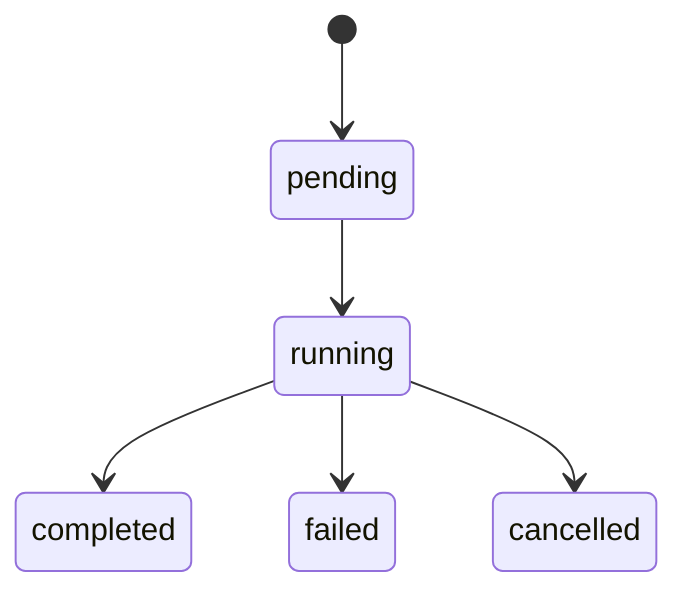

# Pipelines Reference

Pipelines are ordered steps defined in `.eve/manifest.yaml` that expand into job graphs at runtime. Each step becomes a job. Dependencies between steps are honored, and independent steps run in parallel. This page is the complete reference for pipeline schema, step types, actions, triggers, and execution semantics.

## Pipeline schema

```yaml
pipelines:
  <name>:
    trigger:
      <trigger-config>       # Optional: auto-trigger on events
    steps:
      - name: <step-name>    # Required: unique within the pipeline
        action: { ... }      # One of: action, script, agent, run
        depends_on: [...]     # Optional: list of step names
```

A pipeline must have at least one step. Each step must specify exactly one execution type: `action`, `script`, `agent`, or `run`.

## Step types

### Action steps

Action steps invoke built-in platform operations.

```yaml
- name: build
  action:
    type: build
```

Actions are the workhorses of pipelines — they handle building images, creating releases, deploying to environments, and more.

### Script steps

Script steps execute shell commands via the worker.

```yaml
- name: unit-tests
  script:
    run: "pnpm test"
    timeout: 1800           # Timeout in seconds (optional)
```

The `run` field contains the command. The `timeout` field (in seconds) controls how long the worker waits before killing the process.

### Agent steps

Agent steps create AI agent jobs driven by a prompt.

```yaml
- name: diagnose
  agent:
    prompt: "Analyze the failure and propose a fix"
```

Use agent steps when a pipeline stage needs reasoning, analysis, or code generation rather than a deterministic script.

### Run steps

Run steps are shorthand for `script.run`:

```yaml
- name: lint
  run: "pnpm lint"
```

This is equivalent to `script: { run: "pnpm lint" }`.

## Built-in actions reference

| Action | Description | Key inputs |
|--------|-------------|------------|
| `build` | Create BuildSpec and BuildRun, produce container images | `services`, `force_rebuild` |
| `release` | Create a release from build artifacts (digest-based image refs) | `build_id` (auto from upstream) |
| `deploy` | Deploy a release to an environment | `env_name` |
| `run` | Execute an arbitrary command | `command` |
| `job` | Run a service as a one-off job | `service` |
| `create-pr` | Create a pull request | `title`, `body`, `branch` |
| `notify` | Send a notification | `channel`, `message` |
| `env-ensure` | Create an environment if it does not exist | `env_name`, `kind` |
| `env-delete` | Delete an environment | `env_name` |

### build

Creates a BuildSpec (immutable inputs) and a BuildRun (execution instance). On success, emits `build_id` and `image_digests` as step outputs that flow automatically to downstream steps.

```yaml
- name: build
  action:
    type: build
```

Build actions reuse recent successful artifacts when `project_id`, `git_sha`, `manifest_hash`, and requested services all match. Override with `force_rebuild: true`.

### release

Creates a release from BuildArtifacts. Automatically receives `build_id` from the upstream build step and derives `image_digests_json` from artifacts.

```yaml
- name: release
  depends_on: [build]
  action:
    type: release
```

### deploy

Deploys a release to the specified environment. Uses digest-based image references for immutable deployments.

```yaml
- name: deploy
  depends_on: [release]
  action:
    type: deploy
    env_name: staging
```

### job

Runs a service as a one-off job. Useful for database migrations or batch tasks.

```yaml
- name: migrate
  depends_on: [release]
  action:
    type: job
    service: migrate
```

### env-ensure and env-delete

Manage environments as part of pipeline flows — commonly used for PR preview deployments.

```yaml
- name: create-preview
  action:
    type: env-ensure
    with:
      env_name: pr-42
      kind: preview

- name: cleanup-preview
  action:
    type: env-delete
    with:
      env_name: pr-42
```

### notify

Send notifications to configured channels.

```yaml
- name: notify-team
  action:
    type: notify
    with:
      channel: pr
      message: "Preview deployed successfully"
```

## Canonical pipeline pattern

The standard build-release-deploy pipeline:

```yaml
pipelines:
  deploy:
    trigger:
      github:
        event: push
        branch: main
    steps:
      - name: build
        action: { type: build }
        # Creates BuildSpec + BuildRun, outputs build_id + image_digests

      - name: release
        depends_on: [build]
        action: { type: release }
        # References build_id, derives digests from BuildArtifacts

      - name: deploy
        depends_on: [release]
        action: { type: deploy, env_name: staging }
        # Uses digest-based image refs for immutable deploys
```

### With database migrations

When your project uses a persistent database, add a migration step between release and deploy:

```yaml
steps:
  - name: build
    action: { type: build }
  - name: release
    depends_on: [build]
    action: { type: release }
  - name: migrate
    depends_on: [release]
    action: { type: job, service: migrate }
  - name: deploy
    depends_on: [migrate]
    action: { type: deploy, env_name: sandbox }
```

The `migrate` service should be defined in your manifest with `x-eve.role: job`.

## Step output linking

Data flows between pipeline steps automatically:

1. The `build` action creates BuildSpec and BuildRun records. On success, it emits `build_id` and an `image_digests` map (service name to SHA256 digest).
2. BuildRuns produce BuildArtifacts containing per-service image digests.
3. The `release` action receives `build_id` from the upstream build step and derives `image_digests_json` from BuildArtifacts.
4. The `deploy` action references images by digest for deterministic, reproducible deployments.

This chain guarantees that what was built is exactly what gets released and deployed.

## Dependencies and parallel execution

Steps declare dependencies with `depends_on`. Eve builds a directed acyclic graph (DAG) and executes independent steps in parallel.

```yaml
steps:
  - name: build
    action: { type: build }
  - name: unit-tests
    script: { run: "pnpm test", timeout: 1800 }
  - name: lint
    run: "pnpm lint"
  - name: deploy
    depends_on: [build, unit-tests, lint]
    action: { type: deploy, env_name: staging }
```

In this example, `build`, `unit-tests`, and `lint` run in parallel. `deploy` waits for all three to complete.

### Failure cascading

- A failed job marks the pipeline run as failed.
- Cancellation cascades to all dependent steps.
- Cancelled jobs are terminal and unblock downstream jobs (they do not hold the graph).

## Trigger configuration

Pipelines can trigger automatically when events arrive. Triggers are defined under `pipelines.<name>.trigger`.

### GitHub push triggers

```yaml
trigger:
  github:
    event: push
    branch: main
```

Branch patterns support wildcards:

| Pattern | Matches |
|---------|---------|
| `main` | Exact match |
| `release/*` | `release/v1.0`, `release/v2.0`, etc. |
| `*-prod` | `staging-prod`, `main-prod`, etc. |

### GitHub pull request triggers

```yaml
trigger:
  github:
    event: pull_request
    action: [opened, synchronize, reopened]
    base_branch: main
```

| Field | Description |
|-------|-------------|
| `event` | Must be `pull_request` |
| `action` | One or more of: `opened`, `synchronize`, `reopened`, `closed` |
| `base_branch` | Target branch pattern (supports wildcards) |

### Cron triggers

```yaml
trigger:
  cron:
    schedule: "0 */6 * * *"
```

Uses standard cron expressions.

### System triggers

System triggers react to platform events like job or pipeline failures. Use them for self-healing automation.

```yaml
trigger:
  system:
    event: job.failed
    pipeline: deploy           # Optional: scope to a specific pipeline
```

### Manual triggers

```yaml
trigger:
  manual: true
```

The pipeline only runs when explicitly invoked via `eve pipeline run` or the API.

### Slack triggers

```yaml
trigger:
  slack:
    event: message
    channel: C123ABC
```

## Pipeline inputs

Pipeline inputs can be specified at two levels:

### Manifest-level defaults

```yaml
environments:
  staging:
    pipeline: deploy
    pipeline_inputs:
      smoke_test: true
      timeout: 1800
```

### CLI-level overrides

```bash
eve pipeline run deploy --ref <sha> --inputs '{"smoke_test": false}'
```

CLI inputs override manifest inputs for matching keys.

## Pipeline runs

### Job graph expansion

When a pipeline run is created, the expander:

1. Creates a pipeline run record (`prun_xxx`)
2. Creates one job per step
3. Wires job dependencies from `depends_on`
4. Sets `execution_type` to `action`, `script`, or `agent`

All pipeline runs execute via the job-based engine for consistent execution semantics.

### Run status lifecycle



- Runs transition to `running` when child jobs start.
- A failed job marks the run as `failed` and cascades cancellation.
- Cancelled runs are terminal.

### Subset execution

Run a subset of steps from a pipeline:

```bash
eve pipeline run deploy --ref <sha> --only build,unit-tests
```

The `--only` flag builds a job graph from the full `steps` definition and runs only the specified subset (plus any dependencies they require).

## Environment deploy as pipeline alias

When an environment has a `pipeline` configured in the manifest, `eve env deploy` becomes a pipeline alias:

```bash
# Triggers the "deploy-test" pipeline
eve env deploy test --ref <sha>

# Bypass the pipeline and deploy directly
eve env deploy test --ref <sha> --direct
```

This is configured in the manifest:

```yaml
environments:
  test:
    pipeline: deploy-test
    pipeline_inputs:
      smoke_test: true
```

## Approval gates

Pipeline runs can require approval before proceeding:

```bash
eve pipeline approve <run-id>
```

Approval gates are typically used for production deployments where a human must confirm before the deploy step executes.

## Cancellation

Cancel a running pipeline and all its active jobs:

```bash
eve pipeline cancel <run-id> --reason "Deploying hotfix instead"
```

The `--reason` flag is optional but recommended for audit trails.

## Pipeline logs and streaming

### Snapshot logs

View completed or in-progress logs:

```bash
eve pipeline logs <pipeline> <run-id>                  # All step logs
eve pipeline logs <pipeline> <run-id> --step <name>    # Single step
```

Logs include timestamps and step name prefixes, showing actual build and execution output.

### Live streaming

Stream logs in real time via SSE:

```bash
eve pipeline logs <pipeline> <run-id> --follow
eve pipeline logs <pipeline> <run-id> --follow --step <name>
```

Output format:

```
[14:23:07] [build] Cloning repository...
[14:23:09] [build] buildkit addr: tcp://buildkitd.eve.svc:1234
[14:23:15] [build] [api] #5 [dependencies 1/4] COPY pnpm-lock.yaml ...
[14:24:01] [deploy] Deployment started; waiting up to 180s
[14:24:12] [deploy] Deployment status: 1/1 ready
```

### Failure hints

When a build step fails, the CLI automatically shows:

- The error type and classification
- An actionable hint (e.g., `Run 'eve build diagnose bld_xxx'`)
- The build ID for cross-referencing

### Pipeline-to-build linkage

Pipeline steps of type `build` create build specs and runs. On failure:

1. The pipeline step error includes the build ID
2. The CLI prints a hint to run `eve build diagnose <build_id>`
3. Build diagnosis shows the full BuildKit output and the failed Dockerfile stage

## Promotion workflows

Build once, deploy the same artifacts across environments:

```bash
# 1. Deploy to test (triggers build + release + deploy pipeline)
eve env deploy test --ref <sha>

# 2. Retrieve the release tag
eve release resolve v1.2.3

# 3. Promote to staging using the same release (no rebuild)
eve env deploy staging --ref <sha> --inputs '{"release_id":"rel_xxx"}'

# 4. Promote to production
eve env deploy production --ref <sha> --inputs '{"release_id":"rel_xxx"}'
```

## Complete examples

### CI pipeline for pull requests

```yaml
pipelines:
  ci:
    trigger:
      github:
        event: pull_request
        action: [opened, synchronize]
        base_branch: main
    steps:
      - name: build
        action: { type: build }
      - name: test
        script: { run: "pnpm test", timeout: 1800 }
      - name: lint
        run: "pnpm lint"
```

### PR preview deployments

```yaml
pipelines:
  pr-preview:
    trigger:
      github:
        event: pull_request
        action: [opened, synchronize]
        base_branch: main
    steps:
      - name: create-preview-env
        action:
          type: env-ensure
          with:
            env_name: pr-${{ github.pull_request.number }}
            kind: preview
      - name: build
        action: { type: build }
      - name: deploy
        depends_on: [create-preview-env, build]
        action:
          type: deploy
          with:
            env_name: pr-${{ github.pull_request.number }}

  pr-cleanup:
    trigger:
      github:
        event: pull_request
        action: closed
        base_branch: main
    steps:
      - name: cleanup-env
        action:
          type: env-delete
          with:
            env_name: pr-${{ github.pull_request.number }}
```

### Self-healing pipeline

```yaml
pipelines:
  self-heal:
    trigger:
      system:
        event: job.failed
        pipeline: deploy
    steps:
      - name: diagnose
        agent:
          prompt: "Diagnose the failed deploy and suggest a fix"
```

### Release branch builds

```yaml
pipelines:
  release-pr-build:
    trigger:
      github:
        event: pull_request
        action: [opened, synchronize, reopened]
        base_branch: release/*
    steps:
      - name: build
        action: { type: build }
      - name: test
        script: { run: "pnpm test", timeout: 1800 }
```

## CLI reference

```bash
# List pipelines
eve pipeline list [project]

# Show pipeline definition
eve pipeline show <project> <name>

# Run a pipeline
eve pipeline run <name> --ref <sha> [--env <env>] [--inputs <json>] [--repo-dir <path>]

# Run a subset of steps
eve pipeline run <name> --ref <sha> --only <step1,step2>

# List pipeline runs
eve pipeline runs [project] [--status <status>]

# Show run details
eve pipeline show-run <pipeline> <run-id>

# Approve a pending run
eve pipeline approve <run-id>

# Cancel a run
eve pipeline cancel <run-id> [--reason <text>]

# View logs
eve pipeline logs <pipeline> <run-id> [--step <name>]

# Stream logs in real time
eve pipeline logs <pipeline> <run-id> --follow [--step <name>]
```

:::note
The `--ref` flag must be a 40-character SHA, or a ref that is resolved against `--repo-dir` or the current working directory.
:::

See [eve pipeline](/docs/reference/cli-commands) in the CLI reference for the full flag list.

## API endpoints

### Pipeline definitions

```
GET  /projects/{project_id}/pipelines                          # List pipelines
GET  /projects/{project_id}/pipelines/{name}                   # Get pipeline
```

### Pipeline runs

```
POST /projects/{project_id}/pipelines/{name}/run               # Start a run
GET  /projects/{project_id}/pipelines/{name}/runs              # List runs
GET  /projects/{project_id}/pipelines/{name}/runs/{run_id}     # Get run
POST /pipeline-runs/{run_id}/approve                           # Approve
POST /pipeline-runs/{run_id}/cancel                            # Cancel
GET  /pipeline-runs/{run_id}/stream                            # Stream all steps
GET  /pipeline-runs/{run_id}/steps/{name}/stream               # Stream one step
```

### Job graph

```
GET  /projects/{project_id}/runs/{run_id}                      # Get expanded run
GET  /projects/{project_id}/runs/{run_id}/jobs                 # List jobs in run
```
