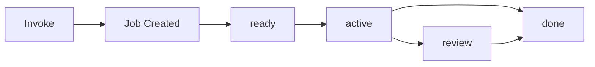

# Workflows Reference

Workflows are named, on-demand job templates defined in your manifest. They provide a stable entry point for recurring tasks -- nightly audits, incident remediation, data migrations -- that can be invoked by the CLI, the REST API, or event triggers without constructing a full job payload each time.

Unlike [pipelines](/docs/reference/pipelines), which define multi-step DAGs that expand into job graphs, workflows map one-to-one with jobs. A workflow invocation creates a single job with the workflow's configuration baked into its hints.

## Workflow vs pipeline

| Concern | Workflow | Pipeline |
|---------|----------|----------|
| **Unit of execution** | Single job | DAG of steps (each step may create a job) |
| **Definition location** | `workflows:` in manifest | `pipelines:` in manifest |
| **Invocation** | `eve workflow run <name>` or `POST /workflows/{name}/invoke` | `eve pipeline run <name>` or event trigger |
| **Use case** | Named agent tasks, remediation, audits | Build/test/deploy sequences |
| **Inputs** | JSON object merged into `hints.request_json` | Pipeline-level inputs distributed to steps |
| **Triggers** | Optional `trigger:` block on the workflow | Optional `trigger:` block on the pipeline |

Choose workflows when you need a single agent task with a stable name and optional input schema. Choose pipelines when you need orchestrated multi-step execution with dependency ordering.

## Defining a workflow

Workflows live under the `workflows:` key in `.eve/manifest.yaml`. Each workflow has a name (the YAML key) and an optional body that can include database access, steps, hints, and triggers.

### Minimal workflow

A workflow with just a prompt and no extra configuration:

```yaml
# .eve/manifest.yaml
workflows:
  nightly-audit:
    db_access: read_only
    steps:
      - agent:
          prompt: "Audit error logs and summarize anomalies"
```

### Workflow with hints and triggers

A more complete workflow that includes remediation gating and an event trigger:

```yaml
workflows:
  fix-ci-failure:
    hints:
      gates: ["remediate:proj_abc123:staging"]
      timeout_seconds: 900
      permission_policy: auto_edit
    trigger:
      github:
        event: check_suite
        branch: main
    steps:
      - agent:
          prompt: "Diagnose and fix the failing CI pipeline"
```

### Workflow with database access

Workflows that need to query or modify the project database declare their access level. This is particularly useful for reporting and data maintenance tasks:

```yaml
workflows:
  weekly-report:
    db_access: read_only
    steps:
      - agent:
          prompt: "Generate a weekly summary of deployment frequency and failure rate"

  cleanup-stale-data:
    db_access: read_write
    steps:
      - agent:
          prompt: "Archive records older than 90 days from the events table"
```

### Workflow fields

| Field | Type | Description |
|-------|------|-------------|
| `db_access` | `read_only` \| `read_write` | Database access level granted to the executing agent. Merged into `hints.db_access` on invocation. |
| `steps` | array | Workflow step definitions. Currently supports `agent` steps with a `prompt` field. |
| `hints` | object | Key-value pairs merged into the job's `hints` at invocation time. Use this for gates, timeouts, and harness preferences. |
| `trigger` | object | Event trigger configuration. When matched, the orchestrator creates a workflow job automatically. |

The workflow name (the YAML key) must be unique within the project manifest. It becomes the stable identifier used in CLI commands, API calls, and trigger matching.

## Workflow hints

The `hints` block is the intended place to set scheduling preferences, remediation gates, and timeout overrides. These hints are merged into the job at invocation time regardless of invocation mode (API, CLI, or event trigger).

```yaml
workflows:
  deploy-staging:
    hints:
      gates: ["env:proj_abc123:staging"]
      timeout_seconds: 1800
      permission_policy: auto_edit
```

### Available hint fields

| Hint | Type | Description |
|------|------|-------------|
| `gates` | string[] | Gate keys that must be acquired before execution. See [Environment Gating](/docs/reference/environment-gating). |
| `timeout_seconds` | number | Maximum execution time. Default: 1800 (30 minutes). |
| `permission_policy` | string | Permission policy for the harness: `default`, `auto_edit`, `never`, `yolo`. |
| `worker_type` | string | Target worker type (e.g., `python-worker`). See [Harnesses & Workers](/docs/reference/harnesses-and-workers). |
| `db_access` | string | Set automatically from the workflow's `db_access` field. |
| `workflow_name` | string | Set automatically to the workflow name. |
| `request_json` | string | Set automatically from the invocation input. |

Hints from the workflow definition are merged with any hints provided at invocation time. Invocation-time hints take precedence over definition-time hints for overlapping keys.

### Remediation gating

For workflows that remediate environment-specific issues, use the `gates` hint to enforce mutual exclusion. Only one remediation job per gate key can run at a time:

```yaml
workflows:
  fix-ci-failure:
    hints:
      gates: ["remediate:proj_abc123:staging"]
```

This ensures that if the same CI failure triggers the workflow twice in quick succession, the second invocation waits for the first to complete before executing. Without gating, two concurrent remediation jobs could make conflicting changes to the same codebase.

See [Environment Gating](/docs/reference/environment-gating) for the full gate lifecycle.

## Triggers

Workflows can fire automatically when an event matches their `trigger` block. The orchestrator evaluates triggers on incoming events and creates workflow jobs for matches.

### GitHub trigger

```yaml
workflows:
  pr-review:
    trigger:
      github:
        event: pull_request
        branch: main
    steps:
      - agent:
          prompt: "Review this pull request for security issues"
```

### Trigger fields

| Field | Type | Description |
|-------|------|-------------|
| `trigger.github.event` | string | GitHub event type: `push`, `pull_request`, `check_suite`, `release`, etc. |
| `trigger.github.branch` | string | Branch filter. Only events matching this branch fire the workflow. |

Trigger configuration follows the same structure as [pipeline triggers](/docs/reference/pipelines) -- specify the event source, event type, and optional branch filter.

When a trigger fires, the orchestrator creates a workflow job with the event payload available in the job context. The agent can use this payload to understand what triggered the workflow and act accordingly.

## Invocation modes

Workflows support three invocation modes: CLI, REST API, and event triggers. All three create a standard job with workflow metadata in its hints.

### How invocation works

When a workflow is invoked, the platform creates a job with the following metadata:

- `labels`: `workflow:{name}` for filtering and identification
- `hints.workflow_name`: the workflow name
- `hints.request_json`: JSON-encoded input (if provided)
- `hints.db_access`: from the workflow definition (if set)
- Additional hints merged from the workflow's `hints` block

The job then follows the standard lifecycle: `ready` -> `active` -> `done` (or `review`).

### CLI invocation

The simplest way to run a workflow:

```bash
# Fire-and-forget (returns immediately)
eve workflow run my-project nightly-audit

# With input data
eve workflow run my-project nightly-audit --input '{"severity": "error"}'

# Synchronous (waits for result, up to 60 seconds)
eve workflow run my-project nightly-audit --wait --input '{"severity": "error"}'
```

The CLI prints the job ID on success. Use `eve job show` or `eve job logs` to monitor progress.

### API invocation

For programmatic access from agents, CI/CD systems, or external tools:

```bash
# Fire-and-forget
curl -X POST \
  -H "Authorization: Bearer $EVE_TOKEN" \
  -H "Content-Type: application/json" \
  -d '{"input": {"severity": "error"}}' \
  "$EVE_API_URL/projects/proj_abc123/workflows/nightly-audit/invoke"

# Synchronous
curl -X POST \
  -H "Authorization: Bearer $EVE_TOKEN" \
  -H "Content-Type: application/json" \
  -d '{"input": {"severity": "error"}}' \
  "$EVE_API_URL/projects/proj_abc123/workflows/nightly-audit/invoke?wait=true"
```

### Event trigger invocation

When a workflow has a `trigger` block, the orchestrator automatically creates workflow jobs when matching events arrive. No manual invocation is required -- the trigger fires as soon as the event is received.

### Fire-and-forget vs synchronous

| Mode | Query parameter | Behavior |
|------|----------------|----------|
| **Fire-and-forget** | `wait=false` (default) | Returns immediately with the job ID |
| **Synchronous** | `wait=true` | Blocks up to 60 seconds, returns `result_json` from the latest attempt |

Synchronous mode is useful for agent-to-agent communication where one workflow needs the result of another before proceeding. If the workflow does not complete within 60 seconds, the API returns the job ID and current status so the caller can poll for results.

## REST API

### List workflows

```
GET /projects/{project_id}/workflows
```

Returns all workflow definitions for the project, as extracted from the manifest.

### Show workflow

```
GET /projects/{project_id}/workflows/{name}
```

Returns a single workflow definition by name.

### Invoke workflow

```
POST /projects/{project_id}/workflows/{name}/invoke?wait=true|false
```

**Request body:**

```json
{
  "input": {
    "env": "staging",
    "ticket": "INC-1234"
  }
}
```

The `input` object is JSON-encoded and stored in `hints.request_json` on the created job. The executing agent can read this input to parameterize its work.

**Response (fire-and-forget):**

```json
{
  "job_id": "42",
  "project_id": "proj_abc123",
  "status": "ready"
}
```

**Response (synchronous, wait=true):**

```json
{
  "job_id": "42",
  "project_id": "proj_abc123",
  "status": "done",
  "result_json": {
    "anomalies_found": 3,
    "summary": "Found 3 recurring timeout errors in the auth service"
  }
}
```

## Workflow inputs

Workflow inputs are arbitrary JSON passed at invocation time. They become available to the executing agent as part of the job context.

```bash
# Pass structured input
eve workflow run my-project audit-logs --input '{"severity": "error", "since": "24h"}'
```

The input is stored as `hints.request_json` on the job. The agent reads this from the job context and uses it to parameterize its work.

### Input examples

**Simple string inputs:**

```bash
eve workflow run my-project deploy --input '{"environment": "staging"}'
```

**Complex structured inputs:**

```bash
eve workflow run my-project incident-response --input '{
  "ticket": "INC-1234",
  "severity": "high",
  "affected_services": ["api", "worker"],
  "rollback_to": "v2.3.1"
}'
```

### Input validation

There is no schema validation on inputs today. The agent receives the raw JSON and is responsible for interpreting it. Request/response schema validation is a planned enhancement that will allow workflow definitions to declare input and output schemas using JSON Schema.

## Execution model

Workflow execution follows the standard job lifecycle:



1. **Invoke** -- CLI, API, or event trigger creates the job
2. **Job created** -- Job enters `ready` phase with workflow metadata in hints
3. **Gate check** -- If `hints.gates` are present, gates must be acquired before the job moves to `active`
4. **Execution** -- The orchestrator assigns the job to a worker. The worker spawns the configured harness with the workflow prompt.
5. **Completion** -- Job transitions to `done` (or `review` if configured). Result data is stored in `result_json`.

The workflow itself does not introduce additional lifecycle states. It is a job with extra metadata, not a separate execution primitive.

### Result data

When a workflow job completes, the agent can write structured results to `result_json` on the job. This is particularly useful with synchronous invocation (`wait=true`), where the caller receives the result directly:

```json
{
  "anomalies_found": 3,
  "summary": "Found 3 recurring timeout errors in the auth service",
  "recommendations": [
    "Increase connection pool size",
    "Add circuit breaker to auth service"
  ]
}
```

Callers can also retrieve results after the fact by reading the completed job's `result_json` field via the Job API.

### Error handling

If a workflow job fails, it follows the standard job error handling:

- The attempt is marked as failed with error details
- If retries are configured (via `hints.max_attempts`), the orchestrator creates a new attempt
- Failed workflow jobs can be inspected via `eve job show` and `eve job logs`

## Common patterns

### Nightly audit with read-only database access

A workflow that runs every night to audit system logs, with read-only database access to query logs and metrics:

```yaml
workflows:
  nightly-audit:
    db_access: read_only
    steps:
      - agent:
          prompt: "Query the last 24 hours of error logs. Summarize anomalies, group by service, and flag any recurring patterns. Write the report as result_json."
```

```bash
eve workflow run my-project nightly-audit --wait
```

### Incident remediation with gating

A workflow triggered by CI failures that automatically diagnoses and fixes issues, with gating to prevent concurrent remediation on the same environment:

```yaml
workflows:
  fix-ci:
    hints:
      gates: ["remediate:proj_abc123:staging"]
      permission_policy: auto_edit
      timeout_seconds: 900
    trigger:
      github:
        event: check_suite
        branch: main
    steps:
      - agent:
          prompt: "The CI pipeline has failed. Diagnose the root cause from the logs, implement a fix, and push a commit."
```

### Agent-to-agent communication

A workflow that one agent invokes synchronously to get structured data from another:

```bash
# Agent A calls Agent B's workflow and waits for structured results
eve workflow run my-project analyze-dependencies --wait \
  --input '{"package": "@eve/shared", "depth": 3}'
```

The invoking agent receives the result directly and can use it to make decisions without parsing logs or intermediate artifacts.

## Skill-driven workflows (planned)

:::note
Skill-driven workflows are planned but not yet implemented. This section describes the intended design.
:::

A skill-driven workflow is a standard OpenSkills skill with additional frontmatter metadata that marks it as a workflow:

```yaml
---
name: prd-workflow
kind: workflow
version: 1
inputs_schema: inputs.schema.json
outputs_schema: outputs.schema.json
config: config.yaml
personas_dir: personas
skills_required:
  - eve-review-plan
  - eve-review-security
---
```

### Skill layout

```
skills/prd-workflow/
  SKILL.md
  config.yaml
  personas/
    security.md
  references/
```

### Manifest mapping

Manifest workflows will be able to reference a workflow skill by name:

```yaml
workflows:
  prd-epic:
    skill: prd-workflow
```

### Project overrides

Projects can override workflow skill configuration by placing files in `.eve/skills/<skill>/`:

```
.eve/skills/prd-workflow/
  config.yaml
  personas/
```

Resolution order for configuration:

1. Job inputs (invocation-time overrides)
2. `.eve/skills/<skill>/config.yaml` (project overrides)
3. `<skill>/config.yaml` (skill defaults)

### Orchestration

Skill-driven workflows use standard job relations (`waits_for`, `blocks`) for multi-job coordination. A workflow skill returns `eve.status = "waiting"` when it is blocked on child jobs.

## CLI commands

### List workflows

```bash
eve workflow list [project]
```

Lists all workflows defined in the project manifest. See [eve workflow list](/docs/reference/cli-appendix#eve-workflow-list).

### Show workflow details

```bash
eve workflow show <project> <name>
```

Displays the full workflow definition including hints, triggers, and database access configuration.

### Run a workflow

```bash
eve workflow run [project] <workflow-name> --input '{"key": "value"}'
```

Creates a job from the workflow definition. Supports `--input` for passing structured JSON input and `--wait` for synchronous execution. See [eve workflow run](/docs/reference/cli-appendix#eve-workflow-run).

### Invoke a workflow (alias)

```bash
eve workflow invoke [project] <workflow-name> --input '{"key": "value"}'
```

Alias for `eve workflow run`.

### View workflow logs

```bash
eve workflow logs <job-id>
```

Streams the execution logs for a workflow job. Equivalent to `eve job logs <job-id>`.
